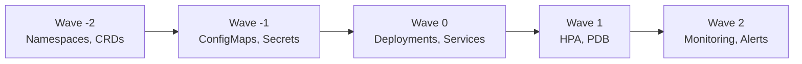

# How to Use the argocd.argoproj.io/sync-wave Annotation

Author: [nawazdhandala](https://github.com/nawazdhandala)

Tags: ArgoCD, GitOps, Kubernetes, Sync Waves, Deployment Ordering

Description: Master the ArgoCD sync-wave annotation to control resource deployment ordering, manage dependencies between Kubernetes resources, and build reliable multi-step deployment workflows.

---

The `argocd.argoproj.io/sync-wave` annotation controls the order in which ArgoCD applies Kubernetes resources during a sync operation. Without sync waves, ArgoCD applies all resources simultaneously. With sync waves, you can enforce sequential ordering - ensuring namespaces exist before deployments, ConfigMaps are created before pods that reference them, and database migrations run before application code.

## How sync waves work

Sync waves assign a numerical value to resources. ArgoCD processes waves in ascending order:

1. All resources in wave -5 are applied first
2. ArgoCD waits for them to become healthy
3. All resources in wave -4 are applied
4. ArgoCD waits for health
5. This continues until all waves are processed

```yaml
# The annotation syntax
metadata:
  annotations:
    argocd.argoproj.io/sync-wave: "0"  # Value must be a string
```

The default wave is `0`. Any resource without the annotation is in wave 0.



## Basic usage

```yaml
# Wave -2: Create the namespace first
apiVersion: v1
kind: Namespace
metadata:
  name: my-app
  annotations:
    argocd.argoproj.io/sync-wave: "-2"

---
# Wave -1: Create configuration before workloads
apiVersion: v1
kind: ConfigMap
metadata:
  name: app-config
  namespace: my-app
  annotations:
    argocd.argoproj.io/sync-wave: "-1"
data:
  APP_ENV: "production"
  LOG_LEVEL: "info"

---
# Wave 0: Deploy the application (default wave)
apiVersion: apps/v1
kind: Deployment
metadata:
  name: web-app
  namespace: my-app
  # No annotation needed - defaults to wave 0
spec:
  replicas: 3
  selector:
    matchLabels:
      app: web-app
  template:
    metadata:
      labels:
        app: web-app
    spec:
      containers:
        - name: app
          image: myorg/web-app:v1.0.0
          envFrom:
            - configMapRef:
                name: app-config

---
# Wave 0: Service is also in wave 0 (applied alongside Deployment)
apiVersion: v1
kind: Service
metadata:
  name: web-app
  namespace: my-app
spec:
  selector:
    app: web-app
  ports:
    - port: 80
      targetPort: 8080

---
# Wave 1: HPA after Deployment is healthy
apiVersion: autoscaling/v2
kind: HorizontalPodAutoscaler
metadata:
  name: web-app
  namespace: my-app
  annotations:
    argocd.argoproj.io/sync-wave: "1"
spec:
  scaleTargetRef:
    apiVersion: apps/v1
    kind: Deployment
    name: web-app
  minReplicas: 3
  maxReplicas: 20
  metrics:
    - type: Resource
      resource:
        name: cpu
        target:
          type: Utilization
          averageUtilization: 70
```

## Real-world example: full-stack application deployment

Here is a complete example with a database, backend API, and frontend:

```yaml
# Wave -5: Namespace
apiVersion: v1
kind: Namespace
metadata:
  name: ecommerce
  annotations:
    argocd.argoproj.io/sync-wave: "-5"

---
# Wave -4: RBAC setup
apiVersion: v1
kind: ServiceAccount
metadata:
  name: app-service-account
  namespace: ecommerce
  annotations:
    argocd.argoproj.io/sync-wave: "-4"

---
# Wave -3: Persistent storage for database
apiVersion: v1
kind: PersistentVolumeClaim
metadata:
  name: postgres-data
  namespace: ecommerce
  annotations:
    argocd.argoproj.io/sync-wave: "-3"
spec:
  accessModes: ["ReadWriteOnce"]
  storageClassName: gp3
  resources:
    requests:
      storage: 100Gi

---
# Wave -2: Database StatefulSet
apiVersion: apps/v1
kind: StatefulSet
metadata:
  name: postgres
  namespace: ecommerce
  annotations:
    argocd.argoproj.io/sync-wave: "-2"
spec:
  serviceName: postgres
  replicas: 1
  selector:
    matchLabels:
      app: postgres
  template:
    metadata:
      labels:
        app: postgres
    spec:
      containers:
        - name: postgres
          image: postgres:16
          ports:
            - containerPort: 5432
          volumeMounts:
            - name: data
              mountPath: /var/lib/postgresql/data
      volumes:
        - name: data
          persistentVolumeClaim:
            claimName: postgres-data

---
# Wave -2: Database service (same wave as StatefulSet)
apiVersion: v1
kind: Service
metadata:
  name: postgres
  namespace: ecommerce
  annotations:
    argocd.argoproj.io/sync-wave: "-2"
spec:
  selector:
    app: postgres
  ports:
    - port: 5432

---
# Wave -1: Database migration (wait for DB to be healthy)
apiVersion: batch/v1
kind: Job
metadata:
  name: db-migrate-v1
  namespace: ecommerce
  annotations:
    argocd.argoproj.io/sync-wave: "-1"
    argocd.argoproj.io/hook: Sync
    argocd.argoproj.io/hook-delete-policy: BeforeHookCreation
spec:
  template:
    spec:
      containers:
        - name: migrate
          image: myorg/ecommerce-migrate:v1.0.0
          env:
            - name: DATABASE_URL
              value: postgres://postgres:5432/ecommerce
      restartPolicy: Never
  backoffLimit: 3

---
# Wave 0: Backend API (after migrations complete)
apiVersion: apps/v1
kind: Deployment
metadata:
  name: api-server
  namespace: ecommerce
  annotations:
    argocd.argoproj.io/sync-wave: "0"
spec:
  replicas: 3
  selector:
    matchLabels:
      app: api-server
  template:
    metadata:
      labels:
        app: api-server
    spec:
      containers:
        - name: api
          image: myorg/ecommerce-api:v1.0.0
          ports:
            - containerPort: 8080
          readinessProbe:
            httpGet:
              path: /health
              port: 8080
            initialDelaySeconds: 10

---
# Wave 1: Frontend (after API is healthy)
apiVersion: apps/v1
kind: Deployment
metadata:
  name: web-frontend
  namespace: ecommerce
  annotations:
    argocd.argoproj.io/sync-wave: "1"
spec:
  replicas: 3
  selector:
    matchLabels:
      app: web-frontend
  template:
    metadata:
      labels:
        app: web-frontend
    spec:
      containers:
        - name: frontend
          image: myorg/ecommerce-frontend:v1.0.0
          env:
            - name: API_URL
              value: http://api-server:8080

---
# Wave 2: Ingress (after frontend is healthy)
apiVersion: networking.k8s.io/v1
kind: Ingress
metadata:
  name: ecommerce
  namespace: ecommerce
  annotations:
    argocd.argoproj.io/sync-wave: "2"
spec:
  rules:
    - host: shop.example.com
      http:
        paths:
          - path: /api
            pathType: Prefix
            backend:
              service:
                name: api-server
                port:
                  number: 8080
          - path: /
            pathType: Prefix
            backend:
              service:
                name: web-frontend
                port:
                  number: 80

---
# Wave 3: Monitoring (after everything is deployed)
apiVersion: monitoring.coreos.com/v1
kind: ServiceMonitor
metadata:
  name: api-server
  namespace: ecommerce
  annotations:
    argocd.argoproj.io/sync-wave: "3"
spec:
  selector:
    matchLabels:
      app: api-server
  endpoints:
    - port: metrics
```

## Wave numbering conventions

Establish a team-wide convention. Here is a recommended scheme:

| Wave | Purpose | Examples |
|------|---------|----------|
| -5 | Namespaces, CRDs | Namespace, CustomResourceDefinition |
| -4 | RBAC, ServiceAccounts | ClusterRole, ServiceAccount |
| -3 | Persistent storage | PVC, StorageClass |
| -2 | Stateful services | Database StatefulSet, Redis |
| -1 | Migrations, setup jobs | Database migration Jobs |
| 0 | Core application | Deployments, Services |
| 1 | Dependent resources | HPA, PDB, frontend apps |
| 2 | Networking | Ingress, Gateway resources |
| 3 | Monitoring and alerting | ServiceMonitor, PrometheusRule |
| 5 | Post-deploy verification | Smoke test Jobs |

## How ArgoCD determines resource health between waves

ArgoCD uses health checks to determine when a wave is complete:

- **Deployment** - Healthy when all replicas are available and the rollout is complete
- **StatefulSet** - Healthy when all replicas are ready
- **Job** - Healthy when completed successfully
- **Service** - Always considered healthy
- **ConfigMap/Secret** - Always considered healthy
- **PVC** - Healthy when bound to a PV

If a resource in a wave does not become healthy within the sync timeout, the entire sync fails and subsequent waves are not processed.

## Common pitfalls

### Forgetting that the value must be a string

```yaml
# Wrong - integer value
annotations:
  argocd.argoproj.io/sync-wave: 1

# Correct - string value
annotations:
  argocd.argoproj.io/sync-wave: "1"
```

### Too many waves slowing down deployment

Each wave adds latency because ArgoCD waits for health checks between waves. Do not create more waves than necessary:

```yaml
# Bad: unnecessary granularity
# Wave 0: ConfigMap A
# Wave 1: ConfigMap B
# Wave 2: ConfigMap C
# Wave 3: Deployment

# Good: group independent resources
# Wave -1: All ConfigMaps (applied together)
# Wave 0: Deployment
```

### Circular dependencies between waves

```yaml
# Problem: Service A depends on Service B, and Service B depends on Service A
# Sync waves cannot solve circular dependencies

# Solution: Put both in the same wave and use readiness probes
# to handle startup ordering
```

### Not accounting for slow resource provisioning

```yaml
# PVCs with WaitForFirstConsumer might not become "Bound" until a pod
# references them. Put PVC and its consumer in the same wave:
apiVersion: v1
kind: PersistentVolumeClaim
metadata:
  name: data
  annotations:
    argocd.argoproj.io/sync-wave: "0"  # Same wave as StatefulSet
```

## Debugging sync wave issues

```bash
# Check sync wave assignments
argocd app resources my-app --output json | \
  jq '.[] | {kind: .kind, name: .name, syncWave: .syncWave}'

# Watch sync progress
argocd app sync my-app --watch

# Check which wave is stuck
argocd app get my-app -o json | \
  jq '.status.operationState.syncResult.resources[] | select(.status != "Synced") | {kind, name, status, message}'
```

## Summary

The `argocd.argoproj.io/sync-wave` annotation is ArgoCD's primary mechanism for ordering resource deployment. Use negative waves for prerequisites (namespaces, RBAC, storage, databases), wave 0 for core application workloads, and positive waves for dependent resources (HPA, Ingress, monitoring). Keep the number of distinct waves minimal to avoid slow deployments, establish a team-wide numbering convention, and remember that ArgoCD waits for resources to become healthy between waves - so proper health checks are essential for sync waves to work correctly.
