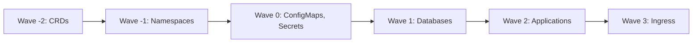

# How to Order Resource Deployment with Sync Waves in ArgoCD

Author: [nawazdhandala](https://github.com/nawazdhandala)

Tags: ArgoCD, GitOps, Kubernetes, Sync Waves, Deployment Ordering

Description: Learn how to use ArgoCD sync waves to control the order in which Kubernetes resources are deployed, ensuring dependencies are created before dependents.

---

When ArgoCD syncs an application, it applies all resources in the Sync phase together by default. But many real-world applications have ordering requirements - the database needs to be running before the application connects to it, CRDs need to exist before custom resources are created, and ConfigMaps need to be available before Deployments that reference them start.

Sync waves solve this by letting you assign a numerical wave to each resource. ArgoCD applies resources in wave order, waiting for each wave to be healthy before moving to the next.

## How Sync Waves Work

Each resource gets a wave number via the `argocd.argoproj.io/sync-wave` annotation. ArgoCD processes waves from lowest to highest number:

1. All resources in wave -2 are applied and must become healthy
2. All resources in wave -1 are applied and must become healthy
3. All resources in wave 0 are applied and must become healthy (default)
4. All resources in wave 1 are applied and must become healthy
5. And so on...

Resources without the annotation default to wave 0.



## Basic Sync Wave Configuration

Add the sync-wave annotation to your resources:

```yaml
# Wave -1: Create the namespace first
apiVersion: v1
kind: Namespace
metadata:
  name: my-app
  annotations:
    argocd.argoproj.io/sync-wave: "-1"
---
# Wave 0: Configuration (default wave)
apiVersion: v1
kind: ConfigMap
metadata:
  name: app-config
  namespace: my-app
data:
  database_host: "postgres.my-app.svc"
  cache_host: "redis.my-app.svc"
---
# Wave 1: Database
apiVersion: apps/v1
kind: StatefulSet
metadata:
  name: postgres
  namespace: my-app
  annotations:
    argocd.argoproj.io/sync-wave: "1"
spec:
  serviceName: postgres
  replicas: 1
  selector:
    matchLabels:
      app: postgres
  template:
    metadata:
      labels:
        app: postgres
    spec:
      containers:
        - name: postgres
          image: postgres:15
          ports:
            - containerPort: 5432
---
# Wave 2: Application
apiVersion: apps/v1
kind: Deployment
metadata:
  name: web-app
  namespace: my-app
  annotations:
    argocd.argoproj.io/sync-wave: "2"
spec:
  replicas: 3
  selector:
    matchLabels:
      app: web-app
  template:
    metadata:
      labels:
        app: web-app
    spec:
      containers:
        - name: web
          image: myorg/web:1.0
          env:
            - name: DATABASE_HOST
              valueFrom:
                configMapKeyRef:
                  name: app-config
                  key: database_host
```

## Wave Processing Rules

ArgoCD follows these rules when processing waves:

1. **All resources in a wave must be applied before moving to the next wave.** If a resource fails to apply, ArgoCD stops and does not proceed to later waves.

2. **All resources in a wave must be healthy before moving to the next wave.** ArgoCD waits for health checks to pass. A Deployment must have its Pods running, a Job must complete, a Service must exist.

3. **Resources within the same wave are applied in parallel.** There is no guaranteed ordering within a single wave.

4. **Negative waves are processed before wave 0.** This is useful for foundational resources that must exist before anything else.

## Common Ordering Patterns

### Infrastructure First, Then Applications

```yaml
# Wave -2: Cluster-level resources
# CRDs, ClusterRoles, ClusterRoleBindings

# Wave -1: Namespace-level setup
# Namespaces, ResourceQuotas, LimitRanges

# Wave 0: Configuration
# ConfigMaps, Secrets, ServiceAccounts

# Wave 1: Stateful infrastructure
# Databases, message queues, caches

# Wave 2: Stateless applications
# Deployments, Services

# Wave 3: Ingress and external access
# Ingress, Gateway, VirtualService
```

### Microservices with Dependencies

```yaml
# Redis cache - wave 1
apiVersion: apps/v1
kind: Deployment
metadata:
  name: redis
  annotations:
    argocd.argoproj.io/sync-wave: "1"
spec:
  replicas: 1
  selector:
    matchLabels:
      app: redis
  template:
    metadata:
      labels:
        app: redis
    spec:
      containers:
        - name: redis
          image: redis:7
---
# Redis Service - wave 1
apiVersion: v1
kind: Service
metadata:
  name: redis
  annotations:
    argocd.argoproj.io/sync-wave: "1"
spec:
  selector:
    app: redis
  ports:
    - port: 6379
---
# API service that depends on Redis - wave 2
apiVersion: apps/v1
kind: Deployment
metadata:
  name: api
  annotations:
    argocd.argoproj.io/sync-wave: "2"
spec:
  replicas: 3
  selector:
    matchLabels:
      app: api
  template:
    metadata:
      labels:
        app: api
    spec:
      containers:
        - name: api
          image: myorg/api:1.0
          env:
            - name: REDIS_HOST
              value: "redis:6379"
---
# Frontend that depends on API - wave 3
apiVersion: apps/v1
kind: Deployment
metadata:
  name: frontend
  annotations:
    argocd.argoproj.io/sync-wave: "3"
spec:
  replicas: 2
  selector:
    matchLabels:
      app: frontend
  template:
    metadata:
      labels:
        app: frontend
    spec:
      containers:
        - name: frontend
          image: myorg/frontend:1.0
          env:
            - name: API_URL
              value: "http://api:8080"
```

### CRD Before Custom Resources

```yaml
# Wave -1: Install the CRD
apiVersion: apiextensions.k8s.io/v1
kind: CustomResourceDefinition
metadata:
  name: certificates.cert-manager.io
  annotations:
    argocd.argoproj.io/sync-wave: "-1"
spec:
  group: cert-manager.io
  names:
    kind: Certificate
    plural: certificates
  scope: Namespaced
  versions:
    - name: v1
      served: true
      storage: true
      schema:
        openAPIV3Schema:
          type: object
---
# Wave 0: Create the custom resource
apiVersion: cert-manager.io/v1
kind: Certificate
metadata:
  name: my-cert
  annotations:
    argocd.argoproj.io/sync-wave: "0"
spec:
  secretName: my-cert-tls
  issuerRef:
    name: letsencrypt-prod
    kind: ClusterIssuer
  dnsNames:
    - example.com
```

## Health Checks and Wave Progression

ArgoCD waits for resources to be "healthy" before progressing to the next wave. What "healthy" means depends on the resource type:

- **Deployment**: All desired Pods are running and ready
- **StatefulSet**: All desired Pods are running and ready
- **Job**: The Job has completed successfully
- **Service**: The Service exists (no health check needed)
- **ConfigMap/Secret**: The resource exists (no health check needed)
- **Pod**: The Pod is running and ready
- **PVC**: The PVC is bound

If a resource never becomes healthy (for example, a Deployment with an invalid image), ArgoCD will wait until the sync timeout and then fail.

## Controlling Timeout

Set a sync timeout to prevent indefinite waits:

```bash
# Sync with a 5-minute timeout
argocd app sync my-app --timeout 300
```

If any wave does not become healthy within the timeout, the sync fails.

## Sync Waves with Hooks

Sync waves work within each sync phase (PreSync, Sync, PostSync). You can use waves to order hooks within the same phase:

```yaml
# PreSync wave 0: Backup database
apiVersion: batch/v1
kind: Job
metadata:
  name: backup-db
  annotations:
    argocd.argoproj.io/hook: PreSync
    argocd.argoproj.io/sync-wave: "0"
    argocd.argoproj.io/hook-delete-policy: HookSucceeded
spec:
  template:
    spec:
      containers:
        - name: backup
          image: myorg/db-tools:latest
          command: ["pg_dump", "-h", "postgres", "-U", "admin", "-d", "mydb", "-f", "/backup/dump.sql"]
      restartPolicy: Never
---
# PreSync wave 1: Run migration (after backup)
apiVersion: batch/v1
kind: Job
metadata:
  name: migrate-db
  annotations:
    argocd.argoproj.io/hook: PreSync
    argocd.argoproj.io/sync-wave: "1"
    argocd.argoproj.io/hook-delete-policy: HookSucceeded
spec:
  template:
    spec:
      containers:
        - name: migrate
          image: myorg/api:v2
          command: ["python", "manage.py", "migrate"]
      restartPolicy: Never
```

The backup runs first (wave 0), and only after it completes does the migration run (wave 1).

## Debugging Wave Issues

If resources are not deploying in the expected order:

```bash
# Check which wave each resource is in
argocd app resources my-app -o wide

# Watch the sync progress
argocd app sync my-app --watch

# Check for resources stuck in earlier waves
argocd app get my-app --show-operation
```

Common issues:
- Resources stuck as "Progressing" prevent later waves from running
- Missing health check support for custom resources causes indefinite waiting
- Resources in the same wave have inter-dependencies (not supported)

## Summary

Sync waves are the primary mechanism for ordering resource deployment in ArgoCD. Assign wave numbers via annotations, and ArgoCD handles the rest - applying resources in order and waiting for health checks between waves. Use negative waves for foundational resources, wave 0 for configuration, and positive waves for applications and their dependencies. Combined with sync phases (PreSync, Sync, PostSync), you can build complete deployment workflows.

For running pre-deployment tasks like database migrations, see our guide on [how to run database migrations as PreSync hooks](https://oneuptime.com/blog/post/2026-02-26-argocd-presync-database-migrations/view).
