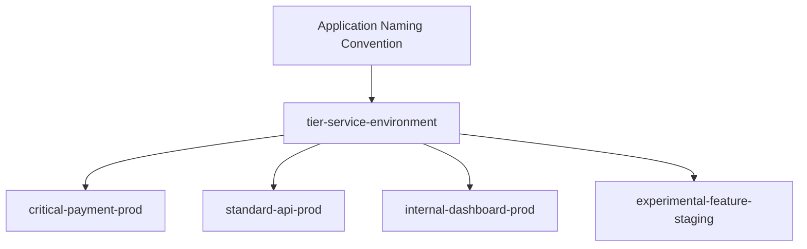

# How to Apply Sync Windows to Specific Applications in ArgoCD

Author: [nawazdhandala](https://github.com/nawazdhandala)

Tags: ArgoCD, GitOps, Kubernetes, Sync Windows, Application Management

Description: Learn how to target sync windows to specific ArgoCD applications using name patterns, allowing different deployment schedules for different application tiers and teams.

---

Not every application in your ArgoCD instance needs the same deployment restrictions. Production-critical payment services might need tight maintenance windows while internal dashboards can deploy anytime. ArgoCD sync windows support application name patterns that let you create different deployment schedules for different applications within the same project.

## Application Matching with Name Patterns

The `applications` field in a sync window accepts a list of glob patterns that match against application names.

```yaml
apiVersion: argoproj.io/v1alpha1
kind: AppProject
metadata:
  name: production
  namespace: argocd
spec:
  syncWindows:
    # Strict window for payment services
    - kind: allow
      schedule: '0 2 * * 2,4'
      duration: 2h
      applications:
        - 'payment-*'
      manualSync: true

    # Broader window for API services
    - kind: allow
      schedule: '0 22 * * *'
      duration: 6h
      applications:
        - 'api-*'
      manualSync: true

    # No restrictions on internal tools
    - kind: allow
      schedule: '0 0 * * *'
      duration: 24h
      applications:
        - 'internal-*'
      manualSync: true
```

The pattern matching uses glob syntax:
- `*` matches any sequence of characters
- `?` matches any single character
- `[abc]` matches any character in the set

## Naming Convention Strategy

A clear naming convention makes sync window targeting practical. Establish a convention before creating applications.



Example naming convention: `{tier}-{service}-{environment}`

```yaml
# Applications follow the naming convention
# critical-payment-api-prod
# critical-auth-service-prod
# standard-order-service-prod
# standard-inventory-service-prod
# internal-admin-dashboard-prod
# internal-monitoring-prod
```

Then target sync windows by tier:

```yaml
syncWindows:
  # Critical tier: narrow maintenance window
  - kind: allow
    schedule: '0 3 * * 3'
    duration: 2h
    applications:
      - 'critical-*'
    manualSync: true
    timeZone: 'UTC'

  # Standard tier: nightly window
  - kind: allow
    schedule: '0 22 * * *'
    duration: 6h
    applications:
      - 'standard-*'
    manualSync: true
    timeZone: 'UTC'

  # Internal tier: anytime
  - kind: allow
    schedule: '0 0 * * *'
    duration: 24h
    applications:
      - 'internal-*'
    manualSync: true
    timeZone: 'UTC'
```

## Multiple Patterns Per Window

Each window can match multiple application patterns.

```yaml
syncWindows:
  # Block business hours for all customer-facing apps
  - kind: deny
    schedule: '0 9 * * 1-5'
    duration: 8h
    applications:
      - 'payment-*'
      - 'auth-*'
      - 'storefront-*'
      - 'checkout-*'
    manualSync: true
    timeZone: 'America/New_York'
```

An application is affected by this window if its name matches any of the listed patterns.

## Exact Application Targeting

You can target specific applications by name without using wildcards.

```yaml
syncWindows:
  # Only this exact application has a narrow window
  - kind: allow
    schedule: '0 3 * * 3'
    duration: 1h
    applications:
      - 'payment-gateway-prod'
    manualSync: true
    timeZone: 'UTC'

  # All other apps get a broader window
  - kind: allow
    schedule: '0 22 * * *'
    duration: 8h
    applications:
      - '*'
    manualSync: true
    timeZone: 'UTC'
```

When multiple windows match an application, ArgoCD evaluates all of them. The `payment-gateway-prod` application matches both windows, so it can sync during either the narrow Wednesday window or the nightly window.

Be careful with this interaction. If you want the narrow window to be the only option for `payment-gateway-prod`, add a deny window that covers the broader window for that specific application.

```yaml
syncWindows:
  # Narrow window for payment gateway only
  - kind: allow
    schedule: '0 3 * * 3'
    duration: 1h
    applications:
      - 'payment-gateway-prod'
    manualSync: true

  # Deny the broader window for payment gateway
  - kind: deny
    schedule: '0 22 * * *'
    duration: 8h
    applications:
      - 'payment-gateway-prod'
    manualSync: true

  # Broader window for everything else
  - kind: allow
    schedule: '0 22 * * *'
    duration: 8h
    applications:
      - '*'
    manualSync: true
```

## Per-Team Application Windows

When different teams own different applications, assign sync windows based on team naming conventions.

```yaml
syncWindows:
  # Team Alpha deploys Tuesday and Thursday mornings
  - kind: allow
    schedule: '0 6 * * 2,4'
    duration: 3h
    applications:
      - 'alpha-*'
    manualSync: true
    timeZone: 'America/New_York'

  # Team Beta deploys Monday and Wednesday evenings
  - kind: allow
    schedule: '0 20 * * 1,3'
    duration: 4h
    applications:
      - 'beta-*'
    manualSync: true
    timeZone: 'America/New_York'

  # Platform team can deploy nightly
  - kind: allow
    schedule: '0 0 * * *'
    duration: 6h
    applications:
      - 'platform-*'
    manualSync: true
    timeZone: 'America/New_York'
```

This gives each team their own deployment schedule without interfering with each other.

## Applications Without Matching Windows

If an application does not match any sync window (allow or deny), ArgoCD allows syncs at any time. Sync windows only restrict applications that match their patterns.

This is important when using the wildcard `*` pattern. If you define an allow window with `applications: ['*']`, it matches every application in the project. Any application not in the project's scope is unaffected.

## Using Multiple Projects Instead

An alternative to complex per-application sync windows is using separate ArgoCD Projects for applications with different deployment needs.

```yaml
# Strict project for critical services
apiVersion: argoproj.io/v1alpha1
kind: AppProject
metadata:
  name: critical-production
  namespace: argocd
spec:
  syncWindows:
    - kind: allow
      schedule: '0 3 * * 3'
      duration: 2h
      applications:
        - '*'
      manualSync: true
---
# Relaxed project for internal tools
apiVersion: argoproj.io/v1alpha1
kind: AppProject
metadata:
  name: internal-tools
  namespace: argocd
spec:
  syncWindows: []  # No restrictions
```

Then assign applications to the appropriate project:

```yaml
apiVersion: argoproj.io/v1alpha1
kind: Application
metadata:
  name: payment-gateway
  namespace: argocd
spec:
  project: critical-production  # Strict sync windows apply
  # ...
---
apiVersion: argoproj.io/v1alpha1
kind: Application
metadata:
  name: admin-dashboard
  namespace: argocd
spec:
  project: internal-tools  # No sync window restrictions
  # ...
```

This approach is cleaner when the deployment restrictions are fundamentally different between groups of applications.

## Verifying Application Matching

Check which sync windows affect a specific application.

```bash
# Get application details including sync conditions
argocd app get payment-gateway-prod --output json | \
  jq '{
    name: .metadata.name,
    project: .spec.project,
    conditions: [.status.conditions[] | select(.type | contains("SyncWindow"))]
  }'

# List all windows in the project
argocd proj windows list production
```

If an application is unexpectedly blocked or allowed, verify its name matches the expected window pattern. Test with a manual sync to confirm.

```bash
# Try to sync and check if it is blocked
argocd app sync payment-gateway-prod --dry-run
```

For the fundamentals of sync window configuration, see the [sync windows configuration guide](https://oneuptime.com/blog/post/2026-02-26-argocd-configure-sync-windows/view). For cluster-level targeting, check the [sync windows for clusters guide](https://oneuptime.com/blog/post/2026-02-26-argocd-sync-windows-specific-clusters/view).
