# How to Apply Sync Windows to Specific Clusters in ArgoCD

Author: [nawazdhandala](https://github.com/nawazdhandala)

Tags: ArgoCD, GitOps, Kubernetes, Sync Windows, Multi-Cluster

Description: Learn how to apply ArgoCD sync windows to specific clusters in a multi-cluster setup, enabling different deployment schedules per cluster for regional deployments and staged rollouts.

---

In multi-cluster ArgoCD deployments, different clusters often need different deployment schedules. Your US production cluster might need a maintenance window during US off-peak hours, while your EU cluster needs a window during European off-peak hours. ArgoCD sync windows support cluster-based targeting through the `clusters` field.

## Cluster Matching in Sync Windows

The `clusters` field in a sync window accepts a list of patterns that match against cluster names or URLs.

```yaml
apiVersion: argoproj.io/v1alpha1
kind: AppProject
metadata:
  name: global-production
  namespace: argocd
spec:
  destinations:
    - namespace: '*'
      server: 'https://us-east-cluster.example.com'
    - namespace: '*'
      server: 'https://eu-west-cluster.example.com'
    - namespace: '*'
      server: 'https://ap-southeast-cluster.example.com'
  syncWindows:
    # US cluster: maintenance at 2 AM Eastern
    - kind: allow
      schedule: '0 2 * * *'
      duration: 4h
      applications:
        - '*'
      clusters:
        - 'https://us-east-cluster.example.com'
      manualSync: true
      timeZone: 'America/New_York'

    # EU cluster: maintenance at 2 AM London
    - kind: allow
      schedule: '0 2 * * *'
      duration: 4h
      applications:
        - '*'
      clusters:
        - 'https://eu-west-cluster.example.com'
      manualSync: true
      timeZone: 'Europe/London'

    # APAC cluster: maintenance at 2 AM Tokyo
    - kind: allow
      schedule: '0 2 * * *'
      duration: 4h
      applications:
        - '*'
      clusters:
        - 'https://ap-southeast-cluster.example.com'
      manualSync: true
      timeZone: 'Asia/Tokyo'
```

Each cluster gets its own maintenance window at 2 AM local time.

## Identifying Cluster Names and URLs

ArgoCD identifies clusters by their server URL or a registered name. To find how your clusters are identified:

```bash
# List all registered clusters
argocd cluster list

# Example output:
# SERVER                                   NAME        VERSION  STATUS
# https://kubernetes.default.svc           in-cluster  1.28     Successful
# https://us-east.k8s.example.com          us-east     1.28     Successful
# https://eu-west.k8s.example.com          eu-west     1.28     Successful
# https://ap-southeast.k8s.example.com     ap-south    1.28     Successful
```

You can use either the server URL or the cluster name in sync window patterns.

```yaml
syncWindows:
  # Using cluster names
  - kind: allow
    schedule: '0 2 * * *'
    duration: 4h
    applications:
      - '*'
    clusters:
      - 'us-east'
    manualSync: true

  # Using server URLs
  - kind: allow
    schedule: '0 2 * * *'
    duration: 4h
    applications:
      - '*'
    clusters:
      - 'https://eu-west.k8s.example.com'
    manualSync: true
```

## Wildcard Patterns for Clusters

Use glob patterns to match multiple clusters.

```yaml
syncWindows:
  # Match all US clusters
  - kind: deny
    schedule: '0 9 * * 1-5'
    duration: 8h
    applications:
      - '*'
    clusters:
      - 'us-*'
    manualSync: true

  # Match all production clusters
  - kind: deny
    schedule: '0 9 * * 1-5'
    duration: 8h
    applications:
      - '*'
    clusters:
      - '*-prod'
    manualSync: true

  # Match by URL pattern
  - kind: allow
    schedule: '0 2 * * *'
    duration: 4h
    applications:
      - '*'
    clusters:
      - 'https://*.example.com'
    manualSync: true
```

## Regional Deployment Strategy

A common pattern is deploying to regions sequentially, using staggered sync windows to create a natural rollout.

```mermaid
gantt
    title Regional Deployment Windows (UTC)
    dateFormat HH:mm
    axisFormat %H:%M

    section APAC (Tokyo)
    Maintenance Window :active, 17:00, 4h

    section EU (London)
    Maintenance Window :active, 02:00, 4h

    section US East
    Maintenance Window :active, 07:00, 4h

    section US West
    Maintenance Window :active, 10:00, 4h
```



```yaml
syncWindows:
  # APAC first (2 AM Tokyo = 5 PM UTC previous day)
  - kind: allow
    schedule: '0 17 * * *'
    duration: 4h
    applications:
      - '*'
    clusters:
      - 'ap-*'
    manualSync: true
    timeZone: 'UTC'

  # EU second (2 AM London = 2 AM UTC)
  - kind: allow
    schedule: '0 2 * * *'
    duration: 4h
    applications:
      - '*'
    clusters:
      - 'eu-*'
    manualSync: true
    timeZone: 'UTC'

  # US East third (2 AM Eastern = 7 AM UTC)
  - kind: allow
    schedule: '0 7 * * *'
    duration: 4h
    applications:
      - '*'
    clusters:
      - 'us-east-*'
    manualSync: true
    timeZone: 'UTC'

  # US West last (2 AM Pacific = 10 AM UTC)
  - kind: allow
    schedule: '0 10 * * *'
    duration: 4h
    applications:
      - '*'
    clusters:
      - 'us-west-*'
    manualSync: true
    timeZone: 'UTC'
```

This creates a rolling deployment that moves through regions over the course of a day. If APAC deployments show problems, you can hold back the remaining regions.

## Production vs Staging Cluster Windows

Different environments typically have different restrictions.

```yaml
syncWindows:
  # Staging clusters: deploy anytime
  - kind: allow
    schedule: '0 0 * * *'
    duration: 24h
    applications:
      - '*'
    clusters:
      - '*-staging'
    manualSync: true

  # Production clusters: strict maintenance window
  - kind: allow
    schedule: '0 2 * * *'
    duration: 4h
    applications:
      - '*'
    clusters:
      - '*-prod'
    manualSync: true

  # Block production during business hours (extra safety)
  - kind: deny
    schedule: '0 8 * * 1-5'
    duration: 10h
    applications:
      - '*'
    clusters:
      - '*-prod'
    manualSync: true
    timeZone: 'America/New_York'
```

## Combining Cluster and Application Patterns

You can combine cluster and application patterns for precise targeting.

```yaml
syncWindows:
  # Critical payment apps on US production: very narrow window
  - kind: allow
    schedule: '0 3 * * 3'
    duration: 1h
    applications:
      - 'payment-*'
    clusters:
      - 'us-east-prod'
    manualSync: true
    timeZone: 'America/New_York'

  # Standard apps on US production: nightly window
  - kind: allow
    schedule: '0 22 * * *'
    duration: 6h
    applications:
      - '*'
    clusters:
      - 'us-east-prod'
    manualSync: true
    timeZone: 'America/New_York'

  # All apps on EU staging: no restrictions
  - kind: allow
    schedule: '0 0 * * *'
    duration: 24h
    applications:
      - '*'
    clusters:
      - 'eu-west-staging'
    manualSync: true
```

## The in-cluster Special Case

The local cluster where ArgoCD runs is typically referenced as `https://kubernetes.default.svc` or with the name `in-cluster`. Make sure your cluster patterns match this notation if your applications deploy to the local cluster.

```yaml
syncWindows:
  # Target the in-cluster
  - kind: deny
    schedule: '0 9 * * 1-5'
    duration: 8h
    applications:
      - '*'
    clusters:
      - 'https://kubernetes.default.svc'
    manualSync: true

  # Or by name
  - kind: deny
    schedule: '0 9 * * 1-5'
    duration: 8h
    applications:
      - '*'
    clusters:
      - 'in-cluster'
    manualSync: true
```

## Verifying Cluster-Specific Windows

Check which windows apply to applications targeting a specific cluster.

```bash
# Check the project windows
argocd proj windows list global-production

# Check a specific application
argocd app get my-us-app --output json | \
  jq '{
    name: .metadata.name,
    destinationCluster: .spec.destination.server,
    conditions: [.status.conditions[] | select(.type | contains("Sync"))]
  }'

# List all applications targeting a specific cluster
argocd app list --output json | \
  jq '.[] | select(.spec.destination.server == "https://us-east.k8s.example.com") | .metadata.name'
```

## Handling Cluster Failover

If you have active-passive cluster pairs, update sync windows when failing over.

```bash
# During failover to DR cluster: add an allow window for the DR cluster
argocd proj windows add global-production \
  --kind allow \
  --schedule "0 0 * * *" \
  --duration 24h \
  --applications "*" \
  --clusters "dr-cluster-*" \
  --manual-sync

# After failback: remove the temporary window
argocd proj windows delete global-production <window-index>
```

Track window indices with `argocd proj windows list` to ensure you remove the correct window.

For application-level targeting, see the [sync windows for applications guide](https://oneuptime.com/blog/post/2026-02-26-argocd-sync-windows-specific-applications/view). For namespace-level targeting, check the [sync windows for namespaces guide](https://oneuptime.com/blog/post/2026-02-26-argocd-sync-windows-specific-namespaces/view).
