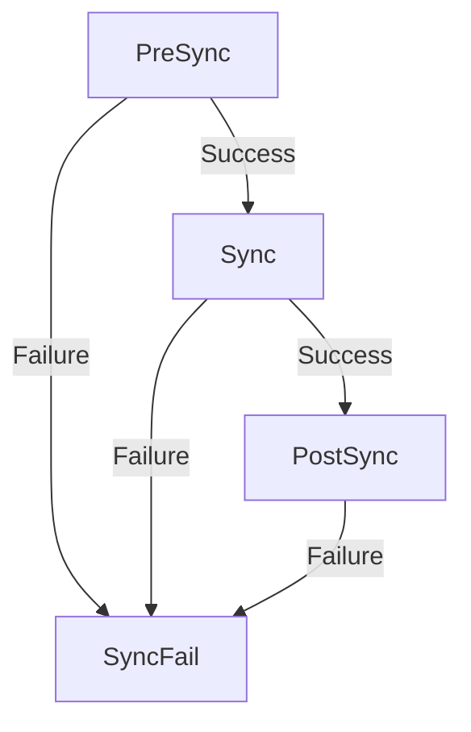

# How to Use SyncFail Hooks for Cleanup After Failed Syncs in ArgoCD

Author: [nawazdhandala](https://github.com/nawazdhandala)

Tags: ArgoCD, GitOps, Kubernetes, Sync Hooks, Error Handling

Description: Learn how to use ArgoCD SyncFail hooks to automate cleanup, alerting, and recovery actions when sync operations fail in your deployment pipeline.

---

When an ArgoCD sync fails, you are often left scrambling. Partially applied resources might be in a broken state, your team needs to know about it, and someone has to figure out what went wrong. SyncFail hooks automate the response to sync failures, running cleanup jobs, sending alerts, and preparing for recovery without any human intervention.

SyncFail hooks execute only when the sync operation fails. They do not run on successful syncs. This makes them the perfect place for error-handling logic that you do not want cluttering your normal deployment flow.

## How SyncFail Hooks Work

The SyncFail phase is triggered when:
- A resource in the Sync phase fails to apply
- A PreSync hook fails (which prevents the Sync phase from starting)
- A PostSync hook fails (which marks the overall sync as failed)
- The sync times out



SyncFail hooks run as Kubernetes Jobs, just like PreSync and PostSync hooks. They have the same lifecycle - they are created, run to completion, and are cleaned up based on the delete policy.

## Basic SyncFail Alert Hook

The most common use case is alerting your team when a sync fails:

```yaml
apiVersion: batch/v1
kind: Job
metadata:
  name: sync-fail-alert
  annotations:
    argocd.argoproj.io/hook: SyncFail
    argocd.argoproj.io/hook-delete-policy: BeforeHookCreation
spec:
  template:
    spec:
      containers:
        - name: alert
          image: curlimages/curl:latest
          command:
            - /bin/sh
            - -c
            - |
              TIMESTAMP=$(date -u +"%Y-%m-%dT%H:%M:%SZ")

              # Send Slack alert
              curl -X POST "$SLACK_WEBHOOK" \
                -H 'Content-Type: application/json' \
                -d "{
                  \"blocks\": [
                    {
                      \"type\": \"section\",
                      \"text\": {
                        \"type\": \"mrkdwn\",
                        \"text\": \":x: *Sync Failed*\n*App:* ${APP_NAME}\n*Environment:* ${ENVIRONMENT}\n*Time:* ${TIMESTAMP}\n\nPlease investigate immediately.\"
                      }
                    },
                    {
                      \"type\": \"actions\",
                      \"elements\": [{
                        \"type\": \"button\",
                        \"text\": {\"type\": \"plain_text\", \"text\": \"View in ArgoCD\"},
                        \"url\": \"https://argocd.example.com/applications/${APP_NAME}\"
                      }]
                    }
                  ]
                }"
          env:
            - name: SLACK_WEBHOOK
              valueFrom:
                secretKeyRef:
                  name: slack-webhook
                  key: url
            - name: APP_NAME
              value: "web-service"
            - name: ENVIRONMENT
              value: "production"
      restartPolicy: Never
  backoffLimit: 1
```

## PagerDuty Incident on Sync Failure

For production environments, trigger an incident:

```yaml
apiVersion: batch/v1
kind: Job
metadata:
  name: sync-fail-pagerduty
  annotations:
    argocd.argoproj.io/hook: SyncFail
    argocd.argoproj.io/hook-delete-policy: BeforeHookCreation
spec:
  template:
    spec:
      containers:
        - name: incident
          image: curlimages/curl:latest
          command:
            - /bin/sh
            - -c
            - |
              curl -X POST "https://events.pagerduty.com/v2/enqueue" \
                -H 'Content-Type: application/json' \
                -d "{
                  \"routing_key\": \"${PD_ROUTING_KEY}\",
                  \"event_action\": \"trigger\",
                  \"dedup_key\": \"argocd-sync-fail-${APP_NAME}\",
                  \"payload\": {
                    \"summary\": \"ArgoCD sync failed for ${APP_NAME} in ${ENVIRONMENT}\",
                    \"severity\": \"critical\",
                    \"source\": \"argocd\",
                    \"component\": \"${APP_NAME}\",
                    \"group\": \"deployment\",
                    \"custom_details\": {
                      \"application\": \"${APP_NAME}\",
                      \"environment\": \"${ENVIRONMENT}\",
                      \"argocd_url\": \"https://argocd.example.com/applications/${APP_NAME}\"
                    }
                  }
                }"
          env:
            - name: PD_ROUTING_KEY
              valueFrom:
                secretKeyRef:
                  name: pagerduty
                  key: routing-key
            - name: APP_NAME
              value: "web-service"
            - name: ENVIRONMENT
              value: "production"
      restartPolicy: Never
  backoffLimit: 1
```

## Cleanup Temporary Resources

If your PreSync or Sync phase creates temporary resources that need cleanup on failure:

```yaml
apiVersion: batch/v1
kind: Job
metadata:
  name: sync-fail-cleanup
  annotations:
    argocd.argoproj.io/hook: SyncFail
    argocd.argoproj.io/hook-delete-policy: BeforeHookCreation
spec:
  template:
    spec:
      serviceAccountName: cleanup-sa
      containers:
        - name: cleanup
          image: bitnami/kubectl:latest
          command:
            - /bin/sh
            - -c
            - |
              echo "Cleaning up temporary resources after sync failure..."

              # Delete any temporary ConfigMaps created during sync
              kubectl delete configmap -n my-app -l temp=true --ignore-not-found

              # Delete any orphaned test data
              kubectl delete job -n my-app -l cleanup-on-fail=true --ignore-not-found

              # Scale down any partially deployed canary
              kubectl scale deployment canary-web --replicas=0 -n my-app --ignore-not-found || true

              echo "Cleanup complete"
      restartPolicy: Never
  backoffLimit: 1
```

You will need a ServiceAccount with appropriate permissions:

```yaml
apiVersion: v1
kind: ServiceAccount
metadata:
  name: cleanup-sa
  namespace: my-app
---
apiVersion: rbac.authorization.k8s.io/v1
kind: Role
metadata:
  name: cleanup-role
  namespace: my-app
rules:
  - apiGroups: [""]
    resources: ["configmaps"]
    verbs: ["delete", "list"]
  - apiGroups: ["batch"]
    resources: ["jobs"]
    verbs: ["delete", "list"]
  - apiGroups: ["apps"]
    resources: ["deployments/scale"]
    verbs: ["update"]
---
apiVersion: rbac.authorization.k8s.io/v1
kind: RoleBinding
metadata:
  name: cleanup-binding
  namespace: my-app
subjects:
  - kind: ServiceAccount
    name: cleanup-sa
    namespace: my-app
roleRef:
  kind: Role
  name: cleanup-role
  apiGroup: rbac.authorization.k8s.io
```

## Collecting Debug Information

Gather diagnostic data automatically when a sync fails:

```yaml
apiVersion: batch/v1
kind: Job
metadata:
  name: sync-fail-debug
  annotations:
    argocd.argoproj.io/hook: SyncFail
    argocd.argoproj.io/hook-delete-policy: BeforeHookCreation
spec:
  template:
    spec:
      serviceAccountName: debug-sa
      containers:
        - name: debug
          image: bitnami/kubectl:latest
          command:
            - /bin/sh
            - -c
            - |
              echo "=== Collecting debug info after sync failure ==="
              NAMESPACE="my-app"

              echo ""
              echo "=== Pod Status ==="
              kubectl get pods -n $NAMESPACE -o wide

              echo ""
              echo "=== Recent Events ==="
              kubectl get events -n $NAMESPACE --sort-by='.lastTimestamp' | tail -30

              echo ""
              echo "=== Failed Pods ==="
              for pod in $(kubectl get pods -n $NAMESPACE --field-selector=status.phase=Failed -o name); do
                echo "--- $pod ---"
                kubectl logs -n $NAMESPACE $pod --tail=20 2>/dev/null || echo "No logs available"
              done

              echo ""
              echo "=== CrashLooping Pods ==="
              for pod in $(kubectl get pods -n $NAMESPACE | grep CrashLoop | awk '{print $1}'); do
                echo "--- $pod ---"
                kubectl logs -n $NAMESPACE $pod --previous --tail=20 2>/dev/null || echo "No previous logs"
              done

              echo ""
              echo "=== Debug collection complete ==="
      restartPolicy: Never
  backoffLimit: 1
  activeDeadlineSeconds: 60
```

The logs from this Job can be retrieved for post-mortem analysis:

```bash
# After a sync failure, check the debug Job logs
kubectl logs -n my-app -l job-name=sync-fail-debug
```

## Multiple SyncFail Hooks with Ordering

You can use sync waves to order multiple SyncFail hooks:

```yaml
# Wave 0: Collect debug info
apiVersion: batch/v1
kind: Job
metadata:
  name: fail-collect-debug
  annotations:
    argocd.argoproj.io/hook: SyncFail
    argocd.argoproj.io/sync-wave: "0"
    argocd.argoproj.io/hook-delete-policy: BeforeHookCreation
spec:
  template:
    spec:
      containers:
        - name: debug
          image: bitnami/kubectl:latest
          command: ["sh", "-c", "kubectl get pods -n my-app; kubectl get events -n my-app"]
      restartPolicy: Never
---
# Wave 1: Send alert with debug info
apiVersion: batch/v1
kind: Job
metadata:
  name: fail-send-alert
  annotations:
    argocd.argoproj.io/hook: SyncFail
    argocd.argoproj.io/sync-wave: "1"
    argocd.argoproj.io/hook-delete-policy: BeforeHookCreation
spec:
  template:
    spec:
      containers:
        - name: alert
          image: curlimages/curl:latest
          command:
            - /bin/sh
            - -c
            - |
              curl -X POST "$SLACK_WEBHOOK" \
                -H 'Content-Type: application/json' \
                -d '{"text": "Sync failed for my-app. Debug info collected - check logs."}'
          env:
            - name: SLACK_WEBHOOK
              valueFrom:
                secretKeyRef:
                  name: slack-webhook
                  key: url
      restartPolicy: Never
---
# Wave 2: Cleanup
apiVersion: batch/v1
kind: Job
metadata:
  name: fail-cleanup
  annotations:
    argocd.argoproj.io/hook: SyncFail
    argocd.argoproj.io/sync-wave: "2"
    argocd.argoproj.io/hook-delete-policy: BeforeHookCreation
spec:
  template:
    spec:
      serviceAccountName: cleanup-sa
      containers:
        - name: cleanup
          image: bitnami/kubectl:latest
          command: ["sh", "-c", "kubectl delete configmap -n my-app -l temp=true --ignore-not-found"]
      restartPolicy: Never
```

## SyncFail Hook Reliability

SyncFail hooks should be as reliable as possible since they run during failure scenarios. Follow these guidelines:

1. **Use small, reliable images.** The `curlimages/curl` and `bitnami/kubectl` images are small and rarely fail to pull.

2. **Set short timeouts.** SyncFail hooks should complete quickly. Use `activeDeadlineSeconds: 60` or less.

3. **Handle errors gracefully.** Use `|| true` for non-critical commands to prevent the SyncFail hook itself from failing.

4. **Avoid complex dependencies.** SyncFail hooks should not depend on services that might be in a broken state due to the sync failure.

5. **Set backoffLimit: 1.** One retry is usually enough. If the SyncFail hook itself fails, you do not want it retrying indefinitely.

## What Happens When SyncFail Hooks Fail

If a SyncFail hook fails, ArgoCD logs the failure but does not enter another failure loop. The original sync failure is already recorded, and the SyncFail hook failure is noted in the operation details. There is no "SyncFailFail" phase.

## Summary

SyncFail hooks automate your incident response to deployment failures. Use them for alerting, debug information collection, resource cleanup, and recovery preparation. Keep them lightweight and reliable - they run during failure scenarios where stability matters most. Combined with PreSync and PostSync hooks, SyncFail hooks complete your deployment workflow by handling the unhappy path alongside the happy path.
