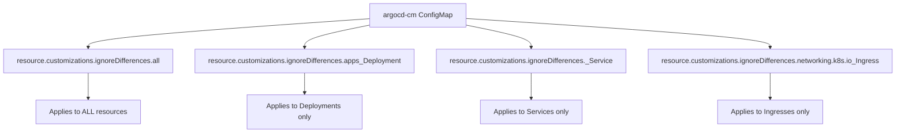
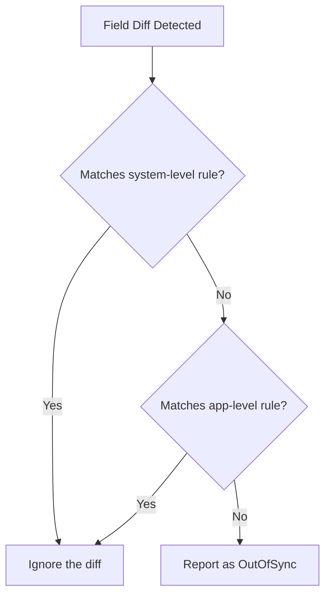

# How to Configure System-Level Diff Defaults in ArgoCD

Author: [nawazdhandala](https://github.com/nawazdhandala)

Tags: ArgoCD, GitOps, Kubernetes, Configuration, Diff Customization

Description: Learn how to configure system-wide diff defaults in ArgoCD using the argocd-cm ConfigMap so all applications benefit from consistent ignore rules and diff strategies.

---

When you manage dozens or hundreds of ArgoCD applications, configuring `ignoreDifferences` on each one becomes repetitive and error-prone. System-level diff defaults let you define ignore rules once in the `argocd-cm` ConfigMap and have them apply to all applications automatically. This is especially useful for cluster-wide concerns like webhook-injected fields, operator-managed values, and Kubernetes default values.

This guide covers how to configure system-level diff defaults, the available configuration keys, and strategies for managing them at scale.

## Where System-Level Diff Defaults Are Configured

System-level diff customizations live in the `argocd-cm` ConfigMap in the ArgoCD namespace:

```bash
# View the current configuration
kubectl get cm argocd-cm -n argocd -o yaml

# Edit it directly
kubectl edit cm argocd-cm -n argocd
```

If you manage ArgoCD with Helm or Kustomize, include these settings in your ArgoCD installation manifests so they are tracked in Git.

## Configuration Key Format

The key format for system-level diff defaults follows this pattern:

```
resource.customizations.ignoreDifferences.<group>_<kind>
```

Where:
- `<group>` is the API group (empty string for core resources, `apps` for Deployments, etc.)
- `<kind>` is the resource kind
- Use `all` to apply to every resource type



### Core API Group Resources

For resources in the core API group (Services, ConfigMaps, Secrets, Pods, PersistentVolumeClaims), the group is an empty string. Prefix the kind with an underscore:

```yaml
# Services (core group)
resource.customizations.ignoreDifferences._Service: |
  jsonPointers:
    - /spec/clusterIP

# ConfigMaps (core group)
resource.customizations.ignoreDifferences._ConfigMap: |
  jsonPointers:
    - /metadata/annotations/kubectl.kubernetes.io~1last-applied-configuration
```

### Named API Group Resources

For resources with a named API group:

```yaml
# Deployments (apps group)
resource.customizations.ignoreDifferences.apps_Deployment: |
  jsonPointers:
    - /spec/replicas

# Ingresses (networking.k8s.io group)
resource.customizations.ignoreDifferences.networking.k8s.io_Ingress: |
  jsonPointers:
    - /metadata/annotations/cert-manager.io~1issuer-name

# Certificates (cert-manager.io group)
resource.customizations.ignoreDifferences.cert-manager.io_Certificate: |
  jsonPointers:
    - /status
```

### All Resources

Use the special `all` keyword to apply rules to every resource type:

```yaml
resource.customizations.ignoreDifferences.all: |
  jsonPointers:
    - /metadata/annotations/kubectl.kubernetes.io~1last-applied-configuration
  managedFieldsManagers:
    - kubectl-client-side-apply
```

## Complete Example Configuration

Here is a comprehensive `argocd-cm` configuration that addresses common diff issues:

```yaml
apiVersion: v1
kind: ConfigMap
metadata:
  name: argocd-cm
  namespace: argocd
data:
  # Global settings
  server.diff.serverSideDiff: "true"

  # Ignore last-applied-configuration on all resources
  resource.customizations.ignoreDifferences.all: |
    jsonPointers:
      - /metadata/annotations/kubectl.kubernetes.io~1last-applied-configuration

  # Ignore HPA-managed replicas and Istio sidecar on Deployments
  resource.customizations.ignoreDifferences.apps_Deployment: |
    jsonPointers:
      - /spec/replicas
    jqPathExpressions:
      - .spec.template.spec.containers[] | select(.name == "istio-proxy")
      - .spec.template.spec.initContainers[] | select(.name == "istio-init")
      - .spec.template.spec.volumes[] | select(.name | startswith("istio-"))
    managedFieldsManagers:
      - kube-controller-manager

  # Ignore HPA-managed replicas on StatefulSets
  resource.customizations.ignoreDifferences.apps_StatefulSet: |
    jsonPointers:
      - /spec/replicas
    managedFieldsManagers:
      - kube-controller-manager

  # Ignore cluster-assigned fields on Services
  resource.customizations.ignoreDifferences._Service: |
    jsonPointers:
      - /spec/clusterIP
      - /spec/clusterIPs
      - /spec/sessionAffinity
      - /spec/ipFamilies
      - /spec/ipFamilyPolicy
      - /spec/internalTrafficPolicy

  # Ignore cert-manager annotations on Ingresses
  resource.customizations.ignoreDifferences.networking.k8s.io_Ingress: |
    jsonPointers:
      - /metadata/annotations/cert-manager.io~1issuer-name
      - /metadata/annotations/cert-manager.io~1issuer-kind
      - /metadata/annotations/acme.cert-manager.io~1http01-edit-in-place
```

## Enabling Server-Side Diff Globally

Instead of configuring many ignore rules, enable server-side diff globally to handle most default value and format issues:

```yaml
apiVersion: v1
kind: ConfigMap
metadata:
  name: argocd-cm
  namespace: argocd
data:
  server.diff.serverSideDiff: "true"
```

This changes the diff strategy for all applications. Individual applications can override this with annotations:

```yaml
# Disable server-side diff for a specific app
metadata:
  annotations:
    argocd.argoproj.io/compare-options: ServerSideDiff=false
```

## How System-Level and Application-Level Rules Interact

System-level rules and application-level `ignoreDifferences` are additive. If a field matches either a system-level or application-level rule, it is ignored:



There is no way to "un-ignore" something at the application level that is ignored at the system level. Design your system-level rules to be conservative and only ignore things that are universally safe to ignore.

## Managing Configuration at Scale

### Using Helm to Manage argocd-cm

If you install ArgoCD with Helm, include the diff defaults in your values file:

```yaml
# values.yaml for ArgoCD Helm chart
configs:
  cm:
    server.diff.serverSideDiff: "true"
    resource.customizations.ignoreDifferences.all: |
      jsonPointers:
        - /metadata/annotations/kubectl.kubernetes.io~1last-applied-configuration
    resource.customizations.ignoreDifferences.apps_Deployment: |
      jsonPointers:
        - /spec/replicas
      managedFieldsManagers:
        - kube-controller-manager
```

### Using Kustomize to Manage argocd-cm

```yaml
# kustomization.yaml
resources:
  - namespace.yaml
  - install.yaml

patches:
  - target:
      kind: ConfigMap
      name: argocd-cm
    patch: |
      apiVersion: v1
      kind: ConfigMap
      metadata:
        name: argocd-cm
      data:
        server.diff.serverSideDiff: "true"
        resource.customizations.ignoreDifferences.all: |
          jsonPointers:
            - /metadata/annotations/kubectl.kubernetes.io~1last-applied-configuration
```

### Using the App-of-Apps Pattern

When managing ArgoCD itself with ArgoCD (bootstrapping), the argocd-cm changes take effect on the next reconciliation:

```yaml
apiVersion: argoproj.io/v1alpha1
kind: Application
metadata:
  name: argocd-config
  namespace: argocd
spec:
  source:
    repoURL: https://github.com/myorg/infra.git
    targetRevision: main
    path: argocd/config
  destination:
    server: https://kubernetes.default.svc
    namespace: argocd
  syncPolicy:
    automated:
      selfHeal: true
```

## System-Level Sync Options

In addition to diff ignore rules, you can configure system-level sync options:

```yaml
apiVersion: v1
kind: ConfigMap
metadata:
  name: argocd-cm
  namespace: argocd
data:
  # Force replace for all Jobs (handles immutable fields)
  resource.customizations.syncOptions.batch_Job: |
    - Replace=true

  # Server-side apply for all Deployments
  resource.customizations.syncOptions.apps_Deployment: |
    - ServerSideApply=true
```

## Testing System-Level Changes

After modifying `argocd-cm`, verify the changes take effect:

```bash
# Apply the ConfigMap changes
kubectl apply -f argocd-cm.yaml

# Wait for ArgoCD to pick up the new config (usually within 30 seconds)
sleep 30

# Hard refresh all affected applications
argocd app list -o name | xargs -I {} argocd app get {} --hard-refresh

# Check if any applications are still OutOfSync
argocd app list -o json | \
  jq '.[] | select(.status.sync.status == "OutOfSync") | .metadata.name'
```

## Auditing System-Level Rules

Keep track of why each rule exists:

```yaml
apiVersion: v1
kind: ConfigMap
metadata:
  name: argocd-cm
  namespace: argocd
  annotations:
    # Document your diff customizations
    config.note/ignore-replicas: "HPA manages replicas on scaled Deployments"
    config.note/ignore-clusterip: "Kubernetes assigns clusterIP at creation time"
    config.note/ignore-istio: "Istio sidecar injector adds containers at admission"
data:
  resource.customizations.ignoreDifferences.apps_Deployment: |
    jsonPointers:
      - /spec/replicas
```

## Best Practices

1. **Start minimal** - Only add system-level rules for issues that affect many applications. Keep application-specific rules at the application level
2. **Enable server-side diff first** - It eliminates most default value diffs without needing ignore rules
3. **Track configuration in Git** - Manage argocd-cm through your ArgoCD bootstrap process
4. **Document every rule** - Include comments or annotations explaining what each rule addresses
5. **Review after upgrades** - Check if new ArgoCD or Kubernetes versions change diff behavior
6. **Test in staging** - Apply new system-level rules to a staging ArgoCD instance before production

For related topics, see [How to Use JSONPointers for Diff Customization](https://oneuptime.com/blog/post/2026-02-26-argocd-jsonpointers-diff-customization/view) and [How to Use JQ Path Expressions for Diff Customization](https://oneuptime.com/blog/post/2026-02-26-argocd-jq-path-diff-customization/view).
