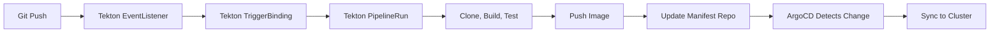

# How to Create a Complete Tekton + ArgoCD Pipeline

Author: [nawazdhandala](https://github.com/nawazdhandala)

Tags: ArgoCD, GitOps, Kubernetes, Tekton, CI/CD

Description: Learn how to build a complete cloud-native CI/CD pipeline using Tekton for Kubernetes-native continuous integration and ArgoCD for GitOps continuous deployment.

---

Tekton and ArgoCD are both Kubernetes-native tools, making them a natural combination for CI/CD. Tekton runs pipelines as Kubernetes resources (Tasks, Pipelines, PipelineRuns), and ArgoCD deploys applications as Kubernetes resources. Everything lives in the cluster, everything is declarative, and everything is managed through Git.

This guide builds a complete pipeline from Tekton CI through ArgoCD CD, including the Tekton resources, triggers, and ArgoCD integration.

## Architecture

Both Tekton and ArgoCD run in the same Kubernetes cluster. Tekton handles CI, ArgoCD handles CD:



## Installing Tekton with ArgoCD

First, deploy Tekton itself using ArgoCD:

```yaml
# tekton-pipelines-app.yaml
apiVersion: argoproj.io/v1alpha1
kind: Application
metadata:
  name: tekton-pipelines
  namespace: argocd
  annotations:
    argocd.argoproj.io/sync-wave: "0"
spec:
  project: platform
  source:
    repoURL: https://github.com/myorg/k8s-platform.git
    path: tekton/pipelines
    targetRevision: main
  destination:
    server: https://kubernetes.default.svc
    namespace: tekton-pipelines
  syncPolicy:
    automated:
      selfHeal: true
    syncOptions:
      - CreateNamespace=true
      - ServerSideApply=true
```

Install Tekton Triggers for webhook handling:

```yaml
# tekton-triggers-app.yaml
apiVersion: argoproj.io/v1alpha1
kind: Application
metadata:
  name: tekton-triggers
  namespace: argocd
  annotations:
    argocd.argoproj.io/sync-wave: "1"
spec:
  project: platform
  source:
    repoURL: https://github.com/myorg/k8s-platform.git
    path: tekton/triggers
    targetRevision: main
  destination:
    server: https://kubernetes.default.svc
    namespace: tekton-pipelines
  syncPolicy:
    automated:
      selfHeal: true
```

## Tekton Tasks

Define reusable tasks for each pipeline step.

Git clone task:

```yaml
# tekton/tasks/git-clone.yaml
apiVersion: tekton.dev/v1
kind: Task
metadata:
  name: git-clone
  namespace: tekton-pipelines
spec:
  params:
    - name: repo-url
      type: string
    - name: revision
      type: string
      default: main
  workspaces:
    - name: source
  results:
    - name: commit-sha
      description: The commit SHA that was cloned
  steps:
    - name: clone
      image: alpine/git:2.43.0
      script: |
        #!/bin/sh
        git clone $(params.repo-url) $(workspaces.source.path)/source
        cd $(workspaces.source.path)/source
        git checkout $(params.revision)
        echo -n $(git rev-parse HEAD) > $(results.commit-sha.path)
```

Build and push task using Kaniko (no Docker daemon needed):

```yaml
# tekton/tasks/build-push.yaml
apiVersion: tekton.dev/v1
kind: Task
metadata:
  name: build-push
  namespace: tekton-pipelines
spec:
  params:
    - name: image
      type: string
    - name: tag
      type: string
    - name: context
      type: string
      default: "."
  workspaces:
    - name: source
    - name: docker-config
  steps:
    - name: build-and-push
      image: gcr.io/kaniko-project/executor:latest
      args:
        - --dockerfile=$(workspaces.source.path)/source/Dockerfile
        - --context=$(workspaces.source.path)/source/$(params.context)
        - --destination=$(params.image):$(params.tag)
        - --destination=$(params.image):latest
        - --cache=true
        - --cache-repo=$(params.image)/cache
      volumeMounts:
        - name: docker-config
          mountPath: /kaniko/.docker
```

Run tests task:

```yaml
# tekton/tasks/run-tests.yaml
apiVersion: tekton.dev/v1
kind: Task
metadata:
  name: run-tests
  namespace: tekton-pipelines
spec:
  params:
    - name: test-command
      type: string
      default: "npm test"
  workspaces:
    - name: source
  steps:
    - name: test
      image: node:20-alpine
      workingDir: $(workspaces.source.path)/source
      script: |
        #!/bin/sh
        npm ci
        $(params.test-command)
```

Update deployment manifest task:

```yaml
# tekton/tasks/update-manifest.yaml
apiVersion: tekton.dev/v1
kind: Task
metadata:
  name: update-manifest
  namespace: tekton-pipelines
spec:
  params:
    - name: deployment-repo
      type: string
    - name: image
      type: string
    - name: tag
      type: string
    - name: deployment-path
      type: string
  workspaces:
    - name: ssh-credentials
  steps:
    - name: update
      image: alpine/git:2.43.0
      script: |
        #!/bin/sh
        # Configure SSH
        mkdir -p ~/.ssh
        cp $(workspaces.ssh-credentials.path)/ssh-privatekey ~/.ssh/id_rsa
        chmod 600 ~/.ssh/id_rsa
        ssh-keyscan github.com >> ~/.ssh/known_hosts

        # Clone deployment repo
        git clone $(params.deployment-repo) /tmp/deploy
        cd /tmp/deploy

        # Update image tag
        sed -i "s|image: $(params.image):.*|image: $(params.image):$(params.tag)|" \
            $(params.deployment-path)/deployment.yaml

        # Commit and push
        git config user.name "Tekton Pipeline"
        git config user.email "tekton@myorg.com"
        git add .
        git commit -m "Update $(params.image) to $(params.tag)"
        git push origin main
```

## Tekton Pipeline

Compose the tasks into a pipeline:

```yaml
# tekton/pipelines/ci-cd-pipeline.yaml
apiVersion: tekton.dev/v1
kind: Pipeline
metadata:
  name: ci-cd-pipeline
  namespace: tekton-pipelines
spec:
  params:
    - name: repo-url
      type: string
    - name: revision
      type: string
      default: main
    - name: image
      type: string
    - name: deployment-repo
      type: string
    - name: deployment-path
      type: string
  workspaces:
    - name: shared-workspace
    - name: docker-config
    - name: ssh-credentials
  tasks:
    - name: clone
      taskRef:
        name: git-clone
      params:
        - name: repo-url
          value: $(params.repo-url)
        - name: revision
          value: $(params.revision)
      workspaces:
        - name: source
          workspace: shared-workspace

    - name: test
      taskRef:
        name: run-tests
      runAfter:
        - clone
      workspaces:
        - name: source
          workspace: shared-workspace

    - name: build-push
      taskRef:
        name: build-push
      runAfter:
        - test
      params:
        - name: image
          value: $(params.image)
        - name: tag
          value: $(tasks.clone.results.commit-sha)
      workspaces:
        - name: source
          workspace: shared-workspace
        - name: docker-config
          workspace: docker-config

    - name: update-manifest
      taskRef:
        name: update-manifest
      runAfter:
        - build-push
      params:
        - name: deployment-repo
          value: $(params.deployment-repo)
        - name: image
          value: $(params.image)
        - name: tag
          value: $(tasks.clone.results.commit-sha)
        - name: deployment-path
          value: $(params.deployment-path)
      workspaces:
        - name: ssh-credentials
          workspace: ssh-credentials
```

## Tekton Triggers

Automatically trigger the pipeline on Git pushes using Tekton Triggers:

```yaml
# tekton/triggers/event-listener.yaml
apiVersion: triggers.tekton.dev/v1beta1
kind: EventListener
metadata:
  name: github-listener
  namespace: tekton-pipelines
spec:
  serviceAccountName: tekton-triggers-sa
  triggers:
    - name: github-push
      interceptors:
        - ref:
            name: github
          params:
            - name: secretRef
              value:
                secretName: github-webhook-secret
                secretKey: token
            - name: eventTypes
              value: ["push"]
      bindings:
        - ref: github-push-binding
      template:
        ref: pipeline-trigger-template
```

```yaml
# tekton/triggers/trigger-binding.yaml
apiVersion: triggers.tekton.dev/v1beta1
kind: TriggerBinding
metadata:
  name: github-push-binding
  namespace: tekton-pipelines
spec:
  params:
    - name: repo-url
      value: $(body.repository.ssh_url)
    - name: revision
      value: $(body.after)
    - name: repo-name
      value: $(body.repository.name)
```

```yaml
# tekton/triggers/trigger-template.yaml
apiVersion: triggers.tekton.dev/v1beta1
kind: TriggerTemplate
metadata:
  name: pipeline-trigger-template
  namespace: tekton-pipelines
spec:
  params:
    - name: repo-url
    - name: revision
    - name: repo-name
  resourcetemplates:
    - apiVersion: tekton.dev/v1
      kind: PipelineRun
      metadata:
        generateName: ci-cd-run-
      spec:
        pipelineRef:
          name: ci-cd-pipeline
        params:
          - name: repo-url
            value: $(tt.params.repo-url)
          - name: revision
            value: $(tt.params.revision)
          - name: image
            value: ghcr.io/myorg/$(tt.params.repo-name)
          - name: deployment-repo
            value: git@github.com:myorg/k8s-deployments.git
          - name: deployment-path
            value: apps/$(tt.params.repo-name)
        workspaces:
          - name: shared-workspace
            volumeClaimTemplate:
              spec:
                accessModes:
                  - ReadWriteOnce
                resources:
                  requests:
                    storage: 1Gi
          - name: docker-config
            secret:
              secretName: docker-registry-credentials
          - name: ssh-credentials
            secret:
              secretName: deployment-repo-ssh-key
```

## Managing Everything Through ArgoCD

The beauty of this setup is that even the Tekton pipeline definitions are managed by ArgoCD:

```yaml
# tekton-ci-config-app.yaml
apiVersion: argoproj.io/v1alpha1
kind: Application
metadata:
  name: tekton-ci-config
  namespace: argocd
spec:
  project: platform
  source:
    repoURL: https://github.com/myorg/k8s-platform.git
    path: tekton
    targetRevision: main
    directory:
      recurse: true
  destination:
    server: https://kubernetes.default.svc
    namespace: tekton-pipelines
  syncPolicy:
    automated:
      selfHeal: true
      prune: true
```

## Summary

Tekton + ArgoCD gives you a fully Kubernetes-native CI/CD pipeline. Both tools use Kubernetes custom resources, both are managed through Git, and both are deployed by ArgoCD. Tekton handles the CI - cloning, testing, building, and pushing images - while ArgoCD handles the CD. The entire pipeline configuration is declarative and version-controlled, making it easy to replicate across clusters and audit for compliance.
