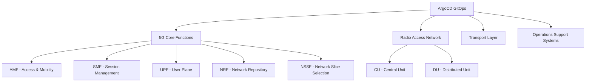

# ArgoCD for Telecom: Network Function Deployments

Author: [nawazdhandala](https://github.com/nawazdhandala)

Tags: ArgoCD, GitOps, Kubernetes, Telecom, 5G

Description: Deploy and manage cloud-native network functions using ArgoCD, covering 5G core components, CNF lifecycle management, and telecom-grade deployment patterns.

---

The telecommunications industry is undergoing a massive transformation from proprietary hardware appliances to cloud-native network functions (CNFs) running on Kubernetes. This shift - driven by 5G deployment, cost reduction, and operational agility - brings telecom workloads into the Kubernetes ecosystem where ArgoCD can manage their lifecycle. However, telecom network functions have requirements that go far beyond typical web applications: carrier-grade availability, strict service level agreements, complex dependency chains, and regulatory compliance. This guide covers how to use ArgoCD for managing telecom-grade network function deployments.

## The Cloud-Native Telecom Stack

Modern telecom infrastructure runs on Kubernetes with CNFs replacing traditional physical and virtual network functions.



## Deploying 5G Core Network Functions

5G core network functions have strict dependency ordering. The Network Repository Function (NRF) must be running before other functions can register. ArgoCD sync waves handle this ordering.

```yaml
# NRF must deploy first - other CNFs register with it
apiVersion: argoproj.io/v1alpha1
kind: Application
metadata:
  name: 5g-nrf
  namespace: argocd
  annotations:
    argocd.argoproj.io/sync-wave: "1"
spec:
  project: telecom-core
  source:
    repoURL: https://github.com/org/telecom-gitops.git
    path: 5g-core/nrf
    targetRevision: main
  destination:
    server: https://telecom-cluster.internal
    namespace: 5g-core
  syncPolicy:
    automated:
      selfHeal: true
    syncOptions:
      - CreateNamespace=true
    retry:
      limit: 5
      backoff:
        duration: 30s
        factor: 2
        maxDuration: 5m

---
# AMF depends on NRF being available
apiVersion: argoproj.io/v1alpha1
kind: Application
metadata:
  name: 5g-amf
  annotations:
    argocd.argoproj.io/sync-wave: "2"
spec:
  project: telecom-core
  source:
    path: 5g-core/amf
  destination:
    namespace: 5g-core

---
# SMF depends on NRF being available
apiVersion: argoproj.io/v1alpha1
kind: Application
metadata:
  name: 5g-smf
  annotations:
    argocd.argoproj.io/sync-wave: "2"
spec:
  project: telecom-core
  source:
    path: 5g-core/smf
  destination:
    namespace: 5g-core

---
# UPF depends on SMF for session management
apiVersion: argoproj.io/v1alpha1
kind: Application
metadata:
  name: 5g-upf
  annotations:
    argocd.argoproj.io/sync-wave: "3"
spec:
  project: telecom-core
  source:
    path: 5g-core/upf
  destination:
    namespace: 5g-core
```

## CNF Resource Requirements

Telecom workloads often require specific CPU pinning, hugepages, DPDK, and SR-IOV interfaces. These are configured through Kubernetes and managed via ArgoCD.

```yaml
# UPF deployment requiring high-performance networking
apiVersion: apps/v1
kind: Deployment
metadata:
  name: upf
  namespace: 5g-core
spec:
  replicas: 3
  template:
    spec:
      containers:
        - name: upf
          image: registry.telecom.internal/5g-upf:v3.2.1
          resources:
            requests:
              cpu: "8"
              memory: 16Gi
              hugepages-1Gi: 4Gi
              # SR-IOV network interfaces
              intel.com/sriov_netdevice: "2"
            limits:
              cpu: "8"
              memory: 16Gi
              hugepages-1Gi: 4Gi
              intel.com/sriov_netdevice: "2"
          volumeMounts:
            - name: hugepage
              mountPath: /dev/hugepages
          env:
            - name: UPF_N3_INTERFACE
              value: "net1"  # SR-IOV interface for N3 (GTP-U)
            - name: UPF_N6_INTERFACE
              value: "net2"  # SR-IOV interface for N6 (Internet)
      volumes:
        - name: hugepage
          emptyDir:
            medium: HugePages
      # Pin to specific nodes with performance profiles
      nodeSelector:
        node-role.kubernetes.io/upf: ""
        feature.node.kubernetes.io/cpu-cpuid.AVX2: "true"
      tolerations:
        - key: "dedicated"
          operator: "Equal"
          value: "upf"
          effect: "NoSchedule"

---
# Multus network attachment for SR-IOV
apiVersion: k8s.cni.cncf.io/v1
kind: NetworkAttachmentDefinition
metadata:
  name: sriov-n3
  namespace: 5g-core
  annotations:
    k8s.v1.cni.cncf.io/resourceName: intel.com/sriov_netdevice
spec:
  config: |
    {
      "cniVersion": "0.3.1",
      "type": "sriov",
      "vlan": 100,
      "ipam": {
        "type": "host-local",
        "ranges": [[{"subnet": "10.10.10.0/24"}]]
      }
    }
```

## Network Slice Management

5G networks use network slicing to provide different service levels for different use cases. ArgoCD can manage slice-specific deployments.

```yaml
# ApplicationSet for network slice deployments
apiVersion: argoproj.io/v1alpha1
kind: ApplicationSet
metadata:
  name: network-slices
  namespace: argocd
spec:
  generators:
    - list:
        elements:
          - slice: embb
            description: "Enhanced Mobile Broadband"
            smf_replicas: "3"
            upf_replicas: "5"
            qos_profile: "high-throughput"
          - slice: urllc
            description: "Ultra-Reliable Low-Latency"
            smf_replicas: "5"
            upf_replicas: "10"
            qos_profile: "low-latency"
          - slice: mmtc
            description: "Massive Machine Type Communication"
            smf_replicas: "2"
            upf_replicas: "3"
            qos_profile: "high-density"
  template:
    metadata:
      name: 'slice-{{slice}}'
      labels:
        network-slice: '{{slice}}'
    spec:
      project: telecom-core
      source:
        repoURL: https://github.com/org/telecom-gitops.git
        path: slices/{{slice}}
        targetRevision: main
      destination:
        server: https://telecom-cluster.internal
        namespace: 'slice-{{slice}}'
      syncPolicy:
        automated:
          selfHeal: true
```

## Carrier-Grade Availability

Telecom systems require 99.999% availability (five nines), which translates to about 5 minutes of downtime per year. ArgoCD configuration must support this.

### Pod Disruption Budgets

```yaml
# PDB for critical network functions
apiVersion: policy/v1
kind: PodDisruptionBudget
metadata:
  name: amf-pdb
  namespace: 5g-core
spec:
  maxUnavailable: 1
  selector:
    matchLabels:
      app: amf

---
# UPF needs even stricter availability
apiVersion: policy/v1
kind: PodDisruptionBudget
metadata:
  name: upf-pdb
  namespace: 5g-core
spec:
  minAvailable: "90%"
  selector:
    matchLabels:
      app: upf
```

### Health Checks for CNFs

Custom ArgoCD health checks for telecom resources.

```yaml
# argocd-cm custom health check for 5G network functions
apiVersion: v1
kind: ConfigMap
metadata:
  name: argocd-cm
  namespace: argocd
data:
  resource.customizations.health.5g.telecom.io_NetworkFunction: |
    hs = {}
    if obj.status ~= nil then
      if obj.status.phase == "Running" and obj.status.registeredWithNRF == true then
        hs.status = "Healthy"
        hs.message = "Network function running and registered with NRF"
      elseif obj.status.phase == "Starting" then
        hs.status = "Progressing"
        hs.message = "Network function starting: " .. (obj.status.message or "")
      else
        hs.status = "Degraded"
        hs.message = "Network function issue: " .. (obj.status.message or "unknown")
      end
    end
    return hs
```

## Rolling Upgrades for Active Networks

Network function upgrades must happen without dropping calls or data sessions. Use careful rolling update strategies.

```yaml
# Rolling update strategy for AMF
apiVersion: apps/v1
kind: Deployment
metadata:
  name: amf
spec:
  replicas: 5
  strategy:
    type: RollingUpdate
    rollingUpdate:
      maxSurge: 1       # Add one new pod at a time
      maxUnavailable: 0  # Never reduce capacity during upgrade
  template:
    spec:
      terminationGracePeriodSeconds: 300  # 5 minutes for graceful drain
      containers:
        - name: amf
          image: registry.telecom.internal/5g-amf:v3.3.0
          lifecycle:
            preStop:
              exec:
                command:
                  - /bin/sh
                  - -c
                  - |
                    # Signal the AMF to stop accepting new connections
                    /usr/local/bin/amf-cli deregister
                    # Wait for existing sessions to drain
                    /usr/local/bin/amf-cli wait-drain --timeout 240
          readinessProbe:
            httpGet:
              path: /health/ready
              port: 8080
            initialDelaySeconds: 30
            periodSeconds: 5
          livenessProbe:
            httpGet:
              path: /health/live
              port: 8080
            initialDelaySeconds: 60
            periodSeconds: 10
```

## Multi-Site Telecom Deployment

Telecom networks span multiple geographic sites - central data centers, regional edge sites, and far-edge locations.

```yaml
# ApplicationSet for multi-site telecom deployment
apiVersion: argoproj.io/v1alpha1
kind: ApplicationSet
metadata:
  name: telecom-multi-site
spec:
  generators:
    - matrix:
        generators:
          - clusters:
              selector:
                matchLabels:
                  site-type: central
              values:
                deploy_core: "true"
                deploy_edge: "false"
          - list:
              elements:
                - component: nrf
                  wave: "1"
                - component: amf
                  wave: "2"
                - component: smf
                  wave: "2"
                - component: upf
                  wave: "3"
    - matrix:
        generators:
          - clusters:
              selector:
                matchLabels:
                  site-type: edge
              values:
                deploy_core: "false"
                deploy_edge: "true"
          - list:
              elements:
                - component: upf
                  wave: "1"
                - component: edge-cache
                  wave: "2"
  template:
    metadata:
      name: '{{component}}-{{name}}'
      annotations:
        argocd.argoproj.io/sync-wave: '{{wave}}'
    spec:
      source:
        repoURL: https://github.com/org/telecom-gitops.git
        path: 'components/{{component}}/overlays/{{metadata.labels.site-type}}'
      destination:
        server: '{{server}}'
        namespace: telecom
```

## Compliance and Change Management

Telecom operators must comply with various regulations and internal change management processes.

```yaml
# Strict sync windows for production network
spec:
  syncWindows:
    # Maintenance windows aligned with network operations
    - kind: allow
      schedule: '0 2 * * 2'  # Tuesday 2 AM (standard maintenance)
      duration: 4h
      applications:
        - '*'
    # Emergency changes require manual sync
    - kind: allow
      schedule: '* * * * *'
      duration: 24h
      applications:
        - '*'
      manualSync: true
```

## Monitoring Telecom Deployments

Telecom monitoring goes beyond standard application metrics. You need to track network-specific KPIs.

```yaml
# PrometheusRule for telecom-specific monitoring
apiVersion: monitoring.coreos.com/v1
kind: PrometheusRule
metadata:
  name: telecom-cnf-alerts
spec:
  groups:
    - name: cnf-health
      rules:
        - alert: AMFRegistrationFailureRate
          expr: rate(amf_registration_failures_total[5m]) > 0.01
          for: 2m
          labels:
            severity: critical
          annotations:
            summary: "High AMF registration failure rate"

        - alert: UPFPacketDropRate
          expr: rate(upf_packets_dropped_total[5m]) / rate(upf_packets_total[5m]) > 0.001
          for: 1m
          labels:
            severity: critical
          annotations:
            summary: "UPF packet drop rate exceeds threshold"

        - alert: SMFSessionSetupLatency
          expr: histogram_quantile(0.99, rate(smf_session_setup_duration_seconds_bucket[5m])) > 0.1
          for: 5m
          labels:
            severity: warning
          annotations:
            summary: "SMF session setup latency exceeds 100ms at p99"
```

The telecom industry's move to cloud-native network functions on Kubernetes creates an opportunity to apply GitOps practices to network infrastructure management. ArgoCD provides the deployment consistency, audit trail, and automated reconciliation that carrier-grade networks demand. Combined with proper health checks, rolling update strategies, and multi-site management, ArgoCD can serve as the deployment backbone for modern telecom infrastructure. For comprehensive monitoring of your telecom CNF deployments, explore [OneUptime](https://oneuptime.com/blog/post/2026-02-26-argocd-gaming-deployments/view) for end-to-end observability across your network function lifecycle.
