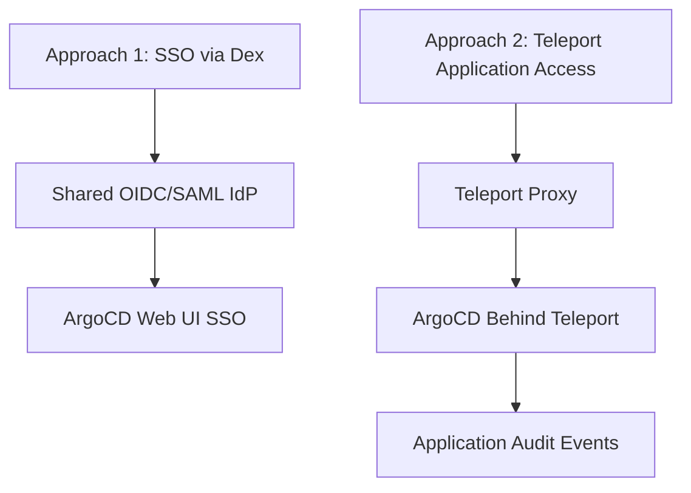

# How to Integrate ArgoCD with Teleport

Author: [nawazdhandala](https://github.com/nawazdhandala)

Tags: ArgoCD, GitOps, Kubernetes, Teleport, Zero Trust

Description: Learn how to integrate ArgoCD with Teleport for zero-trust access, including certificate-based authentication, session recording, and just-in-time access controls for GitOps workflows.

---

Teleport is a zero-trust access platform that provides certificate-based authentication, audit logging, session recording for supported protocols, and just-in-time access for infrastructure. Integrating ArgoCD with Teleport adds a powerful security layer: ArgoCD access through Teleport Application Access is audited, access can be time-limited, and CLI access can use short-lived certificates instead of long-lived tokens. This is especially valuable for organizations with strict compliance requirements.

This guide covers integrating ArgoCD with Teleport for both web UI access and Kubernetes-level access control.

## Why Teleport for ArgoCD

Teleport brings capabilities that standard OIDC/SAML providers do not offer:

- **Application audit events**: ArgoCD access through Teleport Application Access emits app session request events
- **Short-lived certificates**: No long-lived tokens or passwords
- **Just-in-time access**: Users request elevated access that expires automatically
- **Access requests with approvals**: Require manager approval for production access
- **Unified audit log**: All ArgoCD access in one audit trail alongside SSH and database access

## Integration Approaches

There are two ways to integrate ArgoCD with Teleport:


```mermaid
graph TD
    A[Approach 1: SSO via Dex] --> B[Shared OIDC/SAML IdP]
    B --> C[ArgoCD Web UI SSO]

    D[Approach 2: Teleport Application Access] --> E[Teleport Proxy]
    E --> F[ArgoCD Behind Teleport]
    F --> G[Application Audit Events]
```

Approach 1 gives you SSO authentication through the same identity provider you use with Teleport. Approach 2 gives you Teleport's Application Access controls and audit events. Many organizations use both.

## Approach 1: SSO via Dex

Teleport can use OIDC and SAML connectors to authenticate users against your identity provider. For ArgoCD SSO, configure Dex to use that same identity provider directly.

### Step 1: Configure Your Identity Provider in Teleport

Create a Teleport OIDC connector for the same provider your ArgoCD Dex connector will use:

```yaml
# teleport-oidc-connector.yaml
kind: oidc
version: v3
metadata:
  name: company-oidc
spec:
  issuer_url: https://idp.example.com/oauth2/default
  client_id: teleport
  client_secret: "generated-client-secret"
  redirect_url:
  - https://teleport.example.com/v1/webapi/oidc/callback
  scope:
  - openid
  - profile
  - email
  - groups
  claims_to_roles:
  - claim: groups
    value: platform-team
    roles:
    - argocd-admin
  - claim: groups
    value: developers
    roles:
    - argocd-developer
```

Register it:

```bash
tctl create teleport-oidc-connector.yaml
```

### Step 2: Configure an ArgoCD OIDC Client in the Identity Provider

Create a separate OIDC application for ArgoCD in the same identity provider, with this callback URL:

```text
https://argocd.example.com/api/dex/callback
```

### Step 3: Configure Dex in ArgoCD

```yaml
apiVersion: v1
kind: ConfigMap
metadata:
  name: argocd-cm
  namespace: argocd
data:
  url: https://argocd.example.com

  dex.config: |
    connectors:
    - type: oidc
      id: company-oidc
      name: Company OIDC
      config:
        issuer: https://idp.example.com/oauth2/default
        clientID: argocd
        clientSecret: $dex.teleport.clientSecret
        redirectURI: https://argocd.example.com/api/dex/callback
        scopes:
        - openid
        - profile
        - email
        - groups
        insecureEnableGroups: true
        groupsKey: groups
        userIDKey: sub
        userNameKey: preferred_username
```

## Approach 2: Teleport Application Access (Recommended)

This approach puts ArgoCD entirely behind Teleport's application access proxy. This gives you application access audit events, access requests, and certificate-based CLI access.

### Step 1: Deploy Teleport Agent

Deploy a Teleport agent in the ArgoCD namespace:

```yaml
# teleport-agent.yaml
apiVersion: apps/v1
kind: Deployment
metadata:
  name: teleport-agent
  namespace: argocd
spec:
  replicas: 1
  selector:
    matchLabels:
      app: teleport-agent
  template:
    metadata:
      labels:
        app: teleport-agent
    spec:
      containers:
      - name: teleport
        image: public.ecr.aws/gravitational/teleport:18
        args:
        - app
        - start
        - --token=/etc/teleport-secrets/token
        - --auth-server=teleport.example.com:443
        - --name=argocd
        - --uri=http://argocd-server.argocd.svc.cluster.local:80
        - --labels=app=argocd,env=production
        volumeMounts:
        - name: token
          mountPath: /etc/teleport-secrets
          readOnly: true
        - name: teleport-data
          mountPath: /var/lib/teleport
      volumes:
      - name: token
        secret:
          secretName: teleport-join-token
      - name: teleport-data
        emptyDir: {}
```

Generate a join token:

```bash
# On Teleport auth server
tctl tokens add --type=app --ttl=1h
```

Store the token:

```bash
kubectl create secret generic teleport-join-token \
  --namespace argocd \
  --from-literal=token='your-join-token'
```

### Step 2: Configure Teleport Roles

Define roles that control who can access ArgoCD and at what level:

```yaml
# teleport-argocd-roles.yaml
kind: role
version: v7
metadata:
  name: argocd-admin
spec:
  allow:
    app_labels:
      'app': 'argocd'
      'env': 'production'
    # Additional Kubernetes access for ArgoCD namespace
    kubernetes_labels:
      'env': 'production'
    kubernetes_resources:
    - kind: pod
      namespace: argocd
      name: '*'
    kubernetes_groups:
    - argocd-admins
    review_requests:
      roles:
      - argocd-jit-admin
  options:
    # Maximum session duration
    max_session_ttl: 8h
---
kind: role
version: v7
metadata:
  name: argocd-developer
spec:
  allow:
    app_labels:
      'app': 'argocd'
      'env': 'production'
    # Request access to production (requires approval)
    request:
      roles:
      - argocd-jit-admin
      # Limit elevated access duration
      max_duration: 2h
  options:
    max_session_ttl: 8h
```

Apply the roles:

```bash
tctl create teleport-argocd-roles.yaml
```

### Step 3: Configure Just-in-Time Access

Set up access request workflows so developers can request temporary admin access:

```yaml
# teleport-access-request-config.yaml
kind: role
version: v7
metadata:
  name: argocd-jit-admin
spec:
  allow:
    app_labels:
      'app': 'argocd'
      'env': 'production'
  options:
    max_session_ttl: 2h  # Short-lived elevated access
```

Developers request access:

```bash
# Developer requests elevated access
tsh request create --roles=argocd-jit-admin --reason="Deploying hotfix for JIRA-1234"

# Admin approves the request
tsh request review --approve <request-id>

# Developer now has time-limited admin access
tsh login --request-id=<request-id>
tsh apps login argocd
```

## Application Audit

ArgoCD access through Teleport is auditable. Application sessions capture `app.session.request` audit events:

```bash
# View recent Teleport sessions
tsh recordings ls

# View a specific app session as audit events
tsh play --format=json <session-id>

# Export the app session events
tsh play --format=json <session-id> > argocd-app-session.json
```

This is invaluable for compliance - you can prove who accessed ArgoCD and which HTTP requests went through Teleport.

## Teleport with ArgoCD CLI

For CLI access through Teleport:

```bash
# Login to Teleport
tsh login --proxy=teleport.example.com

# Access ArgoCD through Teleport tunnel
tsh apps login argocd

# Now use ArgoCD CLI with Teleport's short-lived client certificate.
# ArgoCD authentication is still required.
export ARGOCD_SERVER=$(tsh apps config --format=uri argocd)
argocd login "$ARGOCD_SERVER" --sso \
  --client-crt "$(tsh apps config --format=cert argocd)" \
  --client-crt-key "$(tsh apps config --format=key argocd)" \
  --server-crt "$(tsh apps config --format=ca argocd)" \
  --grpc-web
argocd app list \
  --server "$ARGOCD_SERVER" \
  --client-crt "$(tsh apps config --format=cert argocd)" \
  --client-crt-key "$(tsh apps config --format=key argocd)" \
  --server-crt "$(tsh apps config --format=ca argocd)" \
  --grpc-web
```

The CLI traffic goes through Teleport's proxy, which means it is also audited and subject to access policies.

## Monitoring the Integration

Monitor both Teleport and ArgoCD health to ensure the authentication chain is working:

```yaml
# PrometheusRule for Teleport agent health
apiVersion: monitoring.coreos.com/v1
kind: PrometheusRule
metadata:
  name: teleport-agent-health
spec:
  groups:
  - name: teleport-argocd
    rules:
    - alert: TeleportAgentDown
      expr: up{job="teleport-agent"} == 0
      for: 5m
      labels:
        severity: critical
      annotations:
        summary: "Teleport agent for ArgoCD is down"
```

Integrate with OneUptime for comprehensive monitoring of both the Teleport agent and ArgoCD health.

## Conclusion

Teleport integration elevates ArgoCD security from basic SSO to zero-trust access with audit events, short-lived certificates, and just-in-time access controls. The application access approach is the most powerful, giving you audit trails for ArgoCD access through Teleport. For organizations in regulated industries or those requiring SOC 2 compliance, the combination of Teleport's audit trail with ArgoCD's GitOps audit trail creates a comprehensive evidence chain for every deployment. The trade-off is added complexity in the access path, but for organizations that already use Teleport, the ArgoCD integration is straightforward and the security benefits are substantial.
