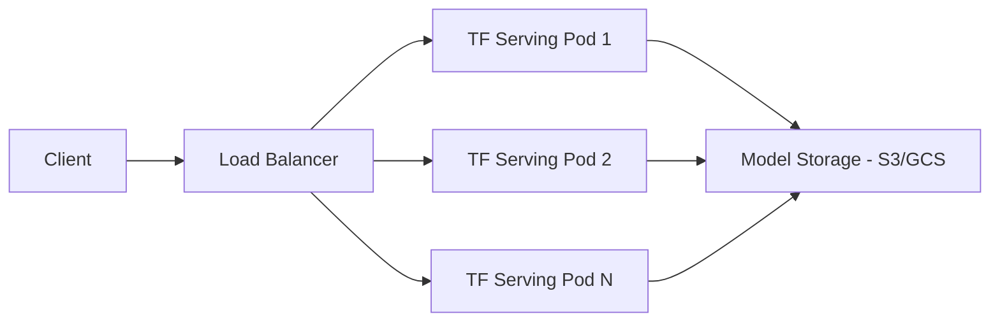

# How to Deploy TensorFlow Serving with ArgoCD

Author: [nawazdhandala](https://github.com/nawazdhandala)

Tags: ArgoCD, GitOps, Kubernetes, TensorFlow, ML Serving

Description: Learn how to deploy and manage TensorFlow Serving on Kubernetes using ArgoCD, with model versioning, GPU support, autoscaling, and canary deployments for production ML inference.

---

TensorFlow Serving is the production-grade model serving system built by Google for TensorFlow models. It handles model loading, versioning, batching, and serving through both REST and gRPC APIs. When deployed on Kubernetes with ArgoCD, you get a GitOps-driven ML inference platform where model updates are just Git commits and rollbacks are instant.

This guide covers deploying TensorFlow Serving on Kubernetes with ArgoCD, from basic CPU deployments to GPU-accelerated production setups with autoscaling.

## TensorFlow Serving Architecture



TensorFlow Serving loads models from a storage backend (S3, GCS, or local disk), serves them through REST/gRPC endpoints, and handles automatic model version transitions.

## Basic TensorFlow Serving Deployment

Start with a straightforward deployment that serves a model from cloud storage:

```yaml
# apps/tf-serving/deployment.yaml
apiVersion: apps/v1
kind: Deployment
metadata:
  name: tf-serving
  labels:
    app: tf-serving
    model: image-classifier
spec:
  replicas: 3
  selector:
    matchLabels:
      app: tf-serving
  template:
    metadata:
      labels:
        app: tf-serving
        model: image-classifier
    spec:
      containers:
        - name: tf-serving
          image: tensorflow/serving:2.14.0
          ports:
            - containerPort: 8501
              name: rest
            - containerPort: 8500
              name: grpc
          args:
            - --model_name=image-classifier
            - --model_base_path=s3://ml-models/image-classifier/
            - --port=8500
            - --rest_api_port=8501
            - --enable_batching=true
            - --batching_parameters_file=/config/batching.config
          env:
            - name: AWS_ACCESS_KEY_ID
              valueFrom:
                secretKeyRef:
                  name: s3-credentials
                  key: access-key
            - name: AWS_SECRET_ACCESS_KEY
              valueFrom:
                secretKeyRef:
                  name: s3-credentials
                  key: secret-key
            - name: AWS_REGION
              value: us-east-1
            - name: S3_ENDPOINT
              value: s3.amazonaws.com
          resources:
            requests:
              cpu: "2"
              memory: 4Gi
            limits:
              cpu: "4"
              memory: 8Gi
          readinessProbe:
            httpGet:
              path: /v1/models/image-classifier
              port: 8501
            initialDelaySeconds: 30
            periodSeconds: 10
          livenessProbe:
            httpGet:
              path: /v1/models/image-classifier
              port: 8501
            initialDelaySeconds: 60
            periodSeconds: 30
          volumeMounts:
            - name: config
              mountPath: /config
      volumes:
        - name: config
          configMap:
            name: tf-serving-config
---
apiVersion: v1
kind: Service
metadata:
  name: tf-serving
spec:
  selector:
    app: tf-serving
  ports:
    - name: rest
      port: 8501
      targetPort: 8501
    - name: grpc
      port: 8500
      targetPort: 8500
```

## Batching Configuration

TensorFlow Serving supports request batching to improve GPU utilization:

```yaml
# apps/tf-serving/config.yaml
apiVersion: v1
kind: ConfigMap
metadata:
  name: tf-serving-config
data:
  batching.config: |
    max_batch_size { value: 32 }
    batch_timeout_micros { value: 5000 }
    max_enqueued_batches { value: 100 }
    num_batch_threads { value: 4 }
    pad_variable_length_inputs: true

  model.config: |
    model_config_list {
      config {
        name: "image-classifier"
        base_path: "s3://ml-models/image-classifier/"
        model_platform: "tensorflow"
        model_version_policy {
          specific {
            versions: 3
            versions: 4
          }
        }
        version_labels {
          key: "stable"
          value: 3
        }
        version_labels {
          key: "canary"
          value: 4
        }
      }
    }
```

The model config allows serving multiple versions simultaneously with labels for routing.

## GPU-Accelerated Deployment

For production workloads that need GPU inference:

```yaml
apiVersion: apps/v1
kind: Deployment
metadata:
  name: tf-serving-gpu
  labels:
    app: tf-serving-gpu
spec:
  replicas: 2
  selector:
    matchLabels:
      app: tf-serving-gpu
  template:
    metadata:
      labels:
        app: tf-serving-gpu
    spec:
      containers:
        - name: tf-serving
          # Use the GPU-enabled image
          image: tensorflow/serving:2.14.0-gpu
          ports:
            - containerPort: 8501
              name: rest
            - containerPort: 8500
              name: grpc
          args:
            - --model_name=image-classifier
            - --model_base_path=s3://ml-models/image-classifier/
            - --port=8500
            - --rest_api_port=8501
            - --enable_batching=true
            - --batching_parameters_file=/config/batching.config
            - --tensorflow_inter_op_parallelism=2
            - --tensorflow_intra_op_parallelism=4
          env:
            - name: NVIDIA_VISIBLE_DEVICES
              value: all
            - name: AWS_ACCESS_KEY_ID
              valueFrom:
                secretKeyRef:
                  name: s3-credentials
                  key: access-key
            - name: AWS_SECRET_ACCESS_KEY
              valueFrom:
                secretKeyRef:
                  name: s3-credentials
                  key: secret-key
          resources:
            requests:
              cpu: "2"
              memory: 8Gi
              nvidia.com/gpu: 1
            limits:
              cpu: "4"
              memory: 16Gi
              nvidia.com/gpu: 1
      nodeSelector:
        accelerator: nvidia-tesla-t4
      tolerations:
        - key: nvidia.com/gpu
          operator: Exists
          effect: NoSchedule
```

## Multi-Model Serving

Serve multiple models from a single TensorFlow Serving deployment:

```yaml
apiVersion: v1
kind: ConfigMap
metadata:
  name: tf-multi-model-config
data:
  models.config: |
    model_config_list {
      config {
        name: "image-classifier"
        base_path: "s3://ml-models/image-classifier/"
        model_platform: "tensorflow"
      }
      config {
        name: "text-sentiment"
        base_path: "s3://ml-models/text-sentiment/"
        model_platform: "tensorflow"
      }
      config {
        name: "recommendation"
        base_path: "s3://ml-models/recommendation/"
        model_platform: "tensorflow"
      }
    }
```

```yaml
apiVersion: apps/v1
kind: Deployment
metadata:
  name: tf-serving-multi
spec:
  template:
    spec:
      containers:
        - name: tf-serving
          image: tensorflow/serving:2.14.0
          args:
            - --model_config_file=/config/models.config
            - --port=8500
            - --rest_api_port=8501
            # Monitor config file for changes
            - --model_config_file_poll_wait_seconds=60
          volumeMounts:
            - name: config
              mountPath: /config
      volumes:
        - name: config
          configMap:
            name: tf-multi-model-config
```

## Model Version Management with GitOps

Track model versions in your GitOps repository:

```yaml
# apps/tf-serving/model-versions.yaml
apiVersion: v1
kind: ConfigMap
metadata:
  name: model-versions
  labels:
    app: tf-serving
data:
  # Update these values to roll out new model versions
  image-classifier-version: "4"
  text-sentiment-version: "2"
  recommendation-version: "7"
```

Your model training pipeline updates this file:

```bash
# After model training and validation passes:
# Update the version in Git
cd gitops-repo
sed -i 's/image-classifier-version: "4"/image-classifier-version: "5"/' \
  apps/tf-serving/model-versions.yaml
git add apps/tf-serving/model-versions.yaml
git commit -m "Promote image-classifier model to v5"
git push
# ArgoCD picks up the change
```

## Autoscaling TensorFlow Serving

Scale based on request rate and GPU utilization:

```yaml
apiVersion: autoscaling/v2
kind: HorizontalPodAutoscaler
metadata:
  name: tf-serving-hpa
spec:
  scaleTargetRef:
    apiVersion: apps/v1
    kind: Deployment
    name: tf-serving
  minReplicas: 2
  maxReplicas: 20
  metrics:
    - type: Resource
      resource:
        name: cpu
        target:
          type: Utilization
          averageUtilization: 60
    - type: Pods
      pods:
        metric:
          name: tf_serving_request_count
        target:
          type: AverageValue
          averageValue: "100"
  behavior:
    scaleUp:
      stabilizationWindowSeconds: 60
      policies:
        - type: Pods
          value: 2
          periodSeconds: 60
    scaleDown:
      stabilizationWindowSeconds: 300
      policies:
        - type: Pods
          value: 1
          periodSeconds: 120
```

## Canary Model Deployment

Deploy a new model version to a subset of traffic:

```yaml
# Stable deployment (current model)
apiVersion: apps/v1
kind: Deployment
metadata:
  name: tf-serving-stable
  labels:
    app: tf-serving
    variant: stable
spec:
  replicas: 3
  selector:
    matchLabels:
      app: tf-serving
      variant: stable
  template:
    spec:
      containers:
        - name: tf-serving
          image: tensorflow/serving:2.14.0
          args:
            - --model_name=image-classifier
            - --model_base_path=s3://ml-models/image-classifier/v4/
---
# Canary deployment (new model)
apiVersion: apps/v1
kind: Deployment
metadata:
  name: tf-serving-canary
  labels:
    app: tf-serving
    variant: canary
spec:
  replicas: 1
  selector:
    matchLabels:
      app: tf-serving
      variant: canary
  template:
    spec:
      containers:
        - name: tf-serving
          image: tensorflow/serving:2.14.0
          args:
            - --model_name=image-classifier
            - --model_base_path=s3://ml-models/image-classifier/v5/
---
# Traffic split
apiVersion: networking.istio.io/v1alpha3
kind: VirtualService
metadata:
  name: tf-serving-route
spec:
  hosts:
    - tf-serving
  http:
    - route:
        - destination:
            host: tf-serving-stable
            port:
              number: 8501
          weight: 90
        - destination:
            host: tf-serving-canary
            port:
              number: 8501
          weight: 10
```

## Monitoring TensorFlow Serving

TensorFlow Serving exposes Prometheus metrics on the REST port:

```yaml
apiVersion: monitoring.coreos.com/v1
kind: ServiceMonitor
metadata:
  name: tf-serving-monitor
spec:
  selector:
    matchLabels:
      app: tf-serving
  endpoints:
    - port: rest
      path: /monitoring/prometheus/metrics
      interval: 15s
```

Key metrics to monitor:

- `:tensorflow:serving:request_count` - Total prediction requests
- `:tensorflow:serving:request_latency` - Prediction latency distribution
- `:tensorflow:core:graph_runs` - Model execution count
- `:tensorflow:serving:batching_session:batch_size` - Actual batch sizes

Use OneUptime to set up alerts on inference latency, error rates, and model availability. Track these metrics alongside your application metrics for a complete view of your ML system health.

## ArgoCD Application Definition

```yaml
apiVersion: argoproj.io/v1alpha1
kind: Application
metadata:
  name: tf-serving
  namespace: argocd
spec:
  project: ml-platform
  source:
    repoURL: https://github.com/myorg/ml-gitops.git
    targetRevision: main
    path: apps/tf-serving
  destination:
    server: https://kubernetes.default.svc
    namespace: ml-serving
  syncPolicy:
    automated:
      prune: true
      selfHeal: true
    syncOptions:
      - CreateNamespace=true
  ignoreDifferences:
    - group: apps
      kind: Deployment
      jsonPointers:
        - /spec/replicas
```

For a broader overview of ML model serving options, see our guide on [ML model serving with ArgoCD](https://oneuptime.com/blog/post/2026-02-26-argocd-ml-model-serving/view). For LLM-specific deployments, check out our guide on [deploying vLLM with ArgoCD](https://oneuptime.com/blog/post/2026-02-26-argocd-vllm-deployment/view).

## Best Practices

1. **Use model version labels** - Label your models (stable, canary, experimental) for safe traffic routing.
2. **Enable request batching** - Batching dramatically improves GPU utilization and throughput.
3. **Set appropriate resource limits** - TensorFlow Serving can consume large amounts of memory when loading models.
4. **Use readiness probes** - Wait for the model to be fully loaded before sending traffic.
5. **Monitor model load time** - Large models can take minutes to load. Account for this in deployment and scaling strategies.
6. **Use S3/GCS for model storage** - Do not bake models into container images. Store them externally.
7. **Implement graceful model transitions** - TensorFlow Serving handles version transitions automatically, but monitor for errors during the transition.
8. **Scale conservatively** - Scale up fast, scale down slowly. Model loading on new pods takes time.

TensorFlow Serving with ArgoCD gives you a production-ready ML inference platform managed through GitOps. Model updates are Git commits, rollbacks are instant, and the entire serving infrastructure is reproducible and auditable.
