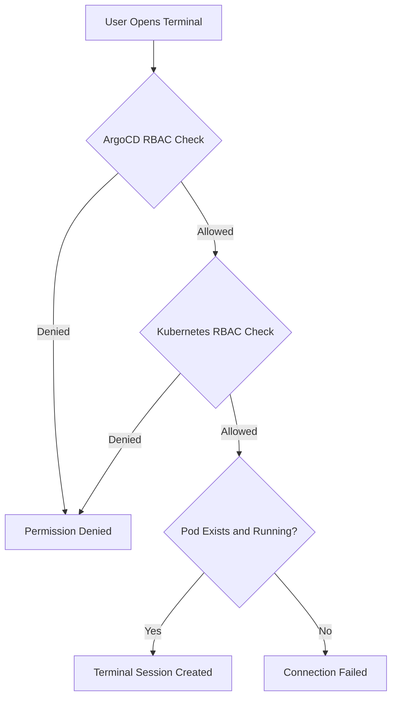

# How to Configure Terminal Access for Specific Pods in ArgoCD

Author: [nawazdhandala](https://github.com/nawazdhandala)

Tags: ArgoCD, GitOps, Kubernetes, Debugging, Security

Description: Learn how to configure granular terminal access in ArgoCD to allow exec sessions only for specific pods, namespaces, or applications using RBAC policies and resource restrictions.

---

ArgoCD's web-based terminal is a powerful debugging tool, but in production environments you rarely want to give blanket terminal access to every pod in every application. Most teams need fine-grained control over which pods can be accessed, by whom, and under what conditions.

This guide walks through configuring targeted terminal access in ArgoCD so that specific users or teams can only exec into pods within their authorized scope.

## Understanding the Access Model

Terminal access in ArgoCD follows a layered authorization model:



Both ArgoCD-level RBAC and Kubernetes-level RBAC must permit the exec operation. This dual-layer approach gives you multiple points of control.

## Restricting Access by Project

The most common approach is to restrict terminal access per ArgoCD project. Each project represents a logical grouping of applications, and you can scope exec permissions to specific projects.

```yaml
apiVersion: v1
kind: ConfigMap
metadata:
  name: argocd-rbac-cm
  namespace: argocd
data:
  policy.csv: |
    # Frontend team can exec into pods in the frontend-project
    p, role:frontend-dev, exec, create, frontend-project/*, allow

    # Backend team can exec into pods in the backend-project
    p, role:backend-dev, exec, create, backend-project/*, allow

    # Platform team can exec into pods in any project
    p, role:platform-eng, exec, create, */*, allow

    # Assign SSO groups to roles
    g, frontend-team, role:frontend-dev
    g, backend-team, role:backend-dev
    g, platform-team, role:platform-eng
  policy.default: role:readonly
```

With this configuration, a frontend developer can only access terminals for applications that belong to `frontend-project`.

## Restricting Access by Application

You can get more specific and limit terminal access to individual applications:

```yaml
apiVersion: v1
kind: ConfigMap
metadata:
  name: argocd-rbac-cm
  namespace: argocd
data:
  policy.csv: |
    # Allow exec only for the "api-gateway" application in production project
    p, role:api-debugger, exec, create, production/api-gateway, allow

    # Allow exec for any app that starts with "debug-"
    p, role:developer, exec, create, development/debug-*, allow

    # Deny exec for all other applications (explicit deny)
    p, role:developer, exec, create, production/*, deny
```

The glob patterns support `*` wildcards, which makes it possible to create flexible matching rules.

## Restricting Access by Namespace

While ArgoCD's RBAC does not directly filter by Kubernetes namespace for exec operations, you can achieve namespace-level restrictions through a combination of ArgoCD projects and Kubernetes RBAC.

First, set up the ArgoCD project to limit which namespaces it can deploy to:

```yaml
apiVersion: argoproj.io/v1alpha1
kind: AppProject
metadata:
  name: staging-only
  namespace: argocd
spec:
  description: "Applications that deploy only to staging namespace"
  destinations:
    - namespace: staging
      server: https://kubernetes.default.svc
  # Only allow specific resource kinds
  clusterResourceWhitelist: []
  namespaceResourceWhitelist:
    - group: "*"
      kind: "*"
```

Then scope exec permissions to that project:

```yaml
# In argocd-rbac-cm
policy.csv: |
  p, role:staging-debugger, exec, create, staging-only/*, allow
```

Since all applications in `staging-only` can only deploy to the staging namespace, terminal access is implicitly limited to pods in that namespace.

## Using Kubernetes RBAC as a Second Layer

For additional security, configure Kubernetes RBAC to restrict which service accounts can exec into pods. You can create a dedicated ServiceAccount for ArgoCD's exec operations:

```yaml
# Create a restricted ClusterRole for exec
apiVersion: rbac.authorization.k8s.io/v1
kind: ClusterRole
metadata:
  name: argocd-exec-restricted
rules:
  - apiGroups: [""]
    resources: ["pods/exec"]
    verbs: ["create"]
    # Note: ClusterRole does not support namespace filtering,
    # use RoleBinding for namespace-level restrictions

---
# Bind the role only in specific namespaces
apiVersion: rbac.authorization.k8s.io/v1
kind: RoleBinding
metadata:
  name: argocd-exec-staging
  namespace: staging
subjects:
  - kind: ServiceAccount
    name: argocd-server
    namespace: argocd
roleRef:
  kind: ClusterRole
  name: argocd-exec-restricted
  apiGroup: rbac.authorization.k8s.io
```

With this setup, the ArgoCD server can only exec into pods within the `staging` namespace at the Kubernetes level, regardless of what ArgoCD RBAC allows.

## Restricting by Container Name

Some pods run multiple containers, and you might want to allow terminal access only to specific containers. ArgoCD does not have built-in RBAC for container-level filtering, but you can use an admission webhook or OPA Gatekeeper policy to enforce this:

```yaml
# OPA Gatekeeper ConstraintTemplate example
apiVersion: templates.gatekeeper.sh/v1
kind: ConstraintTemplate
metadata:
  name: restrictexec
spec:
  crd:
    spec:
      names:
        kind: RestrictExec
      validation:
        openAPIV3Schema:
          type: object
          properties:
            allowedContainers:
              type: array
              items:
                type: string
  targets:
    - target: admission.k8s.gatekeeper.sh
      rego: |
        package restrictexec

        violation[{"msg": msg}] {
          input.review.resource.resource == "pods"
          input.review.subresource == "exec"
          container := input.review.object.container
          not container_allowed(container)
          msg := sprintf("Exec into container %v is not allowed", [container])
        }

        container_allowed(container) {
          allowed := input.parameters.allowedContainers[_]
          container == allowed
        }
```

## Practical Example: Multi-Team Setup

Here is a complete configuration for a multi-team organization where each team can only debug their own applications:

```yaml
# argocd-rbac-cm ConfigMap
apiVersion: v1
kind: ConfigMap
metadata:
  name: argocd-rbac-cm
  namespace: argocd
data:
  policy.csv: |
    # Team-specific exec access
    p, role:team-payments, exec, create, payments-project/*, allow
    p, role:team-orders, exec, create, orders-project/*, allow
    p, role:team-inventory, exec, create, inventory-project/*, allow

    # SRE team gets exec everywhere
    p, role:sre, exec, create, */*, allow

    # Map OIDC groups to roles
    g, oidc-group:payments-eng, role:team-payments
    g, oidc-group:orders-eng, role:team-orders
    g, oidc-group:inventory-eng, role:team-inventory
    g, oidc-group:sre-team, role:sre

    # Also grant standard app permissions
    p, role:team-payments, applications, get, payments-project/*, allow
    p, role:team-payments, applications, sync, payments-project/*, allow
    p, role:team-orders, applications, get, orders-project/*, allow
    p, role:team-orders, applications, sync, orders-project/*, allow
  policy.default: role:readonly
```

## Testing Your Configuration

After configuring RBAC, test it before rolling out:

```bash
# Log in as a specific user to test permissions
argocd login argocd.example.com --username test-user

# Try to exec into a pod in an allowed project
argocd app exec payments-app --pod payment-api-5d8f9c --container api

# Try to exec into a pod in a disallowed project (should fail)
argocd app exec orders-app --pod order-processor-7b3c --container worker
```

You can also validate policies without logging in:

```bash
# Check if a role has exec permission
argocd admin settings rbac can role:team-payments exec create payments-project/*
# Expected: Yes

argocd admin settings rbac can role:team-payments exec create orders-project/*
# Expected: No
```

## Monitoring Terminal Access

Set up monitoring to track who accesses which pods:

```bash
# View ArgoCD API server logs for exec events
kubectl logs -n argocd deployment/argocd-server | grep "exec"
```

For more robust monitoring, consider sending ArgoCD metrics to your observability platform. Check out our guide on [sending ArgoCD metrics to OneUptime](https://oneuptime.com/blog/post/2026-02-26-argocd-send-metrics-oneuptime/view) for centralized monitoring.

## Conclusion

Configuring terminal access for specific pods in ArgoCD requires a combination of ArgoCD RBAC policies, project-level restrictions, and optionally Kubernetes-level RBAC. By layering these controls, you can give developers the debugging access they need while maintaining strict security boundaries between teams and environments. Start with project-level restrictions as the primary control mechanism, and add Kubernetes RBAC for defense in depth.
