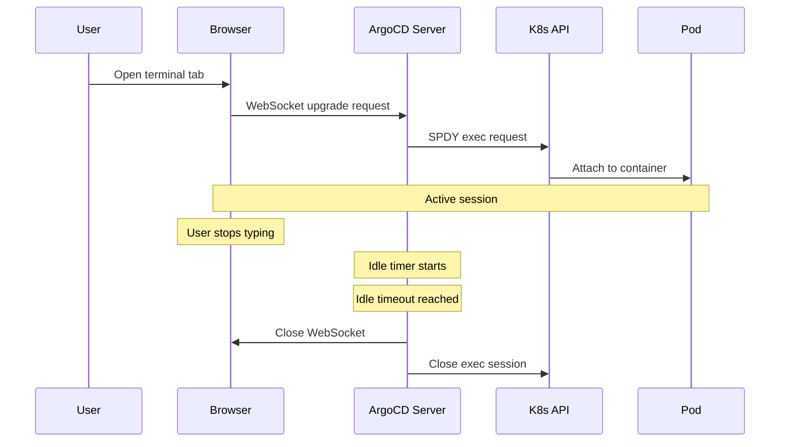
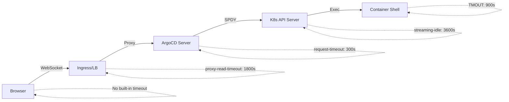

# How to Configure Terminal Timeout Settings in ArgoCD

Author: [nawazdhandala](https://github.com/nawazdhandala)

Tags: ArgoCD, GitOps, Kubernetes, Security, Configuration

Description: Learn how to configure terminal session timeout settings in ArgoCD to balance usability and security, including idle timeouts, maximum session duration, and WebSocket configurations.

---

When you enable the web-based terminal in ArgoCD, one of the first things you should configure is session timeout behavior. Without proper timeouts, terminal sessions can remain open indefinitely, consuming server resources and creating security risks from abandoned sessions. This guide covers every timeout-related setting that affects ArgoCD terminal sessions.

## Understanding Terminal Session Lifecycle

Before diving into configuration, it helps to understand how terminal sessions flow through the system:



There are multiple layers where timeouts can be configured, and each one serves a different purpose.

## ArgoCD Server Timeout Settings

The ArgoCD API server has its own timeout settings that affect terminal sessions. These are configured through the `argocd-cmd-params-cm` ConfigMap:

```yaml
apiVersion: v1
kind: ConfigMap
metadata:
  name: argocd-cmd-params-cm
  namespace: argocd
data:
  # Server-side request timeout (applies to all API requests)
  # Default: 60 (seconds)
  server.request.timeout: "300"
```

For Helm-based installations:

```yaml
# values.yaml
server:
  extraArgs:
    - --request-timeout
    - "300"
```

The `server.request.timeout` controls how long the server will keep a request open. For terminal sessions, this is less relevant because they use WebSocket connections, but it still affects the initial handshake.

## WebSocket Connection Timeouts

Terminal sessions use WebSocket connections, and the timeout behavior depends on how you expose the ArgoCD server.

### Nginx Ingress Controller

If you use Nginx Ingress, configure the proxy timeouts to allow long-lived WebSocket connections:

```yaml
apiVersion: networking.k8s.io/v1
kind: Ingress
metadata:
  name: argocd-server
  namespace: argocd
  annotations:
    # Maximum time to wait for a response from the upstream
    nginx.ingress.kubernetes.io/proxy-read-timeout: "3600"
    # Maximum time to wait for sending a request to the upstream
    nginx.ingress.kubernetes.io/proxy-send-timeout: "3600"
    # Connection timeout
    nginx.ingress.kubernetes.io/proxy-connect-timeout: "60"
    # WebSocket support
    nginx.ingress.kubernetes.io/proxy-http-version: "1.1"
    nginx.ingress.kubernetes.io/configuration-snippet: |
      proxy_set_header Upgrade $http_upgrade;
      proxy_set_header Connection "upgrade";
spec:
  rules:
    - host: argocd.example.com
      http:
        paths:
          - path: /
            pathType: Prefix
            backend:
              service:
                name: argocd-server
                port:
                  number: 443
```

The `proxy-read-timeout` and `proxy-send-timeout` values determine how long the Nginx proxy will wait before closing an idle WebSocket connection. Setting them to 3600 means one hour of idle time before disconnection.

### Traefik Ingress

For Traefik, configure equivalent settings:

```yaml
apiVersion: traefik.io/v1alpha1
kind: IngressRoute
metadata:
  name: argocd-server
  namespace: argocd
spec:
  entryPoints:
    - websecure
  routes:
    - match: Host(`argocd.example.com`)
      kind: Rule
      services:
        - name: argocd-server
          port: 443
      middlewares:
        - name: argocd-timeout
---
apiVersion: traefik.io/v1alpha1
kind: Middleware
metadata:
  name: argocd-timeout
  namespace: argocd
spec:
  buffering:
    # Allow large responses for terminal output
    maxResponseBodyBytes: 0
  headers:
    customRequestHeaders:
      Connection: "upgrade"
      Upgrade: "websocket"
```

### AWS ALB Ingress

For AWS Application Load Balancer:

```yaml
apiVersion: networking.k8s.io/v1
kind: Ingress
metadata:
  name: argocd-server
  namespace: argocd
  annotations:
    alb.ingress.kubernetes.io/scheme: internal
    # ALB idle timeout - max 4000 seconds
    alb.ingress.kubernetes.io/load-balancer-attributes: idle_timeout.timeout_seconds=3600
    # Enable WebSocket stickiness
    alb.ingress.kubernetes.io/target-group-attributes: stickiness.enabled=true,stickiness.lb_cookie.duration_seconds=3600
```

AWS ALB has a maximum idle timeout of 4000 seconds. Set this to a reasonable value based on your debugging sessions.

## Kubernetes API Server Exec Timeout

The Kubernetes API server itself has timeout settings for exec operations:

```yaml
# kube-apiserver configuration
# This is usually set in the API server manifest
# /etc/kubernetes/manifests/kube-apiserver.yaml
spec:
  containers:
    - command:
        - kube-apiserver
        # Streaming connection idle timeout
        # Default: 4h (14400s)
        - --streaming-connection-idle-timeout=1h
```

The `--streaming-connection-idle-timeout` setting controls how long the Kubernetes API server will keep an idle exec/attach/port-forward session open. The default is 4 hours, but you might want to reduce it for security:

```bash
# Check current setting on your cluster
kubectl get pods -n kube-system -l component=kube-apiserver \
  -o jsonpath='{.items[0].spec.containers[0].command}' | tr ',' '\n' | grep streaming
```

Setting this to `0` disables the timeout entirely, which is not recommended for production.

## Configuring a Custom Idle Timeout Strategy

Since ArgoCD does not have a built-in "terminal idle timeout" setting, you can implement one by combining ingress-level and Kubernetes-level timeouts:

```yaml
# Recommended timeout configuration for production
# 1. Ingress layer: 30 minutes idle timeout
apiVersion: networking.k8s.io/v1
kind: Ingress
metadata:
  name: argocd-server
  annotations:
    nginx.ingress.kubernetes.io/proxy-read-timeout: "1800"
    nginx.ingress.kubernetes.io/proxy-send-timeout: "1800"
```

```yaml
# 2. Kubernetes API server: 1 hour streaming timeout
# In kube-apiserver manifest
- --streaming-connection-idle-timeout=1h
```

This creates a two-tier timeout:
- After 30 minutes of inactivity, the ingress closes the WebSocket
- After 1 hour of inactivity, the Kubernetes API server closes the exec session (backup)

## Shell-Level Timeouts

You can also configure timeouts at the shell level inside containers. While this is a broader container configuration, it affects terminal sessions:

```yaml
# In your Deployment spec, set TMOUT for bash sessions
apiVersion: apps/v1
kind: Deployment
spec:
  template:
    spec:
      containers:
        - name: app
          env:
            # Auto-logout after 15 minutes of inactivity
            - name: TMOUT
              value: "900"
```

The `TMOUT` environment variable causes bash to automatically exit after the specified number of seconds of inactivity. This provides a defense-in-depth timeout that works regardless of ingress or API server settings.

## Monitoring Session Duration

Track how long terminal sessions last to tune your timeout settings:

```bash
# Check ArgoCD server logs for exec session duration
kubectl logs deployment/argocd-server -n argocd | grep "exec" | tail -20

# Monitor active WebSocket connections
kubectl exec -n argocd deployment/argocd-server -- ss -t | grep ESTABLISHED | wc -l
```

## Timeout Configuration Matrix

Here is a summary of all timeout layers and their recommended values:



| Layer | Setting | Recommended Value | Purpose |
|-------|---------|-------------------|---------|
| Ingress | proxy-read-timeout | 1800s (30 min) | Kill idle WebSocket connections |
| ArgoCD | request-timeout | 300s | Initial connection timeout |
| K8s API | streaming-connection-idle-timeout | 3600s (1 hour) | Backup idle timeout |
| Shell | TMOUT | 900s (15 min) | User-facing auto-logout |

## Handling Timeout Errors

When a session times out, the browser will show a disconnection message. Common timeout-related errors:

**"WebSocket connection closed"**: The ingress or load balancer closed the connection. Increase `proxy-read-timeout` if sessions are timing out during active use.

**"command terminated with exit code 137"**: The exec session was killed by the Kubernetes API server. Check `--streaming-connection-idle-timeout`.

**"connection reset by peer"**: A network device between the client and server (firewall, NAT gateway) timed out the idle TCP connection. Configure TCP keepalive:

```yaml
# In argocd-cm ConfigMap
apiVersion: v1
kind: ConfigMap
metadata:
  name: argocd-cm
  namespace: argocd
data:
  exec.enabled: "true"
```

For network-level keepalives, configure your ingress:

```yaml
annotations:
  nginx.ingress.kubernetes.io/upstream-keepalive-timeout: "900"
```

## Conclusion

Terminal timeout configuration in ArgoCD spans multiple layers, from the ingress controller through the ArgoCD server, the Kubernetes API server, and down to the shell itself. A well-configured timeout strategy balances usability (sessions should not drop during active debugging) with security (abandoned sessions should be cleaned up promptly). Start with the recommended values in this guide and adjust based on your team's actual debugging session patterns.
