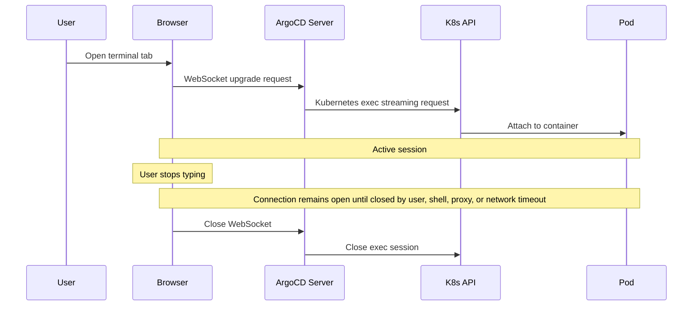
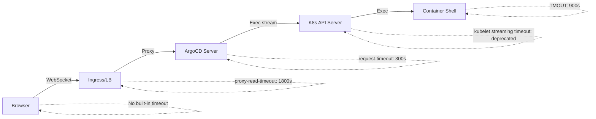

# How to Configure Terminal Timeout Settings in ArgoCD

Author: [nawazdhandala](https://github.com/nawazdhandala)

Tags: ArgoCD, GitOps, Kubernetes, Security, Configuration

Description: Learn how to configure terminal session timeout settings in ArgoCD to balance usability and security, including idle timeouts, maximum session duration, and WebSocket configurations.

---

When you enable the web-based terminal in ArgoCD, one of the first things you should configure is session timeout behavior. Without proper timeouts, terminal sessions can remain open indefinitely, consuming server resources and creating security risks from abandoned sessions. This guide covers every timeout-related setting that affects ArgoCD terminal sessions.

## Understanding Terminal Session Lifecycle

Before diving into configuration, it helps to understand how terminal sessions flow through the system:


```mermaid
sequenceDiagram
    participant User
    participant Browser
    participant ArgoCD Server
    participant K8s API
    participant Pod

    User->>Browser: Open terminal tab
    Browser->>ArgoCD Server: WebSocket upgrade request
    ArgoCD Server->>K8s API: Kubernetes exec streaming request
    K8s API->>Pod: Attach to container
    Note over Browser,Pod: Active session
    Note over Browser: User stops typing
    Note over Browser,Pod: Connection remains open until closed by user, shell, proxy, or network timeout
    Browser->>ArgoCD Server: Close WebSocket
    ArgoCD Server->>K8s API: Close exec session
```

There are multiple layers where timeouts can be configured, and each one serves a different purpose.

## ArgoCD Server Timeout Settings

The ArgoCD API server has its own timeout settings that affect terminal sessions. These are configured through the `argocd-cmd-params-cm` ConfigMap:

```yaml
apiVersion: v1
kind: ConfigMap
metadata:
  name: argocd-cmd-params-cm
  namespace: argocd
data:
  # Server-side request timeout (applies to all API requests)
  # Default: 0 (no timeout)
  server.request.timeout: "300s"
```

For Helm-based installations:

```yaml
# values.yaml

server:
  extraArgs:
    - --request-timeout
    - "300s"
```

The `server.request.timeout` controls how long the server waits before giving up on a single server request. Non-zero values should include a time unit, such as `300s`. For terminal sessions, this is less relevant because they use WebSocket connections, but it can still affect ordinary API requests around the terminal workflow.

## WebSocket Connection Timeouts

Terminal sessions use WebSocket connections, and the timeout behavior depends on how you expose the ArgoCD server.

### Nginx Ingress Controller

If you use Nginx Ingress, configure the proxy timeouts to allow long-lived WebSocket connections:

```yaml
apiVersion: networking.k8s.io/v1
kind: Ingress
metadata:
  name: argocd-server
  namespace: argocd
  annotations:
    # Maximum time to wait for a response from the upstream
    nginx.ingress.kubernetes.io/proxy-read-timeout: "3600"
    # Maximum time to wait for sending a request to the upstream
    nginx.ingress.kubernetes.io/proxy-send-timeout: "3600"
    # Connection timeout
    nginx.ingress.kubernetes.io/proxy-connect-timeout: "60"
    # HTTP/1.1 is the default in ingress-nginx, but is shown here explicitly
    nginx.ingress.kubernetes.io/proxy-http-version: "1.1"
spec:
  rules:
    - host: argocd.example.com
      http:
        paths:
          - path: /
            pathType: Prefix
            backend:
              service:
                name: argocd-server
                port:
                  number: 443
```

The `proxy-read-timeout` and `proxy-send-timeout` values are measured between successive read or write operations. For a mostly idle WebSocket connection, these values determine how long Nginx can wait without traffic before closing the proxied connection. Setting them to 3600 allows up to one hour between read or write operations.

### Traefik Ingress

For Traefik, timeout settings such as `idleTimeout` are configured on entryPoints in Traefik's static configuration, not on an individual `IngressRoute` middleware:

```yaml
# traefik static configuration
entryPoints:
  websecure:
    address: ":443"
    transport:
      respondingTimeouts:
        idleTimeout: 3600s
```

The `IngressRoute` can then route ArgoCD normally:

```yaml
apiVersion: traefik.io/v1alpha1
kind: IngressRoute
metadata:
  name: argocd-server
  namespace: argocd
spec:
  entryPoints:
    - websecure
  routes:
    - match: Host(`argocd.example.com`)
      kind: Rule
      services:
        - name: argocd-server
          port: 443
```

### AWS ALB Ingress

For AWS Application Load Balancer:

```yaml
apiVersion: networking.k8s.io/v1
kind: Ingress
metadata:
  name: argocd-server
  namespace: argocd
  annotations:
    alb.ingress.kubernetes.io/scheme: internal
    # ALB idle timeout - max 4000 seconds
    alb.ingress.kubernetes.io/load-balancer-attributes: idle_timeout.timeout_seconds=3600
```

AWS ALB has a maximum idle timeout of 4000 seconds. Set this to a reasonable value based on your debugging sessions. You do not need cookie-based stickiness for the upgraded WebSocket connection itself because ALB keeps an accepted WebSocket connection on the selected target.

## Kubernetes Streaming Timeout

Kubernetes has historically exposed a kubelet streaming timeout for exec, attach, and port-forward operations:

```yaml
# kubelet configuration
apiVersion: kubelet.config.k8s.io/v1beta1
kind: KubeletConfiguration
# Streaming connection idle timeout
# Default: 4h
streamingConnectionIdleTimeout: 1h
```

The `streamingConnectionIdleTimeout` field is documented as the maximum time a streaming connection can be idle before it is automatically closed, but current Kubernetes documentation marks it as deprecated and no longer effective. Do not rely on it as your primary timeout control on current clusters.

```bash
# Check kubelet configuration on a node if your cluster exposes it
kubectl get --raw /api/v1/nodes/<node-name>/proxy/configz | grep streamingConnectionIdleTimeout
```

If you manage kubelet configuration directly on an older cluster where this field still has effect, setting it to `0` disables the timeout entirely, which is not recommended for production.

## Configuring a Custom Idle Timeout Strategy

Since ArgoCD does not have a built-in "terminal idle timeout" setting, you can implement one primarily at the ingress or load-balancer layer:

```yaml
# Recommended timeout configuration for production
# 1. Ingress layer: 30 minutes idle timeout
apiVersion: networking.k8s.io/v1
kind: Ingress
metadata:
  name: argocd-server
  annotations:
    nginx.ingress.kubernetes.io/proxy-read-timeout: "1800"
    nginx.ingress.kubernetes.io/proxy-send-timeout: "1800"
```

```yaml
# 2. For older clusters only: kubelet streaming timeout as a backup
# In kubelet configuration
streamingConnectionIdleTimeout: 1h
```

This creates a two-tier timeout:
- After 30 minutes of inactivity, the ingress closes the WebSocket
- On older clusters where the kubelet field is still effective, the kubelet can close an idle streaming connection as a backup

## Shell-Level Timeouts

You can also configure timeouts at the shell level inside containers. While this is a broader container configuration, it affects terminal sessions:

```yaml
# In your Deployment spec, set TMOUT for bash sessions
apiVersion: apps/v1
kind: Deployment
spec:
  template:
    spec:
      containers:
        - name: app
          env:
            # Auto-logout after 15 minutes of inactivity
            - name: TMOUT
              value: "900"
```

The `TMOUT` environment variable causes bash to automatically exit after the specified number of seconds of inactivity. This provides a defense-in-depth timeout that works regardless of ingress or API server settings.

## Monitoring Session Duration

Track how long terminal sessions last to tune your timeout settings:

```bash
# Check ArgoCD server logs for exec session duration
kubectl logs deployment/argocd-server -n argocd | grep "exec" | tail -20

# Monitor active WebSocket connections
kubectl exec -n argocd deployment/argocd-server -- ss -t | grep ESTABLISHED | wc -l
```

## Timeout Configuration Matrix

Here is a summary of all timeout layers and their recommended values:


```mermaid
flowchart LR
    A[Browser] -->|WebSocket| B[Ingress/LB]
    B -->|Proxy| C[ArgoCD Server]
    C -->|Exec stream| D[K8s API Server]
    D -->|Exec| E[Container Shell]

    A -.->|No built-in timeout| A
    B -.->|proxy-read-timeout: 1800s| B
    C -.->|request-timeout: 300s| C
    D -.->|kubelet streaming timeout: deprecated| D
    E -.->|TMOUT: 900s| E
```

| Layer | Setting | Recommended Value | Purpose |
|-------|---------|-------------------|---------|
| Ingress | proxy-read-timeout | 1800s (30 min) | Kill idle WebSocket connections |
| ArgoCD | request-timeout | 300s | General server request timeout |
| Kubernetes/Kubelet | streamingConnectionIdleTimeout | Do not rely on current clusters | Deprecated streaming timeout |
| Shell | TMOUT | 900s (15 min) | User-facing auto-logout |

## Handling Timeout Errors

When a session times out, the browser will show a disconnection message. Common timeout-related errors:

**"WebSocket connection closed"**: The ingress or load balancer closed the connection. Increase `proxy-read-timeout` if sessions are timing out during active use.

**"command terminated with exit code 137"**: The process inside the container was killed with SIGKILL, commonly because of an out-of-memory kill or another forced termination. This is not a reliable indicator of a terminal idle timeout.

**"connection reset by peer"**: A network device between the client and server (firewall, NAT gateway) closed the TCP connection. First verify that the terminal feature is enabled:

```yaml
# In argocd-cm ConfigMap
apiVersion: v1
kind: ConfigMap
metadata:
  name: argocd-cm
  namespace: argocd
data:
  exec.enabled: "true"
```

For network-level keepalives, configure your ingress:

```yaml
annotations:
  nginx.ingress.kubernetes.io/proxy-read-timeout: "1800"
  nginx.ingress.kubernetes.io/proxy-send-timeout: "1800"
```

## Conclusion

Terminal timeout configuration in ArgoCD spans multiple layers, from the ingress controller or load balancer through the ArgoCD server and down to the shell itself. A well-configured timeout strategy balances usability (sessions should not drop during active debugging) with security (abandoned sessions should be cleaned up promptly). Start with the recommended values in this guide and adjust based on your team's actual debugging session patterns.
