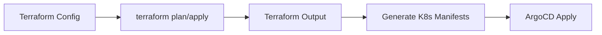

# How to Create a Plugin for Terraform with ArgoCD

Author: [nawazdhandala](https://github.com/nawazdhandala)

Tags: ArgoCD, GitOps, Kubernetes, Terraform, Config Management Plugins

Description: Learn how to create an ArgoCD Config Management Plugin that generates Kubernetes manifests from Terraform configurations for GitOps-driven infrastructure.

---

Terraform and ArgoCD serve different parts of the infrastructure stack - Terraform provisions cloud resources while ArgoCD deploys Kubernetes workloads. But there are scenarios where you want to bridge these worlds: generating Kubernetes manifests from Terraform outputs, managing Terraform-provisioned resources through ArgoCD, or using Terraform to template Kubernetes YAML. This guide shows how to build a CMP plugin that integrates Terraform into ArgoCD's manifest generation pipeline.

## Use Cases for a Terraform CMP Plugin

Before building the plugin, let us clarify what this integration actually does. There are several legitimate use cases:

1. **Terraform-to-Kubernetes manifests**: Use Terraform to template Kubernetes YAML using variables and data sources
2. **Terraform state to ConfigMaps**: Generate ConfigMaps from Terraform outputs (like database endpoints, VPC IDs) that your applications need
3. **CDK for Terraform (CDKTF)**: Generate Kubernetes manifests from TypeScript/Python using CDKTF
4. **Crossplane-style**: Use Terraform providers to define Kubernetes-adjacent resources as part of your application manifests



## Building the Plugin

### Approach 1: Terraform as a Template Engine

The simplest approach uses Terraform's `local_file` resource to generate Kubernetes YAML:

```yaml
# plugin.yaml
apiVersion: argoproj.io/v1alpha1
kind: ConfigManagementPlugin
metadata:
  name: terraform-manifests
spec:
  version: v1.0
  init:
    command: [sh, -c]
    args:
      - |
        set -euo pipefail

        echo "Initializing Terraform..." >&2
        terraform init -backend=false -input=false

        echo "Planning..." >&2
        terraform plan -out=tfplan -input=false \
          -var="namespace=${ARGOCD_APP_NAMESPACE:-default}" \
          -var="app_name=${ARGOCD_APP_NAME:-app}" 2>&1 >&2
  generate:
    command: [sh, -c]
    args:
      - |
        set -euo pipefail

        # Apply to generate the local files
        terraform apply -auto-approve tfplan 2>&1 >&2

        # Output all generated YAML files
        for f in output/*.yaml output/*.yml; do
          [ -f "$f" ] || continue
          cat "$f"
          echo "---"
        done
  discover:
    find:
      glob: "**/*.tf"
```

### The Terraform Configuration

```hcl
# main.tf
variable "namespace" {
  type    = string
  default = "default"
}

variable "app_name" {
  type    = string
  default = "my-app"
}

variable "replicas" {
  type    = number
  default = 3
}

variable "image_tag" {
  type    = string
  default = "latest"
}

# Use data sources to fetch dynamic values
# Note: In CMP context, cloud data sources require credentials
data "external" "config" {
  program = ["sh", "-c", "echo '{\"db_host\": \"db.internal.svc\", \"cache_host\": \"redis.internal.svc\"}'"]
}

# Generate a Deployment manifest
resource "local_file" "deployment" {
  filename = "${path.module}/output/deployment.yaml"
  content = yamlencode({
    apiVersion = "apps/v1"
    kind       = "Deployment"
    metadata = {
      name      = var.app_name
      namespace = var.namespace
      labels = {
        "app.kubernetes.io/name"       = var.app_name
        "app.kubernetes.io/managed-by" = "terraform-argocd"
      }
    }
    spec = {
      replicas = var.replicas
      selector = {
        matchLabels = {
          "app.kubernetes.io/name" = var.app_name
        }
      }
      template = {
        metadata = {
          labels = {
            "app.kubernetes.io/name" = var.app_name
          }
        }
        spec = {
          containers = [{
            name  = var.app_name
            image = "${var.app_name}:${var.image_tag}"
            ports = [{ containerPort = 8080 }]
            env = [
              {
                name  = "DB_HOST"
                value = data.external.config.result.db_host
              },
              {
                name  = "CACHE_HOST"
                value = data.external.config.result.cache_host
              }
            ]
            resources = {
              requests = {
                memory = "128Mi"
                cpu    = "100m"
              }
              limits = {
                memory = "256Mi"
                cpu    = "500m"
              }
            }
          }]
        }
      }
    }
  })
}

# Generate a Service manifest
resource "local_file" "service" {
  filename = "${path.module}/output/service.yaml"
  content = yamlencode({
    apiVersion = "v1"
    kind       = "Service"
    metadata = {
      name      = var.app_name
      namespace = var.namespace
    }
    spec = {
      selector = {
        "app.kubernetes.io/name" = var.app_name
      }
      ports = [{
        port       = 80
        targetPort = 8080
        protocol   = "TCP"
      }]
      type = "ClusterIP"
    }
  })
}

# Generate a ConfigMap from dynamic data
resource "local_file" "configmap" {
  filename = "${path.module}/output/configmap.yaml"
  content = yamlencode({
    apiVersion = "v1"
    kind       = "ConfigMap"
    metadata = {
      name      = "${var.app_name}-config"
      namespace = var.namespace
    }
    data = {
      "db-host"    = data.external.config.result.db_host
      "cache-host" = data.external.config.result.cache_host
    }
  })
}
```

### The Dockerfile

```dockerfile
FROM hashicorp/terraform:1.7 AS terraform

FROM alpine:3.19

# Install runtime dependencies
RUN apk add --no-cache bash git

# Copy Terraform binary
COPY --from=terraform /bin/terraform /usr/local/bin/terraform

# Copy ArgoCD CMP server
COPY --from=quay.io/argoproj/argocd:v2.10.0 \
    /usr/local/bin/argocd-cmp-server \
    /usr/local/bin/argocd-cmp-server

COPY plugin.yaml /home/argocd/cmp-server/config/plugin.yaml

USER 999
ENTRYPOINT ["/usr/local/bin/argocd-cmp-server"]
```

### Approach 2: Terraform State Reader

A more advanced approach reads Terraform state from a remote backend and generates ConfigMaps with the output values:

```yaml
# plugin.yaml
apiVersion: argoproj.io/v1alpha1
kind: ConfigManagementPlugin
metadata:
  name: terraform-outputs
spec:
  version: v1.0
  generate:
    command: [sh, -c]
    args:
      - |
        set -euo pipefail

        # Read the config file that specifies which Terraform state to read
        if [ ! -f "terraform-outputs.yaml" ]; then
          echo "Error: terraform-outputs.yaml not found" >&2
          exit 1
        fi

        # Initialize Terraform with the remote backend
        terraform init -input=false 2>&1 >&2

        # Extract outputs as JSON
        OUTPUTS=$(terraform output -json)

        # Generate a ConfigMap with all outputs
        cat <<YAML
        apiVersion: v1
        kind: ConfigMap
        metadata:
          name: terraform-outputs
          namespace: ${ARGOCD_APP_NAMESPACE:-default}
          labels:
            app.kubernetes.io/managed-by: argocd-terraform-plugin
        data:
        $(echo "$OUTPUTS" | jq -r 'to_entries[] | "  \(.key): \"\(.value.value)\""')
        YAML
  discover:
    find:
      glob: "**/terraform-outputs.yaml"
```

## Security Considerations

Running Terraform inside an ArgoCD plugin raises serious security concerns:

**State management**: Never use local state in CMP plugins. The filesystem is ephemeral. If you need state, use a remote backend (S3, GCS, Terraform Cloud), but be very careful about what operations the plugin performs.

**No apply for cloud resources**: The plugin should only use Terraform for template generation with `local_file` resources or state reading. Never run `terraform apply` against cloud providers from within ArgoCD - that creates a parallel infrastructure management path that bypasses GitOps principles.

**Credentials**: If your Terraform config needs cloud credentials (for data sources or remote state), mount them carefully:

```yaml
containers:
  - name: terraform-plugin
    image: my-registry/argocd-cmp-terraform:v1.0
    env:
      - name: AWS_REGION
        value: us-east-1
    volumeMounts:
      - name: aws-credentials
        mountPath: /home/argocd/.aws
        readOnly: true
```

**Provider caching**: Terraform downloads providers during `terraform init`, which can be slow. Cache providers in the container image:

```dockerfile
# Pre-download providers at build time
COPY providers.tf /tmp/
RUN cd /tmp && terraform init && \
    cp -r .terraform/providers /opt/terraform-providers

# Set the plugin filesystem mirror
ENV TF_PLUGIN_CACHE_DIR=/opt/terraform-providers
```

## Using the Plugin

```yaml
apiVersion: argoproj.io/v1alpha1
kind: Application
metadata:
  name: my-app-with-terraform
  namespace: argocd
spec:
  project: default
  source:
    repoURL: https://github.com/myorg/k8s-terraform.git
    targetRevision: main
    path: apps/my-app
    plugin:
      name: terraform-manifests
      env:
        - name: TF_VAR_replicas
          value: "5"
        - name: TF_VAR_image_tag
          value: "v2.1.0"
  destination:
    server: https://kubernetes.default.svc
    namespace: my-app
```

## Alternative: Use Crossplane Instead

For many Terraform-ArgoCD integration scenarios, Crossplane is a better fit. Crossplane brings Terraform-style cloud resource management directly into Kubernetes as custom resources, which ArgoCD handles natively without any plugins.

If your goal is to manage cloud resources through GitOps, consider Crossplane. If your goal is specifically to use Terraform's templating capabilities for Kubernetes manifests, the CMP plugin approach described here is appropriate.

## Performance Tips

- Pre-install Terraform providers in the container image to avoid downloading them during init
- Use `-backend=false` when you do not need remote state
- Set appropriate timeouts (Terraform init can take 30+ seconds)
- Use `TF_PLUGIN_CACHE_DIR` for provider caching

## Summary

A Terraform CMP plugin for ArgoCD bridges infrastructure templating with Kubernetes manifest management. The safest approach uses Terraform purely as a template engine with `local_file` resources and no cloud provider interactions. For reading cloud resource information, a state-reader plugin can generate ConfigMaps from Terraform outputs. However, always consider whether Crossplane or a simpler templating tool would be more appropriate for your specific use case before building a Terraform plugin.
