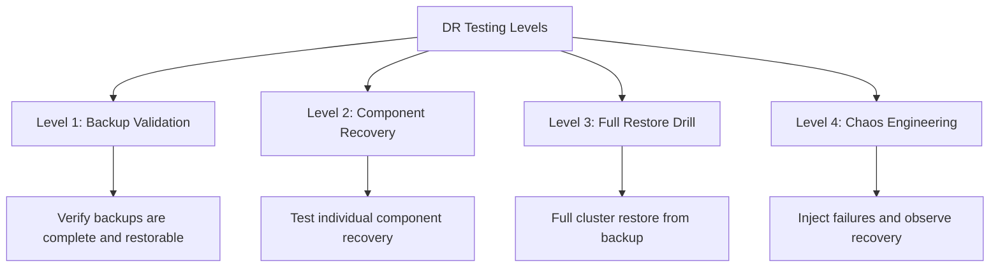

# How to Test ArgoCD Disaster Recovery Procedures

Author: [nawazdhandala](https://github.com/nawazdhandala)

Tags: ArgoCD, GitOps, Kubernetes, Disaster Recovery, Testing

Description: Learn how to test your ArgoCD disaster recovery procedures with practical drills, validation scripts, and chaos engineering approaches.

---

A disaster recovery plan that has never been tested is not a plan - it is a hope. Testing your ArgoCD DR procedures is just as important as setting them up. Regular DR drills uncover gaps in your runbooks, stale backups, missing credentials, and timing issues that only surface under real failure conditions. This guide covers how to test every aspect of your ArgoCD DR setup.

## DR Testing Strategy

Structure your DR testing in layers of increasing severity:



## Level 1: Backup Validation

Run this daily to ensure your backups are viable:

```bash
#!/bin/bash
# test-backup-integrity.sh - Validate ArgoCD backup files

BACKUP_DIR="${1:-/backups/argocd/latest}"

echo "=== ArgoCD Backup Validation ==="
echo "Backup: $BACKUP_DIR"
echo ""

PASS=0
FAIL=0

# Test 1: Backup files exist
echo "Test 1: Checking backup files exist..."
REQUIRED_FILES=("applications.yaml" "projects.yaml")
for file in "${REQUIRED_FILES[@]}"; do
  if [ -f "$BACKUP_DIR/$file" ]; then
    echo "  PASS: $file exists"
    PASS=$((PASS + 1))
  else
    echo "  FAIL: $file missing"
    FAIL=$((FAIL + 1))
  fi
done

# Test 2: YAML is valid
echo ""
echo "Test 2: Validating YAML syntax..."
for file in "$BACKUP_DIR"/*.yaml; do
  [ -f "$file" ] || continue
  if python3 -c "import yaml; list(yaml.safe_load_all(open('$file')))" 2>/dev/null; then
    echo "  PASS: $(basename "$file") is valid YAML"
    PASS=$((PASS + 1))
  else
    echo "  FAIL: $(basename "$file") has invalid YAML"
    FAIL=$((FAIL + 1))
  fi
done

# Test 3: Application count is reasonable
echo ""
echo "Test 3: Checking application count..."
APP_COUNT=$(grep -c "kind: Application$" "$BACKUP_DIR/applications.yaml" 2>/dev/null || echo 0)
if [ "$APP_COUNT" -gt 0 ]; then
  echo "  PASS: Found $APP_COUNT applications in backup"
  PASS=$((PASS + 1))
else
  echo "  FAIL: No applications found in backup"
  FAIL=$((FAIL + 1))
fi

# Test 4: Projects exist
echo ""
echo "Test 4: Checking project count..."
PROJ_COUNT=$(grep -c "kind: AppProject" "$BACKUP_DIR/projects.yaml" 2>/dev/null || echo 0)
if [ "$PROJ_COUNT" -gt 0 ]; then
  echo "  PASS: Found $PROJ_COUNT projects in backup"
  PASS=$((PASS + 1))
else
  echo "  FAIL: No projects found in backup"
  FAIL=$((FAIL + 1))
fi

# Test 5: Backup age
echo ""
echo "Test 5: Checking backup age..."
if [ -f "$BACKUP_DIR/applications.yaml" ]; then
  BACKUP_AGE_HOURS=$(( ($(date +%s) - $(stat -f %m "$BACKUP_DIR/applications.yaml" 2>/dev/null || stat -c %Y "$BACKUP_DIR/applications.yaml" 2>/dev/null || echo 0)) / 3600 ))
  if [ "$BACKUP_AGE_HOURS" -lt 25 ]; then
    echo "  PASS: Backup is $BACKUP_AGE_HOURS hours old (within 24h)"
    PASS=$((PASS + 1))
  else
    echo "  FAIL: Backup is $BACKUP_AGE_HOURS hours old (older than 24h)"
    FAIL=$((FAIL + 1))
  fi
fi

# Test 6: Compare with live count
echo ""
echo "Test 6: Comparing with live application count..."
LIVE_COUNT=$(kubectl get applications.argoproj.io -n argocd --no-headers 2>/dev/null | wc -l | tr -d ' ')
if [ -n "$LIVE_COUNT" ] && [ "$LIVE_COUNT" -gt 0 ]; then
  DIFF=$((LIVE_COUNT - APP_COUNT))
  if [ ${DIFF#-} -lt 5 ]; then  # Allow up to 5 difference
    echo "  PASS: Backup ($APP_COUNT) matches live ($LIVE_COUNT) within tolerance"
    PASS=$((PASS + 1))
  else
    echo "  WARN: Backup ($APP_COUNT) differs from live ($LIVE_COUNT) by $DIFF"
    FAIL=$((FAIL + 1))
  fi
fi

echo ""
echo "=== Results ==="
echo "Passed: $PASS"
echo "Failed: $FAIL"

if [ "$FAIL" -gt 0 ]; then
  echo "STATUS: BACKUP VALIDATION FAILED"
  exit 1
else
  echo "STATUS: BACKUP VALIDATION PASSED"
  exit 0
fi
```

## Level 2: Component Recovery Testing

Test recovering individual ArgoCD components:

### Test ConfigMap Recovery

```bash
#!/bin/bash
# test-configmap-recovery.sh - Test ConfigMap backup and restore

NAMESPACE="argocd"

echo "=== Testing ConfigMap Recovery ==="

# 1. Save current state
echo "1. Saving current argocd-cm state..."
kubectl get configmap argocd-cm -n "$NAMESPACE" -o yaml > /tmp/test-cm-backup.yaml

# 2. Add a test entry
echo "2. Adding test entry to argocd-cm..."
kubectl patch configmap argocd-cm -n "$NAMESPACE" --type merge \
  -p '{"data":{"dr.test.key":"dr-test-value"}}'

# 3. Verify the change
echo "3. Verifying change..."
VALUE=$(kubectl get configmap argocd-cm -n "$NAMESPACE" \
  -o jsonpath='{.data.dr\.test\.key}')
if [ "$VALUE" = "dr-test-value" ]; then
  echo "  PASS: Test value was set correctly"
else
  echo "  FAIL: Test value not found"
fi

# 4. Restore from backup
echo "4. Restoring from backup..."
kubectl apply -f /tmp/test-cm-backup.yaml -n "$NAMESPACE"

# 5. Verify restoration
echo "5. Verifying restoration..."
VALUE=$(kubectl get configmap argocd-cm -n "$NAMESPACE" \
  -o jsonpath='{.data.dr\.test\.key}')
if [ -z "$VALUE" ]; then
  echo "  PASS: Test value was removed (restore successful)"
else
  echo "  FAIL: Test value still present (restore failed)"
fi

# Cleanup
rm -f /tmp/test-cm-backup.yaml
echo ""
echo "ConfigMap recovery test complete."
```

### Test Repository Credential Recovery

```bash
#!/bin/bash
# test-repo-recovery.sh

NAMESPACE="argocd"

echo "=== Testing Repository Credential Recovery ==="

# 1. Count current repo secrets
REPO_COUNT=$(kubectl get secrets -n "$NAMESPACE" \
  -l argocd.argoproj.io/secret-type=repository --no-headers | wc -l | tr -d ' ')
echo "1. Current repository secrets: $REPO_COUNT"

# 2. Export repo secrets
echo "2. Exporting repository secrets..."
kubectl get secrets -n "$NAMESPACE" \
  -l argocd.argoproj.io/secret-type=repository -o yaml > /tmp/test-repo-backup.yaml

# 3. Verify export is valid
echo "3. Validating export..."
EXPORT_COUNT=$(python3 -c "
import yaml
with open('/tmp/test-repo-backup.yaml') as f:
    doc = yaml.safe_load(f)
    items = doc.get('items', [doc]) if doc.get('kind') == 'List' else [doc]
    print(len([i for i in items if i]))
")
echo "   Exported $EXPORT_COUNT secrets"

if [ "$EXPORT_COUNT" = "$REPO_COUNT" ]; then
  echo "  PASS: Export count matches"
else
  echo "  FAIL: Export count mismatch ($EXPORT_COUNT vs $REPO_COUNT)"
fi

# Cleanup
rm -f /tmp/test-repo-backup.yaml
echo "Repository recovery test complete."
```

## Level 3: Full Restore Drill

Perform a complete restore in an isolated environment:

```bash
#!/bin/bash
# full-restore-drill.sh - Full ArgoCD restore drill in a test namespace

# Use a separate namespace to avoid affecting production
TEST_NS="argocd-dr-test"
BACKUP_DIR="${1:-/backups/argocd/latest}"

echo "=== Full ArgoCD Restore Drill ==="
echo "Namespace: $TEST_NS"
echo "Backup: $BACKUP_DIR"
echo ""

# Step 1: Create test namespace
echo "Step 1: Creating test namespace..."
kubectl create namespace "$TEST_NS" 2>/dev/null || true

# Step 2: Install ArgoCD in test namespace
echo "Step 2: Installing ArgoCD..."
kubectl apply -n "$TEST_NS" \
  -f https://raw.githubusercontent.com/argoproj/argo-cd/v2.13.0/manifests/install.yaml
kubectl wait --for=condition=available deployment --all -n "$TEST_NS" --timeout=180s

# Step 3: Import backup
echo "Step 3: Importing backup..."

# Import ConfigMaps
for f in "$BACKUP_DIR"/cm-*.yaml; do
  if [ -f "$f" ]; then
    python3 -c "
import yaml
with open('$f') as fh:
    doc = yaml.safe_load(fh)
    meta = doc.get('metadata', {})
    meta['namespace'] = '$TEST_NS'
    for field in ['resourceVersion', 'uid', 'creationTimestamp', 'managedFields']:
        meta.pop(field, None)
    print(yaml.dump(doc))
" | kubectl apply -f - 2>&1 | sed 's/^/  /'
  fi
done

# Import Projects
if [ -f "$BACKUP_DIR/projects.yaml" ]; then
  python3 -c "
import yaml
for doc in yaml.safe_load_all(open('$BACKUP_DIR/projects.yaml')):
    if doc is None:
        continue
    if doc.get('kind') == 'List':
        items = doc.get('items', [])
    else:
        items = [doc]
    for item in items:
        meta = item.get('metadata', {})
        meta['namespace'] = '$TEST_NS'
        for f in ['resourceVersion', 'uid', 'creationTimestamp', 'managedFields']:
            meta.pop(f, None)
        item.pop('status', None)
        print('---')
        print(yaml.dump(item))
" | kubectl apply -f - 2>&1 | sed 's/^/  /'
fi

# Step 4: Verify
echo ""
echo "Step 4: Verification..."
echo "  Pods:"
kubectl get pods -n "$TEST_NS" --no-headers | sed 's/^/    /'
echo ""
echo "  Projects:"
kubectl get appprojects.argoproj.io -n "$TEST_NS" --no-headers | sed 's/^/    /'

# Step 5: Cleanup
echo ""
read -p "Press Enter to cleanup test namespace (or Ctrl+C to keep it)..."
kubectl delete namespace "$TEST_NS"
echo "Cleanup complete."
```

## Level 4: Chaos Engineering

Inject real failures to test automated recovery:

```bash
#!/bin/bash
# chaos-test-argocd.sh - Chaos engineering tests for ArgoCD

NAMESPACE="argocd"

echo "=== ArgoCD Chaos Engineering Test ==="
echo "WARNING: This test will temporarily disrupt ArgoCD components"
echo ""

# Test 1: Kill the application controller
echo "Test 1: Killing application controller pod..."
CONTROLLER_POD=$(kubectl get pods -n "$NAMESPACE" \
  -l app.kubernetes.io/name=argocd-application-controller -o name | head -1)
kubectl delete "$CONTROLLER_POD" -n "$NAMESPACE"
echo "  Waiting for recovery..."
kubectl wait --for=condition=ready pod \
  -l app.kubernetes.io/name=argocd-application-controller \
  -n "$NAMESPACE" --timeout=120s
echo "  PASS: Controller recovered"

# Test 2: Kill the API server
echo ""
echo "Test 2: Killing API server pod..."
API_POD=$(kubectl get pods -n "$NAMESPACE" \
  -l app.kubernetes.io/name=argocd-server -o name | head -1)
kubectl delete "$API_POD" -n "$NAMESPACE"
echo "  Waiting for recovery..."
kubectl wait --for=condition=ready pod \
  -l app.kubernetes.io/name=argocd-server \
  -n "$NAMESPACE" --timeout=120s
echo "  PASS: API server recovered"

# Test 3: Kill the repo server
echo ""
echo "Test 3: Killing repo server pod..."
REPO_POD=$(kubectl get pods -n "$NAMESPACE" \
  -l app.kubernetes.io/name=argocd-repo-server -o name | head -1)
kubectl delete "$REPO_POD" -n "$NAMESPACE"
echo "  Waiting for recovery..."
kubectl wait --for=condition=ready pod \
  -l app.kubernetes.io/name=argocd-repo-server \
  -n "$NAMESPACE" --timeout=120s
echo "  PASS: Repo server recovered"

# Test 4: Verify applications are still healthy after chaos
echo ""
echo "Test 4: Verifying application health after chaos..."
sleep 30  # Give ArgoCD time to re-reconcile

DEGRADED=$(kubectl get applications.argoproj.io -n "$NAMESPACE" -o json | \
  jq '[.items[] | select(.status.health.status == "Degraded")] | length')

if [ "$DEGRADED" = "0" ]; then
  echo "  PASS: No degraded applications"
else
  echo "  WARN: $DEGRADED applications are degraded"
fi

echo ""
echo "=== Chaos Tests Complete ==="
```

## DR Testing Schedule

Establish a regular testing cadence:

| Test Level | Frequency | Duration | Impact |
|-----------|-----------|----------|--------|
| Level 1: Backup validation | Daily (automated) | 2 minutes | None |
| Level 2: Component recovery | Weekly (automated) | 10 minutes | Minimal |
| Level 3: Full restore drill | Monthly | 1 to 2 hours | Isolated namespace |
| Level 4: Chaos engineering | Quarterly | 30 minutes | Brief disruptions |

## Automated DR Test Pipeline

Run DR tests as part of your CI/CD pipeline:

```yaml
# .github/workflows/dr-test.yml
name: ArgoCD DR Test
on:
  schedule:
    - cron: '0 6 * * 1'  # Every Monday at 6 AM

jobs:
  backup-validation:
    runs-on: ubuntu-latest
    steps:
      - name: Validate Backups
        run: |
          # Download latest backup
          aws s3 cp s3://my-backups/argocd/latest/ /tmp/backup/ --recursive

          # Run validation
          ./scripts/test-backup-integrity.sh /tmp/backup

      - name: Alert on Failure
        if: failure()
        run: |
          curl -X POST "$SLACK_WEBHOOK" \
            -d '{"text":"ArgoCD DR backup validation FAILED! Check immediately."}'
```

## Documenting Test Results

Keep a record of DR test results:

```bash
#!/bin/bash
# log-dr-test.sh - Log DR test results

DR_LOG="/var/log/argocd-dr-tests.log"

log_result() {
  local test_name="$1"
  local result="$2"
  local details="$3"

  echo "$(date -u +%Y-%m-%dT%H:%M:%SZ) | $test_name | $result | $details" >> "$DR_LOG"
}

# After running tests
log_result "backup-validation" "PASS" "50 apps, 5 projects verified"
log_result "full-restore-drill" "PASS" "Restored in 4m30s"
log_result "chaos-controller-kill" "PASS" "Recovered in 45s"
```

Testing your ArgoCD DR procedures is not optional - it is the only way to have confidence that recovery will work when you need it. Automate the routine tests, schedule regular drills, and document the results. A well-tested DR plan means the difference between a minor incident and a major outage.
