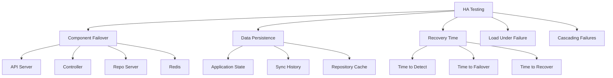

# How to Test ArgoCD HA Configuration

Author: [nawazdhandala](https://github.com/nawazdhandala)

Tags: ArgoCD, GitOps, Kubernetes, High Availability, Testing

Description: Learn how to systematically test your ArgoCD high availability configuration by simulating failures, verifying failover behavior, and validating recovery times.

---

Deploying ArgoCD in HA mode is only half the job. The other half is testing that the HA configuration actually works. Untested HA is false confidence - you think you are protected, but you have no proof. This guide provides a systematic testing methodology covering every ArgoCD component, including test scripts, expected behaviors, and pass/fail criteria.

## Testing Framework

A thorough HA test covers these areas:



## Prerequisites

Before testing, set up a test application and monitoring:

```bash
# Create a test application
argocd app create ha-test \
  --repo https://github.com/argoproj/argocd-example-apps \
  --path guestbook \
  --dest-server https://kubernetes.default.svc \
  --dest-namespace default \
  --sync-policy automated

# Verify it is synced and healthy
argocd app get ha-test

# Note the current state
echo "Pre-test state:"
argocd app list
argocd cluster list
kubectl get pods -n argocd -o wide
```

## Test 1: API Server Pod Failure

**Objective**: Verify the UI and CLI remain accessible when an API server pod dies.

```bash
#!/bin/bash
echo "=== Test 1: API Server Pod Failure ==="

# Record start time
START=$(date +%s)

# Get number of API server pods
REPLICAS=$(kubectl get deployment argocd-server -n argocd -o jsonpath='{.spec.replicas}')
echo "API server replicas: $REPLICAS"

# Kill one API server pod
POD=$(kubectl get pods -n argocd -l app.kubernetes.io/name=argocd-server \
  -o jsonpath='{.items[0].metadata.name}')
echo "Killing pod: $POD"
kubectl delete pod "$POD" -n argocd

# Immediately test API access
echo "Testing API access during failover..."
for i in $(seq 1 30); do
  if argocd app list > /dev/null 2>&1; then
    RECOVERY_TIME=$(($(date +%s) - START))
    echo "PASS: API accessible after $RECOVERY_TIME seconds"
    break
  fi
  sleep 1
done

# Wait for replacement pod
echo "Waiting for replacement pod..."
kubectl wait --for=condition=ready pod \
  -l app.kubernetes.io/name=argocd-server \
  -n argocd --timeout=120s

# Verify all replicas are back
RUNNING=$(kubectl get pods -n argocd -l app.kubernetes.io/name=argocd-server \
  --field-selector=status.phase=Running --no-headers | wc -l)

if [ "$RUNNING" -eq "$REPLICAS" ]; then
  echo "PASS: All $REPLICAS API server pods restored"
else
  echo "FAIL: Only $RUNNING of $REPLICAS pods running"
fi
```

**Expected behavior**: API remains accessible throughout. New pod starts within 30 seconds.

## Test 2: Controller Leader Failover

**Objective**: Verify a new controller becomes leader when the current leader dies.

```bash
#!/bin/bash
echo "=== Test 2: Controller Leader Failover ==="

# Find current leader
LEADER=$(kubectl get lease argocd-application-controller -n argocd \
  -o jsonpath='{.spec.holderIdentity}')
echo "Current leader: $LEADER"

# Record the lease transitions count
TRANSITIONS_BEFORE=$(kubectl get lease argocd-application-controller -n argocd \
  -o jsonpath='{.spec.leaseTransitions}')

# Kill the leader
echo "Killing leader: $LEADER"
kubectl delete pod "$LEADER" -n argocd
START=$(date +%s)

# Watch for new leader
echo "Waiting for new leader election..."
for i in $(seq 1 60); do
  NEW_LEADER=$(kubectl get lease argocd-application-controller -n argocd \
    -o jsonpath='{.spec.holderIdentity}' 2>/dev/null)
  if [ -n "$NEW_LEADER" ] && [ "$NEW_LEADER" != "$LEADER" ]; then
    FAILOVER_TIME=$(($(date +%s) - START))
    echo "PASS: New leader elected: $NEW_LEADER (took $FAILOVER_TIME seconds)"
    break
  fi
  sleep 1
done

# Verify reconciliation works
echo "Testing application reconciliation..."
argocd app sync ha-test --force
sleep 10
STATUS=$(argocd app get ha-test -o json | jq -r '.status.sync.status')
if [ "$STATUS" = "Synced" ]; then
  echo "PASS: Reconciliation works with new leader"
else
  echo "FAIL: Application status is $STATUS"
fi

# Verify transitions count increased
TRANSITIONS_AFTER=$(kubectl get lease argocd-application-controller -n argocd \
  -o jsonpath='{.spec.leaseTransitions}')
echo "Lease transitions: $TRANSITIONS_BEFORE -> $TRANSITIONS_AFTER"
```

**Expected behavior**: New leader within 30 seconds. Reconciliation resumes immediately.

## Test 3: Redis Failover

**Objective**: Verify Redis Sentinel promotes a replica when the master fails.

```bash
#!/bin/bash
echo "=== Test 3: Redis Failover ==="

# Find current Redis master
MASTER_INFO=$(kubectl exec -n argocd argocd-redis-ha-server-0 -c sentinel -- \
  redis-cli -p 26379 sentinel get-master-addr-by-name mymaster 2>/dev/null)
echo "Current Redis master: $MASTER_INFO"

# Find which pod is the master
for i in 0 1 2; do
  ROLE=$(kubectl exec -n argocd argocd-redis-ha-server-$i -c redis -- \
    redis-cli info replication 2>/dev/null | grep role)
  echo "Server $i: $ROLE"
  if echo "$ROLE" | grep -q "master"; then
    MASTER_POD="argocd-redis-ha-server-$i"
  fi
done

echo "Master pod: $MASTER_POD"

# Kill the master
echo "Killing Redis master..."
kubectl delete pod "$MASTER_POD" -n argocd
START=$(date +%s)

# Wait for Sentinel failover
echo "Waiting for Sentinel failover..."
for i in $(seq 1 45); do
  # Check any surviving Sentinel
  for j in 0 1 2; do
    NEW_MASTER=$(kubectl exec -n argocd argocd-redis-ha-server-$j -c sentinel -- \
      redis-cli -p 26379 sentinel get-master-addr-by-name mymaster 2>/dev/null | head -1)
    if [ -n "$NEW_MASTER" ]; then
      FAILOVER_TIME=$(($(date +%s) - START))
      echo "New master detected at: $NEW_MASTER (took $FAILOVER_TIME seconds)"
      break 2
    fi
  done
  sleep 1
done

# Test ArgoCD still works
echo "Testing ArgoCD after Redis failover..."
argocd app list > /dev/null 2>&1
if [ $? -eq 0 ]; then
  echo "PASS: ArgoCD functional after Redis failover"
else
  echo "FAIL: ArgoCD not functional"
fi
```

**Expected behavior**: Sentinel promotes a replica within 15 seconds. ArgoCD continues working.

## Test 4: Repo Server Scaling Under Load

**Objective**: Verify repo server handles load when one instance fails.

```bash
#!/bin/bash
echo "=== Test 4: Repo Server Under Load ==="

# Count current repo server pods
REPLICAS=$(kubectl get deployment argocd-repo-server -n argocd \
  -o jsonpath='{.spec.replicas}')
echo "Repo server replicas: $REPLICAS"

# Kill one repo server
POD=$(kubectl get pods -n argocd -l app.kubernetes.io/name=argocd-repo-server \
  -o jsonpath='{.items[0].metadata.name}')
echo "Killing repo server: $POD"
kubectl delete pod "$POD" -n argocd

# Immediately trigger multiple syncs
echo "Triggering concurrent syncs..."
argocd app sync ha-test --force --async

# Check if sync completes
sleep 30
STATUS=$(argocd app get ha-test -o json | jq -r '.status.sync.status')
if [ "$STATUS" = "Synced" ]; then
  echo "PASS: Sync completed despite repo server failure"
else
  echo "WARNING: Status is $STATUS (may need more time)"
fi

# Verify replacement pod
kubectl wait --for=condition=ready pod \
  -l app.kubernetes.io/name=argocd-repo-server \
  -n argocd --timeout=120s

RUNNING=$(kubectl get pods -n argocd -l app.kubernetes.io/name=argocd-repo-server \
  --field-selector=status.phase=Running --no-headers | wc -l)
echo "Repo servers running: $RUNNING (expected: $REPLICAS)"
```

## Test 5: PDB Validation

**Objective**: Verify PDBs prevent excessive disruption during node drain.

```bash
#!/bin/bash
echo "=== Test 5: PDB Validation ==="

# Check PDB status
echo "Current PDB status:"
kubectl get pdb -n argocd

# Find a node with ArgoCD pods
NODE=$(kubectl get pods -n argocd -l app.kubernetes.io/name=argocd-server \
  -o jsonpath='{.items[0].spec.nodeName}')
echo "Testing drain on node: $NODE"

# Count ArgoCD pods on this node
PODS_ON_NODE=$(kubectl get pods -n argocd --field-selector spec.nodeName="$NODE" \
  --no-headers | wc -l)
echo "ArgoCD pods on node: $PODS_ON_NODE"

# Attempt drain with a short timeout
echo "Attempting node drain (60s timeout)..."
kubectl drain "$NODE" --ignore-daemonsets --delete-emptydir-data \
  --timeout=60s --dry-run=client 2>&1

# Check if drain would succeed
if kubectl drain "$NODE" --ignore-daemonsets --delete-emptydir-data \
  --timeout=60s --dry-run=client 2>&1 | grep -q "evict"; then
  echo "PASS: Drain would succeed while respecting PDBs"
else
  echo "INFO: Drain may be partially blocked by PDBs (expected behavior)"
fi

# Verify PDB allowed disruptions
for PDB in $(kubectl get pdb -n argocd -o jsonpath='{.items[*].metadata.name}'); do
  ALLOWED=$(kubectl get pdb "$PDB" -n argocd -o jsonpath='{.status.disruptionsAllowed}')
  echo "PDB $PDB: $ALLOWED disruptions allowed"
  if [ "$ALLOWED" -gt 0 ]; then
    echo "  PASS: Can tolerate disruption"
  else
    echo "  WARNING: No disruptions allowed (check replica count)"
  fi
done
```

## Test 6: Full Component Restart

**Objective**: Verify ArgoCD recovers completely after all components restart.

```bash
#!/bin/bash
echo "=== Test 6: Full Component Restart ==="

# Record application states before restart
echo "Pre-restart state:"
argocd app list -o json | jq '.[].metadata.name' > /tmp/pre-restart-apps.txt

# Restart all ArgoCD components
echo "Restarting all components..."
kubectl rollout restart statefulset/argocd-application-controller -n argocd
kubectl rollout restart deployment/argocd-server -n argocd
kubectl rollout restart deployment/argocd-repo-server -n argocd

# Wait for all rollouts to complete
echo "Waiting for rollouts..."
kubectl rollout status statefulset/argocd-application-controller -n argocd --timeout=300s
kubectl rollout status deployment/argocd-server -n argocd --timeout=300s
kubectl rollout status deployment/argocd-repo-server -n argocd --timeout=300s

# Verify all applications are present
echo "Post-restart state:"
argocd app list -o json | jq '.[].metadata.name' > /tmp/post-restart-apps.txt

# Compare
DIFF=$(diff /tmp/pre-restart-apps.txt /tmp/post-restart-apps.txt)
if [ -z "$DIFF" ]; then
  echo "PASS: All applications present after restart"
else
  echo "FAIL: Application list differs:"
  echo "$DIFF"
fi

# Verify sync works
argocd app sync ha-test
STATUS=$(argocd app get ha-test -o json | jq -r '.status.sync.status')
echo "Sync status after restart: $STATUS"
```

## Comprehensive HA Test Script

Combine all tests into a single comprehensive script:

```bash
#!/bin/bash
# argocd-ha-test.sh - Comprehensive HA testing

RESULTS=()
PASS=0
FAIL=0

run_test() {
  local name="$1"
  local result="$2"
  if [ "$result" -eq 0 ]; then
    RESULTS+=("PASS: $name")
    ((PASS++))
  else
    RESULTS+=("FAIL: $name")
    ((FAIL++))
  fi
}

echo "=== ArgoCD HA Comprehensive Test ==="
echo "Started: $(date)"

# Test 1: All pods are running
ALL_RUNNING=$(kubectl get pods -n argocd --no-headers | grep -v Running | wc -l)
run_test "All pods running" "$ALL_RUNNING"

# Test 2: PDBs are configured
PDB_COUNT=$(kubectl get pdb -n argocd --no-headers | wc -l)
[ "$PDB_COUNT" -ge 3 ] && run_test "PDBs configured" 0 || run_test "PDBs configured" 1

# Test 3: Multiple API server replicas
API_REPLICAS=$(kubectl get deployment argocd-server -n argocd \
  -o jsonpath='{.status.readyReplicas}')
[ "$API_REPLICAS" -ge 2 ] && run_test "API server HA ($API_REPLICAS replicas)" 0 \
  || run_test "API server HA ($API_REPLICAS replicas)" 1

# Test 4: Controller replicas
CTRL_REPLICAS=$(kubectl get statefulset argocd-application-controller -n argocd \
  -o jsonpath='{.status.readyReplicas}')
[ "$CTRL_REPLICAS" -ge 2 ] && run_test "Controller HA ($CTRL_REPLICAS replicas)" 0 \
  || run_test "Controller HA ($CTRL_REPLICAS replicas)" 1

# Test 5: Redis HA
REDIS_REPLICAS=$(kubectl get statefulset argocd-redis-ha-server -n argocd \
  -o jsonpath='{.status.readyReplicas}' 2>/dev/null || echo "0")
[ "$REDIS_REPLICAS" -ge 3 ] && run_test "Redis HA ($REDIS_REPLICAS replicas)" 0 \
  || run_test "Redis HA ($REDIS_REPLICAS replicas)" 1

# Test 6: Pods spread across nodes
UNIQUE_NODES=$(kubectl get pods -n argocd -o jsonpath='{.items[*].spec.nodeName}' | \
  tr ' ' '\n' | sort -u | wc -l)
[ "$UNIQUE_NODES" -ge 2 ] && run_test "Pods on multiple nodes ($UNIQUE_NODES)" 0 \
  || run_test "Pods on multiple nodes ($UNIQUE_NODES)" 1

# Test 7: Leader election active
LEADER=$(kubectl get lease argocd-application-controller -n argocd \
  -o jsonpath='{.spec.holderIdentity}' 2>/dev/null)
[ -n "$LEADER" ] && run_test "Leader election active ($LEADER)" 0 \
  || run_test "Leader election active" 1

# Test 8: API accessible
argocd app list > /dev/null 2>&1
run_test "API accessible" $?

# Print results
echo ""
echo "=== Results ==="
for result in "${RESULTS[@]}"; do
  echo "  $result"
done
echo ""
echo "Total: $((PASS + FAIL)) tests, $PASS passed, $FAIL failed"
echo "Completed: $(date)"
```

## Testing Schedule

| Test | Frequency | Automation |
|---|---|---|
| Configuration validation | Daily (automated) | CronJob |
| Single pod failure | Monthly | Manual or automated |
| Leader election failover | Monthly | Manual |
| Redis failover | Quarterly | Manual |
| Full restart recovery | Quarterly | Manual |
| Node drain with PDBs | Quarterly | Manual |
| Zone failure simulation | Bi-annually | Manual |

HA testing is not a one-time activity. Run the comprehensive test after every ArgoCD upgrade, after infrastructure changes, and on a regular schedule. Document the results and track trends over time. For continuous monitoring between tests, see our guide on [monitoring ArgoCD component health](https://oneuptime.com/blog/post/2026-02-26-argocd-monitor-component-health/view).
