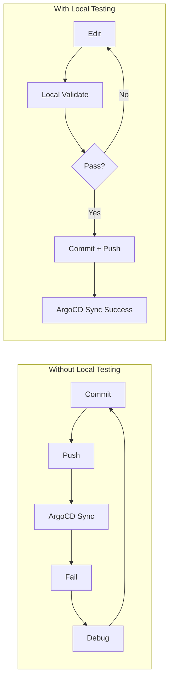

# How to Test ArgoCD Application Manifests Locally

Author: [nawazdhandala](https://github.com/nawazdhandala)

Tags: ArgoCD, GitOps, Kubernetes, Testing, Manifests

Description: Learn how to test and validate ArgoCD application manifests locally before pushing to Git, catching errors early in your GitOps workflow.

---

One of the most frustrating experiences with ArgoCD is pushing a manifest change to Git, waiting for the sync, and then discovering a YAML typo or missing field caused a deployment failure. Testing manifests locally before pushing saves time and prevents failed syncs from reaching your cluster.

This guide covers the tools and techniques for validating ArgoCD application manifests on your local machine.

## Why Test Locally?

The GitOps feedback loop can be slow. You commit, push, ArgoCD detects the change, tries to sync, and fails. Then you debug, fix, commit again, and repeat. Local testing shortens this loop dramatically:



## Step 1: Validate YAML Syntax

The most basic check is YAML syntax validation. Many ArgoCD errors come from simple YAML formatting issues:

```bash
# Install yamllint
pip install yamllint

# Validate a single file
yamllint apps/my-app/deployment.yaml

# Validate an entire directory
yamllint apps/my-app/
```

Configure yamllint to be Kubernetes-friendly:

```yaml
# .yamllint.yaml
extends: default
rules:
  line-length:
    max: 200  # K8s manifests can have long lines
  truthy:
    check-keys: false  # Allow "on" in GitHub Actions
  comments:
    min-spaces-from-content: 1
  indentation:
    spaces: 2
    indent-sequences: consistent
```

## Step 2: Validate Against Kubernetes Schemas

YAML can be syntactically valid but still not match the Kubernetes API schema. Use kubeconform to check:

```bash
# Install kubeconform
brew install kubeconform

# Validate manifests against K8s 1.28 schemas
kubeconform -kubernetes-version 1.28.0 \
  -summary \
  -output json \
  apps/my-app/

# Validate with CRD schemas (important for ArgoCD resources)
kubeconform -kubernetes-version 1.28.0 \
  -schema-location default \
  -schema-location 'https://raw.githubusercontent.com/datreeio/CRDs-catalog/main/{{.Group}}/{{.ResourceKind}}_{{.ResourceAPIVersion}}.json' \
  apps/my-app/
```

For ArgoCD-specific resources (Application, AppProject, ApplicationSet), you need CRD schemas:

```bash
# Download ArgoCD CRD schemas
mkdir -p /tmp/argocd-schemas
curl -L https://raw.githubusercontent.com/argoproj/argo-cd/stable/manifests/crds/application-crd.yaml \
  -o /tmp/argocd-schemas/application-crd.yaml

# Convert CRD to JSON schema (using openapi2jsonschema)
pip install openapi2jsonschema
openapi2jsonschema /tmp/argocd-schemas/application-crd.yaml

# Validate ArgoCD resources
kubeconform -schema-location 'file:///tmp/argocd-schemas/{{ .ResourceKind }}.json' \
  argocd-apps/
```

## Step 3: Render Helm Templates Locally

If your ArgoCD application uses Helm, render the templates locally to catch errors before ArgoCD tries:

```bash
# Render Helm templates with values
helm template my-app ./charts/my-app \
  --values values/production.yaml \
  --namespace production \
  --output-dir /tmp/rendered

# Validate the rendered output
kubeconform -kubernetes-version 1.28.0 /tmp/rendered/
```

You can combine rendering and validation in a single check:

```bash
# Render and validate in one pipeline
helm template my-app ./charts/my-app \
  --values values/production.yaml \
  --namespace production | \
  kubeconform -kubernetes-version 1.28.0 -summary
```

Common Helm errors you will catch locally:

```yaml
# Missing required value
# values.yaml has no "image.tag" but template uses it
# {{ required "image.tag is required" .Values.image.tag }}

# Type mismatch
# values.yaml: replicaCount: "3" (string, not int)
# template: replicas: {{ .Values.replicaCount }}
```

## Step 4: Build Kustomize Locally

For Kustomize-based applications:

```bash
# Build the kustomization
kustomize build apps/my-app/overlays/production

# Build and validate
kustomize build apps/my-app/overlays/production | \
  kubeconform -kubernetes-version 1.28.0 -summary

# With ArgoCD-compatible flags
kustomize build apps/my-app/overlays/production \
  --enable-helm \
  --load-restrictor LoadRestrictionsNone
```

## Step 5: Use argocd CLI for Local Manifest Generation

ArgoCD has a local mode that generates manifests exactly as the server would:

```bash
# Generate manifests locally using the same logic as ArgoCD
argocd app manifests my-app --source live > /tmp/live.yaml
argocd app manifests my-app --source git > /tmp/desired.yaml

# Compare what ArgoCD would see
diff /tmp/live.yaml /tmp/desired.yaml
```

For a more thorough local test, use `argocd app diff` with a local path:

```bash
# Compare your local changes against the live cluster
argocd app diff my-app --local apps/my-app/production/

# This shows exactly what ArgoCD would detect as different
# without actually syncing anything
```

## Step 6: Dry-Run Against the API Server

The most thorough local test is a dry-run against an actual Kubernetes API server:

```bash
# Client-side dry-run (fast but less accurate)
kubectl apply --dry-run=client -f apps/my-app/deployment.yaml

# Server-side dry-run (more accurate, requires cluster access)
kubectl apply --dry-run=server -f apps/my-app/deployment.yaml

# Dry-run an entire directory
kubectl apply --dry-run=server -R -f apps/my-app/production/
```

Server-side dry-run sends the request to the API server, which processes it through admission controllers and validates it fully, but does not actually persist the change.

## Putting It All Together: Local Validation Script

Create a validation script that runs all checks:

```bash
#!/bin/bash
# validate-manifests.sh
set -euo pipefail

APP_PATH="${1:?Usage: validate-manifests.sh <app-path>}"
K8S_VERSION="${2:-1.28.0}"

echo "=== YAML Lint ==="
yamllint "$APP_PATH"

echo ""
echo "=== Schema Validation ==="
# Check if it's a Kustomize directory
if [ -f "$APP_PATH/kustomization.yaml" ]; then
    echo "Detected Kustomize, building first..."
    kustomize build "$APP_PATH" | \
        kubeconform -kubernetes-version "$K8S_VERSION" -summary
# Check if it's a Helm chart
elif [ -f "$APP_PATH/Chart.yaml" ]; then
    echo "Detected Helm chart, rendering first..."
    helm template test "$APP_PATH" | \
        kubeconform -kubernetes-version "$K8S_VERSION" -summary
else
    echo "Validating plain YAML..."
    kubeconform -kubernetes-version "$K8S_VERSION" \
        -summary "$APP_PATH"
fi

echo ""
echo "=== Dry Run (if cluster available) ==="
if kubectl cluster-info &>/dev/null; then
    if [ -f "$APP_PATH/kustomization.yaml" ]; then
        kustomize build "$APP_PATH" | \
            kubectl apply --dry-run=server -f -
    else
        kubectl apply --dry-run=server -R -f "$APP_PATH"
    fi
else
    echo "No cluster available, skipping dry-run"
fi

echo ""
echo "All validations passed!"
```

Run it before every commit:

```bash
chmod +x validate-manifests.sh
./validate-manifests.sh apps/my-app/overlays/production
```

## IDE Integration

Set up your editor to validate manifests as you type:

### VS Code

Install these extensions:
- YAML by Red Hat (schema validation)
- Kubernetes by Microsoft (resource completion)

Add to your `.vscode/settings.json`:

```json
{
  "yaml.schemas": {
    "kubernetes": "apps/**/*.yaml",
    "https://raw.githubusercontent.com/argoproj/argo-cd/stable/manifests/crds/application-crd.yaml": "argocd-apps/**/*.yaml"
  },
  "yaml.validate": true
}
```

### Pre-commit Hook

Automate validation with a pre-commit hook:

```yaml
# .pre-commit-config.yaml
repos:
  - repo: https://github.com/adrienverge/yamllint
    rev: v1.33.0
    hooks:
      - id: yamllint
        args: [-c, .yamllint.yaml]

  - repo: local
    hooks:
      - id: kubeconform
        name: Validate K8s manifests
        entry: bash -c 'kubeconform -kubernetes-version 1.28.0 -summary "$@"' --
        language: system
        files: '\.yaml$'
        exclude: '.github/|.yamllint'
```

## Monitoring Deployment Success

Even with local testing, monitor your ArgoCD sync success rate. Track how many syncs fail on first attempt vs succeed - a high first-attempt success rate tells you your local testing is working. [OneUptime](https://oneuptime.com/blog/post/2026-02-06-monitor-argocd-deployments-opentelemetry/view) can help you build dashboards around these metrics.

## Conclusion

Testing ArgoCD manifests locally is not optional - it is a fundamental practice for efficient GitOps. The combination of YAML linting, schema validation, template rendering, and dry-runs catches the vast majority of errors before they reach your cluster. Set up a validation script, integrate it into your pre-commit hooks, and watch your failed sync rate drop dramatically.
