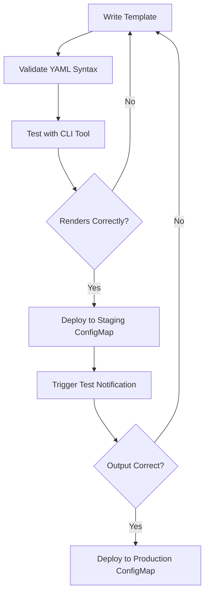

# How to Test Notification Templates Locally in ArgoCD

Author: [nawazdhandala](https://github.com/nawazdhandala)

Tags: ArgoCD, GitOps, Kubernetes, Notifications, Testing

Description: Learn how to test ArgoCD notification templates locally before deploying them, using the argocd-notifications CLI tool and mock application data to validate template rendering.

---

Deploying notification templates directly to your cluster and waiting for a trigger to fire is a slow and frustrating way to develop them. ArgoCD provides tooling to test notification templates locally, letting you validate template rendering, check for syntax errors, and preview the output before anything touches your cluster. This guide walks you through local testing workflows.

## The argocd-notifications CLI Tool

ArgoCD ships a notifications CLI tool that can render templates against mock or real application data. This is the primary tool for local template testing.

### Installing the CLI

You can get the notifications CLI from the ArgoCD releases:

```bash
# Download the notifications tools binary
# Replace VERSION with your ArgoCD version
VERSION=v2.10.0
curl -sSL -o argocd-notifications \
  "https://github.com/argoproj/argo-cd/releases/download/${VERSION}/argocd-linux-amd64"

chmod +x argocd-notifications
sudo mv argocd-notifications /usr/local/bin/

# On macOS with Homebrew
brew install argocd
```

The `argocd` CLI includes notification-related subcommands starting from version 2.6.

## Testing Templates with the CLI

### Basic Template Rendering

Create a local file with your template and test it against a real application:

```bash
# Test a template against a real application in your cluster
argocd admin notifications template notify \
  app-sync-succeeded my-app \
  --config-map argocd-notifications-cm \
  --secret argocd-notifications-secret
```

This renders the template `app-sync-succeeded` using the actual state of `my-app` from your cluster and prints the result.

### Testing with a Specific Notification Service

To see what would be sent to a specific service:

```bash
# Preview what would be sent to Slack
argocd admin notifications template get app-sync-succeeded \
  --config-map argocd-notifications-cm
```

## Using Mock Application Data

You do not need a running cluster to test templates. Create a mock application JSON file:

```json
{
  "metadata": {
    "name": "test-application",
    "namespace": "argocd",
    "labels": {
      "env": "production",
      "team": "backend"
    },
    "annotations": {}
  },
  "spec": {
    "project": "default",
    "source": {
      "repoURL": "https://github.com/company/k8s-manifests.git",
      "targetRevision": "main",
      "path": "services/api"
    },
    "destination": {
      "server": "https://kubernetes.default.svc",
      "namespace": "api-production"
    }
  },
  "status": {
    "sync": {
      "status": "Synced",
      "revision": "abc1234def5678901234567890abcdef12345678"
    },
    "health": {
      "status": "Healthy"
    },
    "operationState": {
      "phase": "Succeeded",
      "message": "successfully synced (all tasks run)",
      "startedAt": "2026-02-26T10:00:00Z",
      "finishedAt": "2026-02-26T10:01:30Z",
      "syncResult": {
        "revision": "abc1234def5678901234567890abcdef12345678"
      }
    }
  }
}
```

Save this as `mock-app.json` and use it for local rendering tests.

## Testing Go Template Syntax

ArgoCD notification templates use Go template syntax. You can test templates offline with a simple Go script or use the `gomplate` tool:

```bash
# Install gomplate
brew install gomplate  # macOS
# or
go install github.com/hairyhenderson/gomplate/v4/cmd/gomplate@latest
```

Create a template file to test:

```yaml
# test-template.yaml
message: |
  Application {{ .app.metadata.name }} sync {{ .app.status.operationState.phase }}.
  Revision: {{ .app.status.sync.revision | trunc 7 }}
  Destination: {{ .app.spec.destination.namespace }}
```

## Validating Template Syntax Before Deployment

Before applying your ConfigMap to the cluster, validate the YAML and template syntax:

```bash
# Validate YAML syntax
kubectl apply --dry-run=client -f argocd-notifications-cm.yaml

# Check for common template issues
# Look for unmatched brackets, invalid field references
grep -n '{{' argocd-notifications-cm.yaml | while read line; do
  echo "$line"
done
```

### Common Template Syntax Errors

**Unmatched braces**: Every `{{` needs a matching `}}`

```yaml
# Wrong
message: "App {{ .app.metadata.name is deployed"

# Correct
message: "App {{ .app.metadata.name }} is deployed"
```

**Nil pointer access**: Accessing a field on a nil object crashes the template

```yaml
# Dangerous - operationState might be nil
message: "Phase: {{ .app.status.operationState.phase }}"

# Safe - check for nil first
message: |
  {{ if .app.status.operationState }}
  Phase: {{ .app.status.operationState.phase }}
  {{ else }}
  No operation state available
  {{ end }}
```

**Wrong pipe functions**: Using a function that does not exist

```yaml
# Wrong - 'substring' is not a built-in function
revision: "{{ .app.status.sync.revision | substring 0 7 }}"

# Correct - use 'trunc' instead
revision: "{{ .app.status.sync.revision | trunc 7 }}"
```

## Testing Templates in a Staging Environment

For full end-to-end testing, create a staging notification setup:

### Step 1: Create a Test Slack Channel

Create a `#argocd-notifications-test` channel in Slack specifically for testing.

### Step 2: Create a Test Application

```yaml
apiVersion: argoproj.io/v1alpha1
kind: Application
metadata:
  name: notification-test
  namespace: argocd
  annotations:
    notifications.argoproj.io/subscribe.on-deployed.slack: argocd-notifications-test
    notifications.argoproj.io/subscribe.on-deploy-failed.slack: argocd-notifications-test
    notifications.argoproj.io/subscribe.on-health-degraded.slack: argocd-notifications-test
spec:
  project: default
  source:
    repoURL: https://github.com/argoproj/argocd-example-apps.git
    targetRevision: HEAD
    path: guestbook
  destination:
    server: https://kubernetes.default.svc
    namespace: notification-test
```

### Step 3: Trigger Notifications

```bash
# Sync the test application to trigger on-deployed
argocd app sync notification-test

# Force the app OutOfSync by making a manual change
kubectl scale deployment guestbook-ui --replicas=3 -n notification-test

# Break the app to trigger on-deploy-failed
# Edit the source path to something invalid
argocd app set notification-test --path nonexistent-path
argocd app sync notification-test
```

### Step 4: Verify the Output

Check the test Slack channel for the notifications. Compare the actual output against your expected format.

## Template Development Workflow

Here is an efficient workflow for developing notification templates:



## Testing Conditional Logic

Templates often include conditionals. Test each branch:

```yaml
  template.deployment-status: |
    message: |
      {{ if eq .app.status.operationState.phase "Succeeded" }}
      Deployment of {{ .app.metadata.name }} succeeded.
      {{ else if eq .app.status.operationState.phase "Failed" }}
      ALERT: Deployment of {{ .app.metadata.name }} failed!
      Error: {{ .app.status.operationState.message }}
      {{ else }}
      Deployment of {{ .app.metadata.name }} is {{ .app.status.operationState.phase }}.
      {{ end }}
```

To test all branches, create multiple mock application JSON files with different `operationState.phase` values and render the template against each one.

## Testing Slack Block Kit Formatting

Slack notifications support rich formatting with attachments. Preview them using Slack's Block Kit Builder:

1. Render your template locally to get the JSON output
2. Go to https://app.slack.com/block-kit-builder
3. Paste the attachment JSON
4. Preview how it will look

```yaml
  template.app-sync-status: |
    slack:
      attachments: |
        [{
          "color": "{{ if eq .app.status.sync.status "Synced" }}#18be52{{ else }}#f4c030{{ end }}",
          "blocks": [
            {
              "type": "section",
              "text": {
                "type": "mrkdwn",
                "text": "*{{ .app.metadata.name }}* - {{ .app.status.sync.status }}\nRevision: `{{ .app.status.sync.revision | trunc 7 }}`"
              }
            }
          ]
        }]
```

## Testing Email Templates

For email templates, render the HTML locally and preview in a browser:

```bash
# Render the template to a file
# (using the CLI or manual substitution)
# Then open in browser
open rendered-email.html
```

```yaml
  template.deployment-email: |
    email:
      subject: "Deployment: {{ .app.metadata.name }} - {{ .app.status.operationState.phase }}"
      body: |
        <html>
        <body>
          <h2>Deployment Status</h2>
          <table border="1" cellpadding="5">
            <tr><td>Application</td><td>{{ .app.metadata.name }}</td></tr>
            <tr><td>Status</td><td>{{ .app.status.operationState.phase }}</td></tr>
            <tr><td>Revision</td><td>{{ .app.status.sync.revision | trunc 7 }}</td></tr>
          </table>
        </body>
        </html>
```

## Automated Template Testing in CI

Add template validation to your CI pipeline:

```yaml
# GitHub Actions example
name: Validate Notification Templates
on:
  pull_request:
    paths:
      - 'argocd/notifications/**'

jobs:
  validate:
    runs-on: ubuntu-latest
    steps:
      - uses: actions/checkout@v4
      - name: Validate YAML
        run: |
          # Check YAML syntax
          kubectl apply --dry-run=client -f argocd/notifications/argocd-notifications-cm.yaml
      - name: Check template syntax
        run: |
          # Extract templates and check for common errors
          python3 scripts/validate-templates.py argocd/notifications/argocd-notifications-cm.yaml
```

Local template testing saves you from the deploy-wait-check cycle. Catch syntax errors and rendering issues before they reach your cluster. For related topics, see [debugging notification delivery failures](https://oneuptime.com/blog/post/2026-02-26-argocd-debug-notification-delivery-failures/view) and [creating custom notification templates](https://oneuptime.com/blog/post/2026-02-02-argocd-notifications/view).
