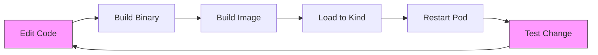

# How to Use Tilt for ArgoCD Development

Author: [nawazdhandala](https://github.com/nawazdhandala)

Tags: ArgoCD, GitOps, Kubernetes, Development, Tilt

Description: Learn how to use Tilt for rapid ArgoCD development with live code reload, automatic image builds, and streamlined local development workflows.

---

Developing ArgoCD locally can be a slow process. Every code change requires rebuilding Go binaries, rebuilding container images, loading them into your local Kubernetes cluster, and restarting deployments. Tilt eliminates this friction by watching your source files and automatically rebuilding and deploying changes in seconds. This guide shows you how to set up Tilt for ArgoCD development and dramatically speed up your inner development loop.

## What is Tilt and Why Use It for ArgoCD

Tilt is a development tool that watches your source code and automatically handles the build-push-deploy cycle. For a multi-component project like ArgoCD - which has a server, controller, repo server, and UI - Tilt manages all components simultaneously and gives you a unified dashboard to monitor their status.

Without Tilt, a typical development iteration looks like this:



Each iteration takes 3 to 5 minutes. With Tilt, changes are reflected in 10 to 30 seconds.

## Prerequisites

You need the following tools installed:

```bash
# Install Tilt
curl -fsSL https://raw.githubusercontent.com/tilt-dev/tilt/master/scripts/install.sh | bash
tilt version

# You also need:
# - Docker
# - kind or minikube
# - Go 1.21+
# - Node.js 20+ and yarn
# - kubectl
```

## Setting Up the Development Cluster

Create a kind cluster configured for Tilt.

```bash
# Create a kind cluster with a local registry
# Tilt works best with a local registry for fast image pushes

# Create the registry container
docker run -d --restart=always -p 5001:5000 --name kind-registry registry:2

# Create a kind cluster connected to the registry
cat <<EOF | kind create cluster --name argocd-dev --config=-
kind: Cluster
apiVersion: kind.x-k8s.io/v1alpha4
containerdConfigPatches:
- |-
  [plugins."io.containerd.grpc.v1.cri".registry.mirrors."localhost:5001"]
    endpoint = ["http://kind-registry:5000"]
nodes:
- role: control-plane
  extraPortMappings:
  - containerPort: 30080
    hostPort: 8080
    protocol: TCP
EOF

# Connect the registry to the kind network
docker network connect kind kind-registry

# Verify the cluster is working
kubectl cluster-info
```

## Creating the Tiltfile

The Tiltfile defines how Tilt builds and deploys each ArgoCD component. Create this in the root of the ArgoCD repository.

```python
# Tiltfile for ArgoCD development

# Configuration
default_registry('localhost:5001')

# Build the main ArgoCD binary using live_update for fast iteration
docker_build(
    'argocd-dev',
    '.',
    dockerfile='Dockerfile',
    only=[
        'cmd/',
        'controller/',
        'reposerver/',
        'server/',
        'pkg/',
        'util/',
        'go.mod',
        'go.sum',
    ],
    live_update=[
        # Sync Go source files
        sync('./cmd', '/src/cmd'),
        sync('./controller', '/src/controller'),
        sync('./reposerver', '/src/reposerver'),
        sync('./server', '/src/server'),
        sync('./pkg', '/src/pkg'),
        sync('./util', '/src/util'),
        # Rebuild the binary inside the container
        run('cd /src && CGO_ENABLED=0 go build -o /usr/local/bin/argocd ./cmd',
            trigger=['./cmd/', './controller/', './reposerver/', './server/', './pkg/', './util/']),
    ],
)

# Build the UI separately for faster iteration
docker_build(
    'argocd-ui-dev',
    './ui',
    dockerfile='ui/Dockerfile.dev',
    live_update=[
        sync('./ui/src', '/app/src'),
        run('cd /app && yarn build', trigger=['./ui/src/']),
    ],
)

# Deploy ArgoCD manifests
k8s_yaml(kustomize('manifests/base'))

# Override images with our dev builds
k8s_image_json_path('{.spec.template.spec.containers[0].image}')

# Configure resource grouping in the Tilt UI
k8s_resource('argocd-server', port_forwards='8080:8080',
             labels=['argocd'])
k8s_resource('argocd-repo-server', labels=['argocd'])
k8s_resource('argocd-application-controller', labels=['argocd'])
k8s_resource('argocd-redis', labels=['argocd'])
k8s_resource('argocd-dex-server', labels=['argocd'])
```

## Optimized Tiltfile with Compile Host

For even faster builds, compile Go binaries on your host machine and inject them into the container.

```python
# Tiltfile - optimized version with host compilation

# Compile on the host for maximum speed
local_resource(
    'argocd-compile',
    'CGO_ENABLED=0 GOOS=linux GOARCH=amd64 go build -o ./dist/argocd ./cmd',
    deps=[
        './cmd/',
        './controller/',
        './reposerver/',
        './server/',
        './pkg/',
        './util/',
        './go.mod',
        './go.sum',
    ],
    labels=['build'],
)

# Build a minimal image that just copies in the binary
docker_build(
    'argocd-dev',
    '.',
    dockerfile_contents='''
FROM ubuntu:22.04
RUN apt-get update && apt-get install -y \
    git git-lfs gpg gpg-agent ca-certificates && \
    rm -rf /var/lib/apt/lists/*
COPY dist/argocd /usr/local/bin/argocd
RUN ln -s /usr/local/bin/argocd /usr/local/bin/argocd-server && \
    ln -s /usr/local/bin/argocd /usr/local/bin/argocd-application-controller && \
    ln -s /usr/local/bin/argocd /usr/local/bin/argocd-repo-server && \
    ln -s /usr/local/bin/argocd /usr/local/bin/argocd-cmp-server
''',
    only=['dist/argocd'],
    live_update=[
        sync('./dist/argocd', '/usr/local/bin/argocd'),
    ],
)

# UI development with hot reload
local_resource(
    'argocd-ui',
    serve_cmd='cd ui && yarn start',
    deps=[],
    links=['http://localhost:4000'],
    labels=['ui'],
)

# Deploy ArgoCD
k8s_yaml(kustomize('manifests/base'))

# Port forwards for access
k8s_resource('argocd-server',
    port_forwards=['8080:8080', '8083:8083'],
    labels=['argocd'],
    resource_deps=['argocd-compile'])

k8s_resource('argocd-repo-server',
    labels=['argocd'],
    resource_deps=['argocd-compile'])

k8s_resource('argocd-application-controller',
    labels=['argocd'],
    resource_deps=['argocd-compile'])
```

## Running Tilt

Start the Tilt development environment.

```bash
# Start Tilt (opens the dashboard in your browser)
tilt up

# Or start without opening the browser
tilt up --no-browser

# The Tilt dashboard is available at http://localhost:10350
```

The Tilt dashboard shows you the status of all ArgoCD components, build logs, and runtime logs in a single interface.

## Development Workflow with Tilt

Once Tilt is running, your development workflow becomes simple.

```bash
# 1. Edit source code in your preferred editor
vim controller/appcontroller.go

# 2. Save the file
# Tilt automatically detects the change

# 3. Watch the Tilt dashboard
# - "argocd-compile" rebuilds the binary (2-5 seconds)
# - The container image is updated
# - The pod restarts with the new binary (5-10 seconds)

# 4. Test your change
argocd app sync my-test-app

# Total iteration time: ~15 seconds
```

## UI Development with Tilt

For frontend development, Tilt can run the React development server with hot module replacement.

```python
# Add to your Tiltfile for UI development
local_resource(
    'argocd-ui-dev',
    serve_cmd='cd ui && ARGOCD_SERVER=https://localhost:8080 yarn start',
    deps=['ui/package.json'],
    links=['http://localhost:4000'],
    labels=['ui'],
)
```

The UI development server supports hot reload, so CSS and React component changes are reflected instantly without a page refresh.

## Tilt Extensions for ArgoCD

Tilt has an extension ecosystem. These extensions are useful for ArgoCD development.

```python
# Load useful Tilt extensions
load('ext://restart_process', 'docker_build_with_restart')
load('ext://namespace', 'namespace_create')
load('ext://helm_resource', 'helm_resource')

# Create the argocd namespace if it does not exist
namespace_create('argocd')

# Use docker_build_with_restart for faster container restarts
docker_build_with_restart(
    'argocd-dev',
    '.',
    dockerfile_contents='...',
    only=['dist/argocd'],
    entrypoint=['/usr/local/bin/argocd-server'],
    live_update=[
        sync('./dist/argocd', '/usr/local/bin/argocd'),
    ],
)
```

## Debugging with Tilt

Tilt makes it easy to attach a debugger to running ArgoCD components.

```python
# Build with debug symbols
local_resource(
    'argocd-compile-debug',
    'CGO_ENABLED=0 GOOS=linux GOARCH=amd64 go build -gcflags="all=-N -l" -o ./dist/argocd ./cmd',
    deps=['./cmd/', './controller/', './server/', './pkg/'],
    labels=['build'],
)

# Expose the delve debug port
k8s_resource('argocd-server',
    port_forwards=['8080:8080', '2345:2345'],  # 2345 for delve
    labels=['argocd'])
```

Then connect your IDE's debugger to `localhost:2345`.

## Tips for Efficient ArgoCD Development with Tilt

**Limit what Tilt watches.** Exclude test files, documentation, and other directories that do not affect the running binary.

```python
# Use .tiltignore to exclude directories
# .tiltignore
*_test.go
docs/
test/
hack/
.git/
```

**Use resource dependencies.** Ensure components start in the right order.

```python
k8s_resource('argocd-repo-server', resource_deps=['argocd-redis'])
k8s_resource('argocd-server', resource_deps=['argocd-repo-server'])
k8s_resource('argocd-application-controller', resource_deps=['argocd-repo-server'])
```

**Keep test applications handy.** Have a set of test ArgoCD Applications that you can quickly deploy to test your changes.

```bash
# Apply a test application
kubectl apply -f test/e2e/testdata/test-app.yaml
```

Using Tilt for ArgoCD development transforms the experience from a tedious cycle of manual rebuilds to a fast, automated workflow. The investment in setting up Tilt pays for itself after just a few development sessions. For more on ArgoCD development workflows, check out our guide on [building ArgoCD from source](https://oneuptime.com/blog/post/2026-02-26-argocd-build-from-source/view).
