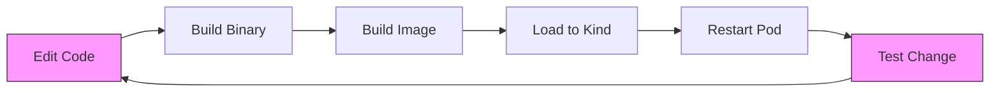

# How to Use Tilt for ArgoCD Development

Author: [nawazdhandala](https://github.com/nawazdhandala)

Tags: ArgoCD, GitOps, Kubernetes, Development, Tilt

Description: Learn how to use Tilt for rapid ArgoCD development with live code reload, automatic image builds, and streamlined local development workflows.

---

Developing ArgoCD locally can be a slow process. Every code change requires rebuilding Go binaries, rebuilding container images, loading them into your local Kubernetes cluster, and restarting deployments. Tilt eliminates this friction by watching your source files and automatically rebuilding and deploying changes in seconds. This guide shows you how to set up Tilt for ArgoCD development and dramatically speed up your inner development loop.

## What is Tilt and Why Use It for ArgoCD

Tilt is a development tool that watches your source code and automatically handles the build-push-deploy cycle. For a multi-component project like ArgoCD - which has a server, controller, repo server, and UI - Tilt manages all components simultaneously and gives you a unified dashboard to monitor their status.

Without Tilt, a typical development iteration looks like this:


```mermaid
graph LR
    A[Edit Code] --> B[Build Binary]
    B --> C[Build Image]
    C --> D[Load to Kind]
    D --> E[Restart Pod]
    E --> F[Test Change]
    F --> A
    style A fill:#f9f,stroke:#333
    style F fill:#f9f,stroke:#333
```

Each iteration takes 3 to 5 minutes. With Tilt, changes are reflected in 10 to 30 seconds.

## Prerequisites

You need the following tools installed:

```bash
# Install Tilt

curl -fsSL https://raw.githubusercontent.com/tilt-dev/tilt/master/scripts/install.sh | bash
tilt version

# You also need:
# - Docker
# - kind or minikube
# - Go version listed in Argo CD's go.mod
# - Node.js version used by Argo CD's Dockerfile.ui.tilt and pnpm
# - kubectl
```

## Setting Up the Development Cluster

Create a kind cluster configured for Tilt.

```bash
# Create a kind cluster with a local registry
# Tilt works best with a local registry for fast image pushes

# Create the registry container
docker run -d --restart=always -p 127.0.0.1:5001:5000 --name kind-registry registry:3

# Create a kind cluster connected to the registry
cat <<EOF | kind create cluster --name argocd-dev --config=-
kind: Cluster
apiVersion: kind.x-k8s.io/v1alpha4
containerdConfigPatches:
- |-
  [plugins."io.containerd.grpc.v1.cri".registry]
    config_path = "/etc/containerd/certs.d"
nodes:
- role: control-plane
  extraPortMappings:
  - containerPort: 30080
    hostPort: 8080
    protocol: TCP
EOF

# Tell containerd inside the kind node how to reach localhost:5001
REGISTRY_DIR="/etc/containerd/certs.d/localhost:5001"
for node in $(kind get nodes --name argocd-dev); do
  docker exec "${node}" mkdir -p "${REGISTRY_DIR}"
  cat <<EOF | docker exec -i "${node}" cp /dev/stdin "${REGISTRY_DIR}/hosts.toml"
[host."http://kind-registry:5000"]
EOF
done

# Connect the registry to the kind network
docker network connect kind kind-registry || true

# Document the local registry for tools that read the standard ConfigMap
cat <<EOF | kubectl apply -f -
apiVersion: v1
kind: ConfigMap
metadata:
  name: local-registry-hosting
  namespace: kube-public
data:
  localRegistryHosting.v1: |
    host: "localhost:5001"
    help: "https://kind.sigs.k8s.io/docs/user/local-registry/"
EOF

# Verify the cluster is working
kubectl cluster-info
```

## Creating the Tiltfile

The Tiltfile defines how Tilt builds and deploys each ArgoCD component. Create this in the root of the ArgoCD repository.

```python
# Tiltfile for ArgoCD development

load('ext://restart_process', 'docker_build_with_restart')

update_settings(k8s_server_side_apply="true")

cluster_version = decode_yaml(local('kubectl version -o yaml'))
platform = cluster_version['serverVersion']['platform']
arch = platform.split('/')[1]

code_deps = [
    'applicationset',
    'cmd',
    'cmpserver',
    'commitserver',
    'common',
    'controller',
    'notification-controller',
    'pkg',
    'reposerver',
    'server',
    'util',
    'go.mod',
    'go.sum',
]

# Build the main Argo CD binary on code changes
local_resource(
    'argocd-compile',
    'CGO_ENABLED=0 GOOS=linux GOARCH=' + arch + ' go build -mod=readonly -o .tilt-bin/argocd_linux cmd/main.go',
    deps=code_deps,
    ignore=['**/*_test.go'],
    labels=['build'],
)

# Deploy the Argo CD Tilt manifests
k8s_yaml(kustomize('manifests/dev-tilt'))

# Build the dev image and restart the process after live updates
docker_build_with_restart(
    'quay.io/argoproj/argocd:latest',
    context='.',
    dockerfile='Dockerfile.tilt',
    entrypoint=[
        '/usr/bin/tini',
        '-s',
        '--',
        'dlv',
        'exec',
        '--continue',
        '--accept-multiclient',
        '--headless',
        '--listen=:2345',
        '--api-version=2',
    ],
    platform=platform,
    only=[
        '.tilt-bin',
        'hack',
        'entrypoint.sh',
    ],
    live_update=[
        sync('.tilt-bin/argocd_linux', '/usr/local/bin/argocd'),
    ],
    restart_file='/tilt/.restart-proc',
)

# Build the image used by Argo CD init jobs
docker_build(
    'argocd-job',
    context='.',
    dockerfile='Dockerfile.tilt',
    platform=platform,
    only=[
        '.tilt-bin',
        'hack',
        'entrypoint.sh',
    ],
)

# Configure resource grouping in the Tilt UI
k8s_resource(workload='argocd-server',
             port_forwards=['8080:8080', '8083:8083'],
             labels=['argocd'],
             resource_deps=['argocd-compile'])
k8s_resource(workload='argocd-repo-server',
             labels=['argocd'],
             resource_deps=['argocd-compile'])
k8s_resource(workload='argocd-application-controller',
             labels=['argocd'],
             resource_deps=['argocd-compile'])
k8s_resource(workload='argocd-redis', labels=['argocd'])
k8s_resource(workload='argocd-dex-server', labels=['argocd'])
```

## Optimized Tiltfile with Compile Host

For even faster builds, compile Go binaries on your host machine and inject them into the container.

```python
# Tiltfile - optimized version with host compilation

# Compile on the host for maximum speed
local_resource(
    'argocd-compile',
    'CGO_ENABLED=0 GOOS=linux GOARCH=amd64 go build -mod=readonly -o ./.tilt-bin/argocd_linux cmd/main.go',
    deps=[
        'applicationset',
        'cmd',
        'cmpserver',
        'commitserver',
        'common',
        'controller',
        'notification-controller',
        'pkg',
        'reposerver',
        'server',
        'util',
        'go.mod',
        'go.sum',
    ],
    ignore=['**/*_test.go'],
    labels=['build'],
)

# Build a minimal image that just copies in the binary
docker_build(
    'quay.io/argoproj/argocd:latest',
    '.',
    dockerfile_contents='''
FROM ubuntu:22.04
RUN apt-get update && apt-get install -y \
    git git-lfs gpg gpg-agent ca-certificates tini && \
    rm -rf /var/lib/apt/lists/*
COPY .tilt-bin/argocd_linux /usr/local/bin/argocd
RUN ln -s /usr/local/bin/argocd /usr/local/bin/argocd-server && \
    ln -s /usr/local/bin/argocd /usr/local/bin/argocd-application-controller && \
    ln -s /usr/local/bin/argocd /usr/local/bin/argocd-repo-server && \
    ln -s /usr/local/bin/argocd /usr/local/bin/argocd-cmp-server
RUN mkdir -p /tilt
''',
    only=['.tilt-bin/argocd_linux'],
    live_update=[
        sync('./.tilt-bin/argocd_linux', '/usr/local/bin/argocd'),
    ],
)

# UI development with hot reload
local_resource(
    'argocd-ui',
    serve_cmd='cd ui && pnpm start',
    deps=['ui/package.json', 'ui/pnpm-lock.yaml'],
    links=['http://localhost:4000'],
    labels=['ui'],
)

# Deploy ArgoCD
k8s_yaml(kustomize('manifests/dev-tilt'))

# Port forwards for access
k8s_resource('argocd-server',
    port_forwards=['8080:8080', '8083:8083'],
    labels=['argocd'],
    resource_deps=['argocd-compile'])

k8s_resource('argocd-repo-server',
    labels=['argocd'],
    resource_deps=['argocd-compile'])

k8s_resource('argocd-application-controller',
    labels=['argocd'],
    resource_deps=['argocd-compile'])
```

## Running Tilt

Start the Tilt development environment.

```bash
# Start Tilt (opens the dashboard in your browser)
tilt up

# Or start without opening the browser
tilt up --no-browser

# The Tilt dashboard is available at http://localhost:10350
```

The Tilt dashboard shows you the status of all ArgoCD components, build logs, and runtime logs in a single interface.

## Development Workflow with Tilt

Once Tilt is running, your development workflow becomes simple.

```bash
# 1. Edit source code in your preferred editor
vim controller/appcontroller.go

# 2. Save the file
# Tilt automatically detects the change

# 3. Watch the Tilt dashboard
# - "argocd-compile" rebuilds the binary (2-5 seconds)
# - The container image is updated
# - The pod restarts with the new binary (5-10 seconds)

# 4. Test your change
argocd app sync my-test-app

# Total iteration time: ~15 seconds
```

## UI Development with Tilt

For frontend development, Tilt can run the React development server with hot module replacement.

```python
# Add to your Tiltfile for UI development
local_resource(
    'argocd-ui-dev',
    cmd='cd ui && pnpm install',
    serve_cmd='cd ui && ARGOCD_SERVER=https://localhost:8080 pnpm start',
    deps=['ui/package.json', 'ui/pnpm-lock.yaml'],
    links=['http://localhost:4000'],
    labels=['ui'],
)
```

The UI development server supports hot reload, so CSS and React component changes are reflected instantly without a page refresh.

## Tilt Extensions for ArgoCD

Tilt has an extension ecosystem. These extensions are useful for ArgoCD development.

```python
# Load useful Tilt extensions
load('ext://restart_process', 'docker_build_with_restart')
load('ext://namespace', 'namespace_create')
load('ext://helm_resource', 'helm_resource')

# Create the argocd namespace if it does not exist
namespace_create('argocd')

# Use docker_build_with_restart for faster container restarts
docker_build_with_restart(
    'quay.io/argoproj/argocd:latest',
    '.',
    dockerfile_contents='...',
    only=['.tilt-bin/argocd_linux'],
    entrypoint=['/usr/local/bin/argocd-server'],
    live_update=[
        sync('./.tilt-bin/argocd_linux', '/usr/local/bin/argocd'),
    ],
)
```

## Debugging with Tilt

Tilt makes it easy to attach a debugger to running ArgoCD components.

```python
# Build with debug symbols
local_resource(
    'argocd-compile-debug',
    'CGO_ENABLED=0 GOOS=linux GOARCH=amd64 go build -gcflags="all=-N -l" -mod=readonly -o ./.tilt-bin/argocd_linux cmd/main.go',
    deps=['cmd', 'controller', 'reposerver', 'server', 'pkg', 'util', 'go.mod', 'go.sum'],
    labels=['build'],
)

# Run the process under delve and expose the debug port
docker_build_with_restart(
    'quay.io/argoproj/argocd:latest',
    context='.',
    dockerfile='Dockerfile.tilt',
    entrypoint=[
        '/usr/bin/tini',
        '-s',
        '--',
        'dlv',
        'exec',
        '--continue',
        '--accept-multiclient',
        '--headless',
        '--listen=:2345',
        '--api-version=2',
    ],
    live_update=[
        sync('./.tilt-bin/argocd_linux', '/usr/local/bin/argocd'),
    ],
)

k8s_resource('argocd-server',
    port_forwards=['8080:8080', '9345:2345'],  # 9345 forwards to delve in the pod
    labels=['argocd'])
```

Then connect your IDE's debugger to `localhost:9345`.

## Tips for Efficient ArgoCD Development with Tilt

**Limit what Tilt watches.** Exclude test files, documentation, and other directories that do not affect the running binary.

```python
# Use .tiltignore to exclude directories
# .tiltignore
*_test.go
docs/
test/
hack/
.git/
```

**Use resource dependencies.** Ensure components start in the right order.

```python
k8s_resource('argocd-repo-server', resource_deps=['argocd-redis'])
k8s_resource('argocd-server', resource_deps=['argocd-repo-server'])
k8s_resource('argocd-application-controller', resource_deps=['argocd-repo-server'])
```

**Keep test applications handy.** Have a set of test ArgoCD Applications that you can quickly deploy to test your changes.

```bash
# Apply a test application
kubectl apply -f test/e2e/testdata/test-app.yaml
```

Using Tilt for ArgoCD development transforms the experience from a tedious cycle of manual rebuilds to a fast, automated workflow. The investment in setting up Tilt pays for itself after just a few development sessions. For more on ArgoCD development workflows, check out our guide on [building ArgoCD from source](https://oneuptime.com/blog/post/2026-02-26-argocd-build-from-source/view).
