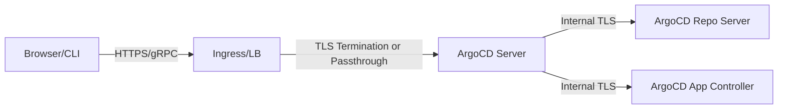

# How to Configure TLS Certificates for ArgoCD Server

Author: [nawazdhandala](https://github.com/nawazdhandala)

Tags: ArgoCD, GitOps, Kubernetes, TLS, Security

Description: A step-by-step guide to configuring TLS certificates for the ArgoCD server, covering certificate creation, Kubernetes secrets, ingress TLS termination, and certificate management.

---

By default, ArgoCD generates a self-signed TLS certificate during installation. This works for development but is not suitable for production. Browsers show security warnings, API clients reject the certificate, and automated tooling fails with TLS verification errors.

This guide walks through configuring proper TLS certificates for the ArgoCD server, whether you bring your own certificate, use cert-manager, or handle TLS at the ingress level.

## Understanding ArgoCD TLS Architecture

ArgoCD server handles two types of traffic:

1. **HTTPS** - For the web UI and REST API
2. **gRPC** - For CLI communication and inter-component traffic

Both use TLS by default. The certificate is stored in a Kubernetes secret named `argocd-server-tls` in the argocd namespace.



## Method 1: Bring Your Own Certificate

If you already have a certificate from a CA (Certificate Authority), configure it directly:

### Create the TLS Secret

```bash
# Create the secret from your certificate and key files
kubectl create secret tls argocd-server-tls \
  --cert=server.crt \
  --key=server.key \
  -n argocd
```

Or use a YAML manifest:

```yaml
apiVersion: v1
kind: Secret
metadata:
  name: argocd-server-tls
  namespace: argocd
type: kubernetes.io/tls
data:
  tls.crt: <base64-encoded-certificate>
  tls.key: <base64-encoded-private-key>
```

Encode your certificate and key:

```bash
# Base64 encode certificate and key
cat server.crt | base64 -w 0
cat server.key | base64 -w 0
```

### Verify the Certificate

```bash
# Check the secret exists
kubectl get secret argocd-server-tls -n argocd

# View certificate details
kubectl get secret argocd-server-tls -n argocd -o jsonpath='{.data.tls\.crt}' | \
  base64 -d | openssl x509 -noout -text
```

### Restart ArgoCD Server

After creating or updating the TLS secret, restart the ArgoCD server to pick up the new certificate:

```bash
kubectl rollout restart deployment argocd-server -n argocd
```

## Method 2: TLS Termination at Ingress

The most common production setup is to terminate TLS at the ingress controller and run ArgoCD server in insecure mode behind the ingress.

### Configure ArgoCD for Insecure Mode

Tell ArgoCD to not use TLS on its own (the ingress handles it):

```yaml
apiVersion: v1
kind: ConfigMap
metadata:
  name: argocd-cmd-params-cm
  namespace: argocd
data:
  server.insecure: "true"
```

Or pass the `--insecure` flag to the server:

```bash
kubectl patch deployment argocd-server -n argocd \
  --type='json' \
  -p='[{"op": "add", "path": "/spec/template/spec/containers/0/command/-", "value": "--insecure"}]'
```

### Configure Nginx Ingress with TLS

```yaml
apiVersion: networking.k8s.io/v1
kind: Ingress
metadata:
  name: argocd-server-ingress
  namespace: argocd
  annotations:
    nginx.ingress.kubernetes.io/force-ssl-redirect: "true"
    nginx.ingress.kubernetes.io/ssl-passthrough: "false"
    nginx.ingress.kubernetes.io/backend-protocol: "HTTP"
spec:
  ingressClassName: nginx
  tls:
    - hosts:
        - argocd.company.com
      secretName: argocd-ingress-tls
  rules:
    - host: argocd.company.com
      http:
        paths:
          - path: /
            pathType: Prefix
            backend:
              service:
                name: argocd-server
                port:
                  number: 80
```

Create the TLS secret for the ingress:

```bash
kubectl create secret tls argocd-ingress-tls \
  --cert=fullchain.pem \
  --key=privkey.pem \
  -n argocd
```

### Configure Traefik Ingress with TLS

```yaml
apiVersion: networking.k8s.io/v1
kind: Ingress
metadata:
  name: argocd-server-ingress
  namespace: argocd
  annotations:
    traefik.ingress.kubernetes.io/router.tls: "true"
spec:
  tls:
    - hosts:
        - argocd.company.com
      secretName: argocd-ingress-tls
  rules:
    - host: argocd.company.com
      http:
        paths:
          - path: /
            pathType: Prefix
            backend:
              service:
                name: argocd-server
                port:
                  number: 80
```

## Method 3: TLS Passthrough

TLS passthrough lets ArgoCD handle its own TLS while the ingress controller simply forwards encrypted traffic. This is needed when gRPC clients connect directly:

```yaml
apiVersion: networking.k8s.io/v1
kind: Ingress
metadata:
  name: argocd-server-ingress
  namespace: argocd
  annotations:
    nginx.ingress.kubernetes.io/ssl-passthrough: "true"
spec:
  ingressClassName: nginx
  rules:
    - host: argocd.company.com
      http:
        paths:
          - path: /
            pathType: Prefix
            backend:
              service:
                name: argocd-server
                port:
                  number: 443
```

With TLS passthrough, ArgoCD server uses its own certificate (`argocd-server-tls` secret), and the ingress controller does not decrypt the traffic.

## Method 4: Using cert-manager

cert-manager can automatically issue and renew TLS certificates from Let's Encrypt or other CAs.

### Install cert-manager

```bash
kubectl apply -f https://github.com/cert-manager/cert-manager/releases/latest/download/cert-manager.yaml
```

### Create a ClusterIssuer

```yaml
apiVersion: cert-manager.io/v1
kind: ClusterIssuer
metadata:
  name: letsencrypt-prod
spec:
  acme:
    server: https://acme-v02.api.letsencrypt.org/directory
    email: admin@company.com
    privateKeySecretRef:
      name: letsencrypt-prod-key
    solvers:
      - http01:
          ingress:
            class: nginx
```

### Annotate the Ingress

```yaml
apiVersion: networking.k8s.io/v1
kind: Ingress
metadata:
  name: argocd-server-ingress
  namespace: argocd
  annotations:
    cert-manager.io/cluster-issuer: letsencrypt-prod
    nginx.ingress.kubernetes.io/force-ssl-redirect: "true"
    nginx.ingress.kubernetes.io/backend-protocol: "HTTP"
spec:
  ingressClassName: nginx
  tls:
    - hosts:
        - argocd.company.com
      secretName: argocd-server-tls-auto
  rules:
    - host: argocd.company.com
      http:
        paths:
          - path: /
            pathType: Prefix
            backend:
              service:
                name: argocd-server
                port:
                  number: 80
```

cert-manager will automatically:
1. Request a certificate from Let's Encrypt
2. Complete the HTTP-01 challenge
3. Store the certificate in the `argocd-server-tls-auto` secret
4. Renew the certificate before it expires

## Verifying TLS Configuration

After configuring TLS, verify it works:

```bash
# Check the certificate served by ArgoCD
openssl s_client -connect argocd.company.com:443 -servername argocd.company.com </dev/null 2>/dev/null | \
  openssl x509 -noout -subject -issuer -dates

# Test with curl
curl -v https://argocd.company.com

# Test gRPC connectivity
argocd login argocd.company.com --grpc-web

# If using self-signed cert, skip verification (development only)
argocd login argocd.company.com --insecure
```

## Certificate Chain Requirements

For production certificates, include the full certificate chain:

```bash
# Combine certificate and intermediate CA
cat server.crt intermediate-ca.crt > fullchain.crt

# Create the secret with the full chain
kubectl create secret tls argocd-server-tls \
  --cert=fullchain.crt \
  --key=server.key \
  -n argocd
```

Missing intermediate certificates cause "unable to verify the first certificate" errors in browsers and clients.

## Troubleshooting TLS Issues

### Browser Shows Security Warning

- Check if the certificate matches the domain name
- Verify the full certificate chain is included
- Ensure the certificate has not expired

### ArgoCD CLI Fails with TLS Error

```bash
# If using a custom CA, add it to the CLI
argocd login argocd.company.com \
  --certificate-authority /path/to/ca.crt

# Or skip TLS verification (not recommended for production)
argocd login argocd.company.com --insecure
```

### Mixed TLS Configuration

If you see redirect loops or connection errors, make sure you are consistent:
- If the ingress terminates TLS, ArgoCD server must run with `--insecure`
- If TLS passthrough is used, ArgoCD server must have a valid TLS certificate
- Do not mix both approaches

## Summary

Configuring TLS for ArgoCD server involves choosing between direct TLS on the server, TLS termination at the ingress, or TLS passthrough. For most production deployments, TLS termination at the ingress with ArgoCD in insecure mode is the simplest and most maintainable approach. Use cert-manager for automatic certificate management, or bring your own certificates from your internal CA. Always verify the full certificate chain and test with both browser and CLI access.
