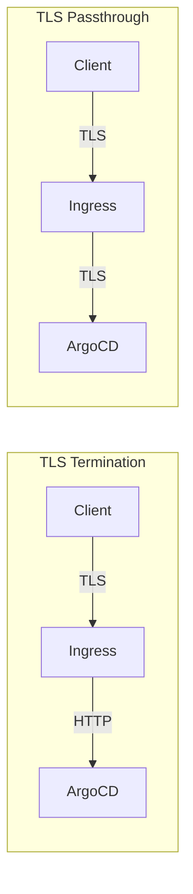

# How to Configure ArgoCD with TLS Passthrough

Author: [nawazdhandala](https://github.com/nawazdhandala)

Tags: ArgoCD, GitOps, Kubernetes, TLS, Networking

Description: Configure TLS passthrough for ArgoCD so the server handles its own TLS certificates while routing through your ingress controller.

---

TLS passthrough is an alternative to TLS termination where the ingress controller does not decrypt traffic. Instead, it passes encrypted packets directly to the ArgoCD server, which handles TLS on its own. This approach is useful when you want end-to-end encryption, need ArgoCD to use its own certificates, or want the simplest possible ingress configuration.

## TLS Termination vs TLS Passthrough

Understanding the difference is critical for choosing the right approach:

**TLS Termination**: The ingress decrypts traffic, inspects it, and forwards plain HTTP to ArgoCD. ArgoCD runs in insecure mode. The ingress can apply rate limiting, path-based routing, and header manipulation.

**TLS Passthrough**: The ingress routes encrypted traffic directly to ArgoCD based on the SNI (Server Name Indication) header. ArgoCD handles TLS with its own certificate. The ingress cannot inspect or modify the traffic.



## When to Use TLS Passthrough

Choose passthrough when:

- Your security policy requires end-to-end encryption
- You want gRPC and HTTPS to work without extra configuration
- You do not need ingress-level features like rate limiting or header modification
- You want ArgoCD to manage its own certificates
- You need the simplest possible setup that just works

Avoid passthrough when:

- You need to apply WAF rules at the ingress
- You need ingress-level rate limiting
- You need path-based routing to split traffic
- You want to use wildcard certificates at the ingress level

## Configuration with Nginx Ingress

### Step 1: Enable SSL Passthrough on the Controller

SSL passthrough is disabled by default in Nginx Ingress Controller. You must enable it:

```bash
# If installed with Helm
helm upgrade ingress-nginx ingress-nginx/ingress-nginx \
  --namespace ingress-nginx \
  --set controller.extraArgs.enable-ssl-passthrough=""

# If installed with manifests, add the argument to the controller deployment
# --enable-ssl-passthrough
```

Verify it is enabled:

```bash
kubectl get deployment -n ingress-nginx ingress-nginx-controller -o yaml | grep ssl-passthrough
```

### Step 2: Keep ArgoCD TLS Enabled

Do NOT set `server.insecure: "true"`. ArgoCD should handle its own TLS. Verify the ConfigMap does not have the insecure flag:

```bash
kubectl get configmap argocd-cmd-params-cm -n argocd -o yaml
# Make sure server.insecure is NOT set to "true"
```

### Step 3: Create the Ingress

```yaml
apiVersion: networking.k8s.io/v1
kind: Ingress
metadata:
  name: argocd-server-ingress
  namespace: argocd
  annotations:
    # Enable SSL passthrough
    nginx.ingress.kubernetes.io/ssl-passthrough: "true"
    # Do not set backend-protocol - traffic goes through encrypted
spec:
  ingressClassName: nginx
  rules:
    - host: argocd.example.com
      http:
        paths:
          - path: /
            pathType: Prefix
            backend:
              service:
                name: argocd-server
                port:
                  number: 443
```

Notice the port is 443 (HTTPS), not 80.

## Configuration with Traefik

Traefik uses IngressRouteTCP for passthrough:

```yaml
apiVersion: traefik.io/v1alpha1
kind: IngressRouteTCP
metadata:
  name: argocd-server
  namespace: argocd
spec:
  entryPoints:
    - websecure
  routes:
    - match: HostSNI(`argocd.example.com`)
      services:
        - name: argocd-server
          port: 443
  tls:
    passthrough: true
```

## Configuration with HAProxy

```yaml
apiVersion: networking.k8s.io/v1
kind: Ingress
metadata:
  name: argocd-server-ingress
  namespace: argocd
  annotations:
    haproxy.org/ssl-passthrough: "true"
spec:
  ingressClassName: haproxy
  rules:
    - host: argocd.example.com
      http:
        paths:
          - path: /
            pathType: Prefix
            backend:
              service:
                name: argocd-server
                port:
                  number: 443
```

## Configuration with Istio

Istio handles passthrough at the Gateway level:

```yaml
apiVersion: networking.istio.io/v1
kind: Gateway
metadata:
  name: argocd-gateway
  namespace: argocd
spec:
  selector:
    istio: ingressgateway
  servers:
    - port:
        number: 443
        name: tls
        protocol: TLS
      tls:
        mode: PASSTHROUGH
      hosts:
        - argocd.example.com
---
apiVersion: networking.istio.io/v1
kind: VirtualService
metadata:
  name: argocd-server
  namespace: argocd
spec:
  hosts:
    - argocd.example.com
  gateways:
    - argocd-gateway
  tls:
    - match:
        - port: 443
          sniHosts:
            - argocd.example.com
      route:
        - destination:
            host: argocd-server
            port:
              number: 443
```

## Managing ArgoCD's TLS Certificate

With passthrough, ArgoCD uses its own TLS certificate. By default, ArgoCD generates a self-signed certificate. For production, replace it with a proper certificate:

```bash
# Create a TLS secret that ArgoCD will use
kubectl create secret tls argocd-server-tls \
  --namespace argocd \
  --cert=tls.crt \
  --key=tls.key
```

Configure ArgoCD to use this certificate:

```yaml
apiVersion: v1
kind: ConfigMap
metadata:
  name: argocd-cmd-params-cm
  namespace: argocd
data:
  server.tls.cert.file: /app/config/tls/tls.crt
  server.tls.key.file: /app/config/tls/tls.key
```

Or mount the secret directly by patching the ArgoCD server deployment:

```yaml
spec:
  template:
    spec:
      containers:
        - name: argocd-server
          volumeMounts:
            - name: tls-certs
              mountPath: /app/config/tls
              readOnly: true
      volumes:
        - name: tls-certs
          secret:
            secretName: argocd-server-tls
```

## Using cert-manager with Passthrough

You can still use cert-manager to manage ArgoCD's certificate, even with passthrough. The certificate is mounted into the ArgoCD server pod instead of being used by the ingress:

```yaml
apiVersion: cert-manager.io/v1
kind: Certificate
metadata:
  name: argocd-server-tls
  namespace: argocd
spec:
  secretName: argocd-server-tls
  issuerRef:
    name: letsencrypt-prod
    kind: ClusterIssuer
  dnsNames:
    - argocd.example.com
  # Use DNS01 challenge since HTTP01 won't work with passthrough
  # (the ingress cannot handle ACME HTTP challenges in passthrough mode)
```

Important: You must use DNS01 challenge with passthrough because the ACME HTTP01 challenge requires the ingress to serve a token at `/.well-known/acme-challenge/`, which passthrough mode cannot do.

## Advantages of Passthrough for gRPC

One significant advantage of passthrough is that both HTTPS (UI) and gRPC (CLI) work without any special configuration. Since ArgoCD handles both protocols on port 443, and the ingress just passes traffic through, there is no need for separate routes or the `--grpc-web` flag:

```bash
# Both of these work with passthrough
argocd login argocd.example.com
argocd app list

# No need for --grpc-web
```

This is because ArgoCD's server natively supports protocol multiplexing. It reads the initial bytes of the connection to determine if it is HTTP/1.1 or HTTP/2 (gRPC) and routes accordingly.

## Verifying the Setup

```bash
# Check the certificate ArgoCD presents
openssl s_client -connect argocd.example.com:443 -servername argocd.example.com < /dev/null 2>/dev/null | openssl x509 -noout -subject -issuer

# Verify the UI is accessible
curl -k https://argocd.example.com

# Test CLI (native gRPC, no --grpc-web needed)
argocd login argocd.example.com

# If using self-signed cert, add --insecure
argocd login argocd.example.com --insecure
```

## Troubleshooting

**Connection Refused**: SSL passthrough is not enabled on the ingress controller. For Nginx, check that `--enable-ssl-passthrough` is in the controller args.

**Certificate Warning**: ArgoCD is still using its self-signed certificate. Replace it with a proper certificate as shown above.

**Routing Fails for Other Hosts**: SSL passthrough uses SNI-based routing, which means the ingress checks the hostname in the TLS ClientHello. Make sure DNS resolves correctly.

**HTTP Challenge Fails for cert-manager**: Use DNS01 challenge instead of HTTP01 when using passthrough mode.

For the alternative approach using TLS termination, see [ArgoCD with TLS termination at load balancer](https://oneuptime.com/blog/post/2026-02-26-argocd-tls-termination-load-balancer/view). For automatic certificate management, see [ArgoCD with cert-manager](https://oneuptime.com/blog/post/2026-02-26-argocd-cert-manager-ssl/view).
