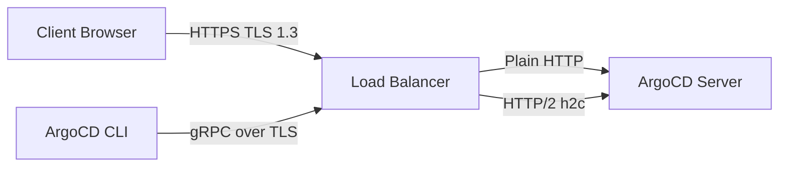

# How to Configure ArgoCD with TLS Termination at Load Balancer

Author: [nawazdhandala](https://github.com/nawazdhandala)

Tags: ArgoCD, GitOps, Kubernetes, TLS, Load Balancing

Description: Configure TLS termination at the load balancer level for ArgoCD with proper backend configuration, certificate management, and security hardening.

---

TLS termination at the load balancer is the most common way to handle HTTPS for ArgoCD in production. The load balancer decrypts incoming TLS traffic and forwards plain HTTP to the ArgoCD server inside the cluster. This simplifies certificate management, centralizes TLS configuration, and offloads cryptographic processing from your application pods.

## How TLS Termination Works

In this setup, the TLS handshake happens at the load balancer (ingress controller, cloud LB, or external proxy). The load balancer presents the certificate to clients and decrypts the traffic. It then forwards plain HTTP to the ArgoCD server running in insecure mode inside the cluster.



The traffic inside the cluster is unencrypted, but this is generally acceptable because:

- Cluster networking is typically isolated
- You can add mTLS with a service mesh if needed
- It is the standard pattern used by most Kubernetes applications

## Step 1: Configure ArgoCD for Insecure Mode

When using TLS termination, ArgoCD server must run without its built-in TLS. Otherwise, you get a double-encryption scenario that breaks communication.

```yaml
apiVersion: v1
kind: ConfigMap
metadata:
  name: argocd-cmd-params-cm
  namespace: argocd
data:
  # Disable TLS on the ArgoCD server
  server.insecure: "true"
```

Apply and restart:

```bash
kubectl apply -f argocd-cmd-params-cm.yaml
kubectl rollout restart deployment argocd-server -n argocd

# Verify the server started in insecure mode
kubectl logs -n argocd -l app.kubernetes.io/name=argocd-server | grep "insecure"
```

## Step 2: Create TLS Certificate

You need a TLS certificate for your domain. Here are several options:

**Option A: Self-signed certificate (for testing)**

```bash
# Generate a self-signed cert
openssl req -x509 -nodes -days 365 \
  -newkey rsa:2048 \
  -keyout tls.key \
  -out tls.crt \
  -subj "/CN=argocd.example.com"

# Create a Kubernetes secret
kubectl create secret tls argocd-server-tls \
  --namespace argocd \
  --cert=tls.crt \
  --key=tls.key
```

**Option B: cert-manager (recommended for production)**

```yaml
apiVersion: cert-manager.io/v1
kind: Certificate
metadata:
  name: argocd-server-tls
  namespace: argocd
spec:
  secretName: argocd-server-tls
  issuerRef:
    name: letsencrypt-prod
    kind: ClusterIssuer
  dnsNames:
    - argocd.example.com
```

**Option C: Cloud provider managed certificate**

For AWS, use ACM. For GCP, use Google-managed certificates. These do not need Kubernetes secrets since the cloud LB handles them natively.

## Step 3: Configure the Ingress

With Nginx Ingress Controller:

```yaml
apiVersion: networking.k8s.io/v1
kind: Ingress
metadata:
  name: argocd-server-ingress
  namespace: argocd
  annotations:
    # Backend is HTTP since ArgoCD is in insecure mode
    nginx.ingress.kubernetes.io/backend-protocol: "HTTP"
    # Force HTTPS redirect
    nginx.ingress.kubernetes.io/force-ssl-redirect: "true"
    # TLS cipher configuration
    nginx.ingress.kubernetes.io/ssl-ciphers: "ECDHE-ECDSA-AES128-GCM-SHA256:ECDHE-RSA-AES128-GCM-SHA256:ECDHE-ECDSA-AES256-GCM-SHA384:ECDHE-RSA-AES256-GCM-SHA384"
    # Minimum TLS version
    nginx.ingress.kubernetes.io/ssl-protocols: "TLSv1.2 TLSv1.3"
    # HSTS header
    nginx.ingress.kubernetes.io/hsts: "true"
    nginx.ingress.kubernetes.io/hsts-max-age: "31536000"
    nginx.ingress.kubernetes.io/hsts-include-subdomains: "true"
    # Buffer sizes for large ArgoCD responses
    nginx.ingress.kubernetes.io/proxy-buffer-size: "64k"
spec:
  ingressClassName: nginx
  rules:
    - host: argocd.example.com
      http:
        paths:
          - path: /
            pathType: Prefix
            backend:
              service:
                name: argocd-server
                port:
                  number: 80
  tls:
    - hosts:
        - argocd.example.com
      secretName: argocd-server-tls
```

## Cloud Load Balancer Configuration

### AWS Network Load Balancer

For AWS NLB with TLS termination:

```yaml
apiVersion: v1
kind: Service
metadata:
  name: argocd-server-lb
  namespace: argocd
  annotations:
    # Use NLB
    service.beta.kubernetes.io/aws-load-balancer-type: "nlb"
    # TLS termination at NLB
    service.beta.kubernetes.io/aws-load-balancer-ssl-cert: "arn:aws:acm:us-east-1:123456789:certificate/your-cert-arn"
    # Listen on HTTPS
    service.beta.kubernetes.io/aws-load-balancer-ssl-ports: "443"
    # Backend protocol
    service.beta.kubernetes.io/aws-load-balancer-backend-protocol: "tcp"
spec:
  type: LoadBalancer
  ports:
    - name: https
      port: 443
      targetPort: 8080
  selector:
    app.kubernetes.io/name: argocd-server
```

### GCP TCP Load Balancer

For GCP with a managed certificate:

```yaml
apiVersion: v1
kind: Service
metadata:
  name: argocd-server-lb
  namespace: argocd
  annotations:
    cloud.google.com/neg: '{"ingress": true}'
spec:
  type: LoadBalancer
  ports:
    - name: https
      port: 443
      targetPort: 8080
  selector:
    app.kubernetes.io/name: argocd-server
```

## Security Hardening

When terminating TLS at the load balancer, apply these security measures:

### Enforce Minimum TLS Version

```yaml
annotations:
  nginx.ingress.kubernetes.io/ssl-protocols: "TLSv1.2 TLSv1.3"
```

### Add Security Headers

```yaml
annotations:
  nginx.ingress.kubernetes.io/configuration-snippet: |
    more_set_headers "X-Frame-Options: DENY";
    more_set_headers "X-Content-Type-Options: nosniff";
    more_set_headers "X-XSS-Protection: 1; mode=block";
    more_set_headers "Referrer-Policy: strict-origin-when-cross-origin";
```

### Enable OCSP Stapling

```yaml
annotations:
  nginx.ingress.kubernetes.io/enable-ocsp-stapling: "true"
```

## Handling the X-Forwarded Headers

When ArgoCD runs behind TLS termination, it needs to know the original client protocol and IP. The load balancer adds `X-Forwarded-*` headers that ArgoCD reads:

```yaml
# ArgoCD server configuration
apiVersion: v1
kind: ConfigMap
metadata:
  name: argocd-cmd-params-cm
  namespace: argocd
data:
  server.insecure: "true"
  # Trust the proxy headers
  server.rootpath: ""
```

The ingress controller should pass these headers:

```yaml
annotations:
  nginx.ingress.kubernetes.io/use-forwarded-headers: "true"
  nginx.ingress.kubernetes.io/forwarded-for-header: "X-Forwarded-For"
```

## Verifying TLS Configuration

After setup, verify the TLS configuration:

```bash
# Check certificate details
openssl s_client -connect argocd.example.com:443 -servername argocd.example.com < /dev/null 2>/dev/null | openssl x509 -text -noout

# Check TLS version and cipher
curl -vI https://argocd.example.com 2>&1 | grep -E "SSL connection|subject|issuer"

# Test with SSLLabs (for public endpoints)
# Visit: https://www.ssllabs.com/ssltest/analyze.html?d=argocd.example.com

# Verify ArgoCD is accessible
curl -I https://argocd.example.com

# Test CLI
argocd login argocd.example.com --grpc-web
```

## Troubleshooting

**Redirect Loop**: ArgoCD is trying to redirect HTTP to HTTPS, but the ingress is also doing it. Make sure `server.insecure: "true"` is set.

**Mixed Content Warnings**: The browser thinks some resources are loaded over HTTP. Check that `X-Forwarded-Proto` headers are being passed.

**Certificate Not Trusted**: If using a self-signed cert, the CLI needs `--insecure` flag. For production, use a trusted CA or cert-manager with Let's Encrypt.

**Connection Reset**: The backend protocol annotation does not match ArgoCD's mode. If `server.insecure` is true, use `HTTP`. If false, use `HTTPS`.

For TLS passthrough as an alternative, see [configuring ArgoCD with TLS passthrough](https://oneuptime.com/blog/post/2026-02-26-argocd-tls-passthrough/view). For automatic certificate management, check [ArgoCD with cert-manager](https://oneuptime.com/blog/post/2026-02-26-argocd-cert-manager-ssl/view).
