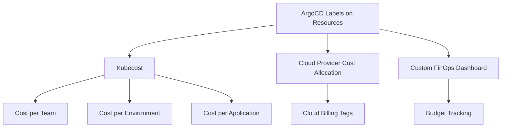

# How to Track Deployment Costs with ArgoCD Labels

Author: [nawazdhandala](https://github.com/nawazdhandala)

Tags: ArgoCD, GitOps, Kubernetes, Cost Management, FinOps

Description: Learn how to use ArgoCD labels and annotations to track deployment costs per team, environment, and application for Kubernetes cost allocation and FinOps.

---

When your cloud bill arrives and finance asks "which team is responsible for this 40% cost increase?", you need answers fast. Kubernetes makes cost attribution surprisingly hard because workloads from different teams share the same nodes. The key to solving this is consistent labeling, and ArgoCD is the perfect place to enforce it.

In this guide, I will show you how to use ArgoCD's GitOps workflow to enforce cost-tracking labels across all deployments and integrate them with cost monitoring tools.

## Why Labels Matter for Cost Tracking

Cloud cost tools like Kubecost, CloudHealth, and native cloud provider cost allocation all rely on Kubernetes labels to attribute costs. Without consistent labels, costs show up as "unattributed" - which is useless for budget planning.



## Defining a Cost Label Standard

Start by establishing which labels are required for cost tracking.

```yaml
# Required cost labels for all workloads
metadata:
  labels:
    # Who pays for this?
    cost-center: "cc-engineering-1234"
    team: "platform"
    department: "engineering"
    # What is this?
    app: "payment-service"
    component: "api"
    # Where does it run?
    environment: "production"
    tier: "critical"
```

## Enforcing Labels Through ArgoCD Projects

Configure ArgoCD projects to include required labels in their description and documentation.

```yaml
# project.yaml
apiVersion: argoproj.io/v1alpha1
kind: AppProject
metadata:
  name: team-alpha
  namespace: argocd
  labels:
    cost-center: "cc-alpha-5678"
    team: "alpha"
spec:
  description: "Team Alpha applications - Cost Center cc-alpha-5678"
  sourceRepos:
    - https://github.com/myorg/team-alpha-*
  destinations:
    - namespace: "alpha-*"
      server: https://kubernetes.default.svc
```

## Using Kyverno to Enforce Cost Labels

Create a Kyverno policy that rejects any workload missing cost labels.

```yaml
# require-cost-labels.yaml
apiVersion: kyverno.io/v1
kind: ClusterPolicy
metadata:
  name: require-cost-labels
spec:
  validationFailureAction: Enforce
  background: true
  rules:
    - name: check-cost-labels
      match:
        any:
          - resources:
              kinds:
                - Deployment
                - StatefulSet
                - DaemonSet
                - Job
                - CronJob
      exclude:
        any:
          - resources:
              namespaces:
                - kube-system
                - argocd
                - monitoring
      validate:
        message: >-
          Resource must have cost tracking labels: cost-center, team, environment.
          Missing labels on {{request.object.metadata.name}}.
        pattern:
          metadata:
            labels:
              cost-center: "cc-?*"
              team: "?*"
              environment: "production | staging | development"
    - name: propagate-labels-to-pods
      match:
        any:
          - resources:
              kinds:
                - Deployment
                - StatefulSet
      mutate:
        patchStrategicMerge:
          spec:
            template:
              metadata:
                labels:
                  +(cost-center): "{{request.object.metadata.labels.\"cost-center\"}}"
                  +(team): "{{request.object.metadata.labels.team}}"
                  +(environment): "{{request.object.metadata.labels.environment}}"
```

The mutation rule copies cost labels from the Deployment to the pod template, ensuring that pods inherit cost attribution.

## ArgoCD ApplicationSet with Cost Labels

Use ApplicationSets to automatically apply cost labels based on team and environment.

```yaml
# cost-tracked-appset.yaml
apiVersion: argoproj.io/v1alpha1
kind: ApplicationSet
metadata:
  name: team-applications
  namespace: argocd
spec:
  generators:
    - matrix:
        generators:
          - list:
              elements:
                - team: alpha
                  costCenter: cc-alpha-5678
                  department: engineering
                - team: beta
                  costCenter: cc-beta-9012
                  department: product
          - git:
              repoURL: https://github.com/myorg/gitops.git
              revision: main
              directories:
                - path: "apps/{{team}}/*"
  template:
    metadata:
      name: "{{team}}-{{path.basename}}"
      labels:
        cost-center: "{{costCenter}}"
        team: "{{team}}"
        department: "{{department}}"
    spec:
      project: "{{team}}"
      source:
        repoURL: https://github.com/myorg/gitops.git
        path: "{{path}}"
        targetRevision: main
      destination:
        server: https://kubernetes.default.svc
        namespace: "{{team}}-production"
```

## Integrating with Kubecost

Kubecost reads Kubernetes labels to allocate costs. Configure it to use your cost labels.

```yaml
# kubecost-config.yaml (deployed via ArgoCD)
apiVersion: v1
kind: ConfigMap
metadata:
  name: allocation-config
  namespace: kubecost
data:
  allocation.json: |
    {
      "labelConfig": {
        "team_label": "team",
        "department_label": "department",
        "environment_label": "environment",
        "product_label": "app",
        "cost_center_label": "cost-center"
      },
      "sharedOverhead": {
        "shareNamespaces": ["kube-system", "argocd", "monitoring"],
        "shareLabels": {},
        "shareByPercent": true
      }
    }
```

## Labeling Namespaces for Cloud Provider Cost Allocation

Cloud providers can use namespace labels for cost allocation. Ensure namespaces are labeled through ArgoCD.

```yaml
# namespace with cost labels
apiVersion: v1
kind: Namespace
metadata:
  name: alpha-production
  labels:
    cost-center: "cc-alpha-5678"
    team: "alpha"
    environment: "production"
  annotations:
    # AWS cost allocation tag
    aws.amazon.com/cost-center: "cc-alpha-5678"
    # GCP label for billing
    cloud.google.com/cost-center: "cc-alpha-5678"
    # Azure tag
    azure.com/cost-center: "cc-alpha-5678"
```

## Building a Cost Dashboard

Create a Grafana dashboard that shows costs by team using Kubecost metrics.

```yaml
# Key Prometheus queries for cost tracking

# Monthly cost per team
# sum(kubecost_cluster_costs_total{}) by (team_label)

# Cost per environment
# sum(kubecost_cluster_costs_total{}) by (environment_label)

# Cost trend (week over week)
# sum(increase(kubecost_cluster_costs_total{}[7d])) by (team_label)

# Unattributed costs (resources missing labels)
# kubecost_cluster_costs_total{team_label=""}
```

## Automated Cost Reports

Deploy a CronJob through ArgoCD that generates weekly cost reports per team.

```yaml
# cost-report-job.yaml
apiVersion: batch/v1
kind: CronJob
metadata:
  name: weekly-cost-report
  namespace: kubecost
spec:
  schedule: "0 8 * * 1"  # Every Monday at 8 AM
  jobTemplate:
    spec:
      template:
        spec:
          containers:
            - name: reporter
              image: curlimages/curl:latest
              command:
                - /bin/sh
                - -c
                - |
                  # Query Kubecost API for last 7 days
                  REPORT=$(curl -s \
                    "http://kubecost-cost-analyzer.kubecost:9090/model/allocation?window=7d&aggregate=label:team")

                  # Format and send to Slack
                  SUMMARY=$(echo "$REPORT" | jq -r '
                    .data[0] | to_entries[] |
                    "Team: \(.key) - Cost: $\(.value.totalCost | . * 100 | round / 100)"
                  ')

                  curl -X POST "$SLACK_WEBHOOK" \
                    -H "Content-Type: application/json" \
                    -d "{
                      \"text\": \"Weekly Kubernetes Cost Report\\n\`\`\`\\n${SUMMARY}\\n\`\`\`\"
                    }"
              env:
                - name: SLACK_WEBHOOK
                  valueFrom:
                    secretKeyRef:
                      name: slack-webhook
                      key: url
          restartPolicy: OnFailure
```

## Handling Label Changes

When teams are reorganized or cost centers change, you need to update labels across all resources. Since everything is in Git and managed by ArgoCD, this is a simple find-and-replace operation.

```bash
# Update cost center across all team-alpha resources
find apps/alpha/ -name "*.yaml" -exec sed -i 's/cc-alpha-5678/cc-alpha-9999/g' {} +

# Commit and push - ArgoCD handles the rest
git add .
git commit -m "chore: update team alpha cost center to cc-alpha-9999"
git push
```

ArgoCD will sync the label changes across all affected resources. This is dramatically easier than manually relabeling resources in a running cluster.

## Conclusion

Cost tracking through ArgoCD labels is the foundation of Kubernetes FinOps. By enforcing cost labels through policy engines, propagating them to all resources through GitOps, and integrating with tools like Kubecost, you create a system where every dollar of cloud spend is attributed to a team and purpose. The GitOps model makes label management tractable because changes happen in Git and propagate automatically. Start with three mandatory labels - team, environment, and cost-center - and expand from there based on your FinOps maturity.
