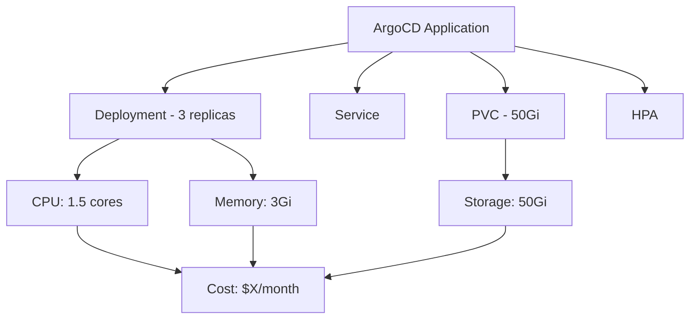

# How to Track Deployment Costs per Application with ArgoCD

Author: [nawazdhandala](https://github.com/nawazdhandala)

Tags: ArgoCD, GitOps, Kubernetes, FinOps, Cost Management

Description: Learn how to track and attribute deployment costs per application in ArgoCD using labels, resource tracking, and cost allocation tools.

---

Understanding what each application costs to run is a fundamental FinOps practice, but it is surprisingly difficult in Kubernetes. Applications spread across multiple pods, use shared infrastructure, and scale dynamically. ArgoCD's application model provides a natural boundary for cost tracking - each ArgoCD Application maps to a set of Kubernetes resources that can be measured and attributed. This guide shows how to build cost visibility per ArgoCD application.

## Why Track Costs per ArgoCD Application

ArgoCD Applications represent logical service boundaries. They map to specific Git repositories and deploy specific sets of Kubernetes resources. This makes them ideal cost attribution units:

- Each Application deploys known resources (Deployments, Services, PVCs)
- Applications have owners (teams) through ArgoCD Projects and labels
- Resource changes are tracked through Git history
- Cost changes can be correlated with specific commits



## Step 1: Consistent Labeling Strategy

The foundation of cost tracking is consistent labels. ArgoCD automatically adds tracking labels to resources it manages, but you should add cost-specific labels:

```yaml
# ArgoCD Application with cost tracking labels
apiVersion: argoproj.io/v1alpha1
kind: Application
metadata:
  name: payment-service
  namespace: argocd
  labels:
    team: payments
    cost-center: CC-1234
    environment: production
    service-tier: critical
spec:
  source:
    repoURL: https://github.com/myorg/payment-service
    targetRevision: main
    path: k8s/production
  destination:
    server: https://kubernetes.default.svc
    namespace: payments
  # Ensure ArgoCD labels propagate to managed resources
  syncPolicy:
    managedNamespaceMetadata:
      labels:
        team: payments
        cost-center: CC-1234
```

Add labels to your application manifests as well:

```yaml
# deployment.yaml with cost tracking labels
apiVersion: apps/v1
kind: Deployment
metadata:
  name: payment-service
  labels:
    app: payment-service
    team: payments
    cost-center: CC-1234
    argocd-app: payment-service
spec:
  template:
    metadata:
      labels:
        app: payment-service
        team: payments
        cost-center: CC-1234
        argocd-app: payment-service
```

## Step 2: Use ArgoCD Resource Tracking

ArgoCD tracks all resources it manages. You can query this information to build a resource inventory per application:

```bash
# List all resources managed by an ArgoCD application
argocd app resources payment-service

# Get detailed resource information including resource requests
argocd app resources payment-service --output json | \
  jq '.[] | {kind: .kind, name: .name, namespace: .namespace}'

# Get the full resource tree
argocd app get payment-service --resource-tree
```

Build a script that calculates resource usage per application:

```bash
#!/bin/bash
# calculate-app-costs.sh
# Estimates monthly costs for an ArgoCD application based on resource requests

APP_NAME=$1
CPU_COST_PER_CORE=${2:-30}    # $30/month per CPU core
MEMORY_COST_PER_GB=${3:-4}     # $4/month per GB RAM
STORAGE_COST_PER_GB=${4:-0.10} # $0.10/month per GB storage

echo "Calculating costs for ArgoCD application: $APP_NAME"
echo "---"

# Get all pods managed by this application
NAMESPACE=$(argocd app get "$APP_NAME" -o json | jq -r '.spec.destination.namespace')

# Calculate CPU costs
TOTAL_CPU=$(kubectl get pods -n "$NAMESPACE" -l "app.kubernetes.io/instance=$APP_NAME" \
  -o jsonpath='{range .items[*]}{range .spec.containers[*]}{.resources.requests.cpu}{"\n"}{end}{end}' | \
  awk '{
    val=$1;
    if (val ~ /m$/) { gsub(/m$/,"",val); val=val/1000 }
    total+=val
  } END {print total}')

# Calculate memory costs
TOTAL_MEM=$(kubectl get pods -n "$NAMESPACE" -l "app.kubernetes.io/instance=$APP_NAME" \
  -o jsonpath='{range .items[*]}{range .spec.containers[*]}{.resources.requests.memory}{"\n"}{end}{end}' | \
  awk '{
    val=$1;
    if (val ~ /Mi$/) { gsub(/Mi$/,"",val); val=val/1024 }
    else if (val ~ /Gi$/) { gsub(/Gi$/,"",val) }
    total+=val
  } END {print total}')

# Calculate storage costs
TOTAL_STORAGE=$(kubectl get pvc -n "$NAMESPACE" -l "app.kubernetes.io/instance=$APP_NAME" \
  -o jsonpath='{range .items[*]}{.spec.resources.requests.storage}{"\n"}{end}' | \
  awk '{
    val=$1;
    if (val ~ /Gi$/) { gsub(/Gi$/,"",val) }
    total+=val
  } END {print total}')

CPU_COST=$(echo "$TOTAL_CPU * $CPU_COST_PER_CORE" | bc 2>/dev/null || echo "0")
MEM_COST=$(echo "$TOTAL_MEM * $MEMORY_COST_PER_GB" | bc 2>/dev/null || echo "0")
STORAGE_COST=$(echo "$TOTAL_STORAGE * $STORAGE_COST_PER_GB" | bc 2>/dev/null || echo "0")
TOTAL_COST=$(echo "$CPU_COST + $MEM_COST + $STORAGE_COST" | bc 2>/dev/null || echo "0")

echo "CPU: ${TOTAL_CPU:-0} cores = \$${CPU_COST:-0}/month"
echo "Memory: ${TOTAL_MEM:-0} GB = \$${MEM_COST:-0}/month"
echo "Storage: ${TOTAL_STORAGE:-0} GB = \$${STORAGE_COST:-0}/month"
echo "---"
echo "Total estimated cost: \$${TOTAL_COST:-0}/month"
```

## Step 3: Export Metrics for Cost Dashboards

Create a Prometheus exporter that exposes cost data per ArgoCD application:

```yaml
# ConfigMap for a cost metrics exporter
apiVersion: v1
kind: ConfigMap
metadata:
  name: argocd-cost-exporter-config
  namespace: argocd
data:
  config.yaml: |
    # Pricing configuration (adjust for your cloud provider)
    pricing:
      cpu_per_core_monthly: 30.00
      memory_per_gb_monthly: 4.00
      storage_per_gb_monthly: 0.10

    # Labels to use for grouping
    grouping_labels:
      - team
      - cost-center
      - environment
```

Create a Prometheus recording rule that calculates costs:

```yaml
# Prometheus recording rules for ArgoCD application costs
apiVersion: monitoring.coreos.com/v1
kind: PrometheusRule
metadata:
  name: argocd-cost-rules
  namespace: monitoring
spec:
  groups:
    - name: argocd-costs
      interval: 5m
      rules:
        # CPU cost per ArgoCD application
        - record: argocd_app_cpu_cost_monthly
          expr: |
            sum by (label_app_kubernetes_io_instance) (
              kube_pod_container_resource_requests{resource="cpu"}
              * on(pod, namespace) group_left(label_app_kubernetes_io_instance)
              kube_pod_labels{label_app_kubernetes_io_instance!=""}
            ) * 30

        # Memory cost per ArgoCD application
        - record: argocd_app_memory_cost_monthly
          expr: |
            sum by (label_app_kubernetes_io_instance) (
              kube_pod_container_resource_requests{resource="memory"}
              * on(pod, namespace) group_left(label_app_kubernetes_io_instance)
              kube_pod_labels{label_app_kubernetes_io_instance!=""}
            ) / 1073741824 * 4

        # Total cost per ArgoCD application
        - record: argocd_app_total_cost_monthly
          expr: |
            argocd_app_cpu_cost_monthly + argocd_app_memory_cost_monthly

        # Cost per team
        - record: argocd_team_total_cost_monthly
          expr: |
            sum by (label_team) (
              argocd_app_total_cost_monthly
              * on(label_app_kubernetes_io_instance) group_left(label_team)
              kube_pod_labels{label_team!=""}
            )
```

## Step 4: Build a Grafana Cost Dashboard

Create a Grafana dashboard that visualizes costs per ArgoCD application:

```json
{
  "dashboard": {
    "title": "ArgoCD Application Costs",
    "panels": [
      {
        "title": "Monthly Cost by Application",
        "type": "barchart",
        "targets": [
          {
            "expr": "topk(20, argocd_app_total_cost_monthly)",
            "legendFormat": "{{label_app_kubernetes_io_instance}}"
          }
        ]
      },
      {
        "title": "Monthly Cost by Team",
        "type": "piechart",
        "targets": [
          {
            "expr": "argocd_team_total_cost_monthly",
            "legendFormat": "{{label_team}}"
          }
        ]
      },
      {
        "title": "Cost Trend (30 days)",
        "type": "timeseries",
        "targets": [
          {
            "expr": "sum(argocd_app_total_cost_monthly)",
            "legendFormat": "Total"
          }
        ]
      },
      {
        "title": "CPU vs Memory Cost Split",
        "type": "piechart",
        "targets": [
          {
            "expr": "sum(argocd_app_cpu_cost_monthly)",
            "legendFormat": "CPU"
          },
          {
            "expr": "sum(argocd_app_memory_cost_monthly)",
            "legendFormat": "Memory"
          }
        ]
      }
    ]
  }
}
```

## Step 5: Track Cost Changes with Git

Since ArgoCD deploys from Git, you can correlate cost changes with specific commits. Add a webhook that calculates cost impact for pull requests:

```yaml
# GitHub Action to estimate cost impact of resource changes
name: Cost Impact Analysis
on:
  pull_request:
    paths:
      - 'k8s/**'

jobs:
  cost-analysis:
    runs-on: ubuntu-latest
    steps:
      - uses: actions/checkout@v4
        with:
          fetch-depth: 0

      - name: Calculate cost delta
        run: |
          # Compare resource requests between base and head
          BASE_CPU=$(git show origin/main:k8s/production/deployment.yaml | \
            yq '.spec.template.spec.containers[0].resources.requests.cpu')
          HEAD_CPU=$(yq '.spec.template.spec.containers[0].resources.requests.cpu' \
            k8s/production/deployment.yaml)

          BASE_REPLICAS=$(git show origin/main:k8s/production/deployment.yaml | \
            yq '.spec.replicas')
          HEAD_REPLICAS=$(yq '.spec.replicas' k8s/production/deployment.yaml)

          echo "CPU change: $BASE_CPU to $HEAD_CPU"
          echo "Replica change: $BASE_REPLICAS to $HEAD_REPLICAS"
          # Calculate estimated monthly cost change
          # ... cost calculation logic ...

      - name: Comment on PR
        uses: actions/github-script@v7
        with:
          script: |
            github.rest.issues.createComment({
              issue_number: context.issue.number,
              owner: context.repo.owner,
              repo: context.repo.repo,
              body: '## Cost Impact Analysis\n\nEstimated monthly cost change: +$X.XX'
            })
```

## Step 6: Generate Cost Reports

Create periodic cost reports per team:

```bash
#!/bin/bash
# generate-cost-report.sh
# Generates a cost report for all ArgoCD applications

echo "ArgoCD Application Cost Report"
echo "Generated: $(date -u +%Y-%m-%dT%H:%M:%SZ)"
echo "================================"
echo ""

# Get all ArgoCD applications
argocd app list -o json | jq -c '.[]' | while read app; do
  APP_NAME=$(echo $app | jq -r '.metadata.name')
  TEAM=$(echo $app | jq -r '.metadata.labels.team // "unknown"')
  COST_CENTER=$(echo $app | jq -r '.metadata.labels["cost-center"] // "unassigned"')
  NAMESPACE=$(echo $app | jq -r '.spec.destination.namespace')

  # Get resource totals
  POD_COUNT=$(kubectl get pods -n "$NAMESPACE" \
    -l "app.kubernetes.io/instance=$APP_NAME" --no-headers 2>/dev/null | wc -l)

  echo "Application: $APP_NAME"
  echo "  Team: $TEAM"
  echo "  Cost Center: $COST_CENTER"
  echo "  Namespace: $NAMESPACE"
  echo "  Pod Count: $POD_COUNT"
  echo ""
done
```

## Summary

Tracking deployment costs per ArgoCD application starts with consistent labeling and leverages ArgoCD's resource tracking to build a complete picture of what each service consumes. Use Prometheus recording rules for real-time cost metrics, Grafana for visualization, and Git-based workflows for cost impact analysis on pull requests. The combination gives teams visibility into their cloud spending at the application level. For deeper cost optimization, see our guides on [implementing cost allocation labels with ArgoCD](https://oneuptime.com/blog/post/2026-02-26-argocd-cost-allocation-labels/view) and [using Kubecost with ArgoCD](https://oneuptime.com/blog/post/2026-02-26-argocd-kubecost-integration/view).
