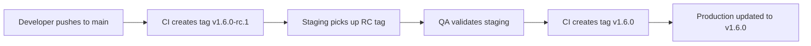

# How to Track a Git Tag in ArgoCD

Author: [nawazdhandala](https://github.com/nawazdhandala)

Tags: ArgoCD, GitOps, Kubernetes, Git, Deployments

Description: Learn how to configure ArgoCD to track Git tags for controlled production deployments with explicit versioning and easy rollbacks.

---

Tracking a Git tag in ArgoCD is one of the most reliable patterns for production deployments. Unlike branch tracking, which continuously follows the latest commits, tag tracking locks your application to a specific, immutable point in your Git history. This gives you explicit control over what is deployed and makes rollbacks trivial.

In this guide, we will cover how to set up tag-based tracking, how to use tag patterns with glob expressions, and how to build a promotion workflow around tags.

## Why Track Tags Instead of Branches

When you track a branch, every push to that branch can trigger a sync. That is great for development but risky for production. Tags provide several advantages:

- **Immutability**: Once a tag is created, it points to a fixed commit. Your production state is deterministic.
- **Auditability**: You can see exactly which version is deployed by looking at the tag name.
- **Rollback simplicity**: Rolling back means changing the `targetRevision` to a previous tag.
- **Release gating**: Deploying requires the deliberate act of creating a tag.

## Basic Tag Tracking Configuration

To configure an ArgoCD application to track a specific tag, set the `targetRevision` field to the tag name:

```yaml
# production-app.yaml - tracks a specific tag
apiVersion: argoproj.io/v1alpha1
kind: Application
metadata:
  name: my-app-production
  namespace: argocd
spec:
  project: default
  source:
    repoURL: https://github.com/myorg/my-manifests.git
    # Set to the exact tag name
    targetRevision: v1.5.2
    path: k8s/overlays/production
  destination:
    server: https://kubernetes.default.svc
    namespace: production
  syncPolicy:
    automated:
      prune: true
      selfHeal: true
```

Using the CLI:

```bash
argocd app create my-app-production \
  --repo https://github.com/myorg/my-manifests.git \
  --path k8s/overlays/production \
  --dest-server https://kubernetes.default.svc \
  --dest-namespace production \
  --revision v1.5.2
```

## Updating the Tag Version

When you want to deploy a new version, update the `targetRevision` to the new tag:

```bash
# Update the application to track a new tag
argocd app set my-app-production --revision v1.6.0
```

Or update the manifest and let ArgoCD pick up the change if you manage your Application resources in Git (app-of-apps pattern):

```yaml
# Change this in your Application manifest
spec:
  source:
    targetRevision: v1.6.0  # updated from v1.5.2
```

## Using Tag Glob Patterns

ArgoCD does not natively support glob patterns in the `targetRevision` field for standard Application resources. However, ApplicationSets with the Git generator can detect new tags and create applications automatically.

That said, you can use a semver-based approach with Helm chart versions in source configurations, which we cover in our guide on [semantic versioning for tracking in ArgoCD](https://oneuptime.com/blog/post/2026-02-26-argocd-semantic-versioning-tracking/view).

## Tag-Based Promotion Workflow

A common production workflow uses tags for promotion across environments:



Here is how you would set up the staging and production applications:

```yaml
# staging - follows release candidate tags (manually updated)
apiVersion: argoproj.io/v1alpha1
kind: Application
metadata:
  name: my-app-staging
  namespace: argocd
spec:
  source:
    repoURL: https://github.com/myorg/my-manifests.git
    targetRevision: v1.6.0-rc.1
    path: k8s/overlays/staging
  destination:
    server: https://kubernetes.default.svc
    namespace: staging
  syncPolicy:
    automated:
      prune: true
      selfHeal: true
---
# production - follows stable release tags
apiVersion: argoproj.io/v1alpha1
kind: Application
metadata:
  name: my-app-production
  namespace: argocd
spec:
  source:
    repoURL: https://github.com/myorg/my-manifests.git
    targetRevision: v1.6.0
    path: k8s/overlays/production
  destination:
    server: https://kubernetes.default.svc
    namespace: production
  syncPolicy:
    automated:
      prune: true
      selfHeal: true
```

## Automating Tag Updates with CI/CD

You can automate the process of updating the ArgoCD Application's `targetRevision` when a new tag is created. Here is an example GitHub Actions workflow:

```yaml
# .github/workflows/promote-production.yaml
name: Promote to Production
on:
  push:
    tags:
      - 'v[0-9]+.[0-9]+.[0-9]+'  # Matches v1.2.3 (no pre-release suffix)

jobs:
  promote:
    runs-on: ubuntu-latest
    steps:
      - name: Checkout app-of-apps repo
        uses: actions/checkout@v4
        with:
          repository: myorg/argocd-apps
          token: ${{ secrets.GH_TOKEN }}

      - name: Update production tag
        run: |
          TAG=${GITHUB_REF#refs/tags/}
          # Update the targetRevision in the production Application manifest
          yq eval ".spec.source.targetRevision = \"$TAG\"" \
            -i apps/production/my-app.yaml

      - name: Commit and push
        run: |
          git config user.name "github-actions"
          git config user.email "github-actions@github.com"
          git add .
          git commit -m "Promote my-app to $TAG in production"
          git push
```

## Rolling Back with Tags

One of the biggest benefits of tag tracking is easy rollback. If a deployment goes wrong:

```bash
# Rollback to the previous tag
argocd app set my-app-production --revision v1.5.2

# Sync to apply the rollback
argocd app sync my-app-production
```

You can also check what tag is currently deployed:

```bash
argocd app get my-app-production -o json | jq '.spec.source.targetRevision'
# Output: "v1.6.0"

argocd app get my-app-production -o json | jq '.status.sync.revision'
# Output: the full commit SHA that the tag resolves to
```

## Lightweight vs Annotated Tags

ArgoCD works with both lightweight and annotated Git tags. However, annotated tags are recommended because they store additional metadata (tagger name, date, message) that can be useful for auditing:

```bash
# Create an annotated tag (recommended)
git tag -a v1.6.0 -m "Release 1.6.0: Added new dashboard feature"
git push origin v1.6.0

# Create a lightweight tag (works but less metadata)
git tag v1.6.0
git push origin v1.6.0
```

## Handling Moved Tags

In general, you should treat tags as immutable. However, if someone force-pushes a tag (moves it to a different commit), ArgoCD will detect this on its next poll and show the application as OutOfSync.

This is considered bad practice. If you need to change what is deployed for a version, create a new tag (e.g., `v1.6.1`) rather than moving an existing tag.

## Summary

Tag-based tracking in ArgoCD provides a production-grade deployment model with clear versioning, deterministic state, and simple rollbacks. Set the `targetRevision` to your tag name, use annotated tags for better auditability, and combine with CI/CD automation to update the Application manifest when new tags are created. For development environments that need continuous deployment, consider [tracking a Git branch](https://oneuptime.com/blog/post/2026-02-26-argocd-track-git-branch/view) instead.
