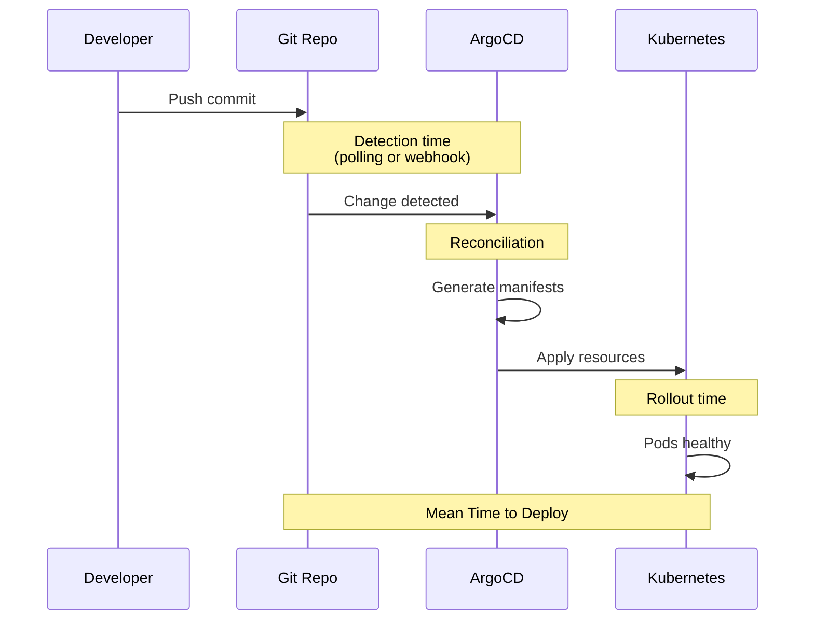

# How to Track Mean Time to Deploy with ArgoCD Metrics

Author: [nawazdhandala](https://github.com/nawazdhandala)

Tags: ArgoCD, GitOps, Kubernetes, DORA Metrics, Monitoring

Description: Learn how to measure and track mean time to deploy using ArgoCD Prometheus metrics, covering lead time from Git commit to running in production.

---

Mean Time to Deploy (MTTD) measures how long it takes for a code change to go from commit to running in production. It is closely related to the DORA "Lead Time for Changes" metric and is one of the most important indicators of your delivery pipeline's efficiency. ArgoCD provides the metrics you need to track this, but it takes some work to stitch together the complete picture.

## What Mean Time to Deploy Means in ArgoCD

In a GitOps workflow with ArgoCD, the deployment pipeline has several distinct phases:

1. Developer pushes a commit to Git
2. ArgoCD detects the change during its polling cycle (or via webhook)
3. ArgoCD compares the new desired state with the live state
4. If auto-sync is enabled, ArgoCD starts the sync operation
5. The sync operation applies resources to the cluster
6. Resources roll out (pods start, health checks pass)

MTTD covers the time from step 2 through step 6. The total "lead time for changes" includes step 1 as well, but ArgoCD can only measure from when it first detects the change.



## ArgoCD Metrics for MTTD

ArgoCD exposes several metrics that together give you MTTD:

### Reconciliation Duration

This measures how long ArgoCD takes to detect a change and compute the diff:

```promql
# P50 reconciliation duration
histogram_quantile(0.5, sum(rate(argocd_app_reconcile_bucket[5m])) by (le))

# P95 reconciliation duration
histogram_quantile(0.95, sum(rate(argocd_app_reconcile_bucket[5m])) by (le))

# P99 reconciliation duration
histogram_quantile(0.99, sum(rate(argocd_app_reconcile_bucket[5m])) by (le))

# Per application
histogram_quantile(0.95, sum(rate(argocd_app_reconcile_bucket[5m])) by (le, name))
```

### Sync Duration

This measures the time the actual sync operation takes - from starting the apply to all resources being applied:

```promql
# Average sync duration for successful syncs
rate(argocd_app_sync_total{phase="Succeeded"}[1h])

# If using custom metrics for sync duration tracking
# ArgoCD does not natively expose sync duration as a histogram
# You may need to calculate it from sync events
```

### Git Request Duration

Time spent fetching from Git repositories:

```promql
# P95 Git fetch duration
histogram_quantile(0.95, sum(rate(argocd_git_request_duration_seconds_bucket[5m])) by (le))

# Per repository
histogram_quantile(0.95,
  sum(rate(argocd_git_request_duration_seconds_bucket[5m])) by (le, repo)
)
```

## Building a Complete MTTD Measurement

ArgoCD does not provide a single "time from change to deployed" metric out of the box. You need to combine several measurements:

### Method 1: Using ArgoCD Metrics

Approximate MTTD by summing the component times:

```promql
# Approximate MTTD = polling interval + reconciliation + sync time
# Polling interval is a constant (default 3 minutes)

# Detection + Reconciliation P95
histogram_quantile(0.95, sum(rate(argocd_app_reconcile_bucket[1h])) by (le))

# Add the typical Git fetch time
+ histogram_quantile(0.95, sum(rate(argocd_git_request_duration_seconds_bucket[1h])) by (le))
```

### Method 2: Using Kubernetes Events

For more accurate MTTD, track when resources actually become healthy. Use a combination of ArgoCD sync events and Kubernetes pod readiness:

```yaml
# Deploy a metrics exporter that calculates MTTD from events
apiVersion: apps/v1
kind: Deployment
metadata:
  name: argocd-mttd-exporter
  namespace: argocd
spec:
  replicas: 1
  selector:
    matchLabels:
      app: argocd-mttd-exporter
  template:
    metadata:
      labels:
        app: argocd-mttd-exporter
    spec:
      serviceAccountName: argocd-mttd-exporter
      containers:
        - name: exporter
          image: python:3.12-slim
          command:
            - python
            - /app/exporter.py
          ports:
            - containerPort: 8080
              name: metrics
          volumeMounts:
            - name: script
              mountPath: /app
      volumes:
        - name: script
          configMap:
            name: argocd-mttd-exporter-script
```

### Method 3: Using ArgoCD Notifications for Timestamps

A practical approach is to use ArgoCD notifications to record deployment timestamps:

```yaml
# In argocd-notifications-cm ConfigMap
apiVersion: v1
kind: ConfigMap
metadata:
  name: argocd-notifications-cm
  namespace: argocd
data:
  trigger.on-deployed: |
    - when: app.status.operationState.phase in ['Succeeded'] and app.status.health.status == 'Healthy'
      send: [record-deployment-time]

  template.record-deployment-time: |
    webhook:
      metrics-collector:
        method: POST
        body: |
          {
            "app": "{{.app.metadata.name}}",
            "project": "{{.app.spec.project}}",
            "revision": "{{.app.status.sync.revision}}",
            "deployedAt": "{{.app.status.operationState.finishedAt}}",
            "syncStartedAt": "{{.app.status.operationState.startedAt}}",
            "syncDuration": "{{.app.status.operationState.finishedAt}}"
          }

  service.webhook.metrics-collector: |
    url: http://mttd-collector.argocd:8080/deployments
    headers:
      - name: Content-Type
        value: application/json
```

## Recording Rules

Pre-compute MTTD-related metrics to make dashboard queries efficient:

```yaml
apiVersion: monitoring.coreos.com/v1
kind: PrometheusRule
metadata:
  name: argocd-mttd-recording-rules
  namespace: argocd
spec:
  groups:
    - name: argocd-mttd
      interval: 1m
      rules:
        # P50 reconciliation time
        - record: argocd:reconcile_duration:p50
          expr: |
            histogram_quantile(0.5, sum(rate(argocd_app_reconcile_bucket[5m])) by (le))

        # P95 reconciliation time
        - record: argocd:reconcile_duration:p95
          expr: |
            histogram_quantile(0.95, sum(rate(argocd_app_reconcile_bucket[5m])) by (le))

        # P50 Git request time
        - record: argocd:git_request_duration:p50
          expr: |
            histogram_quantile(0.5, sum(rate(argocd_git_request_duration_seconds_bucket[5m])) by (le))

        # P95 Git request time
        - record: argocd:git_request_duration:p95
          expr: |
            histogram_quantile(0.95, sum(rate(argocd_git_request_duration_seconds_bucket[5m])) by (le))

        # Approximate MTTD (detection + render + apply)
        - record: argocd:estimated_mttd:p95
          expr: |
            histogram_quantile(0.95, sum(rate(argocd_app_reconcile_bucket[5m])) by (le))
            + histogram_quantile(0.95, sum(rate(argocd_git_request_duration_seconds_bucket[5m])) by (le))

        # Per-application reconciliation P95
        - record: argocd:reconcile_duration_by_app:p95
          expr: |
            histogram_quantile(0.95, sum(rate(argocd_app_reconcile_bucket[5m])) by (le, name))
```

## Grafana Dashboard

```json
{
  "dashboard": {
    "title": "ArgoCD Mean Time to Deploy",
    "panels": [
      {
        "title": "Estimated MTTD (P95)",
        "type": "stat",
        "targets": [
          {
            "expr": "argocd:estimated_mttd:p95",
            "unit": "s"
          }
        ],
        "fieldConfig": {
          "defaults": {
            "unit": "s",
            "thresholds": {
              "steps": [
                {"value": 0, "color": "green"},
                {"value": 120, "color": "yellow"},
                {"value": 300, "color": "red"}
              ]
            }
          }
        }
      },
      {
        "title": "MTTD Components Breakdown",
        "type": "bargauge",
        "targets": [
          {"expr": "argocd:git_request_duration:p95", "legendFormat": "Git Fetch"},
          {"expr": "argocd:reconcile_duration:p95", "legendFormat": "Reconciliation"}
        ]
      },
      {
        "title": "Reconciliation Duration Over Time",
        "type": "timeseries",
        "targets": [
          {"expr": "argocd:reconcile_duration:p50", "legendFormat": "P50"},
          {"expr": "argocd:reconcile_duration:p95", "legendFormat": "P95"}
        ]
      },
      {
        "title": "Slowest Applications (Reconciliation)",
        "type": "table",
        "targets": [
          {
            "expr": "topk(10, argocd:reconcile_duration_by_app:p95)",
            "format": "table"
          }
        ]
      }
    ]
  }
}
```

## Reducing Mean Time to Deploy

If your MTTD is higher than acceptable, here are the levers you can pull:

**Use Git webhooks instead of polling**: Reduce the detection time from 3 minutes (default polling interval) to seconds:

```yaml
# Configure webhook in argocd-cm
apiVersion: v1
kind: ConfigMap
metadata:
  name: argocd-cm
  namespace: argocd
data:
  # Webhook secret for GitHub
  webhook.github.secret: $webhook-github-secret
```

**Increase repo server resources**: Manifest generation is often the bottleneck. Give the repo server more CPU:

```yaml
resources:
  requests:
    cpu: 500m
    memory: 512Mi
  limits:
    cpu: 2000m
    memory: 1Gi
```

**Enable manifest caching**: Ensure the repo server cache is working to avoid re-rendering unchanged manifests.

**Reduce application complexity**: Large applications with hundreds of resources take longer to sync. Split them into smaller applications where possible.

## Alerting on MTTD Regression

```yaml
apiVersion: monitoring.coreos.com/v1
kind: PrometheusRule
metadata:
  name: argocd-mttd-alerts
  namespace: argocd
spec:
  groups:
    - name: argocd-mttd-alerts
      rules:
        - alert: ArgoCDHighMTTD
          expr: |
            argocd:estimated_mttd:p95 > 300
          for: 30m
          labels:
            severity: warning
          annotations:
            summary: "ArgoCD estimated MTTD P95 exceeds 5 minutes"
            description: "Current P95 MTTD is {{ $value | humanizeDuration }}"
```

## Connecting to OneUptime

Track MTTD alongside your other DORA metrics in OneUptime. By correlating deployment time with incident frequency and change failure rate, you get a complete picture of your delivery performance. See the ArgoCD metrics guide for integration setup.

Mean Time to Deploy is the metric that tells you if your GitOps pipeline is actually fast. Measure it, set targets, and continuously optimize the pipeline to keep your deployments flowing smoothly.
