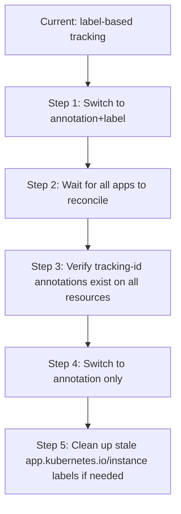

# How to Use argocd.argoproj.io/tracking-id Label

Author: [nawazdhandala](https://github.com/nawazdhandala)

Tags: ArgoCD, GitOps, Kubernetes, Labels, Resource Tracking

Description: Learn how the argocd.argoproj.io/tracking-id label works in ArgoCD for resource ownership tracking and how to configure annotation-based tracking.

---

Every resource that ArgoCD manages needs to be tracked back to the Application that owns it. The `argocd.argoproj.io/tracking-id` label (or annotation, depending on your tracking method) is the mechanism ArgoCD uses to establish this ownership link. Understanding how it works is critical for debugging resource conflicts, shared resource issues, and migration scenarios.

## How Resource Tracking Works in ArgoCD

When ArgoCD syncs an application, it needs to answer one fundamental question for every resource in the cluster: "Which ArgoCD Application owns this resource?" The tracking ID is how it answers that question.

ArgoCD supports three tracking methods:

1. **Label-based tracking** (legacy default) - Uses the `app.kubernetes.io/instance` label
2. **Annotation-based tracking** - Uses the `argocd.argoproj.io/tracking-id` annotation
3. **Annotation+Label tracking** - Uses both for backward compatibility

## The tracking-id Format

The tracking-id value follows a specific format:

```text
<application-name>:<group>/<kind>:<namespace>/<name>
```

For example:

```text
my-app:apps/Deployment:production/web-server
my-app:/Service:production/web-server-svc
my-app:networking.k8s.io/Ingress:production/web-ingress
```

For cluster-scoped resources (no namespace):

```text
my-app:rbac.authorization.k8s.io/ClusterRole:/my-cluster-role
```

## Label-Based Tracking (Legacy)

By default, ArgoCD uses the `app.kubernetes.io/instance` label to track resources:

```yaml
apiVersion: apps/v1
kind: Deployment
metadata:
  name: web-server
  labels:
    app.kubernetes.io/instance: my-app
spec:
  replicas: 3
  selector:
    matchLabels:
      app: web-server
  template:
    metadata:
      labels:
        app: web-server
    spec:
      containers:
        - name: web
          image: nginx:1.25
```

The problem with label-based tracking is that `app.kubernetes.io/instance` is a commonly used label in the Kubernetes ecosystem. Helm charts, operators, and other tools also use this label, leading to conflicts. If a Helm chart sets `app.kubernetes.io/instance: my-chart-release` and ArgoCD tries to set it to `my-app`, you get an immediate conflict.

## Annotation-Based Tracking

Annotation-based tracking solves the label conflict problem by using the ArgoCD-specific `argocd.argoproj.io/tracking-id` annotation instead:

```yaml
apiVersion: apps/v1
kind: Deployment
metadata:
  name: web-server
  annotations:
    argocd.argoproj.io/tracking-id: "my-app:apps/Deployment:production/web-server"
spec:
  replicas: 3
  selector:
    matchLabels:
      app: web-server
  template:
    metadata:
      labels:
        app: web-server
    spec:
      containers:
        - name: web
          image: nginx:1.25
```

Since this is an ArgoCD-specific annotation, it will not conflict with any other tooling.

## Configuring the Tracking Method

You configure the tracking method in the `argocd-cm` ConfigMap:

```yaml
apiVersion: v1
kind: ConfigMap
metadata:
  name: argocd-cm
  namespace: argocd
data:
  # Options: "label", "annotation", "annotation+label"
  application.resourceTrackingMethod: annotation
```

Here is what each method does:

### label (default)

```yaml
data:
  application.resourceTrackingMethod: label
```

Sets the `app.kubernetes.io/instance` label on managed resources. This is the legacy default and works fine if you do not have label conflicts.

### annotation

```yaml
data:
  application.resourceTrackingMethod: annotation
```

Uses only the `argocd.argoproj.io/tracking-id` annotation. Recommended for new installations or environments using Helm charts heavily.

### annotation+label

```yaml
data:
  application.resourceTrackingMethod: annotation+label
```

Sets both the annotation and the label. This is useful during migration from label-based to annotation-based tracking, as ArgoCD will read the annotation for tracking but still set the label for backward compatibility.

## Why Annotation-Based Tracking Is Recommended

Here is a practical example of why label-based tracking causes problems. Consider a Helm chart with these labels:

```yaml
# What the Helm chart template generates
apiVersion: apps/v1
kind: Deployment
metadata:
  name: {{ .Release.Name }}-app
  labels:
    app.kubernetes.io/instance: {{ .Release.Name }}
    app.kubernetes.io/name: my-chart
    helm.sh/chart: my-chart-1.0.0
```

When ArgoCD manages this with label-based tracking, it tries to overwrite `app.kubernetes.io/instance` with the ArgoCD application name. This creates a persistent diff and the application is always reported as OutOfSync.

With annotation-based tracking, the Helm chart labels remain untouched:

```yaml
apiVersion: apps/v1
kind: Deployment
metadata:
  name: release-app
  labels:
    # These stay as the Helm chart intended
    app.kubernetes.io/instance: release
    app.kubernetes.io/name: my-chart
    helm.sh/chart: my-chart-1.0.0
  annotations:
    # ArgoCD tracks via this annotation instead
    argocd.argoproj.io/tracking-id: "my-argo-app:apps/Deployment:default/release-app"
```

## Migrating Between Tracking Methods

Migrating from label-based to annotation-based tracking requires careful planning. Here is the recommended approach:



### Step 1: Switch to annotation+label

```yaml
apiVersion: v1
kind: ConfigMap
metadata:
  name: argocd-cm
  namespace: argocd
data:
  application.resourceTrackingMethod: annotation+label
```

### Step 2: Force refresh all applications

```bash
# List all applications and refresh them
for app in $(argocd app list -o name); do
  argocd app get "$app" --hard-refresh
done
```

### Step 3: Verify annotations are present

```bash
# Check a specific deployment for the tracking-id annotation
kubectl get deployment web-server -o jsonpath='{.metadata.annotations.argocd\.argoproj\.io/tracking-id}'

# Should output something like:
# my-app:apps/Deployment:default/web-server
```

### Step 4: Switch to annotation-only

Once you have verified all resources have the tracking-id annotation, switch to pure annotation-based tracking:

```yaml
data:
  application.resourceTrackingMethod: annotation
```

## Handling Shared Resources

The tracking-id becomes critically important when multiple applications reference the same resource. ArgoCD uses the tracking-id to determine ownership, and only one application can own a given resource.

If two applications try to manage the same resource:

```yaml
# Application A manages this namespace
apiVersion: v1
kind: Namespace
metadata:
  name: shared-namespace
  annotations:
    argocd.argoproj.io/tracking-id: "app-a:/Namespace:/shared-namespace"
```

If Application B also tries to manage the same namespace, ArgoCD will detect a conflict. You can handle this by:

1. Removing the resource from one application's source
2. Using the `FailOnSharedResource` sync option to prevent accidental overwrites
3. Designating one application as the owner and excluding the resource from others

## Debugging Tracking Issues

When resources appear in the wrong application or go missing, check the tracking information:

```bash
# Check the tracking-id annotation on a resource
kubectl get deployment web-server -n production \
  -o jsonpath='{.metadata.annotations.argocd\.argoproj\.io/tracking-id}'

# Check the app.kubernetes.io/instance label
kubectl get deployment web-server -n production \
  -o jsonpath='{.metadata.labels.app\.kubernetes\.io/instance}'

# List all resources tracked by a specific application
argocd app resources my-app

# Check for orphaned resources (tracked but app doesn't exist)
kubectl get all -A -l app.kubernetes.io/instance=deleted-app
```

## Common Issues and Fixes

**Resource shows in wrong application**: The tracking-id annotation points to a different application than expected. Force a sync on the correct application to reclaim ownership.

**Persistent OutOfSync on Helm charts**: Almost always caused by label-based tracking conflicting with Helm's own `app.kubernetes.io/instance` label. Switch to annotation-based tracking.

**Resource not tracked at all**: The resource was created manually or by another tool without ArgoCD involvement. Sync the application to have ArgoCD add the tracking information.

## Summary

The `argocd.argoproj.io/tracking-id` annotation is ArgoCD's mechanism for knowing which application owns which resource. While label-based tracking works for simple setups, annotation-based tracking is the recommended approach for any environment using Helm charts or multiple tools that interact with Kubernetes labels. The migration path through `annotation+label` makes switching safe and non-disruptive.
