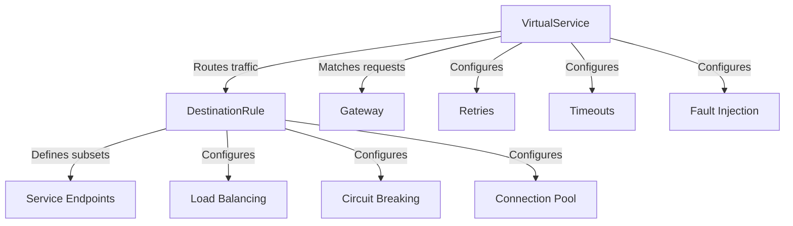

# How to Manage Traffic Policies with ArgoCD

Author: [nawazdhandala](https://github.com/nawazdhandala)

Tags: ArgoCD, GitOps, Kubernetes, Service Mesh, Traffic Management

Description: Learn how to manage service mesh traffic policies including routing rules, circuit breakers, retries, and load balancing through ArgoCD GitOps workflows.

---

Traffic policies define how requests flow between your services - routing rules, load balancing, circuit breaking, retries, and timeouts. In a service mesh like Istio, these policies are Kubernetes custom resources that ArgoCD can manage like any other manifest. The benefit is that your traffic configuration becomes version-controlled, reviewable, and automatically applied.

This guide covers managing all major traffic policy types through ArgoCD.

## Traffic Policy Architecture

Traffic policies in Istio are split across several resource types. Here is how they relate:



## Setting Up the Traffic Policies Application

Create a dedicated ArgoCD Application for traffic policies, separate from your service deployments:

```yaml
# traffic-policies-app.yaml
apiVersion: argoproj.io/v1alpha1
kind: Application
metadata:
  name: traffic-policies
  namespace: argocd
spec:
  project: networking
  source:
    repoURL: https://github.com/myorg/k8s-traffic-config.git
    path: policies
    targetRevision: main
    directory:
      recurse: true
  destination:
    server: https://kubernetes.default.svc
  syncPolicy:
    automated:
      selfHeal: true
      prune: true
    syncOptions:
      - ServerSideApply=true
      - ApplyOutOfSyncOnly=true
```

## Managing VirtualService Routing Rules

VirtualServices define how requests get routed to different versions of your services. This is the most common traffic policy.

```yaml
# policies/production/api-gateway-vs.yaml
apiVersion: networking.istio.io/v1beta1
kind: VirtualService
metadata:
  name: api-gateway
  namespace: production
spec:
  hosts:
    - api-gateway.production.svc.cluster.local
  http:
    # Route 90% to stable, 10% to canary
    - match:
        - headers:
            x-canary:
              exact: "true"
      route:
        - destination:
            host: api-gateway.production.svc.cluster.local
            subset: canary
    - route:
        - destination:
            host: api-gateway.production.svc.cluster.local
            subset: stable
          weight: 90
        - destination:
            host: api-gateway.production.svc.cluster.local
            subset: canary
          weight: 10
      retries:
        attempts: 3
        perTryTimeout: 2s
        retryOn: 5xx,reset,connect-failure
      timeout: 10s
```

The matching DestinationRule defines subsets and load balancing:

```yaml
# policies/production/api-gateway-dr.yaml
apiVersion: networking.istio.io/v1beta1
kind: DestinationRule
metadata:
  name: api-gateway
  namespace: production
spec:
  host: api-gateway.production.svc.cluster.local
  trafficPolicy:
    loadBalancer:
      simple: LEAST_REQUEST
    connectionPool:
      tcp:
        maxConnections: 100
        connectTimeout: 5s
      http:
        h2UpgradePolicy: DEFAULT
        maxRequestsPerConnection: 10
    outlierDetection:
      consecutive5xxErrors: 5
      interval: 30s
      baseEjectionTime: 30s
      maxEjectionPercent: 50
  subsets:
    - name: stable
      labels:
        version: stable
    - name: canary
      labels:
        version: canary
```

## Circuit Breaker Policies

Circuit breakers prevent cascading failures. Configure them in DestinationRules and manage them through ArgoCD:

```yaml
# policies/production/payment-service-dr.yaml
apiVersion: networking.istio.io/v1beta1
kind: DestinationRule
metadata:
  name: payment-service
  namespace: production
spec:
  host: payment-service.production.svc.cluster.local
  trafficPolicy:
    connectionPool:
      tcp:
        maxConnections: 50
        connectTimeout: 3s
      http:
        maxRequestsPerConnection: 5
        maxRetries: 3
        h2UpgradePolicy: DEFAULT
    outlierDetection:
      # Eject hosts after 3 consecutive 5xx errors
      consecutive5xxErrors: 3
      # Check every 10 seconds
      interval: 10s
      # Eject for at least 30 seconds
      baseEjectionTime: 30s
      # Never eject more than 30% of hosts
      maxEjectionPercent: 30
      # Also consider gateway errors
      consecutiveGatewayErrors: 3
```

## Rate Limiting with EnvoyFilter

For rate limiting, you typically need an EnvoyFilter. Manage this as part of your traffic policies:

```yaml
# policies/production/rate-limit-filter.yaml
apiVersion: networking.istio.io/v1alpha3
kind: EnvoyFilter
metadata:
  name: rate-limit
  namespace: production
spec:
  workloadSelector:
    labels:
      app: api-gateway
  configPatches:
    - applyTo: HTTP_FILTER
      match:
        context: SIDECAR_INBOUND
        listener:
          filterChain:
            filter:
              name: envoy.filters.network.http_connection_manager
      patch:
        operation: INSERT_BEFORE
        value:
          name: envoy.filters.http.local_ratelimit
          typed_config:
            "@type": type.googleapis.com/udpa.type.v1.TypedStruct
            type_url: type.googleapis.com/envoy.extensions.filters.http.local_ratelimit.v3.LocalRateLimit
            value:
              stat_prefix: http_local_rate_limiter
              token_bucket:
                max_tokens: 1000
                tokens_per_fill: 1000
                fill_interval: 60s
              filter_enabled:
                runtime_key: local_rate_limit_enabled
                default_value:
                  numerator: 100
                  denominator: HUNDRED
              filter_enforced:
                runtime_key: local_rate_limit_enforced
                default_value:
                  numerator: 100
                  denominator: HUNDRED
```

## Organizing Traffic Policies in Git

A clean directory structure keeps things manageable as your cluster grows:

```text
policies/
  production/
    api-gateway-vs.yaml
    api-gateway-dr.yaml
    payment-service-dr.yaml
    user-service-vs.yaml
    user-service-dr.yaml
    rate-limit-filter.yaml
  staging/
    api-gateway-vs.yaml
    api-gateway-dr.yaml
  shared/
    default-retry-policy.yaml
    default-timeout-policy.yaml
```

## Sync Waves for Traffic Policy Updates

When updating traffic policies alongside service deployments, ordering matters. Use sync waves to ensure policies are applied before new service versions roll out:

```yaml
# Service deployment - syncs first
apiVersion: apps/v1
kind: Deployment
metadata:
  name: api-gateway
  annotations:
    argocd.argoproj.io/sync-wave: "0"
# ...

---
# DestinationRule - syncs after deployment is ready
apiVersion: networking.istio.io/v1beta1
kind: DestinationRule
metadata:
  name: api-gateway
  annotations:
    argocd.argoproj.io/sync-wave: "1"
# ...

---
# VirtualService with traffic split - syncs last
apiVersion: networking.istio.io/v1beta1
kind: VirtualService
metadata:
  name: api-gateway
  annotations:
    argocd.argoproj.io/sync-wave: "2"
# ...
```

## Fault Injection for Testing

ArgoCD makes it easy to apply and remove fault injection rules for chaos testing:

```yaml
# policies/staging/fault-injection-test.yaml
apiVersion: networking.istio.io/v1beta1
kind: VirtualService
metadata:
  name: payment-service-fault-test
  namespace: staging
spec:
  hosts:
    - payment-service.staging.svc.cluster.local
  http:
    - fault:
        delay:
          percentage:
            value: 10
          fixedDelay: 5s
        abort:
          percentage:
            value: 5
          httpStatus: 503
      route:
        - destination:
            host: payment-service.staging.svc.cluster.local
```

Commit this file to apply fault injection, revert the commit to remove it. Everything is tracked in Git history.

## Health Checks for Traffic Policies

Add custom health checks in ArgoCD's config to track VirtualService and DestinationRule health:

```yaml
# argocd-cm ConfigMap addition
resource.customizations.health.networking.istio.io_VirtualService: |
  hs = {}
  if obj.spec ~= nil and obj.spec.http ~= nil then
    hs.status = "Healthy"
    hs.message = "VirtualService configured"
  else
    hs.status = "Degraded"
    hs.message = "VirtualService has no routes defined"
  end
  return hs
```

## Summary

Managing traffic policies through ArgoCD gives you version-controlled routing rules, circuit breakers, and rate limits. Every traffic change goes through a pull request, gets reviewed by your team, and is automatically applied by ArgoCD. Rollbacks are as simple as reverting a commit. Combined with sync waves for proper ordering and pre-sync hooks for validation, you get a safe and predictable traffic management workflow.
