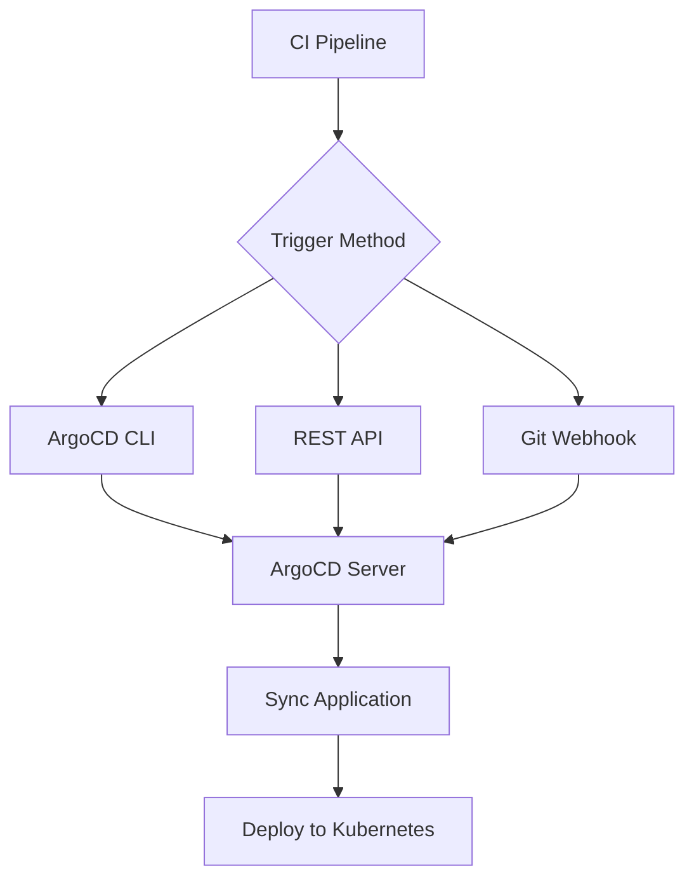

# How to Trigger ArgoCD Sync from CI Pipeline

Author: [nawazdhandala](https://github.com/nawazdhandala)

Tags: ArgoCD, GitOps, Kubernetes, CI/CD

Description: Learn how to trigger ArgoCD application syncs from CI pipelines using the CLI, REST API, and webhooks, with practical examples for GitHub Actions, GitLab CI, and Jenkins.

---

In a GitOps workflow, ArgoCD polls your Git repository on a regular interval to detect changes. By default, this polling happens every three minutes. But when your CI pipeline just built and pushed a new image, waiting three minutes feels like an eternity. This guide shows you how to trigger ArgoCD syncs immediately from your CI pipeline.

## Three Ways to Trigger Syncs

There are three primary methods to trigger an ArgoCD sync from CI:

1. **ArgoCD CLI** - Direct command-line interface calls
2. **REST API** - HTTP calls to the ArgoCD API server
3. **Git Webhooks** - Automatic detection via webhook notifications

Each has trade-offs in terms of setup complexity, security, and reliability.



## Method 1: Using the ArgoCD CLI

The ArgoCD CLI is the most straightforward way to trigger syncs. It handles authentication, retries, and provides clear output.

### Setup

First, create a CI service account in ArgoCD:

```bash
# Add a CI account to ArgoCD
kubectl patch configmap argocd-cm -n argocd --type merge -p '{
  "data": {
    "accounts.ci-pipeline": "apiKey"
  }
}'

# Grant sync permissions
kubectl patch configmap argocd-rbac-cm -n argocd --type merge -p '{
  "data": {
    "policy.csv": "p, ci-pipeline, applications, sync, */*, allow\np, ci-pipeline, applications, get, */*, allow\n"
  }
}'

# Generate a token
argocd account generate-token --account ci-pipeline
```

### GitHub Actions Example

```yaml
name: Deploy
on:
  push:
    branches: [main]

jobs:
  deploy:
    runs-on: ubuntu-latest
    steps:
      - uses: actions/checkout@v4

      - name: Build and push image
        run: |
          docker build -t myregistry.com/app:${GITHUB_SHA::7} .
          docker push myregistry.com/app:${GITHUB_SHA::7}

      - name: Update manifest repo
        run: |
          # Update image tag in manifest repo
          git clone https://${{ secrets.GH_TOKEN }}@github.com/org/k8s-manifests.git
          cd k8s-manifests
          sed -i "s|image: myregistry.com/app:.*|image: myregistry.com/app:${GITHUB_SHA::7}|" apps/myapp/deployment.yaml
          git add . && git commit -m "Update app to ${GITHUB_SHA::7}" && git push

      - name: Install ArgoCD CLI
        run: |
          curl -sSL -o argocd https://github.com/argoproj/argo-cd/releases/latest/download/argocd-linux-amd64
          chmod +x argocd
          sudo mv argocd /usr/local/bin/

      - name: Trigger ArgoCD sync
        env:
          ARGOCD_SERVER: ${{ secrets.ARGOCD_SERVER }}
          ARGOCD_AUTH_TOKEN: ${{ secrets.ARGOCD_TOKEN }}
        run: |
          # Trigger sync with auto-retry
          argocd app sync my-app \
            --server $ARGOCD_SERVER \
            --grpc-web \
            --force \
            --retry-limit 3
```

### GitLab CI Example

```yaml
# .gitlab-ci.yml
stages:
  - build
  - deploy

build:
  stage: build
  image: docker:latest
  services:
    - docker:dind
  script:
    - docker build -t myregistry.com/app:${CI_COMMIT_SHORT_SHA} .
    - docker push myregistry.com/app:${CI_COMMIT_SHORT_SHA}

deploy:
  stage: deploy
  image: argoproj/argocd:v2.10.0
  variables:
    ARGOCD_SERVER: argocd.example.com
  script:
    # Login using token (no password prompt)
    - argocd app sync my-app
        --auth-token $ARGOCD_TOKEN
        --server $ARGOCD_SERVER
        --grpc-web
    # Wait for sync to finish
    - argocd app wait my-app
        --auth-token $ARGOCD_TOKEN
        --server $ARGOCD_SERVER
        --grpc-web
        --health
        --timeout 300
```

### Jenkins Pipeline Example

```groovy
// Jenkinsfile
pipeline {
    agent any
    environment {
        ARGOCD_SERVER = credentials('argocd-server')
        ARGOCD_TOKEN = credentials('argocd-token')
    }
    stages {
        stage('Build') {
            steps {
                sh '''
                    docker build -t myregistry.com/app:${GIT_COMMIT[0..6]} .
                    docker push myregistry.com/app:${GIT_COMMIT[0..6]}
                '''
            }
        }
        stage('Deploy') {
            steps {
                sh '''
                    # Download ArgoCD CLI
                    curl -sSL -o argocd https://github.com/argoproj/argo-cd/releases/latest/download/argocd-linux-amd64
                    chmod +x argocd

                    # Trigger sync
                    ./argocd app sync my-app \
                        --server $ARGOCD_SERVER \
                        --auth-token $ARGOCD_TOKEN \
                        --grpc-web

                    # Wait for healthy state
                    ./argocd app wait my-app \
                        --server $ARGOCD_SERVER \
                        --auth-token $ARGOCD_TOKEN \
                        --grpc-web \
                        --health \
                        --timeout 300
                '''
            }
        }
    }
}
```

## Method 2: Using the REST API

When installing the ArgoCD CLI is not practical, use the REST API directly with curl.

```bash
# Trigger a sync via API
curl -X POST \
  -H "Authorization: Bearer $ARGOCD_TOKEN" \
  -H "Content-Type: application/json" \
  "https://$ARGOCD_SERVER/api/v1/applications/my-app/sync" \
  -d '{
    "revision": "HEAD",
    "prune": true,
    "strategy": {
      "apply": {
        "force": false
      }
    }
  }'
```

For a sync that targets specific resources only:

```bash
# Sync only the Deployment resource
curl -X POST \
  -H "Authorization: Bearer $ARGOCD_TOKEN" \
  -H "Content-Type: application/json" \
  "https://$ARGOCD_SERVER/api/v1/applications/my-app/sync" \
  -d '{
    "resources": [
      {
        "group": "apps",
        "kind": "Deployment",
        "name": "my-app",
        "namespace": "production"
      }
    ]
  }'
```

## Method 3: Git Webhooks

Webhooks are the recommended approach for most setups. Instead of your CI pipeline calling ArgoCD directly, configure the Git repository to notify ArgoCD of changes.

### GitHub Webhook Setup

Configure ArgoCD to accept webhooks:

```yaml
# argocd-cm ConfigMap
apiVersion: v1
kind: ConfigMap
metadata:
  name: argocd-cm
  namespace: argocd
data:
  webhook.github.secret: "my-webhook-secret"
```

Then add a webhook in your GitHub repository settings:
- Payload URL: `https://argocd.example.com/api/webhook`
- Content type: `application/json`
- Secret: `my-webhook-secret`
- Events: `Push events`

### GitLab Webhook Setup

```yaml
# argocd-cm ConfigMap
apiVersion: v1
kind: ConfigMap
metadata:
  name: argocd-cm
  namespace: argocd
data:
  webhook.gitlab.secret: "my-gitlab-secret"
```

## Refresh Before Sync

When you update manifests in Git and immediately trigger a sync, ArgoCD might not have detected the new commit yet. Always refresh first:

```bash
# Refresh the app to detect the latest commit, then sync
argocd app get my-app --refresh --server $ARGOCD_SERVER --grpc-web
argocd app sync my-app --server $ARGOCD_SERVER --grpc-web
```

Or via API:

```bash
# Hard refresh then sync
curl -s -H "Authorization: Bearer $ARGOCD_TOKEN" \
  "https://$ARGOCD_SERVER/api/v1/applications/my-app?refresh=hard"

# Small delay to let the refresh complete
sleep 5

curl -X POST -H "Authorization: Bearer $ARGOCD_TOKEN" \
  "https://$ARGOCD_SERVER/api/v1/applications/my-app/sync"
```

## Handling Sync Failures in CI

Your CI pipeline should handle sync failures gracefully:

```bash
#!/bin/bash
# trigger-sync.sh - Trigger sync with error handling
set -e

argocd app sync my-app \
  --server "$ARGOCD_SERVER" \
  --auth-token "$ARGOCD_TOKEN" \
  --grpc-web \
  --retry-limit 3 || {
    echo "Sync failed. Fetching application status..."
    argocd app get my-app \
      --server "$ARGOCD_SERVER" \
      --auth-token "$ARGOCD_TOKEN" \
      --grpc-web
    exit 1
  }

echo "Sync completed. Waiting for healthy state..."
argocd app wait my-app \
  --server "$ARGOCD_SERVER" \
  --auth-token "$ARGOCD_TOKEN" \
  --grpc-web \
  --health \
  --timeout 300 || {
    echo "Application did not become healthy within 5 minutes"
    argocd app get my-app \
      --server "$ARGOCD_SERVER" \
      --auth-token "$ARGOCD_TOKEN" \
      --grpc-web
    exit 1
  }

echo "Deployment successful!"
```

## Best Practices

1. **Always use `--grpc-web` flag** when calling ArgoCD from CI containers, as many network setups do not support native gRPC.

2. **Set appropriate timeouts** - Do not let your CI pipeline hang forever waiting for a sync. Use `--timeout` with reasonable values.

3. **Use refresh before sync** - Ensure ArgoCD has the latest Git state before triggering sync.

4. **Prefer webhooks for standard flows** - Only use CLI/API triggers when you need synchronous feedback in the pipeline.

5. **Log the sync result** - Always capture and display the sync outcome for debugging failed deployments.

For comprehensive deployment monitoring, you can combine ArgoCD sync triggers with [ArgoCD notifications](https://oneuptime.com/blog/post/2026-01-25-notifications-argocd/view) to keep your team informed about deployment status.
