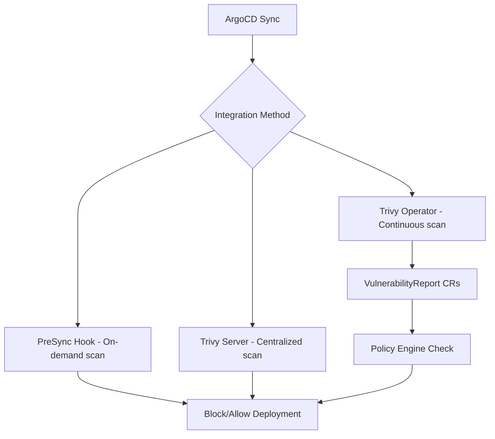

# How to Integrate Trivy Scanning with ArgoCD

Author: [nawazdhandala](https://github.com/nawazdhandala)

Tags: ArgoCD, GitOps, Kubernetes, Trivy, Security

Description: Learn how to integrate Aqua Trivy container image scanning with ArgoCD deployments using server mode, operator integration, and PreSync hooks for continuous vulnerability detection.

---

Trivy is one of the most popular open-source vulnerability scanners for container images, file systems, and Kubernetes configurations. Integrating it with ArgoCD creates a security-first deployment pipeline where every image is checked for vulnerabilities before it runs in your cluster. This guide covers multiple integration patterns, from simple PreSync hooks to full Trivy Operator deployment.

## Trivy Integration Architecture

There are several ways to integrate Trivy with ArgoCD, each with different trade-offs:



## Method 1: Trivy Server Deployment

Deploy a centralized Trivy server that all scan jobs can use. This avoids downloading the vulnerability database for every scan:

```yaml
# applications/trivy-server.yaml
apiVersion: argoproj.io/v1alpha1
kind: Application
metadata:
  name: trivy-server
  namespace: argocd
spec:
  project: security
  source:
    repoURL: https://aquasecurity.github.io/helm-charts/
    chart: trivy
    targetRevision: 0.7.0
    helm:
      values: |
        trivy:
          mode: server
        server:
          replicas: 2
          resources:
            requests:
              cpu: 500m
              memory: 2Gi
            limits:
              cpu: 2
              memory: 4Gi
        persistence:
          enabled: true
          size: 10Gi
          storageClass: gp3
        service:
          type: ClusterIP
          port: 4954
        # Cache vulnerability DB
        cacheDir: /home/scanner/.cache/trivy
        # Auto-update vulnerability DB
        dbUpdateInterval: 12h
  destination:
    server: https://kubernetes.default.svc
    namespace: trivy-system
  syncPolicy:
    automated:
      selfHeal: true
      prune: true
    syncOptions:
      - CreateNamespace=true
```

## PreSync Hook Using Trivy Server

With the server running, create lightweight scan jobs that query it:

```yaml
# hooks/trivy-presync-scan.yaml
apiVersion: batch/v1
kind: Job
metadata:
  name: trivy-scan-gate
  annotations:
    argocd.argoproj.io/hook: PreSync
    argocd.argoproj.io/hook-delete-policy: BeforeHookCreation
spec:
  template:
    spec:
      containers:
        - name: trivy-client
          image: aquasec/trivy:latest
          command:
            - /bin/sh
            - -c
            - |
              # Images to scan - update these with your actual images
              IMAGES="
              registry.example.com/frontend:v3.2.1
              registry.example.com/backend:v2.8.0
              registry.example.com/worker:v1.4.3
              "

              FAILED=0

              for IMAGE in $IMAGES; do
                echo "=========================================="
                echo "Scanning: $IMAGE"
                echo "=========================================="

                trivy image \
                  --server http://trivy-server.trivy-system:4954 \
                  --severity CRITICAL,HIGH \
                  --exit-code 0 \
                  --format table \
                  "$IMAGE"

                # Check for critical vulns separately to gate deployment
                CRITICAL_COUNT=$(trivy image \
                  --server http://trivy-server.trivy-system:4954 \
                  --severity CRITICAL \
                  --format json \
                  --quiet \
                  "$IMAGE" | jq '[.Results[]?.Vulnerabilities[]?] | length')

                if [ "$CRITICAL_COUNT" -gt "0" ]; then
                  echo "FAILED: $IMAGE has $CRITICAL_COUNT critical vulnerabilities"
                  FAILED=1
                else
                  echo "PASSED: $IMAGE has no critical vulnerabilities"
                fi
              done

              if [ "$FAILED" -eq "1" ]; then
                echo ""
                echo "Deployment BLOCKED: One or more images have critical vulnerabilities"
                exit 1
              fi

              echo ""
              echo "All images passed vulnerability scan"
      restartPolicy: Never
  backoffLimit: 1
```

## Method 2: Trivy Operator Integration

The Trivy Operator continuously scans workloads running in your cluster and creates VulnerabilityReport custom resources. Deploy it through ArgoCD:

```yaml
# applications/trivy-operator.yaml
apiVersion: argoproj.io/v1alpha1
kind: Application
metadata:
  name: trivy-operator
  namespace: argocd
spec:
  project: security
  source:
    repoURL: https://aquasecurity.github.io/helm-charts/
    chart: trivy-operator
    targetRevision: 0.21.0
    helm:
      values: |
        operator:
          vulnerabilityScannerEnabled: true
          configAuditScannerEnabled: true
          rbacAssessmentScannerEnabled: true
          scanJobTimeout: 10m
          scanJobTTL: 30m
        trivy:
          mode: ClientServer
          serverURL: http://trivy-server.trivy-system:4954
          severity: CRITICAL,HIGH,MEDIUM
          ignoreUnfixed: false
        compliance:
          failEntriesLimit: 10
        vulnerabilityReportsPlugin: Trivy
        scannerReportTTL: 24h
  destination:
    server: https://kubernetes.default.svc
    namespace: trivy-system
  syncPolicy:
    automated:
      selfHeal: true
      prune: true
```

## Querying VulnerabilityReports in PreSync

With the Trivy Operator running, you can check existing scan results instead of running a new scan:

```yaml
# hooks/check-vuln-reports.yaml
apiVersion: batch/v1
kind: Job
metadata:
  name: check-vulnerability-reports
  annotations:
    argocd.argoproj.io/hook: PreSync
    argocd.argoproj.io/hook-delete-policy: BeforeHookCreation
spec:
  template:
    spec:
      serviceAccountName: vuln-report-reader
      containers:
        - name: checker
          image: bitnami/kubectl:latest
          command:
            - /bin/sh
            - -c
            - |
              # Check for critical vulnerabilities in the namespace
              REPORTS=$(kubectl get vulnerabilityreports \
                -n default \
                -o json)

              CRITICAL_TOTAL=$(echo "$REPORTS" | \
                jq '[.items[].report.summary.criticalCount] | add // 0')

              HIGH_TOTAL=$(echo "$REPORTS" | \
                jq '[.items[].report.summary.highCount] | add // 0')

              echo "Vulnerability Summary:"
              echo "  Critical: $CRITICAL_TOTAL"
              echo "  High:     $HIGH_TOTAL"

              # List affected workloads
              echo ""
              echo "Affected workloads:"
              echo "$REPORTS" | jq -r '
                .items[] |
                select(.report.summary.criticalCount > 0) |
                "  \(.metadata.labels["trivy-operator.resource.name"]): \(.report.summary.criticalCount) critical"
              '

              if [ "$CRITICAL_TOTAL" -gt "0" ]; then
                echo ""
                echo "BLOCKED: $CRITICAL_TOTAL critical vulnerabilities found"
                exit 1
              fi

              echo "No critical vulnerabilities - deployment approved"
      restartPolicy: Never
  backoffLimit: 1
---
# RBAC for reading vulnerability reports
apiVersion: rbac.authorization.k8s.io/v1
kind: ClusterRole
metadata:
  name: vuln-report-reader
rules:
  - apiGroups: ["aquasecurity.github.io"]
    resources: ["vulnerabilityreports"]
    verbs: ["get", "list"]
---
apiVersion: rbac.authorization.k8s.io/v1
kind: ClusterRoleBinding
metadata:
  name: vuln-report-reader
roleRef:
  apiGroup: rbac.authorization.k8s.io
  kind: ClusterRole
  name: vuln-report-reader
subjects:
  - kind: ServiceAccount
    name: vuln-report-reader
    namespace: default
```

## Trivy Config Scanning for Kubernetes Manifests

Trivy can also scan your Kubernetes manifests for misconfigurations. Use this as a Git-side check:

```yaml
# hooks/config-scan.yaml
apiVersion: batch/v1
kind: Job
metadata:
  name: trivy-config-scan
  annotations:
    argocd.argoproj.io/hook: PreSync
    argocd.argoproj.io/hook-delete-policy: BeforeHookCreation
    argocd.argoproj.io/sync-wave: "-2"
spec:
  template:
    spec:
      containers:
        - name: config-scanner
          image: aquasec/trivy:latest
          command:
            - /bin/sh
            - -c
            - |
              apk add --no-cache git

              # Clone the config repo
              git clone --depth 1 https://github.com/your-org/k8s-configs.git /configs

              # Scan Kubernetes configs for misconfigurations
              trivy config \
                --severity CRITICAL,HIGH \
                --exit-code 1 \
                --format table \
                /configs/manifests/

              if [ $? -ne 0 ]; then
                echo "Configuration misconfigurations found!"
                exit 1
              fi

              echo "Configuration scan passed"
      restartPolicy: Never
  backoffLimit: 1
```

## Custom Trivy Ignore Rules

Create a `.trivyignore` file in your repository to suppress known false positives:

```text
# .trivyignore
# CVE-2024-1234 - mitigated by network policy, no fix available
CVE-2024-1234

# CVE-2024-5678 - affects unused feature, vendor acknowledged
CVE-2024-5678
```

Mount this file in your scan job:

```yaml
volumes:
  - name: trivy-config
    configMap:
      name: trivy-ignore-rules
---
# ConfigMap managed by ArgoCD
apiVersion: v1
kind: ConfigMap
metadata:
  name: trivy-ignore-rules
data:
  .trivyignore: |
    CVE-2024-1234
    CVE-2024-5678
```

## Scan Result Dashboard

For ongoing visibility, create a dashboard using the VulnerabilityReport data. Use [OneUptime](https://oneuptime.com) to track vulnerability trends and alert when new critical CVEs affect your running workloads.

## Notification Integration

Configure ArgoCD notifications to alert on scan failures:

```yaml
apiVersion: v1
kind: ConfigMap
metadata:
  name: argocd-notifications-cm
  namespace: argocd
data:
  template.trivy-scan-failed: |
    message: |
      Trivy vulnerability scan blocked deployment of {{.app.metadata.name}}.
      Check the PreSync job logs: kubectl logs -n {{.app.spec.destination.namespace}} -l job-name=trivy-scan-gate
    slack:
      attachments: |
        [{
          "color": "#E01E5A",
          "title": "Vulnerability Scan Failed: {{.app.metadata.name}}",
          "fields": [
            {"title": "Application", "value": "{{.app.metadata.name}}", "short": true},
            {"title": "Namespace", "value": "{{.app.spec.destination.namespace}}", "short": true}
          ]
        }]
```

## Summary

Integrating Trivy with ArgoCD can be done at multiple levels. A centralized Trivy server provides fast, cached scanning that PreSync hooks can leverage. The Trivy Operator adds continuous scanning with VulnerabilityReport CRDs that can be queried during sync decisions. Config scanning catches Kubernetes manifest issues before they are applied. The best approach combines all three: Trivy server for on-demand PreSync scans, the operator for continuous monitoring, and config scanning for catching misconfigurations in your GitOps repository.
