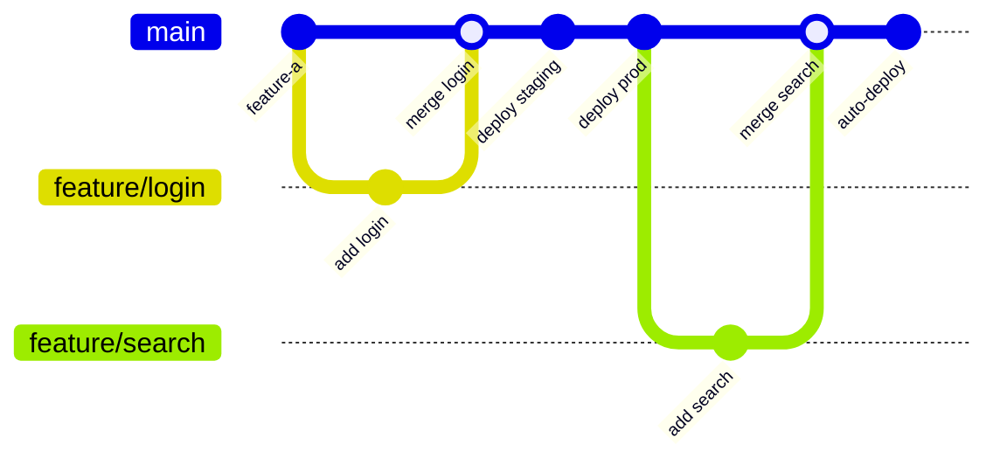

# How to Implement Trunk-Based Development with ArgoCD

Author: [nawazdhandala](https://github.com/nawazdhandala)

Tags: ArgoCD, GitOps, Kubernetes, Trunk-Based Development, CI/CD

Description: Learn how to implement trunk-based development with ArgoCD for continuous deployment, including branch strategies, environment promotion, and automated testing gates.

---

Trunk-based development is a branching strategy where developers commit small, frequent changes directly to the main branch (the "trunk"). When combined with ArgoCD and GitOps, this approach creates a powerful continuous deployment pipeline where every merge to main triggers a deployment. This guide shows you how to structure your repositories and ArgoCD configuration for trunk-based development.

## Why Trunk-Based Development with ArgoCD

Trunk-based development reduces merge conflicts, encourages smaller changes, and enables continuous integration. When paired with ArgoCD:

- Every commit to main is automatically deployed
- Short-lived feature branches are merged frequently
- Feature flags replace long-lived feature branches
- The deployment pipeline is simple and fast



## Repository Structure

In trunk-based development with ArgoCD, you typically use two repositories:

1. **Application repo** - Contains source code, merged to main frequently
2. **Manifest repo** - Contains Kubernetes manifests, updated by CI pipeline

```text
# Manifest repo structure
k8s-manifests/
  base/
    deployment.yaml
    service.yaml
    kustomization.yaml
  overlays/
    staging/
      kustomization.yaml     # Auto-deployed on every commit
    production/
      kustomization.yaml     # Deployed after staging validation
```

### Base Deployment

```yaml
# base/deployment.yaml
apiVersion: apps/v1
kind: Deployment
metadata:
  name: myapp
spec:
  replicas: 2
  selector:
    matchLabels:
      app: myapp
  template:
    metadata:
      labels:
        app: myapp
    spec:
      containers:
        - name: myapp
          image: myregistry.com/myapp:latest
          ports:
            - containerPort: 8080
          # Feature flags for trunk-based development
          env:
            - name: FEATURE_NEW_SEARCH
              value: "false"
            - name: FEATURE_NEW_CHECKOUT
              value: "false"
```

### Staging Overlay

```yaml
# overlays/staging/kustomization.yaml
apiVersion: kustomize.config.k8s.io/v1beta1
kind: Kustomization
namespace: staging
resources:
  - ../../base
images:
  - name: myregistry.com/myapp
    newTag: "latest"  # Updated by CI on every main branch commit
patches:
  - target:
      kind: Deployment
      name: myapp
    patch: |
      - op: replace
        path: /spec/replicas
        value: 1
      # Enable all feature flags in staging
      - op: replace
        path: /spec/template/spec/containers/0/env/0/value
        value: "true"
      - op: replace
        path: /spec/template/spec/containers/0/env/1/value
        value: "true"
```

### Production Overlay

```yaml
# overlays/production/kustomization.yaml
apiVersion: kustomize.config.k8s.io/v1beta1
kind: Kustomization
namespace: production
resources:
  - ../../base
images:
  - name: myregistry.com/myapp
    newTag: "stable"  # Only updated after staging validation
patches:
  - target:
      kind: Deployment
      name: myapp
    patch: |
      - op: replace
        path: /spec/replicas
        value: 3
      # Selectively enable features in production
      - op: replace
        path: /spec/template/spec/containers/0/env/0/value
        value: "true"
      - op: replace
        path: /spec/template/spec/containers/0/env/1/value
        value: "false"
```

## ArgoCD Application Configuration

### Staging Application (Auto-Sync)

Staging deploys automatically on every change to the main branch:

```yaml
# argocd-staging.yaml
apiVersion: argoproj.io/v1alpha1
kind: Application
metadata:
  name: myapp-staging
  namespace: argocd
spec:
  project: default
  source:
    repoURL: https://github.com/my-org/k8s-manifests.git
    targetRevision: main
    path: overlays/staging
  destination:
    server: https://kubernetes.default.svc
    namespace: staging
  syncPolicy:
    automated:
      prune: true
      selfHeal: true
    syncOptions:
      - CreateNamespace=true
    retry:
      limit: 3
      backoff:
        duration: 5s
        factor: 2
        maxDuration: 3m
```

### Production Application (Manual or Gated Sync)

Production requires explicit promotion:

```yaml
# argocd-production.yaml
apiVersion: argoproj.io/v1alpha1
kind: Application
metadata:
  name: myapp-production
  namespace: argocd
spec:
  project: default
  source:
    repoURL: https://github.com/my-org/k8s-manifests.git
    targetRevision: main
    path: overlays/production
  destination:
    server: https://kubernetes.default.svc
    namespace: production
  # No auto-sync - production requires explicit sync
  syncPolicy:
    syncOptions:
      - CreateNamespace=true
```

## CI Pipeline for Trunk-Based Development

The CI pipeline runs on every push to main. It builds the image, deploys to staging, runs tests, and optionally promotes to production.

```yaml
# .github/workflows/trunk-deploy.yml
name: Trunk Deploy
on:
  push:
    branches: [main]

jobs:
  build:
    runs-on: ubuntu-latest
    outputs:
      image-tag: ${{ steps.build.outputs.tag }}
    steps:
      - uses: actions/checkout@v4
      - name: Build and push
        id: build
        run: |
          TAG="${GITHUB_SHA::7}"
          docker build -t myregistry.com/myapp:$TAG .
          docker push myregistry.com/myapp:$TAG
          echo "tag=$TAG" >> $GITHUB_OUTPUT

  deploy-staging:
    needs: build
    runs-on: ubuntu-latest
    steps:
      - name: Update staging manifests
        env:
          TAG: ${{ needs.build.outputs.image-tag }}
        run: |
          git clone https://${{ secrets.GH_TOKEN }}@github.com/my-org/k8s-manifests.git
          cd k8s-manifests/overlays/staging
          kustomize edit set image myregistry.com/myapp=myregistry.com/myapp:$TAG
          git config user.email "ci@example.com"
          git config user.name "CI Bot"
          git add .
          git commit -m "staging: deploy myapp $TAG"
          git push origin main

      - name: Wait for staging sync
        env:
          ARGOCD_AUTH_TOKEN: ${{ secrets.ARGOCD_TOKEN }}
        run: |
          curl -sSL -o /usr/local/bin/argocd \
            https://github.com/argoproj/argo-cd/releases/latest/download/argocd-linux-amd64
          chmod +x /usr/local/bin/argocd
          argocd app get myapp-staging --refresh --grpc-web \
            --server ${{ secrets.ARGOCD_SERVER }}
          argocd app wait myapp-staging --grpc-web --health --timeout 300 \
            --server ${{ secrets.ARGOCD_SERVER }}

  integration-tests:
    needs: deploy-staging
    runs-on: ubuntu-latest
    steps:
      - uses: actions/checkout@v4
      - name: Run integration tests against staging
        run: |
          ./scripts/run-integration-tests.sh https://staging.myapp.example.com

  promote-production:
    needs: [build, integration-tests]
    runs-on: ubuntu-latest
    # Only auto-promote if on main branch
    if: github.ref == 'refs/heads/main'
    steps:
      - name: Update production manifests
        env:
          TAG: ${{ needs.build.outputs.image-tag }}
        run: |
          git clone https://${{ secrets.GH_TOKEN }}@github.com/my-org/k8s-manifests.git
          cd k8s-manifests/overlays/production
          kustomize edit set image myregistry.com/myapp=myregistry.com/myapp:$TAG
          git config user.email "ci@example.com"
          git config user.name "CI Bot"
          git add .
          git commit -m "production: promote myapp $TAG"
          git push origin main

      - name: Sync production
        env:
          ARGOCD_AUTH_TOKEN: ${{ secrets.ARGOCD_TOKEN }}
        run: |
          curl -sSL -o /usr/local/bin/argocd \
            https://github.com/argoproj/argo-cd/releases/latest/download/argocd-linux-amd64
          chmod +x /usr/local/bin/argocd
          argocd app sync myapp-production --grpc-web \
            --server ${{ secrets.ARGOCD_SERVER }}
          argocd app wait myapp-production --grpc-web --health --timeout 300 \
            --server ${{ secrets.ARGOCD_SERVER }}
```

## Feature Flags Pattern

Trunk-based development relies heavily on feature flags. Instead of hiding incomplete features in branches, deploy them behind flags:

```yaml
# ConfigMap for feature flags
apiVersion: v1
kind: ConfigMap
metadata:
  name: feature-flags
data:
  FEATURE_NEW_SEARCH: "true"
  FEATURE_NEW_CHECKOUT: "false"
  FEATURE_REDESIGN: "false"
```

Reference the ConfigMap in your deployment:

```yaml
spec:
  template:
    spec:
      containers:
        - name: myapp
          envFrom:
            - configMapRef:
                name: feature-flags
```

This lets you merge code to main continuously and control feature visibility through configuration rather than branches.

## Handling Rollbacks

With trunk-based development, rollbacks mean reverting to a previous Git commit or updating the image tag to a known-good version:

```bash
# Rollback by reverting the manifest change
cd k8s-manifests
git revert HEAD --no-edit
git push origin main
# ArgoCD will auto-sync the reverted state
```

Or via ArgoCD:

```bash
# Rollback using ArgoCD's built-in history
argocd app rollback myapp-production
```

## Best Practices

1. **Keep changes small** - Merge to main at least daily. Small changes are easier to review, test, and roll back.

2. **Use feature flags** - Hide incomplete features behind flags rather than using long-lived branches.

3. **Automate staging fully** - Staging should auto-deploy and auto-test on every commit to main.

4. **Gate production on tests** - Only promote to production after staging integration tests pass.

5. **Monitor actively** - Use [ArgoCD health checks](https://oneuptime.com/blog/post/2026-01-25-health-checks-argocd/view) and monitoring to detect issues quickly after deployment.

6. **Keep the pipeline fast** - The entire build-to-staging pipeline should complete in under 10 minutes to maintain the fast feedback loop that trunk-based development depends on.

Trunk-based development with ArgoCD creates a streamlined path from code commit to production deployment. The key is automating the staging path completely and gating production on validation.
