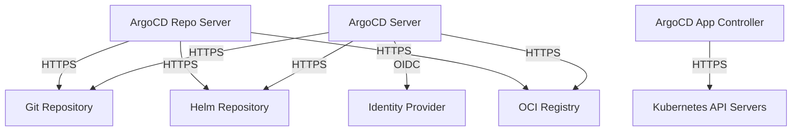

# How to Configure ArgoCD to Trust Custom CA Certificates

Author: [nawazdhandala](https://github.com/nawazdhandala)

Tags: ArgoCD, GitOps, Kubernetes, TLS, Security

Description: Learn how to configure ArgoCD to trust custom Certificate Authority certificates for connecting to private Git repositories, Helm registries, and internal services.

---

Enterprise environments almost always use private Certificate Authorities. Your Git server, Helm registry, container registry, and Kubernetes clusters all use certificates signed by an internal CA that ArgoCD does not trust by default. Every one of these connections will fail with "x509: certificate signed by unknown authority" until you tell ArgoCD to trust your CA.

This guide covers every method for adding custom CA trust to ArgoCD.

## Where CA Trust Matters in ArgoCD

ArgoCD makes TLS connections to several external services:



Each of these connections needs to trust the CA that signed the target server's certificate. If any of these use internal CAs, you need to add those CAs to ArgoCD's trust store.

## Method 1: The argocd-tls-certs-cm ConfigMap

The primary way to add trusted certificates in ArgoCD is the `argocd-tls-certs-cm` ConfigMap. This is the recommended approach for Git and Helm repository certificates.

```yaml
apiVersion: v1
kind: ConfigMap
metadata:
  name: argocd-tls-certs-cm
  namespace: argocd
data:
  # Key is the server hostname (without port)
  git.company.internal: |
    -----BEGIN CERTIFICATE-----
    MIIDxzCCAq+gAwIBAgIJALk8xGz1Ry0fMA0GCSqGSIb3DQEBCwUAMHkxCzAJ
    BgNVBAYTAlVTMRMwEQYDVQQIDApDYWxpZm9ybmlhMRYwFAYDVQQHDA1TYW4g
    ... (your CA certificate) ...
    -----END CERTIFICATE-----
  helm.company.internal: |
    -----BEGIN CERTIFICATE-----
    MIIDxzCCAq+gAwIBAgIJALk8xGz1Ry0fMA0GCSqGSIb3DQEBCwUAMHkxCzAJ
    ... (your CA certificate, can be the same CA) ...
    -----END CERTIFICATE-----
  registry.company.internal: |
    -----BEGIN CERTIFICATE-----
    ... (CA certificate for your container registry) ...
    -----END CERTIFICATE-----
```

Each key is a hostname, and the value is the PEM-encoded CA certificate (or certificate chain) for that hostname.

### Adding Certificates via CLI

```bash
# Add a CA certificate for a specific hostname
argocd cert add-tls git.company.internal --from /path/to/ca.crt

# List all trusted certificates
argocd cert list --cert-type https

# Remove a certificate
argocd cert rm --cert-type https git.company.internal
```

### Multiple CAs for the Same Host

If a server's certificate chain includes intermediate CAs, include the entire chain:

```yaml
data:
  git.company.internal: |
    -----BEGIN CERTIFICATE-----
    ... (Root CA) ...
    -----END CERTIFICATE-----
    -----BEGIN CERTIFICATE-----
    ... (Intermediate CA) ...
    -----END CERTIFICATE-----
```

## Method 2: Mount Custom CA Bundle into Pods

For CA trust that covers all connections (including OIDC providers, external APIs, etc.), mount a custom CA bundle into the ArgoCD pods.

### Create a ConfigMap with Your CA

```bash
kubectl create configmap custom-ca-certs \
  --from-file=company-ca.crt=/path/to/company-ca.crt \
  -n argocd
```

### Patch the ArgoCD Server Deployment

```yaml
apiVersion: apps/v1
kind: Deployment
metadata:
  name: argocd-server
  namespace: argocd
spec:
  template:
    spec:
      containers:
        - name: argocd-server
          env:
            # Tell Go to use this CA bundle
            - name: SSL_CERT_DIR
              value: /etc/ssl/certs
          volumeMounts:
            - name: custom-ca
              mountPath: /etc/ssl/certs/company-ca.crt
              subPath: company-ca.crt
              readOnly: true
      volumes:
        - name: custom-ca
          configMap:
            name: custom-ca-certs
```

Apply the same patch to the repo server and application controller:

```bash
# Patch all ArgoCD components
for deploy in argocd-server argocd-repo-server argocd-application-controller; do
  kubectl patch deployment $deploy -n argocd --type=json -p='[
    {
      "op": "add",
      "path": "/spec/template/spec/volumes/-",
      "value": {
        "name": "custom-ca",
        "configMap": {
          "name": "custom-ca-certs"
        }
      }
    },
    {
      "op": "add",
      "path": "/spec/template/spec/containers/0/volumeMounts/-",
      "value": {
        "name": "custom-ca",
        "mountPath": "/etc/ssl/certs/company-ca.crt",
        "subPath": "company-ca.crt",
        "readOnly": true
      }
    }
  ]'
done
```

## Method 3: Custom ArgoCD Image with CA Certificates

For air-gapped environments or when you want CA trust baked into the image:

```dockerfile
FROM quay.io/argoproj/argocd:v2.10.0

# Switch to root to install certificates
USER root

# Copy your CA certificates
COPY company-ca.crt /usr/local/share/ca-certificates/
RUN update-ca-certificates

# Switch back to ArgoCD user
USER argocd
```

Build and push this image, then reference it in your ArgoCD deployment:

```yaml
apiVersion: apps/v1
kind: Deployment
metadata:
  name: argocd-server
  namespace: argocd
spec:
  template:
    spec:
      containers:
        - name: argocd-server
          image: registry.company.internal/argocd-custom:v2.10.0
```

## Configuring CA Trust for OIDC/SSO

When your identity provider uses a certificate signed by an internal CA, ArgoCD needs to trust it for SSO login. The `argocd-tls-certs-cm` does not cover OIDC connections. Use the volume mount approach instead:

```yaml
# The OIDC provider hostname must be covered by the CA
# Mount the CA into the argocd-server pod

apiVersion: v1
kind: ConfigMap
metadata:
  name: argocd-cmd-params-cm
  namespace: argocd
data:
  # If using Dex, also configure Dex to trust the CA
  dex.server.tls.certificate: /etc/ssl/certs/custom-ca.crt
```

Also add the CA to the Dex server if you are using Dex for SSO:

```yaml
apiVersion: apps/v1
kind: Deployment
metadata:
  name: argocd-dex-server
  namespace: argocd
spec:
  template:
    spec:
      containers:
        - name: dex
          volumeMounts:
            - name: custom-ca
              mountPath: /etc/ssl/certs/company-ca.crt
              subPath: company-ca.crt
      volumes:
        - name: custom-ca
          configMap:
            name: custom-ca-certs
```

## Configuring CA Trust for Kubernetes Clusters

When registering external Kubernetes clusters that use internal CA certificates:

```bash
# The kubeconfig should embed the CA data
# ArgoCD uses this to trust the cluster's API server

# Register the cluster (CA is read from kubeconfig)
argocd cluster add my-cluster --kubeconfig /path/to/kubeconfig
```

Make sure the kubeconfig has embedded CA data:

```yaml
clusters:
  - cluster:
      # Embedded CA data (preferred)
      certificate-authority-data: LS0tLS1CRUdJTi...
      server: https://cluster.company.internal:6443
    name: my-cluster
```

If the kubeconfig references an external file, convert it:

```bash
# Convert file reference to embedded data
kubectl config view --flatten --kubeconfig /path/to/kubeconfig > /tmp/flat-kubeconfig
```

## Verifying CA Trust

### Test Git Repository Connection

```bash
# After adding the CA, test the repo connection
argocd repo add https://git.company.internal/myorg/myrepo \
  --username user \
  --password pass

# If it works, the CA is trusted
# If you get "x509: certificate signed by unknown authority", the CA is not trusted
```

### Test from Inside the Pod

```bash
# Exec into the ArgoCD server pod
kubectl exec -it deployment/argocd-server -n argocd -- bash

# Test connectivity to your Git server
curl -v https://git.company.internal

# Check if your CA is in the trust store
ls /etc/ssl/certs/ | grep company
```

### Check Certificate Chain

```bash
# From outside the cluster, verify the certificate chain
openssl s_client -connect git.company.internal:443 -showcerts </dev/null 2>/dev/null

# Verify against your CA
openssl s_client -connect git.company.internal:443 \
  -CAfile company-ca.crt </dev/null 2>/dev/null | \
  grep "Verify return code"
```

## Troubleshooting

### "x509: certificate signed by unknown authority"

This means ArgoCD cannot verify the certificate chain. Check:

1. Is the CA certificate in `argocd-tls-certs-cm`?
2. Does the hostname key match the server hostname exactly?
3. Is the certificate PEM-encoded and valid?
4. Is the full chain included (root + intermediates)?

### "x509: certificate is valid for X, not Y"

The hostname in the TLS handshake does not match the certificate. This is not a CA trust issue - the certificate needs to include the correct hostname in its SAN.

### Changes Not Taking Effect

- `argocd-tls-certs-cm` changes are picked up automatically (no restart needed)
- Volume-mounted CA changes require a pod restart
- Custom image changes require a new deployment

### Multiple CAs in the Organization

If different services use certificates from different CAs, add all CAs:

```yaml
apiVersion: v1
kind: ConfigMap
metadata:
  name: argocd-tls-certs-cm
  namespace: argocd
data:
  git.company.internal: |
    -----BEGIN CERTIFICATE-----
    ... (Git server CA) ...
    -----END CERTIFICATE-----
  helm.company.internal: |
    -----BEGIN CERTIFICATE-----
    ... (Helm server CA - might be different) ...
    -----END CERTIFICATE-----
```

## Summary

Configuring ArgoCD to trust custom CA certificates is essential in enterprise environments. Use `argocd-tls-certs-cm` for Git and Helm repository certificates (it is the simplest and does not require restarts), mount CA bundles into pods for OIDC and other connections, and embed CA data in kubeconfigs for cluster trust. Always verify trust works by testing connections from inside the ArgoCD pods, and make sure your certificate chains include all intermediate CAs.
