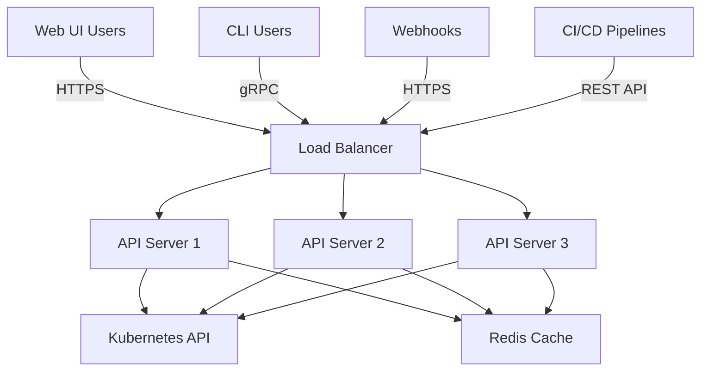

# How to Tune ArgoCD API Server for Many Users

Author: [nawazdhandala](https://github.com/nawazdhandala)

Tags: ArgoCD, GitOps, Kubernetes, Performance Tuning, API Server

Description: Learn how to scale and tune the ArgoCD API server to handle many concurrent users, improving UI responsiveness, CLI throughput, and API request latency.

---

The ArgoCD API server is the gateway for all human interactions with ArgoCD. It serves the web UI, handles CLI requests, processes webhook payloads, and provides the gRPC and REST APIs. When your team grows from a handful of engineers to dozens or hundreds, the API server becomes a bottleneck. Pages load slowly, CLI commands time out, and the UI feels unresponsive. This guide covers how to tune the API server for high user counts.

## How the API Server Handles Requests

The API server handles multiple types of traffic simultaneously.



The UI is particularly expensive because it opens a WebSocket connection that receives real-time updates about application state. Each connected browser tab maintains an active WebSocket, and each WebSocket causes the API server to watch Kubernetes resources.

## Scaling API Server Replicas

The first and most effective optimization is running multiple API server replicas.

```yaml
apiVersion: apps/v1
kind: Deployment
metadata:
  name: argocd-server
  namespace: argocd
spec:
  replicas: 3  # Scale up from default 1
  template:
    spec:
      containers:
      - name: argocd-server
        resources:
          requests:
            cpu: "1"
            memory: "1Gi"
          limits:
            cpu: "2"
            memory: "2Gi"
```

Each API server replica is stateless - it relies on Redis for session data and the Kubernetes API for application state. This means you can scale horizontally without any special configuration. Use a Horizontal Pod Autoscaler for dynamic scaling.

```yaml
apiVersion: autoscaling/v2
kind: HorizontalPodAutoscaler
metadata:
  name: argocd-server
  namespace: argocd
spec:
  scaleTargetRef:
    apiVersion: apps/v1
    kind: Deployment
    name: argocd-server
  minReplicas: 2
  maxReplicas: 10
  metrics:
  - type: Resource
    resource:
      name: cpu
      target:
        type: Utilization
        averageUtilization: 70
  - type: Resource
    resource:
      name: memory
      target:
        type: Utilization
        averageUtilization: 80
```

## Configuring gRPC and HTTP Limits

The API server uses gRPC internally and serves both gRPC and HTTP externally. You can tune connection limits and timeouts.

```yaml
apiVersion: apps/v1
kind: Deployment
metadata:
  name: argocd-server
  namespace: argocd
spec:
  template:
    spec:
      containers:
      - name: argocd-server
        args:
        - /usr/local/bin/argocd-server
        # Maximum number of gRPC connections
        - --server.max-concurrent-streams=100
```

On the Ingress or load balancer side, configure appropriate timeouts for WebSocket connections.

```yaml
# Nginx Ingress example
apiVersion: networking.k8s.io/v1
kind: Ingress
metadata:
  name: argocd-server
  namespace: argocd
  annotations:
    # WebSocket support
    nginx.ingress.kubernetes.io/websocket-services: "argocd-server"
    # Increase timeouts for long-lived connections
    nginx.ingress.kubernetes.io/proxy-read-timeout: "3600"
    nginx.ingress.kubernetes.io/proxy-send-timeout: "3600"
    # Connection limits per IP
    nginx.ingress.kubernetes.io/limit-connections: "50"
    # Request rate limiting
    nginx.ingress.kubernetes.io/limit-rps: "100"
spec:
  rules:
  - host: argocd.example.com
    http:
      paths:
      - path: /
        pathType: Prefix
        backend:
          service:
            name: argocd-server
            port:
              number: 443
```

## Optimizing RBAC Evaluation

Every API request triggers RBAC evaluation. With complex RBAC policies involving many projects and roles, this evaluation adds latency.

```yaml
# Simplify RBAC where possible
# argocd-rbac-cm ConfigMap
apiVersion: v1
kind: ConfigMap
metadata:
  name: argocd-rbac-cm
  namespace: argocd
data:
  # Use group-based policies instead of individual user policies
  policy.csv: |
    # Grant access to groups, not individual users
    p, role:developer, applications, get, */*, allow
    p, role:developer, applications, sync, */*, allow
    p, role:admin, applications, *, */*, allow

    # Map SSO groups to roles
    g, dev-team, role:developer
    g, platform-team, role:admin

  # Default policy for unauthenticated or unmapped users
  policy.default: role:readonly
```

Group-based policies are faster to evaluate than per-user policies because ArgoCD can resolve permissions in a single lookup rather than iterating through many rules.

## Reducing UI Resource Consumption

The ArgoCD UI is a single-page application that creates WebSocket connections for real-time updates. With many users, these WebSocket connections consume significant server resources.

```yaml
# argocd-cmd-params-cm ConfigMap
apiVersion: v1
kind: ConfigMap
metadata:
  name: argocd-cmd-params-cm
  namespace: argocd
data:
  # Disable the built-in UI if using ArgoCD CLI only
  # server.disable.auth: "false"

  # Enable gzip compression for UI assets
  server.enable.gzip: "true"
```

Enabling gzip compression reduces the bandwidth for UI assets, making initial page loads faster. For the WebSocket stream, the improvement is less significant because the data is already fairly compact.

### Using a CDN for Static Assets

For global teams, serve the ArgoCD UI's static assets through a CDN to reduce latency.

```yaml
# Nginx Ingress with caching for static assets
apiVersion: networking.k8s.io/v1
kind: Ingress
metadata:
  name: argocd-server
  annotations:
    nginx.ingress.kubernetes.io/configuration-snippet: |
      location ~* \.(js|css|png|jpg|jpeg|gif|ico|svg|woff|woff2)$ {
        expires 7d;
        add_header Cache-Control "public, immutable";
      }
```

## Session Management

When running multiple API server replicas, session management needs to work correctly. ArgoCD stores sessions in Redis, so sessions are shared across replicas by default.

```yaml
# argocd-cm ConfigMap
apiVersion: v1
kind: ConfigMap
metadata:
  name: argocd-cm
  namespace: argocd
data:
  # Session token expiration (default: 24h)
  # Shorter sessions reduce the session store size
  server.session.maxAge: "12h"
```

If users report being randomly logged out after you scale up the API server, verify that all replicas can reach Redis and that the `argocd-secret` is consistent across replicas.

## Rate Limiting API Requests

For environments where CI/CD pipelines heavily use the ArgoCD API, rate limiting prevents any single client from monopolizing resources.

```yaml
# Implement rate limiting at the Ingress level
apiVersion: networking.k8s.io/v1
kind: Ingress
metadata:
  name: argocd-server
  annotations:
    # Limit to 100 requests per second per IP
    nginx.ingress.kubernetes.io/limit-rps: "100"
    # Allow bursts up to 200
    nginx.ingress.kubernetes.io/limit-burst-multiplier: "2"
    # Return 429 when rate limited
    nginx.ingress.kubernetes.io/limit-req-status-code: "429"
```

For more granular control, consider putting an API gateway like Kong or Ambassador in front of ArgoCD.

## Monitoring API Server Performance

Track these metrics to understand API server health.

```promql
# Request latency by endpoint
histogram_quantile(0.95,
  rate(argocd_server_request_duration_seconds_bucket[5m])
)

# Active gRPC streams (WebSocket connections)
grpc_server_started_total - grpc_server_handled_total

# Request error rate
rate(argocd_server_request_total{code=~"5.."}[5m])

# Number of connected users (approximate)
argocd_server_active_sessions
```

If the 95th percentile request latency exceeds 2 seconds, the API server is under pressure. Add more replicas or investigate which endpoints are slow.

## Practical Scaling Guide

| Concurrent Users | API Server Replicas | CPU per Replica | Memory per Replica |
|-----------------|--------------------|-----------------|--------------------|
| 10 | 1 | 500m | 512Mi |
| 50 | 2 | 1 | 1Gi |
| 100 | 3 | 1 | 1Gi |
| 250 | 5 | 2 | 2Gi |
| 500+ | 5-10 (HPA) | 2 | 2Gi |

These numbers assume users are actively using the UI. CLI-only users consume fewer resources because they do not maintain persistent WebSocket connections.

## Summary

The ArgoCD API server is the easiest component to scale because it is stateless. Run multiple replicas behind a load balancer, enable gzip compression, use group-based RBAC policies, and implement rate limiting for API consumers. Monitor request latency and active connections to know when to scale. For teams larger than 100 engineers, use a Horizontal Pod Autoscaler to handle daily traffic patterns automatically.
