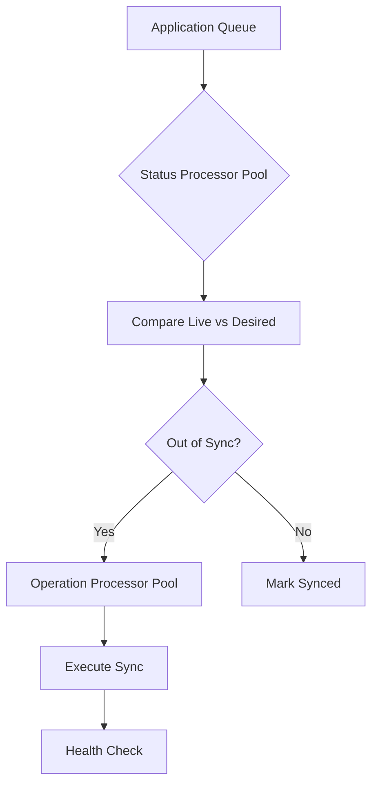

# How to Tune ArgoCD Controller for Large Application Counts

Author: [nawazdhandala](https://github.com/nawazdhandala)

Tags: ArgoCD, GitOps, Kubernetes, Performance Tuning, Scalability

Description: Learn how to tune the ArgoCD application controller to handle hundreds or thousands of applications without degrading sync performance or overwhelming your cluster.

---

When your ArgoCD instance manages more than a hundred applications, the default controller settings start to show their limits. Syncs take longer, the UI becomes sluggish, and you may notice applications stuck in a "Processing" state for minutes at a time. This guide explains how to tune the ArgoCD application controller specifically for environments with large application counts.

## How the Controller Works

The ArgoCD application controller runs a reconciliation loop. On each iteration, it picks up applications from an internal queue, compares their live state against their desired state, and triggers syncs when needed. The speed of this loop depends on several factors: the number of status processors, the number of operation processors, sharding configuration, and available compute resources.



With 500 applications and only 10 status processors, each reconciliation cycle takes much longer than necessary because most applications sit in the queue waiting.

## Increasing Status Processors

Status processors handle the comparison between live and desired state. This is the first thing to increase.

```yaml
apiVersion: apps/v1
kind: Deployment
metadata:
  name: argocd-application-controller
  namespace: argocd
spec:
  template:
    spec:
      containers:
      - name: argocd-application-controller
        args:
        - /usr/local/bin/argocd-application-controller
        # Default is 10, increase based on app count
        # Rule of thumb: 1 processor per 10 apps
        - --status-processors=100
        # Default is 10
        - --operation-processors=50
```

For 500 applications, setting `--status-processors` to 50-100 is reasonable. For 1000+ applications, consider 100-200 processors. Each processor runs as a goroutine, so the overhead is primarily CPU and memory on the controller pod, not additional pods.

## Increasing Operation Processors

Operation processors handle the actual sync execution. If you have many applications syncing simultaneously (for example, after a shared library update), the default 10 processors create a bottleneck.

```yaml
# Operation processors control concurrent syncs
# Default: 10
- --operation-processors=50
```

Set this to roughly half your status processor count. Operations are heavier than status checks because they involve applying resources to the cluster, so you want fewer of them running concurrently than status checks.

## Enabling Controller Sharding

For very large deployments (500+ applications), a single controller instance may not be enough regardless of processor counts. Controller sharding distributes applications across multiple controller replicas.

```yaml
apiVersion: apps/v1
kind: StatefulSet
metadata:
  name: argocd-application-controller
  namespace: argocd
spec:
  replicas: 3  # Run 3 controller shards
  template:
    spec:
      containers:
      - name: argocd-application-controller
        args:
        - /usr/local/bin/argocd-application-controller
        - --status-processors=50
        - --operation-processors=25
        env:
        # Enable sharding
        - name: ARGOCD_CONTROLLER_REPLICAS
          value: "3"
```

With sharding enabled, each controller replica is responsible for a subset of applications. The assignment is based on a hash of the application name, so it is deterministic and does not require coordination between replicas.

You can also use the `--sharding-method` flag to control how applications are distributed.

```yaml
# Available sharding methods
# round-robin: distributes evenly by app count
# legacy: hash-based (default)
- --sharding-method=round-robin
```

The `round-robin` method provides more even distribution, which is important if some applications are significantly more expensive to reconcile than others.

## Configuring Resource Limits

A controller processing hundreds of applications needs substantial CPU and memory. If the controller is resource-constrained, it will be slow regardless of processor counts.

```yaml
apiVersion: apps/v1
kind: Deployment
metadata:
  name: argocd-application-controller
  namespace: argocd
spec:
  template:
    spec:
      containers:
      - name: argocd-application-controller
        resources:
          requests:
            # Base: 500m per 100 apps
            cpu: "2"
            # Base: 1Gi per 100 apps
            memory: "4Gi"
          limits:
            cpu: "4"
            memory: "8Gi"
```

Monitor actual usage with Prometheus and adjust accordingly. The controller memory usage grows linearly with the number of applications and the number of resources in each application.

## Tuning Reconciliation Intervals

With many applications, you want to be careful about how frequently reconciliation runs. Too frequent means the controller never finishes one cycle before starting another.

```yaml
# argocd-cm ConfigMap
apiVersion: v1
kind: ConfigMap
metadata:
  name: argocd-cm
  namespace: argocd
data:
  # Increase for large app counts to reduce controller load
  # Default: 180s
  timeout.reconciliation: "300"
```

For large deployments, increasing the reconciliation interval to 5 minutes (300s) reduces the steady-state load on the controller. Combine this with webhooks so that actual changes are still detected immediately.

## Adjusting the kubectl Parallelism Limit

When the controller syncs an application, it uses kubectl to apply resources. The default parallelism limit is quite conservative.

```yaml
# Default: 1 (sequential kubectl operations)
- --kubectl-parallelism-limit=20
```

Setting this to 20 means the controller can apply up to 20 resources concurrently during a single sync. This makes a huge difference for applications with many resources - a Helm chart that produces 50 resources will sync 20x faster.

## Using Server-Side Apply

Server-side apply offloads the merge logic to the Kubernetes API server, which is more efficient for large resources and reduces client-side CPU usage.

```yaml
# Enable server-side apply globally
apiVersion: v1
kind: ConfigMap
metadata:
  name: argocd-cm
  namespace: argocd
data:
  # Enable server-side apply
  application.sync.serverSideApply: "true"
```

Or enable it per-application in the sync policy.

```yaml
apiVersion: argoproj.io/v1alpha1
kind: Application
metadata:
  name: my-app
spec:
  syncPolicy:
    syncOptions:
    - ServerSideApply=true
```

Server-side apply also eliminates the "too large" error that occurs when annotations exceed the 262144-byte limit on client-side apply.

## Monitoring Controller Performance

Track these Prometheus metrics to understand controller behavior at scale.

```promql
# Queue depth - should stay low
argocd_app_reconcile_pending

# Reconciliation time per app
histogram_quantile(0.95,
  rate(argocd_app_reconcile_duration_seconds_bucket[5m])
)

# Number of apps in each sync status
argocd_app_info{sync_status="OutOfSync"}

# Controller workqueue depth
workqueue_depth{name="app_operation_processing_queue"}
```

If the reconciliation queue depth is consistently growing, the controller cannot keep up. Either increase processors, add shards, or increase the reconciliation interval.

## Practical Scaling Guide

Here is a reference table for controller settings based on application count.

| App Count | Status Processors | Op Processors | Shards | CPU (per shard) | Memory (per shard) |
|-----------|------------------|---------------|--------|-----------------|-------------------|
| 50 | 20 | 10 | 1 | 500m | 1Gi |
| 200 | 50 | 25 | 1 | 1 | 2Gi |
| 500 | 50 | 25 | 2 | 2 | 4Gi |
| 1000 | 100 | 50 | 3 | 2 | 4Gi |
| 2000+ | 100 | 50 | 5+ | 4 | 8Gi |

These are starting points. Profile your actual workload because the complexity of individual applications varies significantly. An application with 5 resources is much cheaper than one with 500 resources.

## Avoiding Common Mistakes

One frequent mistake is increasing processor counts without providing enough CPU. Each processor is a goroutine that actively computes diffs, so high processor counts without proportional CPU just causes contention.

Another mistake is running too many shards for a small number of applications. Sharding has overhead for coordination, and if each shard only handles 20 applications, the overhead may outweigh the benefit.

Finally, do not forget that the repo server and Redis also need to scale alongside the controller. A tuned controller that is waiting on a slow repo server will not show improvement. See our guide on [tuning the ArgoCD repo server](https://oneuptime.com/blog/post/2026-02-26-argocd-tune-repo-server-large-repos/view) for the repo server side.
