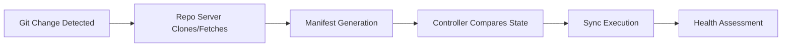

# How to Tune ArgoCD for Fastest Sync Times

Author: [nawazdhandala](https://github.com/nawazdhandala)

Tags: ArgoCD, GitOps, Kubernetes, Performance Tuning, DevOps

Description: Learn how to tune ArgoCD for the fastest possible sync times by optimizing controller settings, repo server caching, webhook triggers, and manifest generation pipelines.

---

ArgoCD sync times can vary dramatically depending on how you configure the system. Out of the box, ArgoCD uses conservative defaults that prioritize stability over speed. If you are running hundreds of applications or need near-instant deployments, those defaults will feel painfully slow. This guide walks through every lever you can pull to make ArgoCD sync as fast as possible.

## Understanding the Sync Pipeline

Before tuning anything, you need to understand what happens during a sync. The process involves multiple components, and each one adds latency.



Each step in this pipeline can be optimized independently. The biggest gains usually come from reducing the time between a Git change and when ArgoCD notices it, followed by optimizing manifest generation.

## Step 1: Enable Webhooks Instead of Polling

By default, ArgoCD polls Git repositories every 3 minutes. That means on average, you wait 90 seconds before ArgoCD even notices a change. Webhooks eliminate this delay entirely.

Configure a webhook in your Git provider that points to your ArgoCD API server.

```yaml
# ArgoCD webhook endpoint
# GitHub: https://argocd.example.com/api/webhook
# GitLab: https://argocd.example.com/api/webhook
# Bitbucket: https://argocd.example.com/api/webhook

# In your argocd-cm ConfigMap, ensure webhook is not disabled
apiVersion: v1
kind: ConfigMap
metadata:
  name: argocd-cm
  namespace: argocd
data:
  # Do NOT set this to "true" - it disables webhooks
  # webhook.disable: "false"

  # Optional: restrict webhook payloads to specific IPs
  webhook.github.secret: "your-webhook-secret"
```

With webhooks, ArgoCD detects changes within seconds of a push.

## Step 2: Reduce the Reconciliation Interval

Even with webhooks, ArgoCD runs periodic reconciliation to catch any drift. The default interval is 3 minutes (`180s`). For faster detection of manual cluster changes, lower this value.

```yaml
# In argocd-cm ConfigMap
apiVersion: v1
kind: ConfigMap
metadata:
  name: argocd-cm
  namespace: argocd
data:
  # Reduce from default 180s to 60s for faster drift detection
  timeout.reconciliation: "60"
```

Be cautious here - setting this too low increases load on the controller and Git server. For most teams, 60 seconds is a good balance.

## Step 3: Tune the Application Controller

The application controller is the heart of ArgoCD. It compares live state against desired state and triggers syncs. Several flags directly affect speed.

```yaml
# argocd-application-controller deployment
apiVersion: apps/v1
kind: Deployment
metadata:
  name: argocd-application-controller
  namespace: argocd
spec:
  template:
    spec:
      containers:
      - name: argocd-application-controller
        args:
        - /usr/local/bin/argocd-application-controller
        # Process more apps simultaneously (default: 10)
        - --status-processors=50
        # Run more sync operations in parallel (default: 10)
        - --operation-processors=25
        # Increase the number of kubectl operations (default: 1)
        - --kubectl-parallelism-limit=20
        # Self-heal check interval (default: 5s)
        - --self-heal-timeout-seconds=3
```

The `--status-processors` flag controls how many applications the controller evaluates concurrently. If you have 500 applications but only 10 status processors, most of them are waiting in a queue. Bumping this to 50 or higher dramatically reduces latency for large deployments.

The `--operation-processors` flag controls how many syncs run in parallel. If you frequently deploy multiple apps at once, increase this value.

## Step 4: Optimize the Repo Server

The repo server is responsible for cloning repositories and generating manifests. It is often the biggest bottleneck.

```yaml
# argocd-repo-server deployment
apiVersion: apps/v1
kind: Deployment
metadata:
  name: argocd-repo-server
  namespace: argocd
spec:
  replicas: 3  # Run multiple replicas for parallelism
  template:
    spec:
      containers:
      - name: argocd-repo-server
        args:
        - /usr/local/bin/argocd-repo-server
        # Increase parallelism for manifest generation (default: 0 = unlimited)
        - --parallelism-limit=0
        env:
        # Cache manifests longer to avoid regeneration
        - name: ARGOCD_EXEC_TIMEOUT
          value: "180"
        resources:
          requests:
            cpu: "2"
            memory: "2Gi"
          limits:
            cpu: "4"
            memory: "4Gi"
```

Increasing the repo server replica count is one of the most impactful changes you can make. Each replica handles manifest generation independently, so three replicas can process three applications simultaneously.

## Step 5: Increase Manifest Cache Duration

ArgoCD caches generated manifests to avoid regenerating them on every reconciliation. The default cache duration is tied to the reconciliation interval. You can extend it.

```yaml
# argocd-cm ConfigMap
apiVersion: v1
kind: ConfigMap
metadata:
  name: argocd-cm
  namespace: argocd
data:
  # Cache repo information longer (default: 180s)
  reposerver.repo.cache.expiration: "300s"
```

Longer cache durations mean fewer calls to the repo server, but they also mean changes take longer to appear if webhooks are not working.

## Step 6: Use Shallow Clones

For large Git repositories, the initial clone can take minutes. Shallow clones fetch only the latest commit, which is usually all ArgoCD needs.

```yaml
# In your Application spec
apiVersion: argoproj.io/v1alpha1
kind: Application
metadata:
  name: my-app
spec:
  source:
    repoURL: https://github.com/org/repo.git
    targetRevision: HEAD
    # ArgoCD uses shallow clones by default for non-annotated tags
    # Ensure your targetRevision supports shallow cloning
```

ArgoCD performs shallow clones by default in recent versions, but if you are using specific commit SHAs as target revisions, it may need to fetch more history. Prefer branch references or tags when possible.

## Step 7: Pre-generate Manifests

If you use Helm or Kustomize, manifest generation itself takes time. Consider pre-rendering manifests in your CI pipeline and storing plain YAML in Git.

```bash
# In your CI pipeline
helm template my-app ./charts/my-app \
  --values values-production.yaml \
  --namespace production > manifests/production/my-app.yaml

# Commit the rendered manifests
git add manifests/
git commit -m "Render production manifests"
git push
```

ArgoCD processes plain YAML manifests much faster than it generates them from Helm charts. The tradeoff is that you lose Helm's ability to pass values at deploy time.

## Step 8: Configure Resource-Level Tracking

ArgoCD supports different tracking methods for resources. The `annotation` tracking method is faster than the default `label` method for large applications.

```yaml
# argocd-cm ConfigMap
apiVersion: v1
kind: ConfigMap
metadata:
  name: argocd-cm
  namespace: argocd
data:
  application.resourceTrackingMethod: annotation
```

The annotation method uses a JSON annotation on each resource instead of labels. It handles resources with the same name across different applications more efficiently.

## Putting It All Together

Here is a summary of the settings that have the biggest impact on sync speed, ranked by effectiveness.

| Setting | Default | Recommended | Impact |
|---------|---------|-------------|--------|
| Webhooks | Polling (3m) | Enabled | Eliminates polling delay |
| Status processors | 10 | 50+ | Faster app evaluation |
| Repo server replicas | 1 | 3+ | Parallel manifest gen |
| Operation processors | 10 | 25+ | Parallel syncs |
| Reconciliation interval | 180s | 60s | Faster drift detection |
| kubectl parallelism | 1 | 20 | Faster resource apply |

## Benchmarking Your Changes

After making changes, measure the impact. ArgoCD exports Prometheus metrics that tell you exactly where time is spent.

```bash
# Key metrics to monitor
# Time from git commit to sync completion
argocd_app_sync_total

# Controller queue depth - should stay low
argocd_app_reconcile_count

# Repo server request duration
argocd_git_request_duration_seconds

# Manifest generation time
argocd_repo_server_request_duration_seconds
```

Track these metrics before and after each change to quantify the improvement.

## Common Pitfalls

Aggressive tuning can cause problems. Watch for these issues.

First, setting `--status-processors` too high can overwhelm the Kubernetes API server. Monitor API server latency and throttling errors.

Second, too many repo server replicas without enough CPU will actually slow things down due to context switching and resource contention.

Third, very short reconciliation intervals combined with many applications can create a thundering herd effect where every application tries to reconcile simultaneously.

Start with the webhook change, then increase processors, then add repo server replicas. Measure after each change and stop when sync times meet your requirements.

For more on monitoring ArgoCD health, check out our guide on [monitoring ArgoCD with Prometheus and Grafana](https://oneuptime.com/blog/post/2026-02-26-argocd-monitor-reduce-memory-footprint/view).
