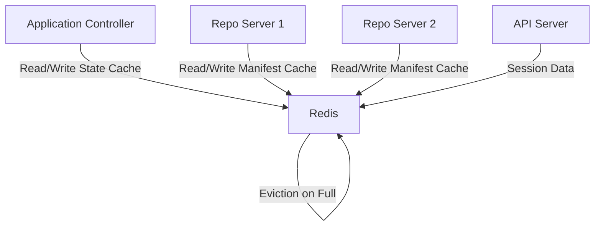

# How to Tune ArgoCD Redis for High Throughput

Author: [nawazdhandala](https://github.com/nawazdhandala)

Tags: ArgoCD, GitOps, Kubernetes, Redis, Performance Tuning

Description: Learn how to tune ArgoCD's Redis instance for high throughput environments with large application counts, including memory management, persistence, and clustering strategies.

---

Redis is a critical component of ArgoCD that often gets overlooked during performance tuning. It serves as the caching layer for manifest data, application state, and the repo server's operation results. When Redis is slow or memory-constrained, every other component in ArgoCD suffers. This guide covers how to properly tune Redis for high-throughput ArgoCD deployments.

## What Redis Does in ArgoCD

ArgoCD uses Redis for three primary purposes.

First, it caches generated manifests from the repo server. When the controller asks for manifests that were recently generated, Redis serves them instantly instead of requiring another clone and generation cycle.

Second, it stores live state cache data. The controller caches the current state of Kubernetes resources in Redis to avoid repeatedly querying the Kubernetes API server.

Third, it handles the repo server's lock coordination. When multiple repo server replicas exist, Redis coordinates which replica handles which repository to avoid duplicate work.



## Increasing Redis Memory

The default Redis deployment in ArgoCD often has conservative memory limits. For large deployments, you need to increase them significantly.

```yaml
apiVersion: apps/v1
kind: Deployment
metadata:
  name: argocd-redis
  namespace: argocd
spec:
  template:
    spec:
      containers:
      - name: redis
        args:
        - redis-server
        # Set max memory based on your workload
        - --maxmemory=2gb
        # Eviction policy - allkeys-lru is best for caching
        - --maxmemory-policy=allkeys-lru
        # Save memory on small aggregates
        - --activedefrag=yes
        resources:
          requests:
            cpu: "500m"
            memory: "2Gi"
          limits:
            cpu: "2"
            memory: "3Gi"
```

The `--maxmemory-policy=allkeys-lru` setting is crucial. It tells Redis to evict the least recently used keys when memory is full, which is the correct behavior for a cache. Without this, Redis will stop accepting writes when full, causing ArgoCD errors.

### Memory Sizing Guide

Use this formula to estimate the memory you need.

```
Base memory: 256MB
Per application: ~2-5MB (depending on manifest size)
Per repository: ~10-50MB (depending on repo size)

Example: 500 apps across 20 repos
= 256MB + (500 * 3MB) + (20 * 25MB)
= 256MB + 1500MB + 500MB
= ~2.3GB
```

This is approximate. Monitor actual usage and adjust.

## Configuring Connection Pooling

ArgoCD components maintain connections to Redis. For large deployments, the default connection settings may not be enough.

```yaml
# Redis server configuration
args:
- redis-server
- --maxmemory=2gb
- --maxmemory-policy=allkeys-lru
# Maximum number of connected clients (default: 10000)
- --maxclients=20000
# TCP keepalive to detect dead connections (seconds)
- --tcp-keepalive=300
# Timeout for idle connections (0 = no timeout)
- --timeout=300
```

On the ArgoCD side, you can configure the Redis connection in the `argocd-cm` ConfigMap.

```yaml
apiVersion: v1
kind: ConfigMap
metadata:
  name: argocd-cm
  namespace: argocd
data:
  # Redis connection URL
  redis.server: "argocd-redis:6379"
  # Optional: connection pool size per ArgoCD component
```

## Tuning Redis Persistence

By default, ArgoCD's Redis does not use persistence because it is purely a cache. This is correct for most deployments - if Redis restarts, ArgoCD simply regenerates the cached data.

However, if Redis restarts are causing significant performance dips (because everything must be regenerated), you can enable RDB snapshots.

```yaml
args:
- redis-server
- --maxmemory=2gb
- --maxmemory-policy=allkeys-lru
# Enable RDB snapshots
# Save after 900 seconds if at least 1 key changed
- --save=900 1
# Save after 300 seconds if at least 100 keys changed
- --save=300 100
# Disable AOF (not needed for caching)
- --appendonly=no
```

The tradeoff is that RDB snapshots consume CPU and create a temporary memory spike (Redis forks to write the snapshot). For pure caching workloads, it is usually better to skip persistence and accept the cold-start penalty.

## Using Redis Sentinel for High Availability

For production deployments where Redis downtime directly impacts ArgoCD functionality, use Redis Sentinel for automatic failover.

```yaml
# Deploy Redis with Sentinel using Bitnami Helm chart
# helm install argocd-redis bitnami/redis \
#   --set sentinel.enabled=true \
#   --set replica.replicaCount=3 \
#   --namespace argocd

# Configure ArgoCD to use Sentinel
apiVersion: v1
kind: ConfigMap
metadata:
  name: argocd-cm
  namespace: argocd
data:
  redis.server: "argocd-redis-node-0.argocd-redis-headless:26379,argocd-redis-node-1.argocd-redis-headless:26379,argocd-redis-node-2.argocd-redis-headless:26379"
```

Alternatively, configure Sentinel in the `argocd-cmd-params-cm` ConfigMap.

```yaml
apiVersion: v1
kind: ConfigMap
metadata:
  name: argocd-cmd-params-cm
  namespace: argocd
data:
  redis.server: "argocd-redis"
  redis.sentinelMasterName: "mymaster"
  redis.sentinelAddresses: "argocd-redis-node-0:26379,argocd-redis-node-1:26379,argocd-redis-node-2:26379"
```

## Optimizing Key Expiration

ArgoCD sets TTLs on cached keys. You can influence how long data stays cached through the `argocd-cm` ConfigMap.

```yaml
apiVersion: v1
kind: ConfigMap
metadata:
  name: argocd-cm
  namespace: argocd
data:
  # Repo cache expiration (default: 24h)
  reposerver.repo.cache.expiration: "48h"

  # OIDC cache expiration
  oidc.cache.expiration: "3h"
```

Longer cache expiration means fewer cache misses, but also means stale data lives longer. This is fine if you use webhooks to invalidate caches on actual changes.

## Reducing Memory Fragmentation

Redis can suffer from memory fragmentation, especially under high churn workloads where keys are constantly created and deleted.

```yaml
args:
- redis-server
- --maxmemory=2gb
- --maxmemory-policy=allkeys-lru
# Enable active defragmentation
- --activedefrag=yes
- --active-defrag-enabled=yes
# Start defrag when fragmentation ratio exceeds 1.1
- --active-defrag-threshold-lower=10
# Use up to 25% CPU for defrag
- --active-defrag-cycle-max=25
```

Active defragmentation reorganizes memory in the background to reduce wasted space. It uses some CPU but prevents the gradual memory bloat that can occur over time.

## Monitoring Redis Performance

Set up monitoring to detect Redis issues before they affect ArgoCD.

```yaml
# Deploy Redis Exporter alongside Redis
apiVersion: apps/v1
kind: Deployment
metadata:
  name: argocd-redis
  namespace: argocd
spec:
  template:
    spec:
      containers:
      - name: redis
        # ... redis config ...
      - name: redis-exporter
        image: oliver006/redis_exporter:latest
        ports:
        - containerPort: 9121
        env:
        - name: REDIS_ADDR
          value: "redis://localhost:6379"
```

Key metrics to monitor.

```promql
# Memory usage
redis_memory_used_bytes

# Memory fragmentation ratio (should be close to 1.0)
redis_memory_fragmentation_ratio

# Cache hit rate
rate(redis_keyspace_hits_total[5m]) /
(rate(redis_keyspace_hits_total[5m]) + rate(redis_keyspace_misses_total[5m]))

# Connected clients
redis_connected_clients

# Evicted keys per second (high means memory is too low)
rate(redis_evicted_keys_total[5m])
```

If the eviction rate is high, you are losing cached data before it can be used. Increase `--maxmemory` or add more repo server replicas to distribute the cache load.

## When to Use External Redis

For very large deployments (1000+ applications), consider using a managed Redis service instead of running Redis inside the cluster.

Benefits of external Redis include: automatic failover, managed backups, better monitoring, and the ability to scale independently of the ArgoCD namespace. AWS ElastiCache, Google Memorystore, and Azure Cache for Redis all work well with ArgoCD.

```yaml
# Point ArgoCD to external Redis
apiVersion: v1
kind: ConfigMap
metadata:
  name: argocd-cmd-params-cm
  namespace: argocd
data:
  redis.server: "my-redis-cluster.abcdef.0001.use1.cache.amazonaws.com:6379"
```

If your external Redis requires authentication, store the password in a Kubernetes secret.

```yaml
apiVersion: v1
kind: Secret
metadata:
  name: argocd-redis
  namespace: argocd
type: Opaque
stringData:
  auth: "your-redis-password"
```

## Summary

Redis tuning for ArgoCD comes down to three priorities: enough memory, proper eviction policy, and appropriate monitoring. Most issues stem from running out of memory or using a suboptimal eviction policy. Start with the memory sizing formula, set `allkeys-lru` as the eviction policy, and monitor the hit rate and eviction metrics. For production environments with many applications, consider Redis Sentinel or a managed Redis service for reliability.
