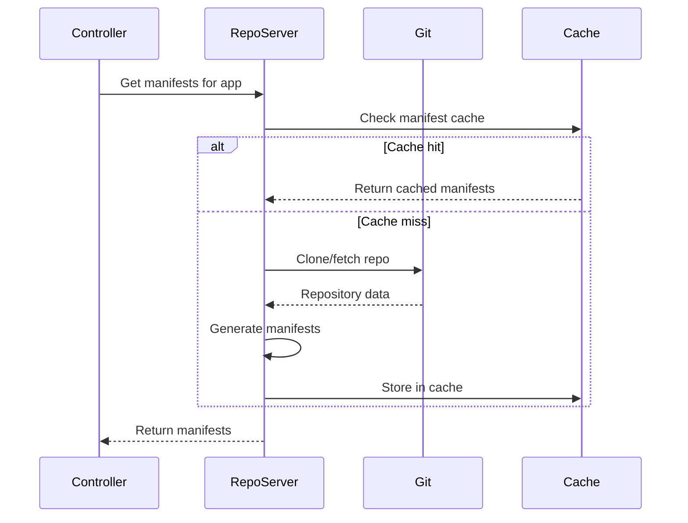

# How to Tune ArgoCD Repo Server for Large Repos

Author: [nawazdhandala](https://github.com/nawazdhandala)

Tags: ArgoCD, GitOps, Kubernetes, Performance Tuning, Repo Server

Description: Learn how to optimize the ArgoCD repo server for large Git repositories, reducing clone times, manifest generation latency, and memory consumption.

---

The ArgoCD repo server is responsible for cloning Git repositories, generating Kubernetes manifests, and caching the results. For small repositories with a few YAML files, the defaults work fine. But when your repository grows to hundreds of megabytes or contains complex Helm charts with many dependencies, the repo server becomes the primary bottleneck. This guide covers every tuning option available for the repo server.

## Understanding the Repo Server Workload

Every time ArgoCD needs to check whether an application is in sync, it asks the repo server for the desired manifests. The repo server then clones (or fetches) the repository, runs the manifest generation tool (plain YAML, Helm, Kustomize, or a plugin), and returns the result.



The three expensive operations are: cloning the repo, generating manifests, and storing them. Let us optimize each one.

## Scaling Repo Server Replicas

The single most impactful change is running multiple repo server replicas. Each replica can serve requests independently.

```yaml
apiVersion: apps/v1
kind: Deployment
metadata:
  name: argocd-repo-server
  namespace: argocd
spec:
  replicas: 5  # Scale up from default 1
  template:
    spec:
      containers:
      - name: argocd-repo-server
        resources:
          requests:
            cpu: "2"
            memory: "4Gi"
          limits:
            cpu: "4"
            memory: "8Gi"
```

A good rule of thumb is one repo server replica per 100-150 applications. If your manifests are generated from complex Helm charts, you may need even more replicas because Helm template rendering is CPU-intensive.

## Increasing Exec Timeout

For large repositories or complex Helm charts, manifest generation might time out before completing. The default timeout is 90 seconds.

```yaml
apiVersion: apps/v1
kind: Deployment
metadata:
  name: argocd-repo-server
  namespace: argocd
spec:
  template:
    spec:
      containers:
      - name: argocd-repo-server
        env:
        # Increase manifest generation timeout (default: 90s)
        - name: ARGOCD_EXEC_TIMEOUT
          value: "300"
```

If you see errors like "rpc error: context deadline exceeded" in the repo server logs, this is the setting to increase.

## Optimizing Git Operations

Large repositories take a long time to clone. Several approaches help.

### Using Shallow Clones

ArgoCD performs shallow clones by default, but ensure your Application specs support this.

```yaml
apiVersion: argoproj.io/v1alpha1
kind: Application
metadata:
  name: my-app
spec:
  source:
    repoURL: https://github.com/org/large-repo.git
    # Use branch reference, not commit SHA
    # Branch refs support shallow cloning
    targetRevision: main
    path: kubernetes/production
```

When you reference a specific commit SHA, ArgoCD may need to fetch more history to find it. Branch names and tags are faster because shallow clones can resolve them directly.

### Splitting Monorepos

If your monorepo contains many unrelated services, consider splitting it. A repo server must clone the entire repository even if an application only uses one directory. A 2GB monorepo is cloned in full for every single application that references it.

If splitting is not practical, ensure the repo server has enough disk space and memory for multiple concurrent clones.

```yaml
# Use emptyDir with a size limit for the clone directory
spec:
  template:
    spec:
      containers:
      - name: argocd-repo-server
        volumeMounts:
        - name: tmp
          mountPath: /tmp
      volumes:
      - name: tmp
        emptyDir:
          sizeLimit: 20Gi  # Enough for multiple large repo clones
```

### Git Fetch Optimization

Configure Git to use more efficient protocols and compression.

```yaml
env:
# Use Git protocol v2 for better performance
- name: GIT_PROTOCOL
  value: "2"
# Increase buffer size for large repos
- name: GIT_HTTP_LOW_SPEED_LIMIT
  value: "1000"
- name: GIT_HTTP_LOW_SPEED_TIME
  value: "300"
```

## Tuning the Manifest Cache

The repo server caches generated manifests in Redis. Proper cache configuration prevents unnecessary regeneration.

```yaml
# argocd-cm ConfigMap
apiVersion: v1
kind: ConfigMap
metadata:
  name: argocd-cm
  namespace: argocd
data:
  # How long repo cache entries live (default: 24h)
  reposerver.repo.cache.expiration: "48h"
```

Increasing the cache expiration means manifests are regenerated less frequently. This is safe when you use webhooks to trigger refreshes on actual changes, because the cache is invalidated when a new commit is detected.

## Controlling Parallelism

The repo server can process multiple requests concurrently. The `--parallelism-limit` flag controls this.

```yaml
args:
- /usr/local/bin/argocd-repo-server
# 0 means unlimited parallelism (default)
# Set a limit if you need to control resource usage
- --parallelism-limit=10
```

Setting this to 0 (unlimited) is fine if you have sufficient CPU and memory. If the repo server is on a constrained node, set a limit to prevent it from consuming all resources. A value of 10-20 per replica is reasonable for most workloads.

## Handling Helm Dependency Updates

Helm charts with many dependencies are particularly slow because `helm dependency update` downloads charts from remote registries on every manifest generation.

### Pre-building Helm Dependencies

Build dependencies in CI and commit the `charts/` directory.

```bash
# In your CI pipeline
cd charts/my-app
helm dependency build
git add Chart.lock charts/
git commit -m "Update Helm dependencies"
```

This way the repo server does not need to download dependencies during manifest generation.

### Using a Local Chart Registry

Configure ArgoCD to pull Helm dependencies from a local registry or mirror, reducing network latency.

```yaml
# argocd-cm ConfigMap
apiVersion: v1
kind: ConfigMap
metadata:
  name: argocd-cm
  namespace: argocd
data:
  helm.repositories: |
    - url: https://charts.internal.example.com
      name: internal
      type: helm
```

## Memory Optimization

Large repos and complex manifests consume significant memory. The repo server holds cloned repositories and generated manifests in memory.

```yaml
resources:
  requests:
    # Memory sizing guide:
    # - Base: 512Mi
    # - Per large repo (>100MB): +256Mi
    # - Per Helm chart with dependencies: +128Mi
    # - Per concurrent manifest generation: +256Mi
    memory: "4Gi"
  limits:
    memory: "8Gi"
```

Monitor the actual memory usage and adjust. If the repo server is OOMKilled, the limits are too low.

## Using Volume Mounts for Faster Cloning

The default `/tmp` directory for cloning may be on a slow filesystem. Using a dedicated volume with faster storage can help.

```yaml
spec:
  template:
    spec:
      containers:
      - name: argocd-repo-server
        volumeMounts:
        - name: repo-cache
          mountPath: /tmp
      volumes:
      # Use a faster volume type if available
      - name: repo-cache
        emptyDir:
          medium: Memory  # Use RAM-backed tmpfs
          sizeLimit: 10Gi
```

Using `medium: Memory` mounts a tmpfs filesystem backed by RAM. This makes Git clone and checkout operations significantly faster, at the cost of using more memory on the node. Only use this if your nodes have enough spare RAM.

## Monitoring Repo Server Performance

Track these metrics to identify bottlenecks.

```promql
# Request duration by repo and method
histogram_quantile(0.95,
  rate(argocd_git_request_duration_seconds_bucket[5m])
)

# Number of pending git requests
argocd_git_request_total - argocd_git_request_duration_seconds_count

# Cache hit rate
rate(argocd_repo_server_cache_hit_total[5m]) /
(rate(argocd_repo_server_cache_hit_total[5m]) +
 rate(argocd_repo_server_cache_miss_total[5m]))
```

A high cache hit rate (above 90%) means your cache settings are working well. If the hit rate is low, check that webhooks are not triggering too many cache invalidations.

## Summary

The most impactful repo server optimizations in order are:

1. **Add replicas** - horizontal scaling provides the most immediate improvement
2. **Use RAM-backed tmpfs** - eliminates disk I/O for cloning
3. **Pre-build Helm dependencies** - avoids network calls during manifest generation
4. **Increase cache duration** - reduces redundant manifest generation
5. **Use branch references** - enables efficient shallow clones

For a holistic view of ArgoCD performance tuning, see our guide on [tuning ArgoCD for fastest sync times](https://oneuptime.com/blog/post/2026-02-26-argocd-tune-fastest-sync-times/view).
