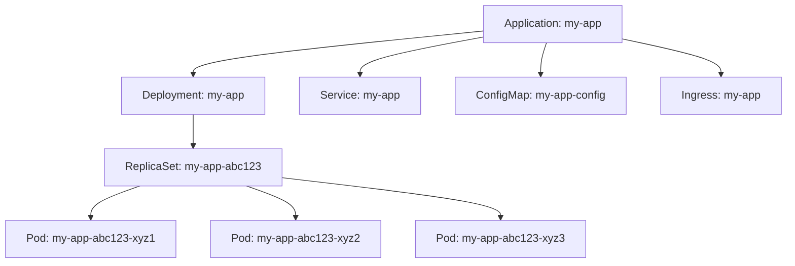

# How to Read the ArgoCD UI Dashboard for Beginners

Author: [nawazdhandala](https://github.com/nawazdhandala)

Tags: ArgoCD, GitOps, Kubernetes, Dashboards, DevOps

Description: A beginner-friendly guide to understanding the ArgoCD web UI dashboard, including application tiles, sync status, health indicators, and the resource tree view.

---

The ArgoCD web UI is one of the main reasons people choose ArgoCD over other GitOps tools. It gives you a visual overview of everything deployed to your Kubernetes clusters without needing to run kubectl commands. But if you are new to ArgoCD, the dashboard can be confusing - there are colored icons, status badges, tree views, and diff panels that are not immediately obvious.

This guide walks you through every part of the ArgoCD UI so you can confidently read and use it from day one.

## Accessing the Dashboard

After installing ArgoCD, you can access the UI by port-forwarding to the API server:

```bash
# Port-forward the ArgoCD server to your local machine
kubectl port-forward svc/argocd-server -n argocd 8080:443

# Open https://localhost:8080 in your browser
# You will see a certificate warning - this is expected with the default self-signed cert
```

For production access, you would typically set up an Ingress or LoadBalancer service. The default username is `admin`, and the password is stored in a Kubernetes secret:

```bash
# Get the initial admin password
kubectl get secret argocd-initial-admin-secret -n argocd \
  -o jsonpath='{.data.password}' | base64 -d
```

## The Application List View

When you first log in, you see the Application List. This is the main dashboard showing all your ArgoCD Applications.

Each application appears as a tile (in card view) or a row (in list view). The key information on each tile is:

- **Application name** - the name you gave the Application
- **Project** - which ArgoCD Project it belongs to (default is "default")
- **Sync status** - whether the cluster matches Git
- **Health status** - whether the application is running correctly
- **Repository** - the Git repo URL
- **Target revision** - the branch, tag, or commit being tracked

### Filtering and Searching

At the top of the dashboard, you can:

- **Search by name** - type part of the application name to filter
- **Filter by project** - show only applications in a specific project
- **Filter by sync status** - show only Synced, OutOfSync, or Unknown applications
- **Filter by health** - show only Healthy, Degraded, Progressing, or Missing applications
- **Filter by cluster** - useful when managing multiple clusters
- **Filter by namespace** - show applications targeting a specific namespace

These filters are essential when you manage dozens or hundreds of applications.

## Understanding Sync Status

The sync status tells you whether the cluster state matches what is in Git. You will see one of these:

**Synced (green checkmark)** - The cluster matches Git exactly. Everything that is declared in Git is deployed, and nothing extra exists that should not be there.

**OutOfSync (yellow arrow)** - The cluster does not match Git. This can mean:
- New changes were committed to Git but not yet applied
- Someone manually changed a resource in the cluster
- A resource was added to Git but does not exist in the cluster yet

**Unknown (gray question mark)** - ArgoCD cannot determine the sync status. This usually means there is an error connecting to the Git repository or the Kubernetes cluster.

For a deeper understanding of sync status, see [understanding sync status in ArgoCD](https://oneuptime.com/blog/post/2026-02-26-argocd-sync-status-explained/view).

## Understanding Health Status

Health status tells you whether the application is actually working, regardless of whether it matches Git. The possible statuses are:

**Healthy (green heart)** - All resources are running correctly. Deployments have all replicas available, Services have endpoints, and Jobs have completed successfully.

**Progressing (blue spinning)** - Resources are in the process of becoming healthy. A Deployment might be rolling out new pods, or a StatefulSet might be starting up replicas. This is normal during and right after a sync.

**Degraded (red heart)** - Something is wrong. A Deployment might have failing pods, a Job might have failed, or a StatefulSet might have unhealthy replicas. This needs attention.

**Suspended (gray pause)** - The resource is intentionally paused. This happens with resources like CronJobs that are suspended or Argo Rollouts that are paused during a canary analysis.

**Missing (yellow exclamation)** - A resource declared in Git does not exist in the cluster. This is different from OutOfSync - the resource should exist but it is completely absent.

**Unknown (gray question mark)** - ArgoCD cannot determine the health. Custom resources without a health check definition will show this status.

For more on health checks, see [how to implement health checks in ArgoCD](https://oneuptime.com/blog/post/2026-01-25-health-checks-argocd/view).

## The Application Detail View

Click on any application tile to enter the detail view. This is where the real power of the UI shows.

### Resource Tree

The resource tree is the centerpiece of the detail view. It shows every Kubernetes resource managed by the application in a hierarchical tree structure.



Each resource in the tree shows:
- The resource kind and name
- A health indicator (colored dot)
- A sync indicator (whether it matches Git)

You can click on any resource to see its details:
- **Summary** - basic info like namespace, labels, annotations
- **Live manifest** - the YAML currently in the cluster
- **Desired manifest** - the YAML from Git
- **Diff** - the differences between live and desired
- **Events** - Kubernetes events for this resource
- **Logs** - container logs (for Pods)

### The Diff Panel

When an application is OutOfSync, the diff panel shows exactly what changed. It displays a side-by-side comparison of the desired state (from Git) and the live state (from the cluster).

Green lines are additions (in Git but not in the cluster). Red lines are removals (in the cluster but not in Git). This helps you understand exactly what a sync will change before you trigger it.

### The Summary Panel

The top of the detail view shows:
- **Sync status** with the current and target Git revision
- **Health status** with a breakdown of resource health
- **Sync policy** (manual or automated)
- **Repository URL** and **path** being tracked
- **Destination cluster** and **namespace**

## Common Actions from the UI

### Syncing an Application

Click the "Sync" button at the top of the application detail view. You will see options:

- **Prune** - delete resources that are in the cluster but not in Git
- **Dry run** - show what would change without applying
- **Apply only** - apply without waiting for health checks
- **Force** - replace resources instead of applying patches
- **Retry** - retry a previously failed sync

For most cases, the default sync settings are fine. Check "Prune" if you want to remove orphaned resources.

### Rolling Back

Click the "History and Rollback" button to see previous sync operations. Each entry shows the Git revision, sync time, and status. You can select any previous revision and click "Rollback" to revert to that state.

For more on rollbacks, see [rollback strategies in ArgoCD](https://oneuptime.com/blog/post/2026-01-25-rollback-strategies-argocd/view).

### Refreshing

Click "Refresh" to trigger ArgoCD to check Git for new commits immediately instead of waiting for the next polling cycle. This is useful when you just pushed a change and want to see it reflected right away.

### Viewing Logs

Navigate to a Pod in the resource tree and click on it. Switch to the "Logs" tab to see container logs. You can select the container if the Pod has multiple containers, follow logs in real-time, and filter by keyword.

This is incredibly useful for debugging - you do not need to switch to kubectl to read logs.

## Application List View Modes

The application list supports three view modes:

**Tiles** - each application as a card with sync and health status. Good for a quick visual overview.

**List** - a compact table view showing all applications with their key properties. Good when you have many applications.

**Tree** - groups applications by project, cluster, or namespace in a hierarchical view. Good for understanding organizational structure.

## The Settings Page

Click the gear icon in the left sidebar to access settings. Here you can:

- **Manage repositories** - add, edit, or remove Git repository connections
- **Manage clusters** - register external Kubernetes clusters
- **Manage projects** - create and configure ArgoCD Projects
- **Manage certificates** - add TLS certificates for Git servers
- **Manage GnuPG keys** - for Git commit signature verification
- **View accounts** - see local accounts and their permissions

## Tips for Effective Dashboard Use

**Bookmark filtered views.** The URL updates when you apply filters. Bookmark URLs like `https://argocd.example.com/applications?proj=production&health=Degraded` to quickly jump to views you check often.

**Use the compact diff.** In the diff view, toggle "Compact diff" to hide unchanged sections and focus on what actually changed.

**Watch resource events.** When debugging, the Events tab on individual resources often tells you exactly what went wrong, just like `kubectl describe` does.

**Check the sync history.** If something went wrong, the sync history shows you exactly when the last successful sync happened and what changed.

## The Bottom Line

The ArgoCD UI gives you real-time visibility into your Kubernetes deployments without needing kubectl. The key things to understand are sync status (does the cluster match Git?), health status (is the application working?), and the resource tree (what resources exist and what state are they in?). Once you learn to read these three things, you can quickly diagnose most deployment issues from the browser.
