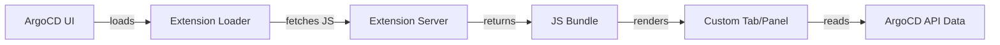

# How to Create UI Extensions for ArgoCD

Author: [nawazdhandala](https://github.com/nawazdhandala)

Tags: ArgoCD, GitOps, Kubernetes, UI Extensions, Customization

Description: Learn how to create custom UI extensions for ArgoCD to add new tabs, panels, and visualizations to the ArgoCD dashboard for your team's needs.

---

ArgoCD's web UI is functional out of the box, but every team has unique needs. Maybe you want to display cost information for each application, show deployment metrics, or add a custom approval workflow panel. ArgoCD's UI extension system lets you build custom React components that integrate directly into the ArgoCD dashboard.

This guide covers how the extension system works, how to build your first extension, and practical examples of extensions that teams commonly build.

## Understanding ArgoCD UI Extensions

ArgoCD supports two types of extensions:

1. **Resource tab extensions** - Add custom tabs to the resource detail view (when you click on a specific Kubernetes resource)
2. **Application tab extensions** - Add custom tabs to the application detail view (the main view when you click on an ArgoCD Application)

Extensions are React components that get loaded into the ArgoCD UI at runtime. They are served as JavaScript bundles from a configurable URL.

## How Extensions Work

The ArgoCD UI loads extensions through a plugin mechanism. When the UI starts, it checks for configured extensions and dynamically loads them. Extensions have access to the application and resource data that ArgoCD already tracks.



## Setting Up the Extension Development Environment

First, you need to set up a development environment for building extensions.

```bash
# Clone the ArgoCD repository for reference
git clone https://github.com/argoproj/argo-cd.git
cd argo-cd

# Look at the extension examples
ls ui/src/app/extensions/
```

Create a new project for your extension.

```bash
# Initialize a new project
mkdir my-argocd-extension
cd my-argocd-extension
npm init -y

# Install dependencies
npm install react react-dom typescript
npm install --save-dev @types/react @types/react-dom webpack webpack-cli ts-loader
```

## Building a Resource Tab Extension

Resource tab extensions appear as additional tabs when viewing a Kubernetes resource in the ArgoCD UI. Here is an example that shows pod metrics.

### Create the Extension Component

```typescript
// src/PodMetricsExtension.tsx
import * as React from 'react';

// The extension receives the resource data as props
interface ExtensionProps {
  resource: {
    metadata: {
      name: string;
      namespace: string;
      labels: Record<string, string>;
      annotations: Record<string, string>;
    };
    kind: string;
    status: any;
  };
  application: {
    metadata: {
      name: string;
    };
    spec: {
      destination: {
        server: string;
        namespace: string;
      };
    };
  };
}

const PodMetricsExtension: React.FC<ExtensionProps> = ({ resource, application }) => {
  const [metrics, setMetrics] = React.useState<any>(null);
  const [loading, setLoading] = React.useState(true);

  React.useEffect(() => {
    // Fetch metrics from your custom backend
    fetch(`/api/extensions/metrics/pods/${resource.metadata.namespace}/${resource.metadata.name}`)
      .then(res => res.json())
      .then(data => {
        setMetrics(data);
        setLoading(false);
      })
      .catch(err => {
        console.error('Failed to fetch metrics:', err);
        setLoading(false);
      });
  }, [resource.metadata.name, resource.metadata.namespace]);

  if (loading) {
    return <div>Loading metrics...</div>;
  }

  if (!metrics) {
    return <div>No metrics available</div>;
  }

  return (
    <div style={{ padding: '20px' }}>
      <h3>Pod Metrics: {resource.metadata.name}</h3>
      <table style={{ width: '100%', borderCollapse: 'collapse' }}>
        <thead>
          <tr>
            <th style={{ textAlign: 'left', padding: '8px' }}>Metric</th>
            <th style={{ textAlign: 'left', padding: '8px' }}>Current</th>
            <th style={{ textAlign: 'left', padding: '8px' }}>Limit</th>
            <th style={{ textAlign: 'left', padding: '8px' }}>Usage %</th>
          </tr>
        </thead>
        <tbody>
          <tr>
            <td style={{ padding: '8px' }}>CPU</td>
            <td>{metrics.cpu.current}</td>
            <td>{metrics.cpu.limit}</td>
            <td>{metrics.cpu.percentage}%</td>
          </tr>
          <tr>
            <td style={{ padding: '8px' }}>Memory</td>
            <td>{metrics.memory.current}</td>
            <td>{metrics.memory.limit}</td>
            <td>{metrics.memory.percentage}%</td>
          </tr>
        </tbody>
      </table>
    </div>
  );
};

// Register the extension
// The extension system looks for this export pattern
((window: any) => {
  window.extensions = window.extensions || {};
  window.extensions.resources = window.extensions.resources || {};
  window.extensions.resources['pod-metrics'] = PodMetricsExtension;
})(window);
```

### Configure Webpack

```javascript
// webpack.config.js
const path = require('path');

module.exports = {
  entry: './src/PodMetricsExtension.tsx',
  output: {
    filename: 'extension.js',
    path: path.resolve(__dirname, 'dist'),
    // Library format required by ArgoCD
    library: {
      type: 'window',
    },
  },
  resolve: {
    extensions: ['.ts', '.tsx', '.js'],
  },
  module: {
    rules: [
      {
        test: /\.tsx?$/,
        use: 'ts-loader',
        exclude: /node_modules/,
      },
    ],
  },
  externals: {
    // ArgoCD provides React, so mark it as external
    react: 'React',
    'react-dom': 'ReactDOM',
  },
};
```

### Build the Extension

```bash
# Build the extension bundle
npx webpack --mode production
```

## Deploying the Extension

Extensions need to be served from a web server that ArgoCD can reach. You can use a simple Nginx deployment.

```yaml
# extension-server.yaml
apiVersion: apps/v1
kind: Deployment
metadata:
  name: argocd-extensions
  namespace: argocd
spec:
  replicas: 1
  selector:
    matchLabels:
      app: argocd-extensions
  template:
    metadata:
      labels:
        app: argocd-extensions
    spec:
      containers:
        - name: nginx
          image: nginx:alpine
          ports:
            - containerPort: 80
          volumeMounts:
            - name: extensions
              mountPath: /usr/share/nginx/html
      volumes:
        - name: extensions
          configMap:
            name: argocd-extensions
---
apiVersion: v1
kind: Service
metadata:
  name: argocd-extensions
  namespace: argocd
spec:
  ports:
    - port: 80
      targetPort: 80
  selector:
    app: argocd-extensions
```

Create a ConfigMap with your extension bundle.

```bash
# Create ConfigMap from the built extension
kubectl create configmap argocd-extensions \
  --namespace argocd \
  --from-file=extension.js=dist/extension.js
```

### Configure ArgoCD to Load the Extension

Update the ArgoCD ConfigMap to register your extension.

```yaml
# argocd-cm patch
apiVersion: v1
kind: ConfigMap
metadata:
  name: argocd-cm
  namespace: argocd
data:
  # Register UI extensions
  extension.config: |
    extensions:
      - name: pod-metrics
        backend:
          services:
            - url: http://argocd-extensions.argocd.svc.cluster.local
```

## Building an Application Tab Extension

Application tab extensions appear at the application level, not the resource level. These are useful for showing deployment history, cost data, or custom dashboards.

```typescript
// src/DeploymentHistoryExtension.tsx
import * as React from 'react';

interface ApplicationTabProps {
  application: {
    metadata: {
      name: string;
      namespace: string;
    };
    status: {
      history: Array<{
        revision: string;
        deployedAt: string;
        source: {
          repoURL: string;
          targetRevision: string;
        };
      }>;
    };
  };
}

const DeploymentHistoryExtension: React.FC<ApplicationTabProps> = ({ application }) => {
  const history = application.status.history || [];

  return (
    <div style={{ padding: '20px' }}>
      <h3>Deployment History: {application.metadata.name}</h3>
      <div style={{ maxHeight: '500px', overflow: 'auto' }}>
        {history.map((entry, index) => (
          <div
            key={index}
            style={{
              padding: '12px',
              margin: '8px 0',
              border: '1px solid #ddd',
              borderRadius: '4px',
            }}
          >
            <strong>Revision:</strong> {entry.revision.substring(0, 8)}
            <br />
            <strong>Deployed:</strong> {new Date(entry.deployedAt).toLocaleString()}
            <br />
            <strong>Repo:</strong> {entry.source.repoURL}
            <br />
            <strong>Branch:</strong> {entry.source.targetRevision}
          </div>
        ))}
      </div>
    </div>
  );
};

((window: any) => {
  window.extensions = window.extensions || {};
  window.extensions.applications = window.extensions.applications || {};
  window.extensions.applications['deployment-history'] = DeploymentHistoryExtension;
})(window);
```

## Common Extension Ideas

Here are practical extensions that teams commonly build:

### Cost Dashboard Extension
Show per-application cost data from tools like Kubecost or OpenCost.

### Compliance Checker
Display compliance status (SOC2, HIPAA) for each application based on policy checks from tools like OPA or Kyverno.

### Dependency Graph
Visualize application dependencies, showing which services depend on each other.

### Rollback Assistant
A more visual rollback interface that shows diffs between revisions and lets users pick specific versions to roll back to.

### Environment Comparison
Side-by-side comparison of what is deployed in staging versus production.

## Security Considerations

When building extensions, keep these security points in mind:

- Extensions run in the same browser context as ArgoCD, so they have access to the same cookies and tokens
- Never load extension bundles from untrusted sources
- Validate all data from custom backends
- Use the ArgoCD RBAC system to control who can see extension data

## Conclusion

ArgoCD UI extensions are a powerful way to customize the dashboard for your team's specific needs. Whether you need cost visibility, custom metrics, compliance dashboards, or approval workflows, extensions let you build exactly what you need without forking the ArgoCD codebase. The development model is straightforward: build a React component, bundle it with webpack, serve it from a web server, and configure ArgoCD to load it. Start with a simple extension and iterate from there.
