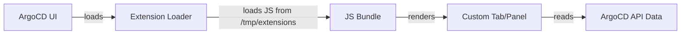

# How to Create UI Extensions for ArgoCD

Author: [nawazdhandala](https://github.com/nawazdhandala)

Tags: ArgoCD, GitOps, Kubernetes, UI Extensions, Customization

Description: Learn how to create custom UI extensions for ArgoCD to add new tabs, panels, and visualizations to the ArgoCD dashboard for your team's needs.

---

Argo CD's web UI is functional out of the box, but every team has unique needs. Maybe you want to display cost information for each application, show deployment metrics, or add a custom approval workflow panel. Argo CD's UI extension system lets you build custom React components that integrate directly into the Argo CD dashboard.

This guide covers how the extension system works, how to build your first extension, and practical examples of extensions that teams commonly build.

## Understanding ArgoCD UI Extensions

Argo CD supports several UI extension points, including these two common tab-based options:

1. **Resource tab extensions** - Add custom tabs to the resource detail view (when you click on a specific Kubernetes resource)
2. **Application tab extensions** - Add custom tabs to the application detail view (the main view when you click on an ArgoCD Application)

Extensions are React components that get loaded into the Argo CD UI at runtime. They are delivered as JavaScript files in the `argocd-server` pod under `/tmp/extensions`, and the file name must start with `extension` and end with `.js`.

## How Extensions Work

The Argo CD UI loads extensions during initial page rendering. Each extension registers itself with the `extensionsAPI` global variable. Extensions have access to the application and resource data that Argo CD already tracks.


```mermaid
flowchart LR
    UI[ArgoCD UI] -->|loads| ExtLoader[Extension Loader]
    ExtLoader -->|loads JS from /tmp/extensions| Bundle[JS Bundle]
    Bundle -->|renders| Tab[Custom Tab/Panel]
    Tab -->|reads| API[ArgoCD API Data]
```

## Setting Up the Extension Development Environment

First, you need to set up a development environment for building extensions.

```bash
# Clone the ArgoCD repository for reference

git clone https://github.com/argoproj/argo-cd.git
cd argo-cd

# Read the UI extension documentation and source code
ls ui/src/app/shared/services/
```

Create a new project for your extension.

```bash
# Initialize a new project
mkdir my-argocd-extension
cd my-argocd-extension
npm init -y

# Install dependencies
npm install react react-dom typescript
npm install --save-dev @types/react @types/react-dom webpack webpack-cli ts-loader
```

Create a TypeScript configuration that supports JSX.

```json
{
  "compilerOptions": {
    "target": "ES2018",
    "module": "ESNext",
    "jsx": "react",
    "moduleResolution": "Node",
    "esModuleInterop": true,
    "strict": true,
    "skipLibCheck": true
  }
}
```

## Building a Resource Tab Extension

Resource tab extensions appear as additional tabs when viewing a Kubernetes resource in the ArgoCD UI. Here is an example that shows pod metrics.

### Create the Extension Component

```typescript
// src/PodMetricsExtension.tsx
import * as React from 'react';

// The extension receives the resource data as props
interface ExtensionProps {
  resource: {
    metadata: {
      name: string;
      namespace: string;
      labels: Record<string, string>;
      annotations: Record<string, string>;
    };
    kind: string;
    status: any;
  };
  application: {
    metadata: {
      name: string;
      namespace: string;
    };
    spec: {
      project: string;
      destination: {
        server: string;
        namespace: string;
      };
    };
  };
}

const PodMetricsExtension: React.FC<ExtensionProps> = ({ resource, application }) => {
  const [metrics, setMetrics] = React.useState<any>(null);
  const [loading, setLoading] = React.useState(true);

  React.useEffect(() => {
    // Fetch metrics from your custom backend
    fetch(`/extensions/pod-metrics/metrics/pods/${resource.metadata.namespace}/${resource.metadata.name}`, {
      headers: {
        'Argocd-Application-Name': `${application.metadata.namespace}:${application.metadata.name}`,
        'Argocd-Project-Name': application.spec.project,
      },
    })
      .then(res => res.json())
      .then(data => {
        setMetrics(data);
        setLoading(false);
      })
      .catch(err => {
        console.error('Failed to fetch metrics:', err);
        setLoading(false);
      });
  }, [resource.metadata.name, resource.metadata.namespace]);

  if (loading) {
    return <div>Loading metrics...</div>;
  }

  if (!metrics) {
    return <div>No metrics available</div>;
  }

  return (
    <div style={{ padding: '20px' }}>
      <h3>Pod Metrics: {resource.metadata.name}</h3>
      <table style={{ width: '100%', borderCollapse: 'collapse' }}>
        <thead>
          <tr>
            <th style={{ textAlign: 'left', padding: '8px' }}>Metric</th>
            <th style={{ textAlign: 'left', padding: '8px' }}>Current</th>
            <th style={{ textAlign: 'left', padding: '8px' }}>Limit</th>
            <th style={{ textAlign: 'left', padding: '8px' }}>Usage %</th>
          </tr>
        </thead>
        <tbody>
          <tr>
            <td style={{ padding: '8px' }}>CPU</td>
            <td>{metrics.cpu.current}</td>
            <td>{metrics.cpu.limit}</td>
            <td>{metrics.cpu.percentage}%</td>
          </tr>
          <tr>
            <td style={{ padding: '8px' }}>Memory</td>
            <td>{metrics.memory.current}</td>
            <td>{metrics.memory.limit}</td>
            <td>{metrics.memory.percentage}%</td>
          </tr>
        </tbody>
      </table>
    </div>
  );
};

((window: any) => {
  window.extensionsAPI.registerResourceExtension(
    PodMetricsExtension,
    '',
    'Pod',
    'Metrics'
  );
})(window);
```

### Configure Webpack

```javascript
// webpack.config.js
const path = require('path');

module.exports = {
  entry: './src/PodMetricsExtension.tsx',
  output: {
    filename: 'extension.js',
    path: path.resolve(__dirname, 'dist'),
  },
  resolve: {
    extensions: ['.ts', '.tsx', '.js'],
  },
  module: {
    rules: [
      {
        test: /\.tsx?$/,
        use: 'ts-loader',
        exclude: /node_modules/,
      },
    ],
  },
  externals: {
    // ArgoCD provides React, so mark it as external
    react: 'React',
    'react-dom': 'ReactDOM',
  },
};
```

### Build the Extension

```bash
# Build the extension bundle
npx webpack --mode production
```

## Deploying the Extension

Extensions need to be mounted into the `argocd-server` pod under `/tmp/extensions`. A simple way to do this is to place the built bundle in a ConfigMap and mount it into the server deployment.

```yaml
# argocd-server patch
apiVersion: apps/v1
kind: Deployment
metadata:
  name: argocd-server
  namespace: argocd
spec:
  template:
    spec:
      containers:
        - name: argocd-server
          volumeMounts:
            - name: pod-metrics-extension
              mountPath: /tmp/extensions/pod-metrics/extension.js
              subPath: extension.js
      volumes:
        - name: pod-metrics-extension
          configMap:
            name: pod-metrics-extension
```

Create a ConfigMap with your extension bundle.

```bash
# Create ConfigMap from the built extension
kubectl create configmap pod-metrics-extension \
  --namespace argocd \
  --from-file=extension.js=dist/extension.js
```

### Configure the Argo CD Proxy Backend

If your extension calls a custom backend, update the Argo CD ConfigMap to register a proxy extension. This does not load the UI bundle; it exposes the backend at `/extensions/pod-metrics/...`.

```yaml
# argocd-cm patch
apiVersion: v1
kind: ConfigMap
metadata:
  name: argocd-cm
  namespace: argocd
data:
  extension.config: |
    extensions:
      - name: pod-metrics
        backend:
          services:
            - url: http://pod-metrics-api.argocd.svc.cluster.local
```

## Building an Application Tab Extension

Application tab extensions appear at the application level, not the resource level. Since an Argo CD Application is a Kubernetes resource, you register an application tab as a resource tab for the `argoproj.io` `Application` kind. These are useful for showing deployment history, cost data, or custom dashboards.

```typescript
// src/DeploymentHistoryExtension.tsx
import * as React from 'react';

interface ApplicationTabProps {
  application: {
    metadata: {
      name: string;
      namespace: string;
    };
    status: {
      history: Array<{
        revision: string;
        deployedAt: string;
        source: {
          repoURL: string;
          targetRevision: string;
        };
      }>;
    };
  };
}

const DeploymentHistoryExtension: React.FC<ApplicationTabProps> = ({ application }) => {
  const history = application.status.history || [];

  return (
    <div style={{ padding: '20px' }}>
      <h3>Deployment History: {application.metadata.name}</h3>
      <div style={{ maxHeight: '500px', overflow: 'auto' }}>
        {history.map((entry, index) => (
          <div
            key={index}
            style={{
              padding: '12px',
              margin: '8px 0',
              border: '1px solid #ddd',
              borderRadius: '4px',
            }}
          >
            <strong>Revision:</strong> {entry.revision.substring(0, 8)}
            <br />
            <strong>Deployed:</strong> {new Date(entry.deployedAt).toLocaleString()}
            <br />
            <strong>Repo:</strong> {entry.source.repoURL}
            <br />
            <strong>Branch:</strong> {entry.source.targetRevision}
          </div>
        ))}
      </div>
    </div>
  );
};

((window: any) => {
  window.extensionsAPI.registerResourceExtension(
    DeploymentHistoryExtension,
    'argoproj.io',
    'Application',
    'Deployment History'
  );
})(window);
```

## Common Extension Ideas

Here are practical extensions that teams commonly build:

### Cost Dashboard Extension
Show per-application cost data from tools like Kubecost or OpenCost.

### Compliance Checker
Display compliance status (SOC2, HIPAA) for each application based on policy checks from tools like OPA or Kyverno.

### Dependency Graph
Visualize application dependencies, showing which services depend on each other.

### Rollback Assistant
A more visual rollback interface that shows diffs between revisions and lets users pick specific versions to roll back to.

### Environment Comparison
Side-by-side comparison of what is deployed in staging versus production.

## Security Considerations

When building extensions, keep these security points in mind:

- Extensions run in the same browser context as ArgoCD, so they have access to the same cookies and tokens
- Never load extension bundles from untrusted sources
- Validate all data from custom backends
- Use the ArgoCD RBAC system to control who can see extension data

## Conclusion

Argo CD UI extensions are a powerful way to customize the dashboard for your team's specific needs. Whether you need cost visibility, custom metrics, compliance dashboards, or approval workflows, extensions let you build exactly what you need without forking the Argo CD codebase. The development model is straightforward: build a React component, bundle it with webpack, mount the JavaScript file into the `argocd-server` pod, and register the component with `extensionsAPI`. Start with a simple extension and iterate from there.
