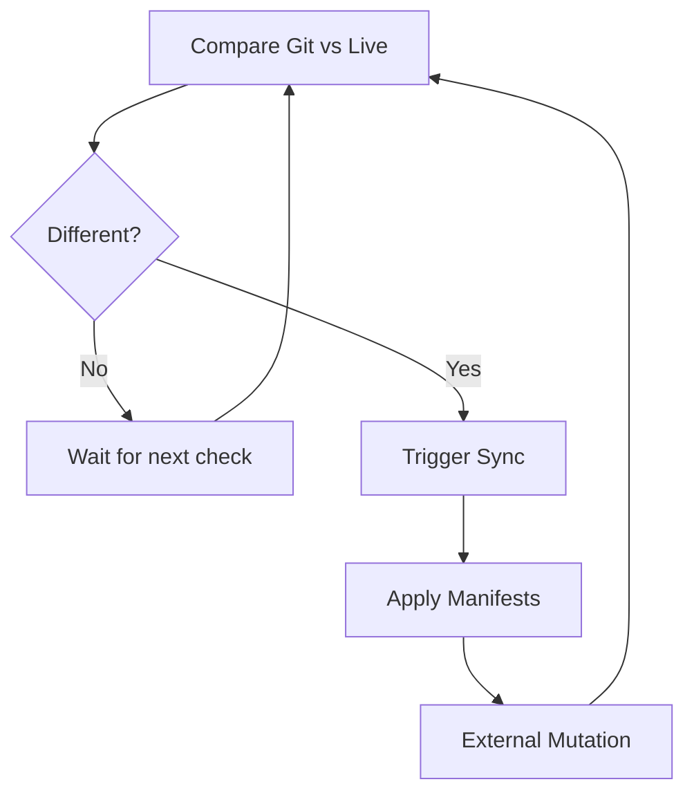

# How to Handle ArgoCD Apps That Keep Auto-Syncing Unnecessarily

Author: [nawazdhandala](https://github.com/nawazdhandala)

Tags: ArgoCD, GitOps, Kubernetes, Troubleshooting, Performance

Description: Diagnose and fix ArgoCD applications that keep triggering auto-sync even when nothing has changed, causing unnecessary deployments and resource churn.

---

Your ArgoCD application has auto-sync enabled, and it keeps syncing over and over again. You check the sync history and see dozens of syncs, each a few minutes apart, even though nobody has pushed any changes. This sync loop wastes cluster resources, clutters your audit logs, and can cause unnecessary pod restarts.

The root cause is almost always that something modifies the live state of your resources after ArgoCD syncs them, causing ArgoCD to detect drift and sync again. Let me walk through how to identify what is causing the loop and how to stop it.

## Understanding the Auto-Sync Loop

ArgoCD auto-sync works like this:

1. ArgoCD compares the live cluster state with the desired Git state
2. If they differ, ArgoCD triggers a sync
3. The sync applies the Git manifests to the cluster
4. Something modifies the live state (mutation)
5. ArgoCD detects the difference on the next comparison
6. Go back to step 2



The key is identifying what causes step 4 - the external mutation.

## Cause 1: Mutating Admission Webhooks

Mutating webhooks modify resources after ArgoCD creates or updates them. Common culprits include:

- **Istio sidecar injector**: Adds sidecar containers, volumes, and annotations
- **Vault injector**: Adds init containers and annotations for secret injection
- **OPA Gatekeeper**: May modify resources to add labels or annotations
- **Kubernetes itself**: Adds default values to fields you did not specify

```bash
# List all mutating webhooks
kubectl get mutatingwebhookconfigurations

# Check which namespaces they apply to
kubectl get mutatingwebhookconfiguration istio-sidecar-injector -o yaml | grep -A 5 namespaceSelector
```

The fix is to use `ignoreDifferences` to tell ArgoCD to ignore the webhook-injected fields.

```yaml
apiVersion: argoproj.io/v1alpha1
kind: Application
metadata:
  name: my-app
  namespace: argocd
spec:
  ignoreDifferences:
    # Ignore Istio sidecar injection
    - group: apps
      kind: Deployment
      jqPathExpressions:
        - .spec.template.metadata.annotations["sidecar.istio.io/status"]
        - '.spec.template.spec.containers[] | select(.name == "istio-proxy")'
        - '.spec.template.spec.initContainers[] | select(.name == "istio-init")'
        - '.spec.template.spec.volumes[] | select(.name | startswith("istio"))'
```

## Cause 2: Controllers Modifying Resources

Kubernetes controllers and operators often modify the resources they manage. For example:

- The Horizontal Pod Autoscaler changes `spec.replicas` on Deployments
- Certificate controllers update certificate annotations
- Operators add status fields or labels

```bash
# Check the sync history to see what changes on each sync
argocd app history my-app

# Check the diff to see exactly what is different
argocd app diff my-app
```

If the HPA is changing replicas, ignore that field.

```yaml
ignoreDifferences:
  - group: apps
    kind: Deployment
    jsonPointers:
      - /spec/replicas
```

Or better yet, remove `spec.replicas` from your Git manifests entirely and let the HPA manage it.

## Cause 3: Server-Side Defaults

As covered in our guide on [handling ArgoCD OutOfSync due to server-side defaults](https://oneuptime.com/blog/post/2026-02-26-argocd-outofsync-server-side-defaults/view), Kubernetes adds default values that your Git manifests do not specify. With auto-sync enabled, this creates a loop.

Enable server-side diff to eliminate false positives from defaults.

```yaml
apiVersion: v1
kind: ConfigMap
metadata:
  name: argocd-cmd-params-cm
  namespace: argocd
data:
  controller.diff.server.side: "true"
```

## Cause 4: Annotation or Label Churn

Some tools continuously update annotations or labels on resources. For example, deployment tools that stamp the last deployment time, or monitoring tools that add metadata.

```bash
# Check for rapidly changing annotations
kubectl get deployment my-app -o jsonpath='{.metadata.annotations}' | jq
```

Ignore the specific annotation causing the churn.

```yaml
ignoreDifferences:
  - group: apps
    kind: Deployment
    jqPathExpressions:
      - .metadata.annotations["deployment-tool.example.com/last-sync"]
```

## Cause 5: Status Field Changes

Some CRDs do not properly separate spec from status, causing status updates to trigger ArgoCD diffs.

```yaml
# Global ignore for status fields on custom resources
apiVersion: v1
kind: ConfigMap
metadata:
  name: argocd-cm
  namespace: argocd
data:
  resource.customizations.ignoreDifferences.certmanager.io_Certificate: |
    jqPathExpressions:
      - .status
```

## Cause 6: Resource Generation Field

The `metadata.generation` and `metadata.resourceVersion` fields change on every update. ArgoCD normally handles these correctly, but custom resources or older versions might not.

## Diagnosing the Loop

Here is a systematic approach to find the cause.

### Step 1: Check the Diff

```bash
# See exactly what ArgoCD thinks is different
argocd app diff my-app --local-repo-root /tmp/debug 2>&1
```

### Step 2: Sync and Immediately Check

```bash
# Sync the app
argocd app sync my-app --force

# Wait 10 seconds and check the diff again
sleep 10
argocd app diff my-app
```

If the diff shows differences immediately after a sync, something is modifying the resource right after ArgoCD applies it.

### Step 3: Check the Application Controller Logs

```bash
# Watch the controller logs for your application
kubectl -n argocd logs -f deployment/argocd-application-controller | grep "my-app"
```

Look for messages about "auto-sync" being triggered and what changed.

### Step 4: Use kubectl to Watch for Modifications

```bash
# Watch for changes to a specific resource
kubectl get deployment my-app -w -o yaml | grep -E "generation|resourceVersion"
```

If the generation keeps incrementing without you doing anything, something is modifying the deployment.

## Fixing the Loop

Once you have identified the cause, apply the appropriate fix.

### Fix 1: Add ignoreDifferences

```yaml
# Add to your Application spec
ignoreDifferences:
  - group: apps
    kind: Deployment
    jqPathExpressions:
      - .spec.template.metadata.annotations["injected-field"]
```

### Fix 2: Enable Server-Side Diff

```yaml
# Per-application
metadata:
  annotations:
    argocd.argoproj.io/compare-options: ServerSideDiff=true
```

### Fix 3: Remove Conflicting Fields from Git

If the HPA manages replicas, remove `spec.replicas` from your Git manifest. If a controller manages a specific field, do not declare it in Git.

### Fix 4: Use RespectIgnoreDifferences in Sync Options

Tell ArgoCD to not override ignored fields during sync.

```yaml
spec:
  syncPolicy:
    syncOptions:
      - RespectIgnoreDifferences=true
```

This is important because without this option, ArgoCD still applies the Git version of ignored fields during sync - it just does not report them as OutOfSync. With `RespectIgnoreDifferences=true`, ArgoCD leaves those fields alone during sync too.

## Prevention

To prevent sync loops in the future:

1. **Always enable server-side diff** on new installations
2. **Test with auto-sync disabled first**, then enable it after confirming there are no phantom diffs
3. **Monitor sync frequency** - if an app syncs more than once per actual Git change, investigate immediately
4. **Use `RespectIgnoreDifferences=true`** whenever you use `ignoreDifferences`

Use [OneUptime](https://oneuptime.com) to monitor your ArgoCD sync frequency. An abnormally high sync rate is a clear indicator of a sync loop that needs attention.

Sync loops are one of the most common operational issues with ArgoCD auto-sync. The root cause is always some external modification to your resources, and the fix is always either ignoring the difference or removing the conflicting field from your Git manifests.
