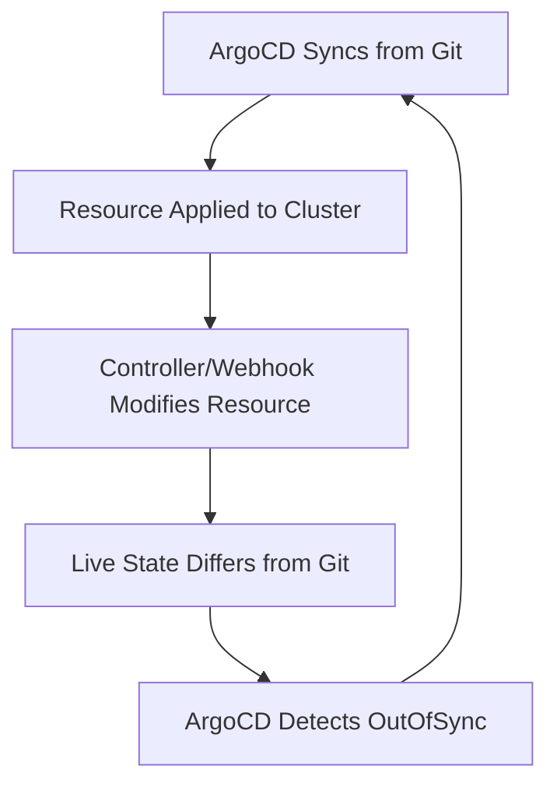

# How to Handle ArgoCD Apps That Keep Auto-Syncing Unnecessarily

Author: [nawazdhandala](https://github.com/nawazdhandala)

Tags: ArgoCD, GitOps, Kubernetes, Troubleshooting

Description: Diagnose and fix ArgoCD applications that continuously auto-sync even when nothing has changed, reducing unnecessary deployments and resource churn.

---

Your ArgoCD Application has auto-sync enabled, and it keeps syncing every few minutes even though you have not pushed any changes. The sync history shows a wall of sync operations, all for the same revision, and the application never stays in a "Synced" state for long. This is a common problem that wastes cluster resources, clutters your sync history, and can cause unnecessary rolling restarts.

## Why This Happens

ArgoCD auto-sync works by comparing the desired state (from Git) with the live state (in the cluster). When they differ, ArgoCD triggers a sync. If something in the cluster keeps modifying the live state, ArgoCD detects the difference and syncs again, which applies the Git state. But then the cluster modifies it again, and the cycle repeats.



This sync loop is caused by fields in the live resources that differ from what is in Git. The sources of these differences vary.

## Cause 1: Server-Side Defaults

Kubernetes adds default values to resources after creation. If your manifests do not include these defaults, ArgoCD sees a difference every time.

For example, you deploy a Deployment without specifying `strategy`:

```yaml
# Your manifest in Git
apiVersion: apps/v1
kind: Deployment
metadata:
  name: myapp
spec:
  replicas: 3
  template:
    spec:
      containers:
        - name: myapp
          image: myapp:1.0
```

Kubernetes adds `strategy: RollingUpdate` with `maxSurge: 25%` and `maxUnavailable: 25%`. ArgoCD syncs to remove these (since they are not in Git), but Kubernetes immediately adds them back.

### Fix: Ignore the Changing Fields

```yaml
apiVersion: argoproj.io/v1alpha1
kind: Application
metadata:
  name: myapp
spec:
  ignoreDifferences:
    - group: apps
      kind: Deployment
      jqPathExpressions:
        - .spec.template.spec.containers[].terminationMessagePath
        - .spec.template.spec.containers[].terminationMessagePolicy
  syncPolicy:
    automated:
      selfHeal: true
    syncOptions:
      - RespectIgnoreDifferences=true
```

The `RespectIgnoreDifferences=true` sync option is essential. Without it, auto-sync still triggers on ignored differences.

## Cause 2: Mutating Admission Webhooks

If your cluster has mutating admission webhooks (like Istio sidecar injection, Vault agent injection, or Kyverno mutations), these webhooks modify resources after ArgoCD applies them.

For example, Istio injects a sidecar container that is not in your Git manifest:

```yaml
# Git has one container
containers:
  - name: myapp
    image: myapp:1.0

# Live state has two containers (Istio injected the sidecar)
containers:
  - name: myapp
    image: myapp:1.0
  - name: istio-proxy
    image: docker.io/istio/proxyv2:1.20.0
```

### Fix: Ignore Webhook-Added Fields

For Istio:

```yaml
ignoreDifferences:
  - group: apps
    kind: Deployment
    jqPathExpressions:
      - .spec.template.metadata.annotations["sidecar.istio.io/status"]
      - .spec.template.metadata.labels["security.istio.io/tlsMode"]
      - .spec.template.spec.containers[] | select(.name == "istio-proxy")
      - .spec.template.spec.initContainers[] | select(.name == "istio-init")
      - .spec.template.spec.volumes[] | select(.name | startswith("istio"))
```

Or use the global configuration in `argocd-cm`:

```yaml
apiVersion: v1
kind: ConfigMap
metadata:
  name: argocd-cm
  namespace: argocd
data:
  resource.customizations.ignoreDifferences.apps_Deployment: |
    jqPathExpressions:
      - .spec.template.spec.containers[] | select(.name == "istio-proxy")
      - .spec.template.spec.initContainers[] | select(.name == "istio-init")
```

## Cause 3: External Controllers Modifying Resources

Operators and controllers often modify the resources they manage. The Horizontal Pod Autoscaler (HPA) changing replica count is a classic example:

```yaml
# Git says 3 replicas
spec:
  replicas: 3

# HPA scales it to 5
spec:
  replicas: 5

# ArgoCD syncs it back to 3, HPA scales to 5 again...
```

### Fix: Ignore the Replicas Field

```yaml
ignoreDifferences:
  - group: apps
    kind: Deployment
    jqPathExpressions:
      - .spec.replicas
```

Or better yet, remove the `replicas` field from your manifest entirely when using HPA:

```yaml
apiVersion: apps/v1
kind: Deployment
metadata:
  name: myapp
spec:
  # Do not set replicas - let HPA manage it
  # replicas: 3
  template:
    spec:
      containers:
        - name: myapp
          image: myapp:1.0
```

## Cause 4: Status Fields Leaking into Diff

Some resources have status subresources that ArgoCD should not compare. Custom Resources without proper status subresource definitions can cause this:

```yaml
ignoreDifferences:
  - group: my.custom.group
    kind: MyResource
    jqPathExpressions:
      - .status
```

Or configure it globally:

```yaml
resource.customizations.ignoreDifferences.my.custom.group_MyResource: |
  jqPathExpressions:
    - .status
```

## Cause 5: Annotation or Label Modifications

Some tools add annotations or labels to resources after creation. For example, `kubectl` adds `kubectl.kubernetes.io/last-applied-configuration`, and some service meshes add their own annotations.

```yaml
ignoreDifferences:
  - group: "*"
    kind: "*"
    jqPathExpressions:
      - .metadata.annotations["kubectl.kubernetes.io/last-applied-configuration"]
```

## Cause 6: Resource Ordering or Formatting Changes

Sometimes the YAML output from the cluster has fields in a different order or with different formatting than Git. ArgoCD normalizes most of this, but edge cases exist with custom resources.

### Fix: Use Server-Side Apply

Server-side apply tracks field ownership and eliminates most false diffs:

```yaml
syncPolicy:
  automated:
    selfHeal: true
  syncOptions:
    - ServerSideApply=true
```

## Diagnosing the Sync Loop

Before applying fixes, identify exactly which fields are causing the loop:

```bash
# Check the sync history
argocd app history myapp

# Show the diff that triggers the sync
argocd app diff myapp

# Get detailed diff output
argocd app diff myapp --local /path/to/manifests 2>&1 | head -100
```

In the ArgoCD UI, go to the Application, click on an OutOfSync resource, and look at the "Diff" tab. The highlighted fields are the ones causing the loop.

You can also check the application controller logs:

```bash
kubectl logs -n argocd deployment/argocd-application-controller | \
  grep "myapp" | grep -i "sync\|refresh" | tail -20
```

## Complete Example: Stopping a Sync Loop

Here is a complete Application spec that handles the most common causes of unnecessary syncing:

```yaml
apiVersion: argoproj.io/v1alpha1
kind: Application
metadata:
  name: myapp
  namespace: argocd
spec:
  project: default
  source:
    repoURL: https://github.com/org/repo.git
    targetRevision: main
    path: manifests/myapp
  destination:
    server: https://kubernetes.default.svc
    namespace: myapp
  ignoreDifferences:
    # HPA-managed replicas
    - group: apps
      kind: Deployment
      jqPathExpressions:
        - .spec.replicas
    # Server-side defaults
    - group: apps
      kind: Deployment
      jqPathExpressions:
        - .spec.template.spec.containers[].terminationMessagePath
        - .spec.template.spec.containers[].terminationMessagePolicy
    # Istio sidecar injection
    - group: apps
      kind: Deployment
      jqPathExpressions:
        - .spec.template.spec.containers[] | select(.name == "istio-proxy")
        - .spec.template.spec.initContainers[] | select(.name == "istio-init")
    # Service cluster IP
    - group: ""
      kind: Service
      jqPathExpressions:
        - .spec.clusterIP
        - .spec.clusterIPs
  syncPolicy:
    automated:
      prune: true
      selfHeal: true
    syncOptions:
      - RespectIgnoreDifferences=true
      - CreateNamespace=true
```

The sync loop will stop once you correctly identify and either ignore or explicitly set the changing fields. Check the diff output first to identify the exact fields, then apply the appropriate fix from the strategies above. The fastest fix is usually `ignoreDifferences` with `RespectIgnoreDifferences=true`, but for a cleaner long-term solution, consider server-side apply or explicitly setting all default values in your manifests.
