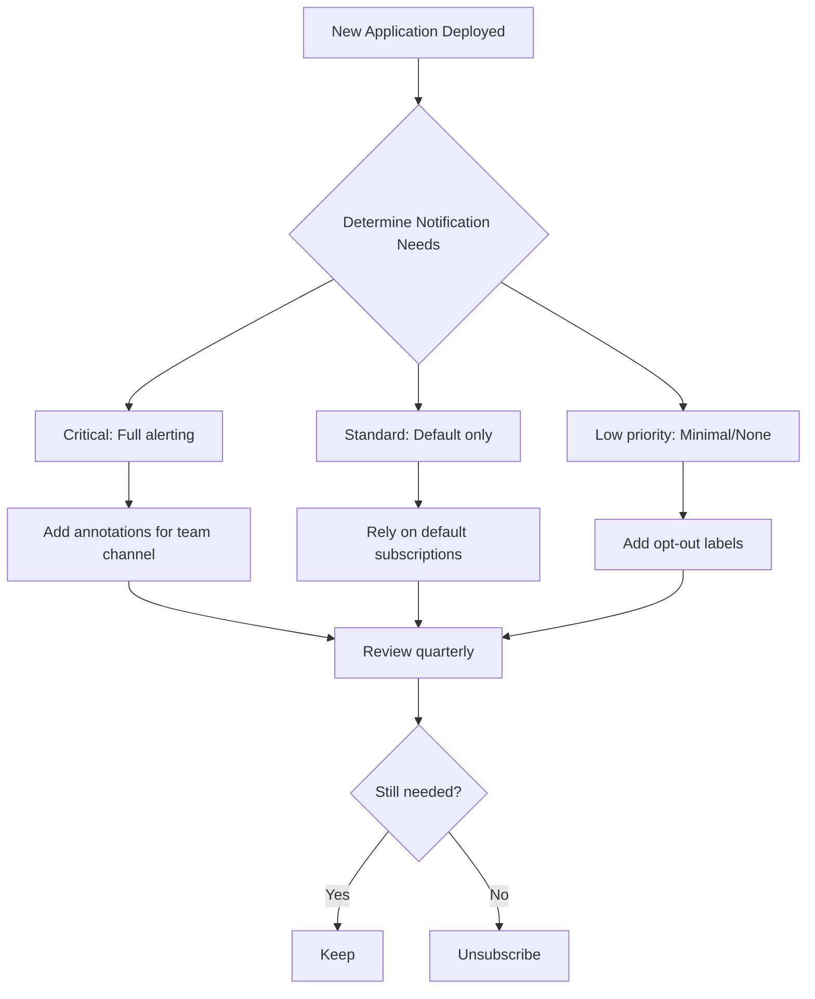

# How to Unsubscribe from Notifications in ArgoCD

Author: [nawazdhandala](https://github.com/nawazdhandala)

Tags: ArgoCD, GitOps, Kubernetes, Notifications

Description: Learn how to unsubscribe ArgoCD applications from notifications, remove annotation-based subscriptions, disable default subscriptions, and manage notification noise across your cluster.

---

Notification fatigue is real. When every sync, every health check, and every deployment triggers a message to your Slack channel, important alerts get lost in the noise. Knowing how to unsubscribe from notifications in ArgoCD is just as important as knowing how to subscribe. This guide covers every method for removing, disabling, and silencing notifications at different levels.

## Removing Annotation-Based Subscriptions

The simplest form of unsubscription is removing the notification annotation from an Application resource.

### Using kubectl

```bash
# Remove a specific notification subscription
kubectl annotate application my-app -n argocd \
  notifications.argoproj.io/subscribe.on-sync-succeeded.slack-

# Remove multiple subscriptions at once
kubectl annotate application my-app -n argocd \
  notifications.argoproj.io/subscribe.on-sync-succeeded.slack- \
  notifications.argoproj.io/subscribe.on-sync-failed.slack- \
  notifications.argoproj.io/subscribe.on-health-degraded.slack-

# Remove ALL notification annotations (careful with this)
kubectl get application my-app -n argocd -o json | \
  jq 'del(.metadata.annotations | to_entries[] | select(.key | startswith("notifications.argoproj.io")))' | \
  kubectl apply -f -
```

The trailing hyphen (`-`) after the annotation key tells kubectl to remove that annotation.

### In Git (GitOps Way)

If your Application resources are managed in Git (which they should be), remove the annotations from the YAML file:

```yaml
# Before: application with notifications
apiVersion: argoproj.io/v1alpha1
kind: Application
metadata:
  name: my-app
  namespace: argocd
  annotations:
    notifications.argoproj.io/subscribe.on-sync-succeeded.slack: my-channel
    notifications.argoproj.io/subscribe.on-sync-failed.slack: my-alerts
    notifications.argoproj.io/subscribe.on-health-degraded.email: team@company.com
spec:
  # ...

# After: notifications removed
apiVersion: argoproj.io/v1alpha1
kind: Application
metadata:
  name: my-app
  namespace: argocd
  # No notification annotations
spec:
  # ...
```

Commit and push the change. When the parent Application (app-of-apps) syncs, the annotations are removed.

### Verifying Removal

```bash
# Confirm no notification annotations remain
kubectl get application my-app -n argocd -o json | \
  jq '.metadata.annotations | to_entries[] | select(.key | startswith("notifications"))'

# Should return empty output
```

## Opting Out of Default Subscriptions

Default subscriptions configured in `argocd-notifications-cm` cannot be removed through annotations. You need a different approach.

### Using Opt-Out Labels

If your default subscriptions use selectors (as recommended), add opt-out labels to the application:

```yaml
# Default subscription with opt-out support
# In argocd-notifications-cm:
subscriptions: |
  - recipients:
      - slack:global-deployments
    triggers:
      - on-sync-succeeded
      - on-sync-failed
    selector: notify-global!=false

  - recipients:
      - slack:critical-alerts
    triggers:
      - on-sync-failed
      - on-health-degraded
    selector: environment=production,notify-critical!=false
```

To opt out:

```yaml
apiVersion: argoproj.io/v1alpha1
kind: Application
metadata:
  name: noisy-batch-job
  namespace: argocd
  labels:
    environment: production
    # Opt out of global deployment notifications
    notify-global: "false"
    # Keep critical alerts (do not add notify-critical: false)
spec:
  # ...
```

To opt out of everything:

```yaml
labels:
  notify-global: "false"
  notify-critical: "false"
```

### Using Trigger Conditions

If your default subscriptions do not use selectors, you can add conditions to the triggers themselves:

```yaml
# In argocd-notifications-cm
trigger.on-sync-failed-default: |
  - when: >
      app.status.operationState.phase in ['Error', 'Failed'] and
      app.metadata.labels['notifications-mute'] != 'all' and
      app.metadata.labels['notifications-mute'] != 'sync'
    send: [sync-failed-template]

trigger.on-health-degraded-default: |
  - when: >
      app.status.health.status == 'Degraded' and
      app.metadata.labels['notifications-mute'] != 'all' and
      app.metadata.labels['notifications-mute'] != 'health'
    send: [health-degraded-template]
```

Applications can then mute specific event categories:

```yaml
# Mute all notifications
labels:
  notifications-mute: "all"

# Mute only sync notifications
labels:
  notifications-mute: "sync"

# Mute only health notifications
labels:
  notifications-mute: "health"
```

## Temporarily Silencing Notifications

Sometimes you need to silence notifications temporarily - during a maintenance window, a migration, or while debugging a flapping application.

### Method 1: Temporary Label

Add a mute label before the maintenance window and remove it after:

```bash
# Silence notifications before maintenance
kubectl label application my-app -n argocd notifications-mute=all

# Do your maintenance work...

# Re-enable notifications after maintenance
kubectl label application my-app -n argocd notifications-mute-
```

### Method 2: Scale Down the Notification Controller

For cluster-wide silencing:

```bash
# Silence all notifications
kubectl scale deployment argocd-notifications-controller -n argocd --replicas=0

# Re-enable notifications
kubectl scale deployment argocd-notifications-controller -n argocd --replicas=1
```

This is a blunt instrument but effective for planned maintenance windows.

### Method 3: Annotation-Based Silencing Window

Create a trigger condition that checks for a silence annotation with a timestamp:

```yaml
trigger.on-sync-failed-silenceable: |
  - when: >
      app.status.operationState.phase in ['Error', 'Failed'] and
      (app.metadata.annotations['notifications-silence-until'] == nil or
       time.Now().Format("2006-01-02T15:04:05Z") > app.metadata.annotations['notifications-silence-until'])
    send: [sync-failed-template]
```

Then silence an application until a specific time:

```bash
# Silence until end of maintenance window
kubectl annotate application my-app -n argocd \
  notifications-silence-until="2026-03-01T06:00:00Z" --overwrite
```

## Unsubscribing from Specific Services

You might want to keep Slack notifications but stop email alerts:

```bash
# Remove only email subscription, keep Slack
kubectl annotate application my-app -n argocd \
  notifications.argoproj.io/subscribe.on-sync-failed.email-

# Keep the Slack subscription
# notifications.argoproj.io/subscribe.on-sync-failed.slack: my-channel (stays)
```

For default subscriptions, use separate opt-out labels per service:

```yaml
subscriptions: |
  - recipients:
      - slack:global-alerts
    triggers:
      - on-sync-failed
    selector: notify-slack!=false

  - recipients:
      - email:sre@company.com
    triggers:
      - on-sync-failed
    selector: notify-email!=false
```

## Disabling Specific Triggers Globally

If you want to disable an entire trigger across all applications:

```yaml
# Option 1: Remove the trigger from argocd-notifications-cm
# Simply delete or comment out the trigger definition

# Option 2: Set an impossible condition
trigger.on-sync-succeeded: |
  - when: "false"
    send: [sync-succeeded-template]

# Option 3: Remove the trigger from all subscriptions
subscriptions: |
  - recipients:
      - slack:global-alerts
    triggers:
      # Removed: on-sync-succeeded
      - on-sync-failed
      - on-health-degraded
```

## Monitoring Unsubscription Status

After making changes, verify that notifications are actually stopped:

```bash
# Check which subscriptions are active for an application
kubectl get application my-app -n argocd -o json | \
  jq '{
    annotations: (.metadata.annotations // {} | to_entries | map(select(.key | startswith("notifications")))),
    labels: (.metadata.labels // {} | to_entries | map(select(.key | startswith("notif"))))
  }'

# Watch notification controller logs to confirm no deliveries
kubectl logs -n argocd deployment/argocd-notifications-controller -f | \
  grep "my-app"

# Trigger a sync and verify no notification is sent
argocd app sync my-app
```

## Notification Hygiene Best Practices



1. **Audit notification subscriptions quarterly** - remove subscriptions for applications or channels that are no longer relevant.
2. **Use opt-out labels from the start** - design your default subscriptions with selector-based opt-out support.
3. **Do not silence permanently** - if you are permanently silencing an application, either fix the underlying noise issue or remove the trigger.
4. **Track notification volume** - monitor how many notifications each channel receives to detect noise problems early.
5. **Make unsubscription self-service** - document the opt-out labels so teams can manage their own notification preferences.

Effective notification management in ArgoCD requires both subscribe and unsubscribe capabilities. By designing your notification architecture with opt-out mechanisms from the beginning, you keep notification channels useful and teams responsive to real alerts. For more on notification configuration, see [How to Configure Notifications in ArgoCD](https://oneuptime.com/blog/post/2026-01-25-notifications-argocd/view).
