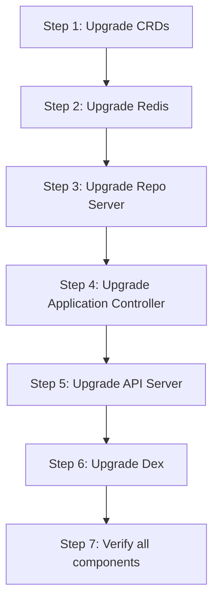

# How to Plan an ArgoCD Upgrade Strategy

Author: [nawazdhandala](https://github.com/nawazdhandala)

Tags: ArgoCD, GitOps, Kubernetes, Upgrades, DevOps

Description: Learn how to plan and execute ArgoCD upgrades safely with pre-upgrade checks, rollback strategies, and zero-downtime upgrade patterns for production environments.

---

Upgrading ArgoCD in production requires careful planning. A failed upgrade can disrupt your entire deployment pipeline since ArgoCD typically manages hundreds or thousands of applications. Unlike regular applications where a brief outage is tolerable, an ArgoCD outage means no deployments, no self-healing, and no drift detection. This guide provides a comprehensive strategy for planning and executing ArgoCD upgrades safely.

## Why Upgrades Need a Strategy

ArgoCD upgrades can involve:

- **CRD changes**: New fields, changed validation rules, or breaking schema changes
- **RBAC changes**: New permissions required for new features
- **Database migrations**: Changes to the Redis cache or underlying data structures
- **API changes**: Breaking changes in the ArgoCD API
- **Dependency updates**: New versions of Redis, Dex, or other components
- **Behavior changes**: Sync policy changes, health check updates, or resource tracking changes

Any of these can cause issues if not handled properly.

## Pre-Upgrade Checklist

Before upgrading, work through this checklist.

### 1. Read the Release Notes

This sounds obvious, but many upgrade issues come from not reading the release notes. Check:

- Breaking changes section
- Deprecation notices
- Migration guides
- Known issues

```bash
# View release notes on GitHub
gh release view v2.12.0 --repo argoproj/argo-cd
```

### 2. Check Kubernetes Compatibility

Each ArgoCD version supports specific Kubernetes versions. Verify compatibility.

```bash
# Check your cluster version
kubectl version --short

# Compare against ArgoCD's compatibility matrix in the docs
```

### 3. Backup Current State

Back up ArgoCD's configuration before upgrading.

```bash
# Export all ArgoCD applications
kubectl get applications -n argocd -o yaml > argocd-apps-backup.yaml

# Export all AppProjects
kubectl get appprojects -n argocd -o yaml > argocd-projects-backup.yaml

# Export ArgoCD ConfigMaps
kubectl get configmap -n argocd argocd-cm -o yaml > argocd-cm-backup.yaml
kubectl get configmap -n argocd argocd-rbac-cm -o yaml > argocd-rbac-cm-backup.yaml
kubectl get configmap -n argocd argocd-cmd-params-cm -o yaml > argocd-cmd-params-backup.yaml

# Export secrets (be careful with these)
kubectl get secret -n argocd argocd-secret -o yaml > argocd-secret-backup.yaml

# Export CRDs
kubectl get crd -l app.kubernetes.io/part-of=argocd -o yaml > argocd-crds-backup.yaml
```

### 4. Audit Current Applications

Check for any applications that are already unhealthy or out of sync.

```bash
# List all applications and their status
argocd app list --output wide

# Find any degraded or unhealthy applications
argocd app list --output json | jq '.[] | select(.status.health.status != "Healthy" or .status.sync.status != "Synced") | {name: .metadata.name, health: .status.health.status, sync: .status.sync.status}'
```

Fix any existing issues before upgrading. You do not want to conflate upgrade problems with pre-existing issues.

### 5. Review Custom Resource Definitions

Check if the new version changes CRDs. CRDs are cluster-scoped and affect all ArgoCD instances.

```bash
# Download new CRDs and diff
kubectl diff -f https://raw.githubusercontent.com/argoproj/argo-cd/v2.12.0/manifests/crds/application-crd.yaml
kubectl diff -f https://raw.githubusercontent.com/argoproj/argo-cd/v2.12.0/manifests/crds/appproject-crd.yaml
```

## Upgrade Strategies

### Strategy 1: In-Place Upgrade (Simplest)

Update the Helm chart version and let ArgoCD upgrade itself.

```yaml
# Update your ArgoCD Helm chart reference
dependencies:
  - name: argo-cd
    version: "7.3.0"  # New version
    repository: "https://argoproj.github.io/argo-helm"
```

This works well for minor version upgrades where the changes are backward compatible. ArgoCD can upgrade itself through GitOps.

**Risks**: If the upgrade breaks ArgoCD, it cannot self-heal.

### Strategy 2: Blue-Green Upgrade (Safest)

Run the new version alongside the old one temporarily.

1. Deploy a new ArgoCD instance in a separate namespace
2. Point a few test applications at the new instance
3. Verify everything works
4. Migrate all applications to the new instance
5. Decommission the old instance

```yaml
# New ArgoCD instance in a different namespace
apiVersion: argoproj.io/v1alpha1
kind: Application
metadata:
  name: argocd-v2-12
  namespace: argocd
spec:
  source:
    path: argocd-new-version
  destination:
    namespace: argocd-v2-12
```

**Risks**: More complex, requires managing two instances temporarily.

### Strategy 3: Canary Upgrade (Balanced)

Upgrade one component at a time in a specific order.



## The Upgrade Process

### Step 1: Upgrade CRDs First

CRDs must be upgraded before the components that use them.

```bash
# Apply new CRDs
kubectl apply --server-side -f https://raw.githubusercontent.com/argoproj/argo-cd/v2.12.0/manifests/crds/application-crd.yaml
kubectl apply --server-side -f https://raw.githubusercontent.com/argoproj/argo-cd/v2.12.0/manifests/crds/appproject-crd.yaml
kubectl apply --server-side -f https://raw.githubusercontent.com/argoproj/argo-cd/v2.12.0/manifests/crds/applicationset-crd.yaml
```

### Step 2: Disable Auto-Sync Temporarily

Prevent ArgoCD from making changes during the upgrade.

```bash
# Disable auto-sync on critical applications
argocd app set critical-app --sync-policy none
```

Or set a maintenance window annotation.

### Step 3: Scale Down Controllers

Reduce the application controller to prevent sync operations during the upgrade.

```bash
kubectl scale deployment argocd-application-controller -n argocd --replicas=0
```

### Step 4: Upgrade Components

Update the Helm values or manifests with the new version and apply.

```bash
# If managed with Helm directly
helm upgrade argocd argo/argo-cd -n argocd -f values.yaml --version 7.3.0

# If ArgoCD manages itself, push the version change to Git
# ArgoCD will detect the change and upgrade itself
```

### Step 5: Verify the Upgrade

```bash
# Check all pods are running
kubectl get pods -n argocd

# Verify the version
argocd version

# Check application health
argocd app list --output wide

# Verify the API is responding
argocd cluster list

# Check for any errors in logs
kubectl logs -n argocd deploy/argocd-application-controller --tail=50
kubectl logs -n argocd deploy/argocd-server --tail=50
kubectl logs -n argocd deploy/argocd-repo-server --tail=50
```

### Step 6: Re-enable Auto-Sync

```bash
# Re-enable auto-sync on applications
argocd app set critical-app --sync-policy automated
```

## Rollback Plan

If the upgrade fails, have a rollback plan ready.

```bash
# Quick rollback using Helm
helm rollback argocd -n argocd

# Manual rollback by applying old manifests
kubectl apply -f argocd-backup/

# Restore CRDs (be careful - this can affect all applications)
kubectl apply --server-side -f argocd-crds-backup.yaml

# Restore configuration
kubectl apply -f argocd-cm-backup.yaml
kubectl apply -f argocd-rbac-cm-backup.yaml
```

## Testing Upgrades in Non-Production First

Always test upgrades in a staging environment first.

```yaml
# Use ApplicationSets to manage ArgoCD across environments
apiVersion: argoproj.io/v1alpha1
kind: ApplicationSet
metadata:
  name: argocd-instances
  namespace: argocd
spec:
  generators:
    - list:
        elements:
          - cluster: staging
            version: "7.3.0"  # Upgrade staging first
          - cluster: production
            version: "7.2.0"  # Keep production on old version until staging is verified
  template:
    metadata:
      name: "argocd-{{cluster}}"
    spec:
      source:
        chart: argo-cd
        repoURL: https://argoproj.github.io/argo-helm
        targetRevision: "{{version}}"
```

## Post-Upgrade Tasks

After a successful upgrade:

1. **Review deprecated features**: Check if any features you use are deprecated
2. **Enable new features**: Review new features that might benefit your workflow
3. **Update documentation**: Update your runbooks with the new version information
4. **Monitor for issues**: Watch logs and metrics closely for the first 24 to 48 hours
5. **Update CLI tools**: Ensure all team members update their `argocd` CLI

## Summary

Planning an ArgoCD upgrade strategy is about reducing risk while maintaining your deployment pipeline's availability. The key steps are reading release notes thoroughly, backing up your configuration, testing in staging first, and having a clear rollback plan. For minor version upgrades, an in-place upgrade with proper backups is usually sufficient. For major version upgrades or environments with strict SLAs, a blue-green approach provides the safest path forward.
