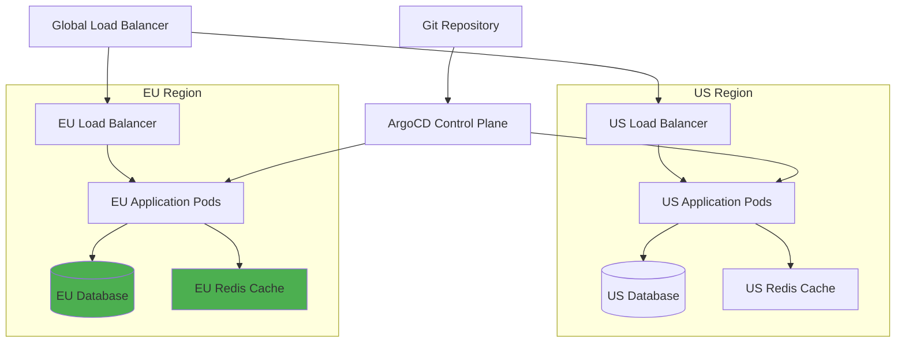

# How to Deploy to US and EU Regions with ArgoCD

Author: [nawazdhandala](https://github.com/nawazdhandala)

Tags: ArgoCD, GitOps, Kubernetes, Multi-Region, GDPR

Description: Learn how to deploy applications across US and EU regions with ArgoCD, handling GDPR compliance, data residency, latency optimization, and region-specific configurations.

---

Deploying to both US and EU regions is one of the most common multi-region patterns. It combines the technical challenge of managing infrastructure across geographic boundaries with the regulatory challenge of EU data protection laws. ArgoCD provides the tools to manage both aspects through Git, making your deployments consistent, auditable, and compliant.

This guide covers the practical setup for US and EU deployment, including GDPR-specific configuration, cluster registration, progressive rollout, and monitoring.

## Architecture Overview



The EU region has additional compliance requirements indicated by the green-highlighted components - these store data that must not leave the EU.

## Step 1: Register Both Clusters

```yaml
# argocd/clusters/us-cluster.yaml
apiVersion: v1
kind: Secret
metadata:
  name: us-production-cluster
  namespace: argocd
  labels:
    argocd.argoproj.io/secret-type: cluster
    region: us-east-1
    environment: production
    data-jurisdiction: us
type: Opaque
stringData:
  name: us-production
  server: https://api.us-east-1.k8s.company.com
  config: |
    {
      "bearerToken": "<service-account-token>",
      "tlsClientConfig": {
        "insecure": false,
        "caData": "<base64-ca-cert>"
      }
    }
---
# argocd/clusters/eu-cluster.yaml
apiVersion: v1
kind: Secret
metadata:
  name: eu-production-cluster
  namespace: argocd
  labels:
    argocd.argoproj.io/secret-type: cluster
    region: eu-west-1
    environment: production
    data-jurisdiction: eu
type: Opaque
stringData:
  name: eu-production
  server: https://api.eu-west-1.k8s.company.com
  config: |
    {
      "bearerToken": "<service-account-token>",
      "tlsClientConfig": {
        "insecure": false,
        "caData": "<base64-ca-cert>"
      }
    }
```

## Step 2: Repository Structure

Organize your deployment manifests to clearly separate US and EU configurations:

```
deploy/
  base/
    kustomization.yaml
    deployment.yaml
    service.yaml
    hpa.yaml
    network-policy.yaml
  overlays/
    us-east-1/
      kustomization.yaml
      config.yaml
    eu-west-1/
      kustomization.yaml
      config.yaml
      gdpr/
        data-protection-annotations.yaml
        pii-encryption-config.yaml
        log-sanitization.yaml
        consent-service.yaml
```

## Step 3: Base Configuration

```yaml
# deploy/base/kustomization.yaml
apiVersion: kustomize.config.k8s.io/v1beta1
kind: Kustomization
commonLabels:
  app: user-service
resources:
  - deployment.yaml
  - service.yaml
  - hpa.yaml
  - network-policy.yaml
```

```yaml
# deploy/base/deployment.yaml
apiVersion: apps/v1
kind: Deployment
metadata:
  name: user-service
spec:
  selector:
    matchLabels:
      app: user-service
  template:
    spec:
      containers:
        - name: user-service
          image: registry.company.com/user-service:v3.0.0
          ports:
            - containerPort: 8080
          envFrom:
            - configMapRef:
                name: region-config
            - secretRef:
                name: user-service-secrets
          livenessProbe:
            httpGet:
              path: /health
              port: 8080
          readinessProbe:
            httpGet:
              path: /ready
              port: 8080
          resources:
            requests:
              cpu: 200m
              memory: 256Mi
            limits:
              cpu: "1"
              memory: 512Mi
```

## Step 4: US Region Configuration

```yaml
# deploy/overlays/us-east-1/kustomization.yaml
apiVersion: kustomize.config.k8s.io/v1beta1
kind: Kustomization
resources:
  - ../../base
configMapGenerator:
  - name: region-config
    behavior: replace
    literals:
      - REGION=us-east-1
      - DATABASE_URL=postgresql://users-db.us-east-1.rds.amazonaws.com:5432/users
      - REDIS_URL=redis://redis.us-east-1.cache.amazonaws.com:6379
      - S3_BUCKET=company-user-data-us
      - CDN_URL=https://cdn-us.company.com
      - TIMEZONE=America/New_York
      - LOCALE=en-US
      - CURRENCY=USD
      - DATA_RESIDENCY=us
patches:
  - path: config.yaml
```

```yaml
# deploy/overlays/us-east-1/config.yaml
apiVersion: autoscaling/v2
kind: HorizontalPodAutoscaler
metadata:
  name: user-service
spec:
  minReplicas: 3
  maxReplicas: 15
  metrics:
    - type: Resource
      resource:
        name: cpu
        target:
          type: Utilization
          averageUtilization: 70
```

## Step 5: EU Region Configuration with GDPR

The EU overlay includes everything from the US overlay plus GDPR-specific configuration:

```yaml
# deploy/overlays/eu-west-1/kustomization.yaml
apiVersion: kustomize.config.k8s.io/v1beta1
kind: Kustomization
resources:
  - ../../base
  - gdpr/consent-service.yaml
configMapGenerator:
  - name: region-config
    behavior: replace
    literals:
      - REGION=eu-west-1
      - DATABASE_URL=postgresql://users-db.eu-west-1.rds.amazonaws.com:5432/users
      - REDIS_URL=redis://redis.eu-west-1.cache.amazonaws.com:6379
      - S3_BUCKET=company-user-data-eu
      - CDN_URL=https://cdn-eu.company.com
      - TIMEZONE=Europe/London
      - LOCALE=en-EU
      - CURRENCY=EUR
      - DATA_RESIDENCY=eu
      # GDPR-specific configuration
      - GDPR_MODE=strict
      - PII_ENCRYPTION=aes-256-gcm
      - DATA_RETENTION_DAYS=365
      - RIGHT_TO_ERASURE=enabled
      - DATA_PORTABILITY=enabled
      - CONSENT_REQUIRED=true
      - LOG_PII_REDACTION=enabled
      - ANALYTICS_ANONYMIZE=true
patches:
  - path: config.yaml
  - path: gdpr/data-protection-annotations.yaml
  - path: gdpr/pii-encryption-config.yaml
  - path: gdpr/log-sanitization.yaml
```

```yaml
# deploy/overlays/eu-west-1/gdpr/data-protection-annotations.yaml
apiVersion: apps/v1
kind: Deployment
metadata:
  name: user-service
  annotations:
    compliance.company.com/gdpr: "true"
    compliance.company.com/data-classification: "personal-data"
    compliance.company.com/data-processor: "company-inc"
    compliance.company.com/legal-basis: "consent"
    compliance.company.com/retention-period: "365d"
    compliance.company.com/dpo-contact: "dpo@company.com"
spec:
  template:
    metadata:
      annotations:
        compliance.company.com/gdpr: "true"
        compliance.company.com/no-external-logging: "true"
```

```yaml
# deploy/overlays/eu-west-1/gdpr/pii-encryption-config.yaml
apiVersion: apps/v1
kind: Deployment
metadata:
  name: user-service
spec:
  template:
    spec:
      containers:
        - name: user-service
          env:
            - name: PII_FIELDS
              value: "email,phone,name,address,ip_address"
            - name: ENCRYPTION_KEY_ARN
              value: "arn:aws:kms:eu-west-1:123456789:key/eu-data-key"
            - name: PII_STORAGE_REGION
              value: "eu-west-1"
            - name: CROSS_REGION_PII_TRANSFER
              value: "deny"
```

```yaml
# deploy/overlays/eu-west-1/gdpr/log-sanitization.yaml
apiVersion: apps/v1
kind: Deployment
metadata:
  name: user-service
spec:
  template:
    spec:
      containers:
        - name: user-service
          env:
            - name: LOG_SANITIZE_PII
              value: "true"
            - name: LOG_SANITIZE_FIELDS
              value: "email,phone,ssn,credit_card,ip_address"
            - name: LOG_DESTINATION
              value: "eu-west-1"  # Logs must stay in EU
            - name: LOG_RETENTION
              value: "365d"
```

```yaml
# deploy/overlays/eu-west-1/gdpr/consent-service.yaml
# Sidecar for consent verification (EU only)
apiVersion: apps/v1
kind: Deployment
metadata:
  name: user-service
spec:
  template:
    spec:
      containers:
        - name: consent-proxy
          image: registry.company.com/consent-proxy:v1.2.0
          ports:
            - containerPort: 8081
          env:
            - name: UPSTREAM_URL
              value: "http://localhost:8080"
            - name: CONSENT_SERVICE_URL
              value: "http://consent-service.gdpr.svc:8080"
            - name: REQUIRE_CONSENT_FOR
              value: "/api/users/*,/api/profile/*"
          resources:
            requests:
              cpu: 50m
              memory: 64Mi
            limits:
              cpu: 200m
              memory: 128Mi
```

## Step 6: Create the ApplicationSet

```yaml
# argocd/applicationsets/user-service.yaml
apiVersion: argoproj.io/v1alpha1
kind: ApplicationSet
metadata:
  name: user-service-global
  namespace: argocd
spec:
  generators:
    - clusters:
        selector:
          matchLabels:
            environment: production
  strategy:
    type: RollingSync
    rollingSync:
      steps:
        # Deploy to US first (canary)
        - matchExpressions:
            - key: region
              operator: In
              values: [us-east-1]
        # Then EU
        - matchExpressions:
            - key: region
              operator: In
              values: [eu-west-1]
  template:
    metadata:
      name: "user-service-{{name}}"
      labels:
        app: user-service
        region: "{{metadata.labels.region}}"
        data-jurisdiction: "{{metadata.labels.data-jurisdiction}}"
    spec:
      project: global-apps
      source:
        repoURL: https://github.com/company/user-service.git
        targetRevision: main
        path: "deploy/overlays/{{metadata.labels.region}}"
      destination:
        server: "{{server}}"
        namespace: user-service
      syncPolicy:
        automated:
          prune: true
          selfHeal: true
        syncOptions:
          - CreateNamespace=true
```

## Step 7: Network Policies for Data Isolation

Ensure EU data cannot flow to US services:

```yaml
# deploy/overlays/eu-west-1/network-policy-gdpr.yaml
apiVersion: networking.k8s.io/v1
kind: NetworkPolicy
metadata:
  name: eu-data-isolation
  namespace: user-service
spec:
  podSelector:
    matchLabels:
      app: user-service
  policyTypes:
    - Egress
  egress:
    # Allow communication within EU region only
    - to:
        - namespaceSelector:
            matchLabels:
              region: eu-west-1
    # Allow DNS
    - ports:
        - port: 53
          protocol: UDP
    # Allow EU database
    - to:
        - ipBlock:
            cidr: 10.100.0.0/16  # EU VPC CIDR
    # Block US endpoints explicitly
    # (defense in depth - application config also prevents this)
```

## Step 8: Monitoring Both Regions

Set up region-aware monitoring:

```yaml
# monitoring/global-alerts.yaml
apiVersion: monitoring.coreos.com/v1
kind: PrometheusRule
metadata:
  name: user-service-global-alerts
spec:
  groups:
    - name: user-service.global
      rules:
        - alert: RegionLatencyDrift
          expr: |
            abs(
              avg by (region) (http_request_duration_seconds{app="user-service",quantile="0.99"})
              - ignoring(region) group_left
              avg(http_request_duration_seconds{app="user-service",quantile="0.99"})
            ) > 0.5
          for: 10m
          annotations:
            summary: "User service latency varies significantly between regions"

        - alert: EUDataResidencyViolation
          expr: |
            increase(
              cross_region_data_transfer_total{
                source_region="eu-west-1",
                destination_region!="eu-west-1",
                data_type="pii"
              }[1h]
            ) > 0
          for: 1m
          labels:
            severity: critical
            compliance: gdpr
          annotations:
            summary: "PII data transfer detected from EU to non-EU region"
```

Use [OneUptime](https://oneuptime.com) for monitoring both US and EU application health from a single dashboard, with region-aware alerting that notifies the appropriate on-call team based on geography.

## Conclusion

Deploying to US and EU regions with ArgoCD requires careful separation of configuration and strong compliance controls for the EU deployment. Kustomize overlays cleanly separate regional configuration, GDPR-specific patches add compliance requirements only to EU deployments, and progressive rollout ensures changes are validated in one region before reaching the other. The critical practices are: never allow PII to cross regional boundaries, use separate databases and caches per region, encrypt PII at rest and in transit, sanitize logs in the EU region, and monitor for data residency violations. With these controls managed through Git and enforced by ArgoCD, your multi-region deployment is both compliant and auditable.
