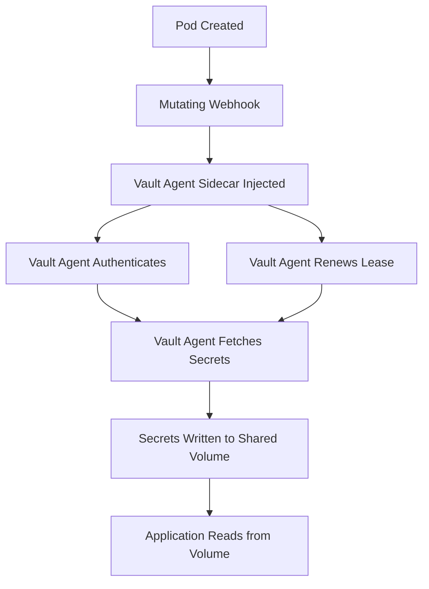

# How to Use Vault Agent Injector with ArgoCD

Author: [nawazdhandala](https://github.com/nawazdhandala)

Tags: ArgoCD, GitOps, Kubernetes, Vault, Secret Injection

Description: Learn how to use the HashiCorp Vault Agent Injector with ArgoCD to automatically inject secrets into pods as files or environment variables at runtime.

---

The Vault Agent Injector is a Kubernetes mutating admission webhook that automatically injects a Vault Agent sidecar into pods. This sidecar fetches secrets from Vault and writes them to a shared volume that your application container can read. When combined with ArgoCD, you get a powerful pattern where your Git repository contains only Vault annotations, and actual secret values are injected at pod startup. This guide covers the complete setup.

## How Vault Agent Injection Works



The key benefit is that your application does not need to know about Vault at all. It just reads files from a directory, and the Vault Agent sidecar handles everything else.

## Prerequisites

- ArgoCD installed on Kubernetes
- HashiCorp Vault deployed (can be external or in-cluster)
- Vault configured with Kubernetes authentication

## Installing the Vault Agent Injector

Deploy the Vault injector using ArgoCD:

```yaml
apiVersion: argoproj.io/v1alpha1
kind: Application
metadata:
  name: vault
  namespace: argocd
spec:
  project: default
  source:
    repoURL: https://helm.releases.hashicorp.com
    chart: vault
    targetRevision: 0.28.0
    helm:
      values: |
        # We only need the injector, not the full Vault server
        server:
          enabled: false
        injector:
          enabled: true
          externalVaultAddr: "https://vault.example.com"
        csi:
          enabled: false
  destination:
    server: https://kubernetes.default.svc
    namespace: vault
  syncPolicy:
    automated:
      prune: true
      selfHeal: true
    syncOptions:
      - CreateNamespace=true
```

If Vault is running in-cluster, you can deploy both the server and injector:

```yaml
helm:
  values: |
    server:
      enabled: true
      ha:
        enabled: true
        replicas: 3
    injector:
      enabled: true
```

## Configuring Vault for Kubernetes Auth

```bash
# Enable Kubernetes auth
vault auth enable kubernetes

# Configure with the cluster's details
vault write auth/kubernetes/config \
  kubernetes_host="https://kubernetes.default.svc:443"

# Create a policy for the application
vault policy write my-app - <<EOF
path "secret/data/my-app/*" {
  capabilities = ["read"]
}
path "database/creds/my-app" {
  capabilities = ["read"]
}
EOF

# Create a role that maps Kubernetes service accounts to Vault policies
vault write auth/kubernetes/role/my-app \
  bound_service_account_names=my-app \
  bound_service_account_namespaces=app \
  policies=my-app \
  ttl=1h
```

## Annotating Pods for Secret Injection

The Vault Agent Injector uses pod annotations to determine what secrets to inject. Here is how to configure it in your deployment manifests managed by ArgoCD.

### Basic Secret Injection

```yaml
apiVersion: apps/v1
kind: Deployment
metadata:
  name: my-app
  namespace: app
spec:
  replicas: 2
  selector:
    matchLabels:
      app: my-app
  template:
    metadata:
      labels:
        app: my-app
      annotations:
        # Enable Vault Agent injection
        vault.hashicorp.com/agent-inject: "true"
        # Vault role to use for authentication
        vault.hashicorp.com/role: "my-app"
        # Inject the database password
        vault.hashicorp.com/agent-inject-secret-db-password: "secret/data/my-app/database"
        # Inject the API key
        vault.hashicorp.com/agent-inject-secret-api-key: "secret/data/my-app/api"
    spec:
      serviceAccountName: my-app
      containers:
        - name: app
          image: my-app:latest
          # Secrets are available as files in /vault/secrets/
          # /vault/secrets/db-password
          # /vault/secrets/api-key
```

The secrets are written as files to `/vault/secrets/` by default. The filename matches the annotation suffix after `agent-inject-secret-`.

### Custom Templates for Secret Formatting

By default, Vault writes the raw JSON response. Use templates to format the output:

```yaml
metadata:
  annotations:
    vault.hashicorp.com/agent-inject: "true"
    vault.hashicorp.com/role: "my-app"
    # Inject as a formatted file
    vault.hashicorp.com/agent-inject-secret-config: "secret/data/my-app/database"
    vault.hashicorp.com/agent-inject-template-config: |
      {{- with secret "secret/data/my-app/database" -}}
      DB_HOST={{ .Data.data.host }}
      DB_PORT={{ .Data.data.port }}
      DB_USERNAME={{ .Data.data.username }}
      DB_PASSWORD={{ .Data.data.password }}
      {{- end }}
```

This writes a `.env` style file to `/vault/secrets/config` that your application can source.

### Injecting as Environment Variables

While Vault Agent writes files, you can use an init container pattern to load them as environment variables:

```yaml
metadata:
  annotations:
    vault.hashicorp.com/agent-inject: "true"
    vault.hashicorp.com/role: "my-app"
    vault.hashicorp.com/agent-inject-secret-env: "secret/data/my-app/config"
    vault.hashicorp.com/agent-inject-template-env: |
      {{- with secret "secret/data/my-app/config" -}}
      export DB_PASSWORD="{{ .Data.data.password }}"
      export API_KEY="{{ .Data.data.api_key }}"
      {{- end }}
spec:
  containers:
    - name: app
      command: ["/bin/sh", "-c"]
      args:
        - source /vault/secrets/env && exec /app/start
```

### Multiple Secret Paths

```yaml
metadata:
  annotations:
    vault.hashicorp.com/agent-inject: "true"
    vault.hashicorp.com/role: "my-app"
    # Database credentials
    vault.hashicorp.com/agent-inject-secret-db: "secret/data/my-app/database"
    vault.hashicorp.com/agent-inject-template-db: |
      {{- with secret "secret/data/my-app/database" -}}
      {{ .Data.data.password }}
      {{- end }}
    # API credentials
    vault.hashicorp.com/agent-inject-secret-api: "secret/data/my-app/api"
    vault.hashicorp.com/agent-inject-template-api: |
      {{- with secret "secret/data/my-app/api" -}}
      {{ .Data.data.key }}
      {{- end }}
    # TLS certificate
    vault.hashicorp.com/agent-inject-secret-tls-cert: "pki/issue/my-app"
    vault.hashicorp.com/agent-inject-template-tls-cert: |
      {{- with secret "pki/issue/my-app" "common_name=my-app.example.com" -}}
      {{ .Data.certificate }}
      {{- end }}
```

## Dynamic Database Credentials

One of Vault's most powerful features is generating short-lived database credentials:

```yaml
metadata:
  annotations:
    vault.hashicorp.com/agent-inject: "true"
    vault.hashicorp.com/role: "my-app"
    vault.hashicorp.com/agent-inject-secret-db-creds: "database/creds/my-app"
    vault.hashicorp.com/agent-inject-template-db-creds: |
      {{- with secret "database/creds/my-app" -}}
      DB_USERNAME={{ .Data.username }}
      DB_PASSWORD={{ .Data.password }}
      {{- end }}
    # Keep the sidecar running to renew the lease
    vault.hashicorp.com/agent-pre-populate-only: "false"
```

The `agent-pre-populate-only: "false"` annotation keeps the Vault Agent running as a sidecar (not just an init container), so it can renew the dynamic credential's lease.

## ArgoCD-Specific Considerations

### Service Account Creation

ArgoCD needs to deploy the service account that Vault uses for authentication:

```yaml
apiVersion: v1
kind: ServiceAccount
metadata:
  name: my-app
  namespace: app
  annotations:
    argocd.argoproj.io/sync-wave: "-2"  # Create before the deployment
```

### Handling ArgoCD Diff Detection

The Vault Agent modifies the pod spec by injecting the sidecar. ArgoCD might show this as a diff. Configure ignore differences:

```yaml
apiVersion: argoproj.io/v1alpha1
kind: Application
metadata:
  name: my-app
  namespace: argocd
spec:
  ignoreDifferences:
    - group: apps
      kind: Deployment
      jsonPointers:
        - /spec/template/metadata/annotations/vault.hashicorp.com~1agent-inject-status
    - group: ""
      kind: Secret
      jsonPointers:
        - /data
```

### Health Check for Vault-Injected Pods

Ensure your pods only become ready after Vault secrets are injected:

```yaml
containers:
  - name: app
    readinessProbe:
      exec:
        command:
          - sh
          - -c
          - test -f /vault/secrets/db-password
      initialDelaySeconds: 5
      periodSeconds: 5
```

## Complete Example

Here is a full deployment managed by ArgoCD with Vault Agent injection:

```yaml
apiVersion: v1
kind: ServiceAccount
metadata:
  name: my-app
  namespace: app
---
apiVersion: apps/v1
kind: Deployment
metadata:
  name: my-app
  namespace: app
spec:
  replicas: 3
  selector:
    matchLabels:
      app: my-app
  template:
    metadata:
      labels:
        app: my-app
      annotations:
        vault.hashicorp.com/agent-inject: "true"
        vault.hashicorp.com/role: "my-app"
        vault.hashicorp.com/agent-inject-secret-config: "secret/data/my-app/config"
        vault.hashicorp.com/agent-inject-template-config: |
          {{- with secret "secret/data/my-app/config" -}}
          DB_HOST={{ .Data.data.db_host }}
          DB_PORT={{ .Data.data.db_port }}
          DB_PASSWORD={{ .Data.data.db_password }}
          API_KEY={{ .Data.data.api_key }}
          {{- end }}
        vault.hashicorp.com/agent-pre-populate-only: "false"
    spec:
      serviceAccountName: my-app
      containers:
        - name: app
          image: my-app:1.0.0
          command: ["/bin/sh", "-c"]
          args:
            - source /vault/secrets/config && exec /app/start
          ports:
            - containerPort: 8080
          readinessProbe:
            exec:
              command: ["test", "-f", "/vault/secrets/config"]
            initialDelaySeconds: 5
```

## Troubleshooting

```bash
# Check if the webhook is running
kubectl get pods -n vault -l app.kubernetes.io/name=vault-agent-injector

# Check webhook logs
kubectl logs -n vault -l app.kubernetes.io/name=vault-agent-injector

# Check the init container logs (Vault Agent)
kubectl logs my-app-pod -n app -c vault-agent-init

# Check the sidecar logs
kubectl logs my-app-pod -n app -c vault-agent

# Verify the secrets are written
kubectl exec my-app-pod -n app -c app -- cat /vault/secrets/config
```

## Conclusion

The Vault Agent Injector provides a transparent way to inject secrets into ArgoCD-managed applications. Your Git repository only contains annotations - no secret values, no encrypted data, not even references to specific secret stores. The Vault Agent handles authentication, secret fetching, lease renewal, and file writing. Combined with ArgoCD's GitOps workflow, you get a clean separation between application deployment (managed by ArgoCD) and secret delivery (managed by Vault).

For alternative Vault integration approaches, see our guides on [managing secrets with HashiCorp Vault and ArgoCD](https://oneuptime.com/blog/post/2026-02-26-argocd-hashicorp-vault-secrets/view) and [using CSI Secrets Store Driver with ArgoCD](https://oneuptime.com/blog/post/2026-02-26-argocd-csi-secrets-store-driver/view).
