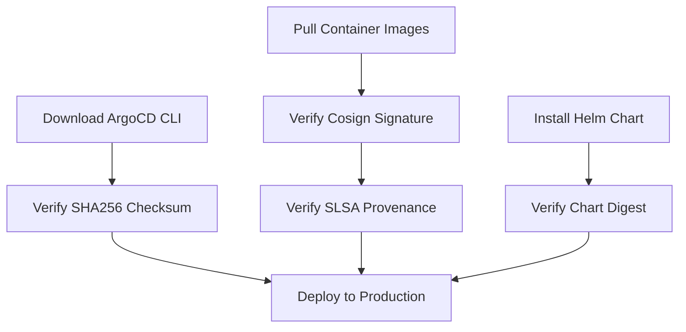

# How to Verify ArgoCD Release Signatures and Checksums

Author: [nawazdhandala](https://github.com/nawazdhandala)

Tags: ArgoCD, GitOps, Kubernetes, Security, Supply Chain

Description: Learn how to verify ArgoCD release binaries and container images using checksums, GPG signatures, and cosign for supply chain security.

---

Supply chain attacks are a growing concern in the software industry. When you install ArgoCD, you are trusting that the binaries and container images have not been tampered with. Verifying release signatures and checksums ensures that what you install is exactly what the ArgoCD project published. This guide covers every method of verification available.

## Why Verification Matters

In 2020, the SolarWinds attack demonstrated how devastating supply chain compromises can be. The Kubernetes ecosystem is not immune to these threats. When you pull an ArgoCD container image or download the CLI binary, you need confidence that it came from the official ArgoCD project and was not modified in transit.

ArgoCD provides multiple verification mechanisms:

- SHA256 checksums for CLI binaries
- GPG signatures for releases
- Cosign signatures for container images
- SLSA provenance attestations

## Verifying CLI Binary Checksums

When downloading the ArgoCD CLI, always verify the checksum.

### Download and Verify on Linux

```bash
# Download the CLI binary
VERSION=v2.13.0
curl -sSL -o argocd-linux-amd64 \
  https://github.com/argoproj/argo-cd/releases/download/${VERSION}/argocd-linux-amd64

# Download the checksum file
curl -sSL -o checksums.txt \
  https://github.com/argoproj/argo-cd/releases/download/${VERSION}/argocd-${VERSION}-checksums.txt

# Verify the checksum
sha256sum argocd-linux-amd64
grep argocd-linux-amd64 checksums.txt

# Or verify automatically
sha256sum -c <(grep argocd-linux-amd64 checksums.txt)
```

### Download and Verify on macOS

```bash
VERSION=v2.13.0
curl -sSL -o argocd-darwin-amd64 \
  https://github.com/argoproj/argo-cd/releases/download/${VERSION}/argocd-darwin-amd64

curl -sSL -o checksums.txt \
  https://github.com/argoproj/argo-cd/releases/download/${VERSION}/argocd-${VERSION}-checksums.txt

# macOS uses shasum instead of sha256sum
shasum -a 256 argocd-darwin-amd64
grep argocd-darwin-amd64 checksums.txt
```

For Apple Silicon Macs, use `argocd-darwin-arm64` instead.

### Automating Checksum Verification in Scripts

If you automate ArgoCD CLI installation in your CI/CD pipeline or setup scripts, always include verification:

```bash
#!/bin/bash
set -euo pipefail

VERSION="${1:-v2.13.0}"
OS=$(uname -s | tr '[:upper:]' '[:lower:]')
ARCH=$(uname -m)

# Map architecture names
case $ARCH in
  x86_64) ARCH="amd64" ;;
  aarch64|arm64) ARCH="arm64" ;;
esac

BINARY="argocd-${OS}-${ARCH}"
BASE_URL="https://github.com/argoproj/argo-cd/releases/download/${VERSION}"

# Download binary and checksums
curl -sSL -o /tmp/argocd "${BASE_URL}/${BINARY}"
curl -sSL -o /tmp/checksums.txt "${BASE_URL}/argocd-${VERSION}-checksums.txt"

# Extract expected checksum
EXPECTED=$(grep "${BINARY}" /tmp/checksums.txt | awk '{print $1}')
ACTUAL=$(sha256sum /tmp/argocd | awk '{print $1}')

if [ "$EXPECTED" != "$ACTUAL" ]; then
  echo "ERROR: Checksum verification failed!"
  echo "Expected: $EXPECTED"
  echo "Actual:   $ACTUAL"
  exit 1
fi

echo "Checksum verified successfully"
chmod +x /tmp/argocd
sudo mv /tmp/argocd /usr/local/bin/argocd
```

## Verifying Container Image Signatures with Cosign

ArgoCD container images are signed using cosign from the Sigstore project. This is the most robust verification method for container images.

### Installing Cosign

```bash
# Install cosign
brew install cosign  # macOS
# or
go install github.com/sigstore/cosign/v2/cmd/cosign@latest
```

### Verifying ArgoCD Images

```bash
# Verify the ArgoCD server image
cosign verify \
  --certificate-identity-regexp="https://github.com/argoproj/argo-cd" \
  --certificate-oidc-issuer="https://token.actions.githubusercontent.com" \
  quay.io/argoproj/argocd:v2.13.0

# Verify the argocd-applicationset-controller image
cosign verify \
  --certificate-identity-regexp="https://github.com/argoproj/argo-cd" \
  --certificate-oidc-issuer="https://token.actions.githubusercontent.com" \
  quay.io/argoproj/argocd:v2.13.0
```

A successful verification outputs the signature payload:

```json
[
  {
    "critical": {
      "identity": {
        "docker-reference": "quay.io/argoproj/argocd"
      },
      "image": {
        "docker-manifest-digest": "sha256:abc123..."
      },
      "type": "cosign container image signature"
    }
  }
]
```

### Integrating Image Verification into Your Pipeline

You can enforce image verification in your deployment pipeline:

```yaml
# Kyverno policy to verify ArgoCD image signatures
apiVersion: kyverno.io/v1
kind: ClusterPolicy
metadata:
  name: verify-argocd-images
spec:
  validationFailureAction: Enforce
  background: false
  rules:
    - name: verify-signature
      match:
        any:
          - resources:
              kinds:
                - Pod
              namespaces:
                - argocd
      verifyImages:
        - imageReferences:
            - "quay.io/argoproj/argocd:*"
          attestors:
            - entries:
                - keyless:
                    subject: "https://github.com/argoproj/argo-cd/*"
                    issuer: "https://token.actions.githubusercontent.com"
```

## Verifying SLSA Provenance

SLSA (Supply-chain Levels for Software Artifacts) provenance attestations provide a verifiable record of how the software was built. ArgoCD publishes SLSA provenance for its releases.

```bash
# Install slsa-verifier
go install github.com/slsa-framework/slsa-verifier/v2/cli/slsa-verifier@latest

# Verify the CLI binary provenance
slsa-verifier verify-artifact argocd-linux-amd64 \
  --provenance-path argocd-linux-amd64.intoto.jsonl \
  --source-uri github.com/argoproj/argo-cd \
  --source-tag v2.13.0
```

## Verifying GPG Signatures

ArgoCD releases may include GPG signatures. You can verify them with the ArgoCD project's public key:

```bash
# Import the ArgoCD release signing key
gpg --keyserver keyserver.ubuntu.com --recv-keys <KEY_ID>

# Download the signature file
curl -sSL -o argocd-linux-amd64.asc \
  https://github.com/argoproj/argo-cd/releases/download/v2.13.0/argocd-linux-amd64.asc

# Verify the signature
gpg --verify argocd-linux-amd64.asc argocd-linux-amd64
```

## Verifying Helm Chart Integrity

If you install ArgoCD via Helm, verify the chart's integrity:

```bash
# Pull the chart without installing
helm pull argo/argo-cd --version 7.0.0 --verify

# Or manually verify the chart digest
helm pull argo/argo-cd --version 7.0.0
sha256sum argo-cd-7.0.0.tgz
```

Compare the checksum against the value published on the Artifact Hub or the official Helm repository.

## Building a Verification Policy

For a production environment, implement verification at multiple levels:



Create a comprehensive verification script for your team:

```bash
#!/bin/bash
set -euo pipefail

VERSION="v2.13.0"
IMAGE="quay.io/argoproj/argocd:${VERSION}"

echo "=== Verifying ArgoCD ${VERSION} ==="

# Step 1: Verify container image signature
echo "Verifying container image signature..."
cosign verify \
  --certificate-identity-regexp="https://github.com/argoproj/argo-cd" \
  --certificate-oidc-issuer="https://token.actions.githubusercontent.com" \
  "${IMAGE}" > /dev/null 2>&1 && echo "Image signature: VERIFIED" || echo "Image signature: FAILED"

# Step 2: Verify CLI checksum
echo "Verifying CLI binary checksum..."
EXPECTED=$(curl -sSL "https://github.com/argoproj/argo-cd/releases/download/${VERSION}/argocd-${VERSION}-checksums.txt" | grep "argocd-linux-amd64" | awk '{print $1}')
ACTUAL=$(sha256sum /usr/local/bin/argocd | awk '{print $1}')
[ "$EXPECTED" = "$ACTUAL" ] && echo "CLI checksum: VERIFIED" || echo "CLI checksum: FAILED"

echo "=== Verification Complete ==="
```

## Conclusion

Verifying ArgoCD releases is a critical step that many teams skip. In a world where supply chain attacks are increasingly common, taking five minutes to verify checksums and signatures can prevent catastrophic security incidents. Use cosign for container images, SHA256 checksums for CLI binaries, and SLSA provenance for full build verification. Integrate these checks into your automation so they happen every time, not just when someone remembers.

For more security practices, check out our guide on [hardening ArgoCD server for production](https://oneuptime.com/blog/post/2026-02-26-argocd-harden-server-production/view).
