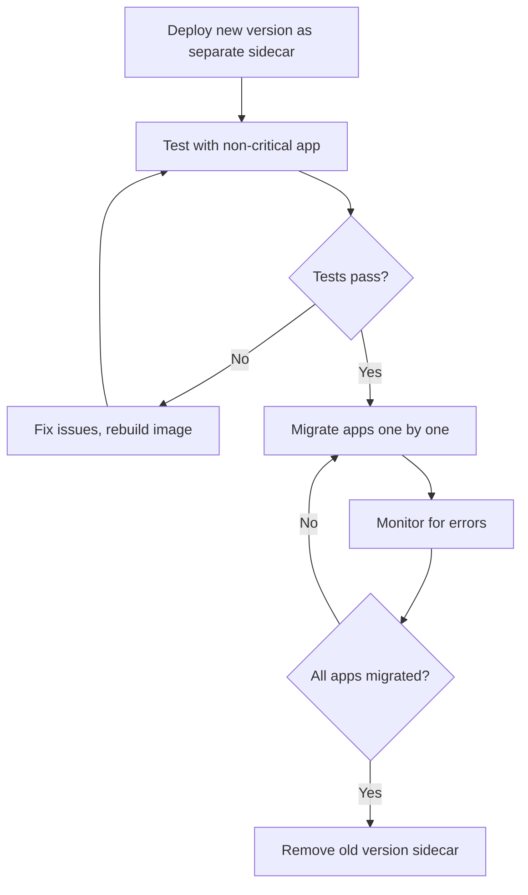

# How to Version Custom Plugins for ArgoCD

Author: [nawazdhandala](https://github.com/nawazdhandala)

Tags: ArgoCD, GitOps, Kubernetes, Config Management Plugins, Versioning

Description: Learn best practices for versioning ArgoCD Config Management Plugins to manage upgrades, rollbacks, and compatibility across your GitOps infrastructure.

---

As your ArgoCD CMP plugins evolve, you need a versioning strategy that lets you upgrade safely, roll back when things break, and run different versions simultaneously for different applications. Unlike application code that gets deployed through ArgoCD, the plugins themselves are infrastructure components that need their own lifecycle management. This guide covers practical approaches to versioning CMP plugins, from simple image tagging to running multiple versions side by side.

## Why Plugin Versioning Matters

A plugin change can break every application that uses it. Consider what happens when you update your SOPS plugin to use a new SOPS version that changes the encryption format, or when you modify the generate command in a way that produces different output. Without versioning:

- You cannot roll back a broken plugin change
- You cannot test a new plugin version with a single application before rolling it out
- You have no way to track which plugin version produced specific manifests
- Debugging becomes harder because you do not know what changed

## Plugin Version in plugin.yaml

The CMP spec includes a `version` field:

```yaml
apiVersion: argoproj.io/v1alpha1
kind: ConfigManagementPlugin
metadata:
  name: sops-decrypt
spec:
  version: v1.2.0
  generate:
    command: [sh, -c]
    args:
      - |
        sops --decrypt .
```

However, this version field is currently informational only - ArgoCD does not use it for plugin selection or compatibility checking. It is still worth setting because it shows up in logs and can be used for tracking.

## Container Image Versioning

The primary versioning mechanism for CMP plugins is the container image tag. Follow semantic versioning for your plugin images:

```
my-registry/argocd-cmp-sops:v1.0.0  # Initial release
my-registry/argocd-cmp-sops:v1.1.0  # New feature (new SOPS version)
my-registry/argocd-cmp-sops:v1.1.1  # Bug fix
my-registry/argocd-cmp-sops:v2.0.0  # Breaking change
```

### Tagging Strategy

```bash
# Build and tag with semantic version
docker build -t my-registry/argocd-cmp-sops:v1.2.0 .

# Also tag with major and minor for floating references
docker tag my-registry/argocd-cmp-sops:v1.2.0 \
  my-registry/argocd-cmp-sops:v1.2
docker tag my-registry/argocd-cmp-sops:v1.2.0 \
  my-registry/argocd-cmp-sops:v1

# Push all tags
docker push my-registry/argocd-cmp-sops:v1.2.0
docker push my-registry/argocd-cmp-sops:v1.2
docker push my-registry/argocd-cmp-sops:v1
```

In your repo-server deployment, pin to a specific version:

```yaml
containers:
  - name: sops-plugin
    # Pin to exact version in production
    image: my-registry/argocd-cmp-sops:v1.2.0
    # NOT: my-registry/argocd-cmp-sops:latest
```

## Running Multiple Versions Simultaneously

Sometimes you need to run two versions of the same plugin - for example, when migrating from v1 to v2 of a tool. Each version is a separate sidecar container with a different plugin name:

```yaml
apiVersion: apps/v1
kind: Deployment
metadata:
  name: argocd-repo-server
  namespace: argocd
spec:
  template:
    spec:
      containers:
        # Current stable version
        - name: sops-plugin-v1
          image: my-registry/argocd-cmp-sops:v1.2.0
          volumeMounts:
            - name: var-files
              mountPath: /var/run/argocd
            - name: plugins
              mountPath: /home/argocd/cmp-server/plugins
            - name: cmp-tmp
              mountPath: /tmp

        # New version being tested
        - name: sops-plugin-v2
          image: my-registry/argocd-cmp-sops:v2.0.0
          volumeMounts:
            - name: var-files
              mountPath: /var/run/argocd
            - name: plugins
              mountPath: /home/argocd/cmp-server/plugins
            - name: cmp-tmp-v2
              mountPath: /tmp
      volumes:
        - name: cmp-tmp-v2
          emptyDir: {}
```

Each version needs a unique plugin name in its `plugin.yaml`:

```yaml
# v1 plugin.yaml
apiVersion: argoproj.io/v1alpha1
kind: ConfigManagementPlugin
metadata:
  name: sops-decrypt-v1
spec:
  version: v1.2.0
  generate:
    command: [sh, -c]
    args:
      - sops --decrypt .
---
# v2 plugin.yaml
apiVersion: argoproj.io/v1alpha1
kind: ConfigManagementPlugin
metadata:
  name: sops-decrypt-v2
spec:
  version: v2.0.0
  generate:
    command: [sh, -c]
    args:
      - |
        # v2 uses different decryption approach
        sops --decrypt --output-type yaml .
```

Applications can then reference whichever version they need:

```yaml
# Application using v1 (stable)
spec:
  source:
    plugin:
      name: sops-decrypt-v1

# Application testing v2 (canary)
spec:
  source:
    plugin:
      name: sops-decrypt-v2
```

## Version Migration Strategy

When upgrading plugins, follow this process:



### Step-by-Step Migration

```bash
# Step 1: Deploy the new version alongside the old one
kubectl patch deployment argocd-repo-server -n argocd \
  --type json \
  -p '[{
    "op": "add",
    "path": "/spec/template/spec/containers/-",
    "value": {
      "name": "sops-plugin-v2",
      "image": "my-registry/argocd-cmp-sops:v2.0.0",
      "securityContext": {"runAsNonRoot": true, "runAsUser": 999},
      "volumeMounts": [
        {"name": "var-files", "mountPath": "/var/run/argocd"},
        {"name": "plugins", "mountPath": "/home/argocd/cmp-server/plugins"},
        {"name": "cmp-tmp", "mountPath": "/tmp"}
      ]
    }
  }]'

# Step 2: Update one test application to use v2
kubectl patch application test-app -n argocd \
  --type merge \
  -p '{"spec":{"source":{"plugin":{"name":"sops-decrypt-v2"}}}}'

# Step 3: Verify the test application works
argocd app get test-app --refresh
argocd app diff test-app

# Step 4: After verification, migrate remaining apps
for app in app1 app2 app3; do
  kubectl patch application $app -n argocd \
    --type merge \
    -p '{"spec":{"source":{"plugin":{"name":"sops-decrypt-v2"}}}}'
done

# Step 5: Remove the old version sidecar
```

## Tracking Plugin Versions

Add version information to your plugin's output for auditing:

```yaml
generate:
  command: [sh, -c]
  args:
    - |
      # Add version annotation to all generated resources
      PLUGIN_VERSION="v1.2.0"
      SOPS_VERSION=$(sops --version 2>&1 | head -1)

      # Generate manifests
      OUTPUT=$(sops --decrypt . 2>/dev/null)

      # Inject version annotation using sed
      echo "$OUTPUT" | sed "s/metadata:/metadata:\n  annotations:\n    cmp.argocd.io\/plugin-version: \"$PLUGIN_VERSION\"/g"
```

Or more robustly, use a Kustomize-based approach to add annotations.

## Changelog and Release Notes

Maintain a changelog for your plugins just like you would for application code:

```
## v2.0.0 (2026-02-26) - BREAKING
- Upgraded SOPS to v4.0.0 (new encryption format)
- Changed output format to multi-document YAML
- Requires re-encryption of all secrets with new format

## v1.2.0 (2026-02-15)
- Added support for age encryption keys
- Improved error messages for missing KMS credentials
- Added SOPS_AGE_KEY_FILE environment variable support

## v1.1.1 (2026-02-01)
- Fixed timeout issue when decrypting large files
- Pinned SOPS to v3.8.1 for stability
```

## CI/CD for Plugin Images

Automate plugin image builds with a CI pipeline:

```yaml
# .github/workflows/build-cmp.yaml
name: Build CMP Plugin
on:
  push:
    tags:
      - 'sops-plugin-v*'

jobs:
  build:
    runs-on: ubuntu-latest
    steps:
      - uses: actions/checkout@v4

      - name: Extract version from tag
        id: version
        run: echo "VERSION=${GITHUB_REF#refs/tags/sops-plugin-}" >> $GITHUB_OUTPUT

      - name: Build and push
        uses: docker/build-push-action@v5
        with:
          context: plugins/sops
          push: true
          tags: |
            my-registry/argocd-cmp-sops:${{ steps.version.outputs.VERSION }}
            my-registry/argocd-cmp-sops:latest

      - name: Test plugin
        run: |
          # Run the plugin in a test container
          docker run --rm \
            -v $(pwd)/test-fixtures:/test \
            my-registry/argocd-cmp-sops:${{ steps.version.outputs.VERSION }} \
            sh -c 'cd /test && sops --decrypt test-secret.yaml'
```

## Image Pull Policy

For production, always use specific version tags and set `imagePullPolicy` appropriately:

```yaml
containers:
  - name: sops-plugin
    image: my-registry/argocd-cmp-sops:v1.2.0
    imagePullPolicy: IfNotPresent  # Use Always if using mutable tags
```

Use `IfNotPresent` with immutable version tags for faster pod startup. Use `Always` only if you are using mutable tags like `latest` (which you should avoid in production).

## Summary

Versioning CMP plugins requires treating them as first-class infrastructure components. Use semantic versioning on container images, pin to specific versions in production, and run multiple versions simultaneously during migrations. Build a CI pipeline for plugin images, maintain a changelog, and follow a gradual migration strategy when upgrading. The ability to run old and new versions side by side is the key to safe plugin upgrades without disrupting your entire GitOps workflow.
