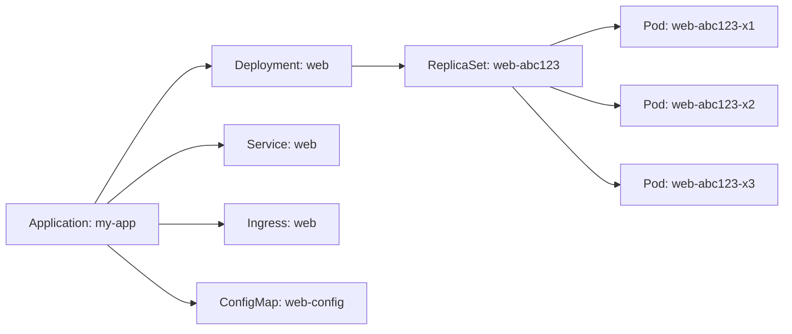

# How to View Application Details in ArgoCD UI

Author: [nawazdhandala](https://github.com/nawazdhandala)

Tags: ArgoCD, GitOps, Kubernetes, ArgoCD UI

Description: Complete walkthrough of the ArgoCD UI application details page including status panels, resource views, sync info, parameters, events, and diff views.

---

The ArgoCD UI is one of its biggest selling points over other GitOps tools. It gives you a real-time visual representation of your application's state, health, and sync status. But the interface packs a lot of information into multiple panels and tabs, and it is easy to miss important details if you do not know where to look. This guide walks through everything you can see and do from the application details page.

## Accessing the Application Details Page

After logging into the ArgoCD UI, you will see the application list view showing tiles for each application. Click on any application tile to open its details page.

You can also navigate directly using the URL pattern:

```
https://argocd.example.com/applications/argocd/<application-name>
```

Or from the CLI, open the UI for a specific app:

```bash
argocd app get my-app --grpc-web
# The output includes a URL field pointing to the UI page
```

## The Application Header

At the top of the application details page, you will see a header bar with key information at a glance:

- **Application name** - The name of your ArgoCD Application resource
- **Project** - The ArgoCD project the application belongs to
- **Sync status** - Either Synced (green), OutOfSync (yellow), or Unknown (gray)
- **Health status** - Healthy (green), Progressing (blue), Degraded (red), Suspended (yellow), or Missing
- **Last sync result** - Success or failure of the most recent sync operation
- **Revision** - The Git commit SHA or Helm chart version currently deployed

The header also contains action buttons:

```
[SYNC]  [REFRESH]  [DELETE]  [DETAILS]  [DIFF]  [HISTORY]
```

## Application Summary Panel

Clicking the application name or the "Details" button opens the summary panel. This panel contains:

### General Information

- **Source** - The Git repository URL, target revision (branch/tag/commit), and path
- **Destination** - The target Kubernetes cluster and namespace
- **Sync Policy** - Whether auto-sync is enabled, and if prune and self-heal are active
- **Sync Options** - Any configured sync options like CreateNamespace, ServerSideApply, etc.
- **Retry** - Retry policy configuration if set

### Status Section

The status section shows:

```
Sync Status:    Synced to main (abc1234)
Health Status:  Healthy
Last Sync:      2 minutes ago
Operation:      Sync succeeded (duration: 12s)
```

This is where you quickly determine if your application is in a good state or needs attention.

### Parameters Section

If your application uses Helm or Kustomize, the parameters section shows the rendered values:

For Helm applications:
- All helm values currently in effect
- Value overrides from the Application spec
- Which values files are being used

For Kustomize applications:
- Image overrides
- Name prefixes/suffixes
- Common labels and annotations

## The Resource Tree View

The resource tree is the most visually distinctive feature of ArgoCD. It displays all Kubernetes resources managed by the application in a tree layout, showing the ownership and dependency relationships.



Each node in the tree shows:
- **Resource kind and name** - e.g., "Deployment/web"
- **Health indicator** - Color-coded icon (green heart for Healthy, red heart for Degraded, etc.)
- **Sync indicator** - Shows if the resource is Synced or OutOfSync

### Tree View Controls

The tree view has several display options:

- **Group by** - Group resources by kind, sync status, or health status
- **Filter** - Filter by resource kind, sync status, or health status
- **Compact view** - Show a condensed tree with fewer details
- **List view** - Switch from tree to a flat table view

### Clicking a Resource Node

Clicking any resource in the tree opens a side panel with detailed information about that specific resource:

- **Summary** - Kind, name, namespace, creation timestamp
- **Live manifest** - The current state of the resource in the cluster
- **Desired manifest** - What the resource should look like based on Git
- **Diff** - Side-by-side comparison showing any differences
- **Events** - Kubernetes events for that resource
- **Logs** - Container logs (for Pods and resources that own Pods)

## The Diff View

The diff view is critical for understanding what will change during a sync or why an application is OutOfSync.

Access it by clicking the "DIFF" button in the header. The diff view shows:

- **Added resources** - Resources in Git that do not exist in the cluster (shown in green)
- **Modified resources** - Resources that differ between Git and the cluster (shown in yellow)
- **Removed resources** - Resources in the cluster that no longer exist in Git (shown in red)

For each modified resource, you see a side-by-side diff similar to a Git diff:

```
Left side (Live):  The current state in the cluster
Right side (Git):  The desired state from Git
```

### Compact Diff Mode

The compact diff mode hides unchanged fields and only shows the differences. This is useful for large resources where only a few fields have changed.

### Ignoring Differences

If you see expected differences (like auto-generated fields), you can configure ArgoCD to ignore them:

```yaml
spec:
  ignoreDifferences:
    - group: apps
      kind: Deployment
      jsonPointers:
        - /spec/replicas  # Ignore replica count managed by HPA
    - group: ""
      kind: Service
      jqPathExpressions:
        - .spec.clusterIP  # Ignore cluster-assigned IP
```

## Application Actions

From the details page, you can perform several actions:

### Sync

Click "SYNC" to trigger a manual sync. The sync dialog lets you:
- Choose which resources to sync (selective sync)
- Enable/disable prune during this sync
- Enable/disable dry run mode
- Force the sync (replaces resources instead of applying)
- Set the target revision for this sync

### Refresh

The "REFRESH" button has two modes:
- **Normal refresh** - ArgoCD compares the cached manifest with the live state
- **Hard refresh** - ArgoCD re-fetches the manifests from Git before comparing

Use hard refresh when you suspect the cached state is stale.

### Delete

The "DELETE" button removes the ArgoCD Application. You get two options:
- **Foreground deletion** - Wait for all managed resources to be deleted
- **Non-cascading deletion** - Delete only the Application CR, leaving managed resources intact

### Rollback

From the History tab, you can rollback to any previous sync:

```bash
# The history shows each sync operation with:
# - Revision (commit SHA)
# - Sync timestamp
# - Sync result (success/failure)
# - Sync duration
# - Who triggered the sync
```

Click on any history entry to see what was deployed at that point, and use the "Rollback" button to revert.

## The Network View

ArgoCD provides a network view that visualizes the networking relationships between resources:

- Services and the Pods they route to
- Ingress rules and their backend services
- Endpoints and their target pods

This view is helpful for debugging connectivity issues - you can see at a glance whether a Service is correctly targeting your Pods.

## Tips for Effective UI Usage

1. **Bookmark important applications** - Use browser bookmarks with the direct URL pattern for applications you check frequently.

2. **Use the filter aggressively** - When an application has dozens of resources, filter by health status "Degraded" to quickly find problems.

3. **Check the diff before syncing** - Always look at the diff view before triggering a manual sync to understand what will change.

4. **Use the tree grouping options** - Grouping by sync status immediately highlights which resources are out of sync.

5. **Open resource logs directly** - For Pods in the tree, click the logs icon to view container logs without leaving the ArgoCD UI.

6. **Use the resource actions menu** - Right-click (or use the three-dot menu) on any resource for quick actions like viewing the live manifest, deleting the resource, or viewing events.

The ArgoCD UI is a powerful tool for understanding and managing your applications. Once you learn to navigate its panels and views efficiently, you can diagnose and resolve deployment issues in seconds rather than minutes.
